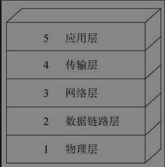
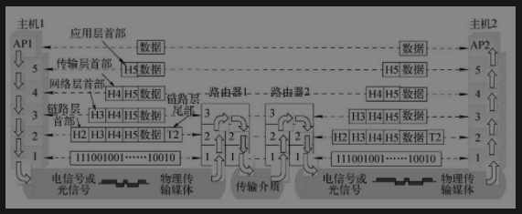

# 网络体系结构与网络协议

> 在计算机的术语中，将计算机网络的
>
> * 层次结构模型
> * 各层协议的集合
>
> 称为**计算机网络的体系结构**。

## 参考模型

此书当中用的参考模型是一种理论模型，是一种分层较为合理又很全面的模型，其层次划分如下图所示。

**五层协议的体系结构**

**数据在各层之间的传递过程**

### 面向连接服务与无连接服务

面向连接的服务就是通信双方在通信时，要事先建立一条通信线路，其过程有

* 建立连接
* 使用连接
* 释放连接

三个过程。

面向连接服务比较适合于在一定周期内向同一目的地发送许多报文的情况。

在无连接服务的情况下，两个实体之间的通信不需要先建好连接，数据一旦发出，则不需要进行任何备份和处理。

无连接服务的特点是不需要接收端做任何响应，因为是一种不可靠的服务，常被描述为“尽力而为”。其优点是通信比较迅速，使用灵活方便，连接开销小，但可靠性低，不能防止报文的丢失、重复或失序，适用于传送少量零星的报文。

