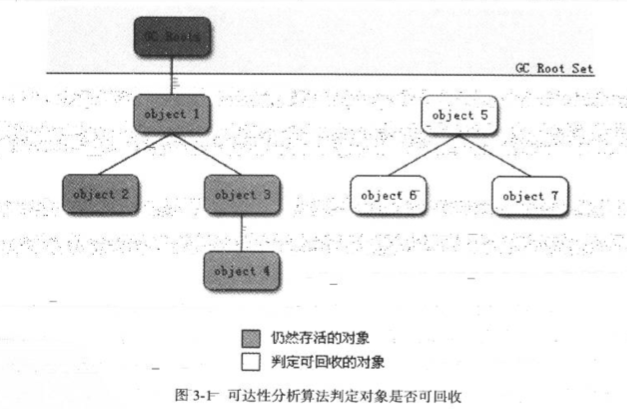
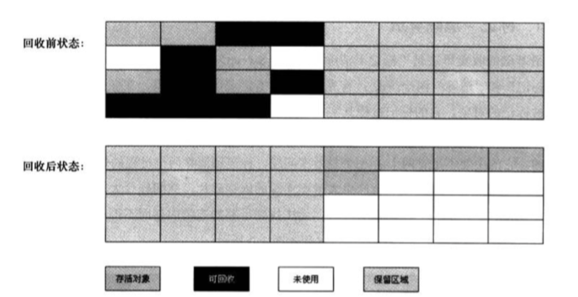
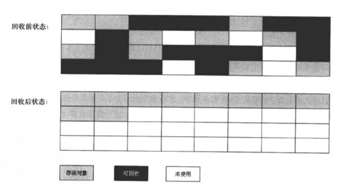

## 概述

* GC最基本的3个问题：

  * 那哪些内存需要回收

  * 什么时候回收

  * 如何回收


* 内存的动态分配与回收都是”自动化“的为什么需要了解GC？

  当需要排查各种内存溢出、内存泄漏问题时，当垃圾收集成为系统达到更高并发量的瓶颈时，我们就需要对这些“自动化”的技术实施必要的监控和调节。

* 内存分配与回收主要关注：

  * Java堆
  * 方法区

  这两部分区域。


## 对象已死吗

第一件事，判断对象是否还存活。


### 引用计数算法

他很好，但还不够好，主要是很难解决**循环引用**问题。

主流虚拟机不使用引用计数来作为对象是否存活判断的算法。


### 可达性分析算法

某个对象没有GCRoot对其实可达的，该对象就可被回收。



在Java语言中，可作为GC Roots的对象包括下面几种：

* 虚拟机栈（栈帧中的本地变量表）中引用的对象。
* 方法区中类静态属性引用的对象
* 方法区中常量引用的对象。
* 本地方法栈中JNI（即一般说的Native方法）引用的对象。


### Java中的各种引用

JDK1.2之前的引用的概念定义很传统，引用被定义成一个指向另一块内存的内存空间所存储的数据。如果从这个定义之上来讨论一个对象的状态，就只存在两种状态：

* 被引用
* 没有被引用

这样，一些中间状态的对象状态就无法表示。

JDK1.2后，对这个定义进行了扩充，引用可分为：

* 强引用

  正常的引用

* 软引用

  软引用是用来描述一些还有用，但非必须的对象。只被软引用关联着的对象，在系统将要发生内存溢出异常前，会把这些对象列进回收范围之中进行第二次回收；

  使用`SoftReference`；

* 弱引用

  它的强度比软引用更弱一些，被弱引用关联的对象只能生存到下一次垃圾收集发生为止；

  使用`WeakReference；`；

* 虚引用

  一个对象是否有虚引用的存在，完全不会对其生存时间构成影响，也无法通过虚引用来取得一个对象实例。为一个对象设置虚引用关联的唯一目的只是为了能在这个对象被收集器回收时收到一个系统通知；

  使用`PhantomReference`；

这些引用类型对对象的引用，从强到弱。


### 生存还是死亡

判定对象死亡分两步进行标记：

1. 第一次标记📌：利用可达性分析算法判定其是否还在被引用，若没有则进行标记。然后根据情况考虑是否要执行finalize()方法，需要执行则把对象放入F-Queue队列中，并稍后在一个由虚拟机自动建立的、**低优先级**的线程中执行。
2. 第二次标记📌：在F-Queue中的对象进行第二次标记，对象可能在finalize()方法中进行自救（与GC Root相关联），此时可以把它移除将要回收的集合，若对象没有进行自救，那么这个对象基本就是要被回收了的。

> 注意：对象finalize()方法只会被调用一次。


### 回收方法区

回收条件极为苛刻，主要针对常量池中不再使用的常量进行回收。可通过虚拟机参数设定是否需要回收此区域。

主要回收两个部分的内容：

1. 废弃的常量

2. 不再使用的类型

废弃的常量的回收与堆中的对象的回收非常相似，类型的卸载则需要满足以下的几个条件：

1. 该类的所有实例都已经被回收；
2. 加载该类的类加载器已经被回收（除非精心设计，否则非常难达到）；
3. 该类对应的java.lang.Class对象没有在任何地方被引用；


## 垃圾收集算法

### 垃圾收集理论

* 大部分对象都是朝生夕死的
* 对象越是活过多轮垃圾收集，就越不容易被清理

因此，把对象进行分区，是有利于垃圾收集的。


### 标记清除算法


最基础的算法，其他的都是根据这个算法优化得来的，这个算法的不足之处：

* 标记和清除的效率都不高
* 会产生大量的内存碎片，导致之后的大对象无法找到连续的内存空间进行分配。


### 标记-复制算法



现代虚拟机采用这种手机算法来回收新生代（注意：新生代）。

* 缺点：这种算法的代价是将内存缩小为了原来的一半，未免太高了一点。

* 基于缺点进行优化： 
  1. 将新生代内存分为3块，一块较大的Eden和两块较小的Survivor，默认比例8：1：1
  2. 这样，新生代当中的可用内存则变为了90%（优化前是50%）
  3. 当垃圾回收的时候，将Eden和其中一块Survivor上还存活着的对象一次性copy到另一块Survivor上
  4. 担保机制：如果回收之后，剩余的对象超过了10%，这些对象将被送入老年代当中
  5. 最后清理掉Eden和那块用过的Survivor的内存空间。

这个算法，建立在新生代**朝生夕死**的特性之上(98%的对象，在垃圾收集的时候都死了)。为了应对存活对象过多的而导致的Survivor（存放活下来的对象那块空间）空间不够的特殊情况，还需要一种担保机制，也就是把老生代的内存空间作为担保（请理解担保的概念），一旦发生特殊情况，就把多存活下来的那些对象copy到老生代的控件当中去——空间分配担保。


### 标记-整理算法



该算法是老年代的收集算法。


## HotSpot算法实现细节

首先是HotSpot的发起垃圾回收。

发起内存回收有很多的条件限制，虚拟机并不能在任意的结点发起内存回收，虚拟机在发起内存回收之前主要需要关注三点：

* GCRoot的查找效率问题。

  因为为了保证可达性分析的准确性，虚拟机必须要分析对象的引用关系，分析过程要求内存中的对象的引用关系不能发生变化，必须进行stop the world，因此该过程对时间是敏感的，如果效率低下会导致执行系统要等待GC很久才能恢复执行。

* 用户线程是否都处于Safe Point

* 用户线程是否都处于Safe Region

* 记忆集与卡表

* 写屏障

* 并发的可达性分析

> 简单的记录一下，不包含太多的细节。


## 经典垃圾收集器

这里讨论的收集器基于**JDK 1.7 Update 14之后-JDK11正式发布之前**的**HotSpot虚拟机**（在这个版本中正式提供了商用的G1收集器，之前G1仍处于实验状态）包含的所有收集器，如图所示。


* 垃圾收集器之间的连线代表他们可以配合使用。
* 所处的区域代表其进行垃圾收集的区域是老年代还是新生代。
* 这些垃圾收集器不存在一款完美的收集器，都是在合适的场景下才会采用哪种垃圾收集器。


### Serial

收集区域：新生代

收集算法：标记-复制

特性：在进行垃圾收集的时候，必须停止用户线程，直到收集结束

优点：简单、高效。内存资源受限的情况下，他的额外内存消耗最小；单核处理器或处理器核心数少的环境下，由于没有多线程的的交互开销，其效率也比较高

收集器运行示意图（Serial + Serial Old）：


### Parnew

Serial的多线程版本，与Serial共用大部分代码，处理使用多线程进行垃圾收集之外，其他行为与Serial收集器完全一致，包括：

* 可用的控制参数
* 收集算法
* STW
* 对象分配规则
* 回收策略


#### Parnew的辉煌与没落

Parnew是JDK1.7之前的遗留系统的首选新生代收集器（重要原因：除了Serial之外，只有他能和CMS协同工作）。CMS是JDK1.5推出的，但是和1.4版本就已经存在的Parallel Scanvege不能配合使用，所以如果想用CMS就必须在Serial和Parnew之间二选一。

G1登场。G1是一个面向全堆的收集器，不需要其他新生代的收集器配合，因此在JDK 1.9开始，官方**不再推荐Parnew + CMS**是服务端模式下的收集器解决方案。全面的推荐G1，并且不再支持Serial + CMS以及 Parnew + Serial Old。

从此，Parenew只能和CMS搭配使用，Parnew基本退出历史舞台。


收集器运行示意图（Parnew + Serial Old）：


### Parallel Scanvege

收集区域：新生代

收集算法：标记-复制

特性：

* 多线程收集
* 更关注的是**达到一个可控制的吞吐量**，吞吐量 = 运行用户代码的时间 / （运行用户代码的时间 + 运行垃圾收集的时间） ,其他收集器则更关注**尽可能地缩短垃圾收集时用户线程的停顿时间**

* 提供了两个调节参数：

  `-XX：MaxGCPauseMillis`用于控制垃圾收集的最大停顿时间

  `XX：GCTimeRatio`直接设置吞吐量

* 自适应垃圾收集的调节策略：

  可通过开启`-XX：+UseAdaptiveSizePolicy`，并设置好具体的基础参数，如-Xmx（最大堆内存），然后使用上边的两个参数（二选一）给虚拟机设定一个优化目标，该收集器会根据实际情况自动的调节-Xmn、Eden与Survivor区域的比例、晋升老年代大小等参数


### Serial Old

收集区域：老年代

收集算法：标记-整理

特性：

* 单线程收集
* 主要在客户端模式下的Hotspot中使用
* 服务端模式下有两种用途：
  * 一种是在JDK 5以及之前的版本中与Parallel Scavenge收集器搭配使用
  * 作为CMS收集器发生失败时的后备预案（Concurrent Mode Failure）

收集器运行示意图（Serial + Serial Old）：


### Parallel Old

收集区域：老年代

收集算法：标记-整理

特性：

* 多线程收集
* JDK 6后与Parallel Scancege搭配使用，提升了老年代的垃圾收集的性能（Serial Old单线程，多核环境下效率比较低）
* 使得“吞吐量优先”收集器终于有了比较名副其实的搭配组合

收集器运行示意图（Parallel Scanvege + Parallel Old）：


### CMS


## GC日志

```
33.125: [GC [DefNew: 3324K->152K(3712K), 0.0025925 secs] 3324K->152K(11904K), 0.0031680 secs]
100.667: [Full GC [Tenured: 0K->210K(10240K), 0.0149142 secs] 4603K->210K(19456K), [Perm : 2999K->2999K(21248K)], 0.0150007 secs] [Times: user=0.01 sys=0.00, real=0.02 secs]
```

* 33.125：GC发生的时间，虚拟机启动以来经过的秒数
* GC：垃圾收集的停顿类型
* DefNew：GC发生的区域
* 3324K->152K(3712K)：该内存区域已使用容量->GC后该内存区域已使用容量（该内存区域总容量）
* 3324K->152K(11904K)：Java堆已使用容量->GC后Java堆已使用容量（Java堆总容量）
* 0.0031680 secs：该内存区域GC所占用的时间


### 垃圾收集器参数总结


## 内存分配与回收策略

Java技术体系中所提倡的自动内存管理最终可以归结为自动化地解决了两个问题：

* 给对象分配内存
* 回收分配给对象的内存

内存分配的规则并非完全固定，取决于以下因素：

* 垃圾收集器的组合
* 虚拟机中与内存相关的参数设置

这里讨论的是Serial / Serial Old这个组合（Client模式下运行的虚拟机默认的垃圾收集器组合）的内存分配和回收策略。

> 新生代GC（Minor GC）：指发生在新生代的垃圾收集动作，因为Java对象大多都具备朝生夕灭的特性，所以Minor GC非常频繁，一般回收速度也比较快。
>
> 老年代GC（Major GC / Full GC）：指发生在老年代的GC，出现了Major GC，经常会伴随至少一次的Minor GC（但非绝对的，在Parallel Scavenge收集器的收集策略里就有直接进行Major GC的策略选择过程）。Major GC的速度一般会比Minor GC慢10倍以上。


### 对象优先在Eden分配

假设虚拟机的参数配置为：*-Xms20M -Xmx20M -Xmn10M XX:SurvivorRatio=8*，堆内存的示意图如下：


1. 大多数情况下，对象在新生代Eden区中分配。当Eden区没有足够空间进行分配时，虚拟机将发起一次Minor GC。
2. Minor GC会对Eden区进行回收，会标记并回收Eden的垃圾对象，并把剩余的存活对象移入Survivor区
3. 如果Survivor区域无法容纳剩余生存的这些对象，对象将会被移入老年代——分配担保机制

```
private static final int _1MB = 1024 ＊ 1024;
/＊＊
 ＊ VM 参 数：-verbose:gc -Xms20M -Xmx20M -Xmn10M -XX:+PrintGCDetails-XX:SurvivorRatio=8
 ＊ -XX:PretenureSizeThreshold=3145728
 ＊/
public static void testPretenureSizeThreshold() {
    byte[] allocation;
    allocation = new byte[4 ＊ _1MB]; //直接分配在老年代中
}
```


### 大对象直接进入老年代

虚拟机参数：*-XX:PretenureSizeThreshold*表示大于此值的对象直接分配进入老年代。

>PretenureSizeThreshold参数只对*Serial*和*ParNew*两款收集器有效，Parallel Scavenge收集器不认识这个参数，Parallel Scavenge收集器一般并不需要设置。如果遇到必须使用此参数的场合，可以考虑ParNew加CMS的收集器组合。


### 长期存活的对象进入老年代

虚拟机参数：*-XX:MaxTenuringThreshold*表示新生代大于此年龄的对象将被移入老年代。

* 虚拟机给每个对象定义了一个对象年龄（Age）计数器。
* 如果对象在Eden出生并经过第一次Minor GC后仍然存活，并且能被Survivor容纳的话，将被移动到Survivor空间中，并且对象年龄设为1。
* 对象在Survivor区中每“熬过”一次Minor GC，年龄就增加1岁，当它的年龄增加到一定程度（默认为15岁），就将会被晋升到老年代中。
* 对象晋升老年代的年龄阈值，可以通过参数-XX:MaxTenuringThreshold设置。


### 动态对象年龄判断

为了能更好地适应不同程序的内存状况，虚拟机并不是永远地要求对象的年龄必须达到了MaxTenuringThreshold才能晋升老年代。

*在进行Minor GC的时候，如果在Survivor空间中相同年龄所有对象大小的总和大于Survivor空间的一半，年龄大于或等于该年龄的对象就可以直接进入老年代，无须等到MaxTenuringThreshold中要求的年龄。*


### 空间分配担保

空间分配担保策略在进行垃圾回收的时候，是否要进行Full GC的依据。其主要的目的是判断老年代是否能够保证新生代一次安全的Minor GC。该策略的判断过程如下：

* 在发生Minor GC之前，虚拟机会先检查老年代最大可用的连续空间是否大于新生代所有对象总空间，如果这个条件成立，那么Minor GC可以确保是安全的，则直接可以进行Minor GC。

* 如果上述的条件不成立，则虚拟机会查看*HandlePromotionFailure*设置值是否允许担保失败。

  * 如果允许，那么会继续检查老年代最大可用的连续空间是否大于历次晋升到老年代对象的平均大小
    * 如果大于，将尝试着进行一次Minor GC，尽管这次Minor GC是有风险的；
    * 如果小于，进行一次Full GC。

  * 如果不允许，进行一次FullGC

在JDK 6 Update 24之后，HandlePromotionFailure这个虚拟机参数起作用了。其空间分配担保策略改为：*只要老年代的连续空间大于新生代对象总大小或者历次晋升的平均大小就会进行Minor GC，否则将进行Full GC*。


## 总结

内存回收与垃圾收集器在很多时候都是影响系统性能、并发能力的主要因素之一，虚拟机之所以提供多种不同的收集器以及提供大量的调节参数，是因为只有根据实际应用需求、实现方式选择最优的收集方式才能获取最高的性能。没有固定收集器、参数组合，也没有最优的调优方法，虚拟机也就没有什么必然的内存回收行为。因此，学习虚拟机内存知识，如果要到实践调优阶段，那么必须了解每个具体收集器的行为、优势和劣势、调节参数。
