## MQ的N个连环炮

1. 为什么用消息队列啊？直接调用接口不就行了?
2. 说说使用MQ优缺点吧
3. 说说各种MQ（kafka、activemq、rabbitmq、rocketmq）的区别，以及适合哪些场景？
4. 消息队列如何保证高可用啊？
5. 重复消费（幂等）、可靠传输不丢消息、消息队列的顺序如何保证，这些问题考虑过吗？
6. 消息队列挤压了几百万消息，消息的过期和延时
7. 消息队列的架构设计

面试一般都是从一个点铺开，而不是发散的，比如可能聊聊高并发话题，就这个话题跟你聊缓存、MQ，对于每个话题从浅入深。

## 消息队列的技术选型

本小节针对MQ的N个连环炮中的**前三个**问题。

### **1. 为什么要用消息队列啊？**

看看候选人是不是瞎用，用完跳槽走人，留下一堆坑。

其本身的目的是问你**MQ的具体使用场景**，你的项目的使用场景是什么，是否与MQ的使用场景相匹配。你项目的这个业务场景有什么技术挑战，如果不用MQ可能会很麻烦，但是用了MQ之后带来了很多的好处。

#### MQ的使用场景

##### 解耦

**不用MQ的情况，系统耦合。**

首先，有这样一个系统，A、B、C、D之间互相调用

然后，来了个E系统，也需要A去调用。A系统此时需要修改代码，去满足E系统的需求。

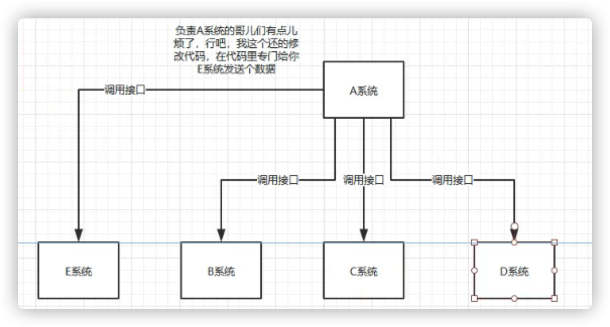

然后，D系统不需要发数据了。A系统此时需要修改代码，去满足D系统的需求。

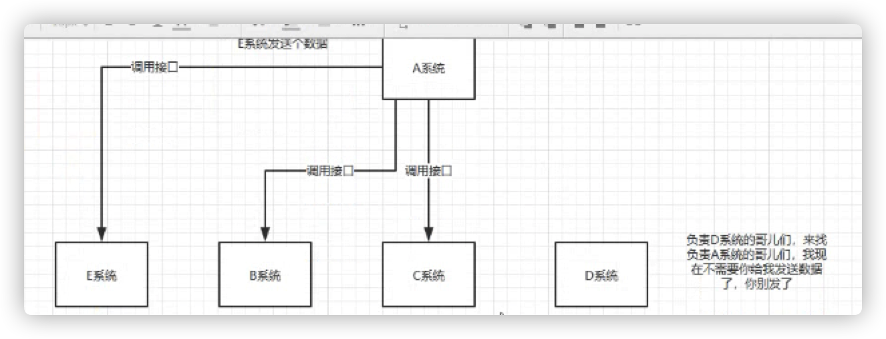

然后，F系统需要A系统调用他的接口。A系统又得改代码。

可见，A系统严重跟其他系统耦合起来的。A系统**产生了一个比较关键的数据**，很多系统需要A系统将这个数据发送过来。除了上述的，A系统还需要考虑很多事，其他系统如果挂了怎么办？访问超时了怎么办？重试机制要不要做？

> A系统不是要调用其他系统的服务，这个很关键，他是产生数据的系统，其他系统要用。MQ最原始的思想是生产者和消费者模式。

**用了MQ，系统解耦**

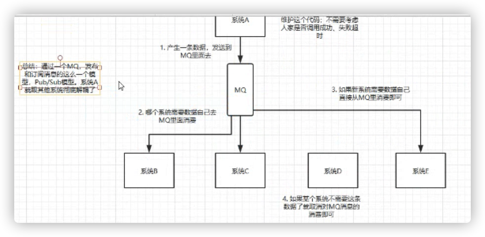

##### 异步

**不用MQ的同步高延时请求场景**

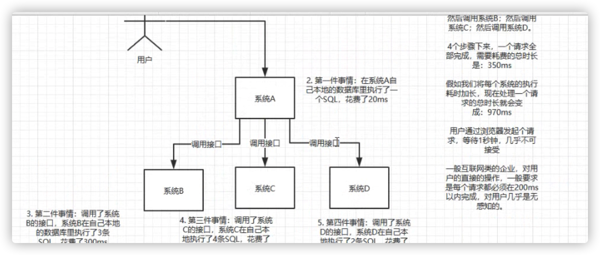

> 哭，原来一般要求是每个请求都必须在200ms内完成。1s都是不可接受的。

**使用MQ进行异步化之后的接口性能优化**

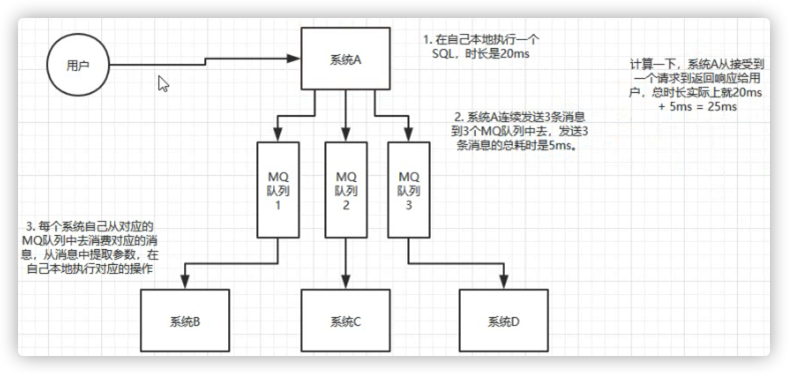

> B、C、D消费失败了怎么办？

##### 消峰

**没有用MQ的时候高峰期系统被打死的场景**

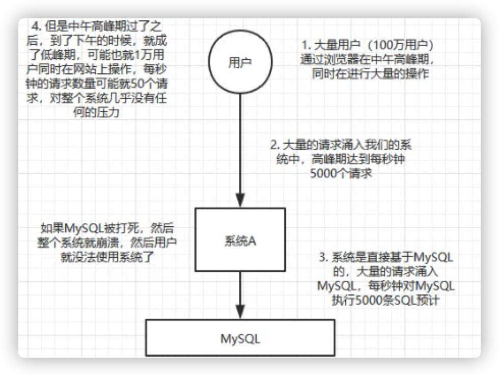

**使用MQ来进行削峰**

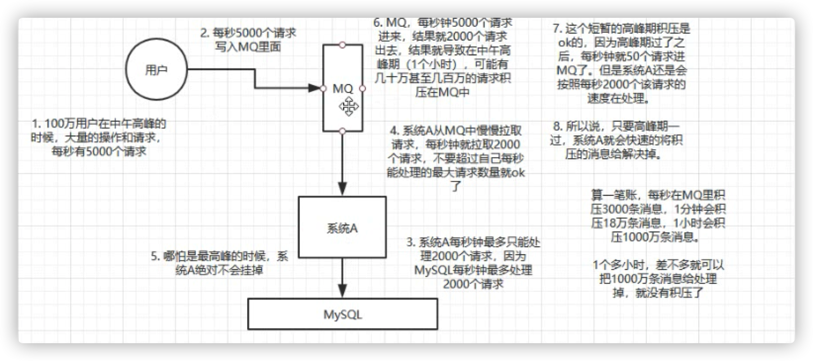

### **2. 说说MQ的优缺点**

看看候选人平时对技术有没有自己的思考。知不知道引入了MQ之后，可能会带来哪些问题。

#### 引入MQ之后系统可能存在的缺陷

* 系统可用性降低

* 系统需要考虑的问题变多

* 一致性问题

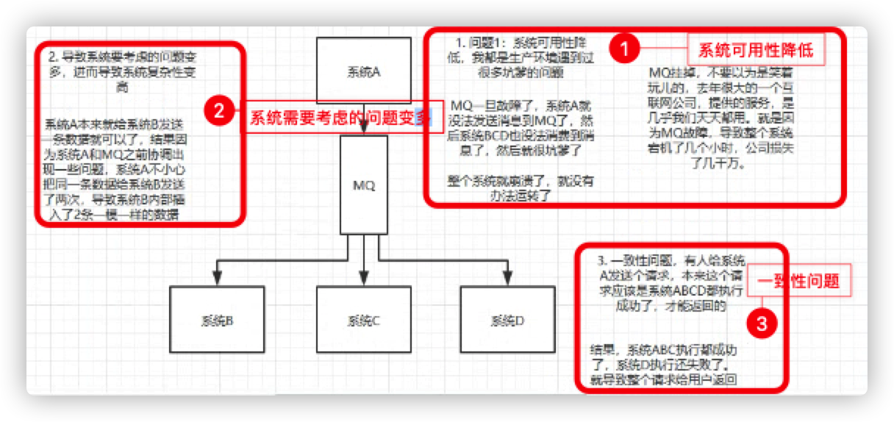

### **3. 各种MQ实现产品的区别**

看看候选人有没有切身去调研，而不是随便就选了一种技术就用。

ActiveMQ 不建议用，社区不活跃了

RabbitMQ 中小型公司可以用，社区活跃，由开源社区维护，基本不用自己看源码去解决问题

RocketMQ 中大型公司可以用，社区活跃度一般，由阿里维护，有项目黄掉的风险，需要考虑自己去看源码解决MQ发生的问题

Kafka  功能简单，扩展方便，一般在大数据领域使用

TODO：找课程的文档，把各种MQ产品的对比表格放在这里。

> 博客适合入门，不适合深入的有体系的去学习东西。

## 引入MQ后如何保证其高可用性？

本小节针对MQ的N个连环炮中的**第四个**问题。

### RabbitMQ（非分布式的，集群模式的）

有两种模式：

* 单机模式
* 普通集群模式

#### 普通集群模式

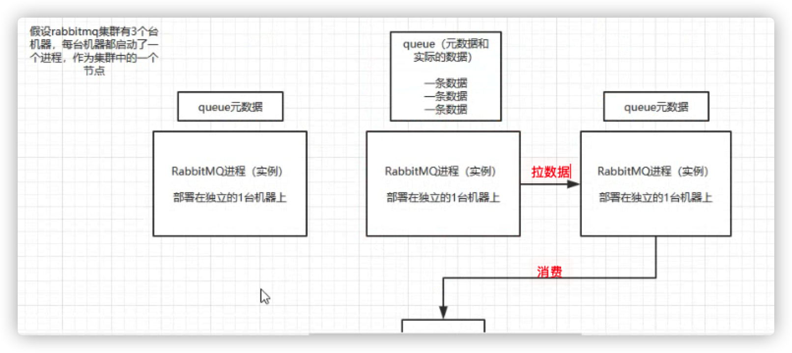

缺点：

* 在MQ集群内部产生大量的数据传输。
* 如果Queue所在的结点宕机了，就导致queue的数据就丢失了。

普通集群模式根本没什么高可用可言。

#### 镜像集群模式

每个结点都会存放queue。

消费者可以在任意结点去消费。

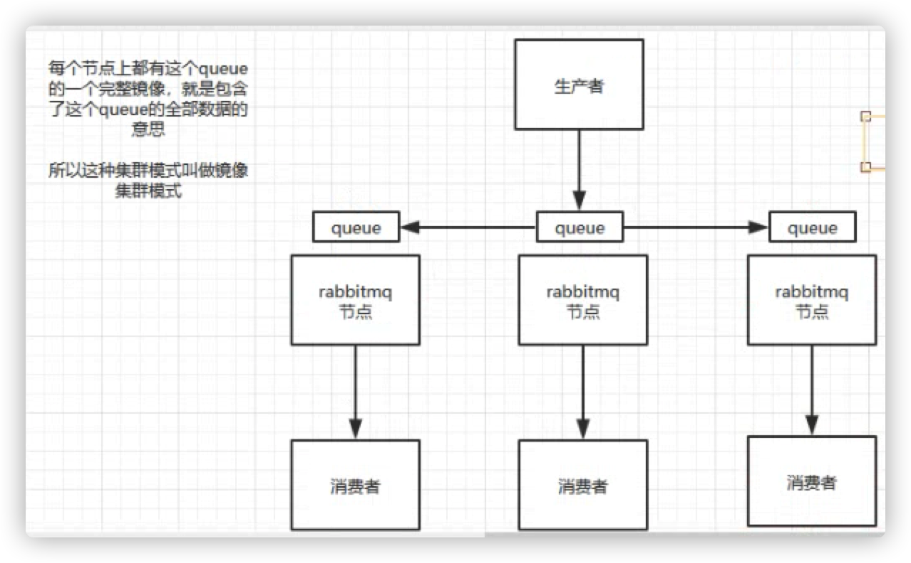

以上，任何一个结点宕机了，其他节点上还包含了这个queue的完整数据。

缺点：

* 不是分布式的，如果queue的数据量很大，大到机器上的容量无法容纳，该怎么办？

### Kafka（纯分布式的）

#### Kafka高可用架构

Kafka部署在多态机器上，在每个机器上启动一个进程。

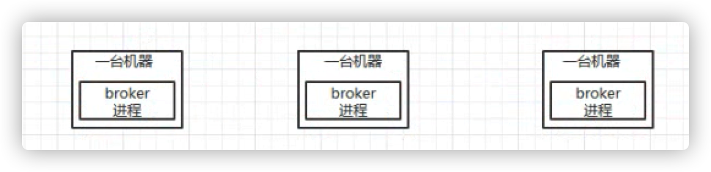

broker进程就是Kafka在每台机器上启动的自己的一个进程。

创建了一个Topic，指定其Partition数量是三个，每个Partition存放了一部分数据。Partition是存放在不同机器上的。**这个就是分布式与简单集群的区别。**

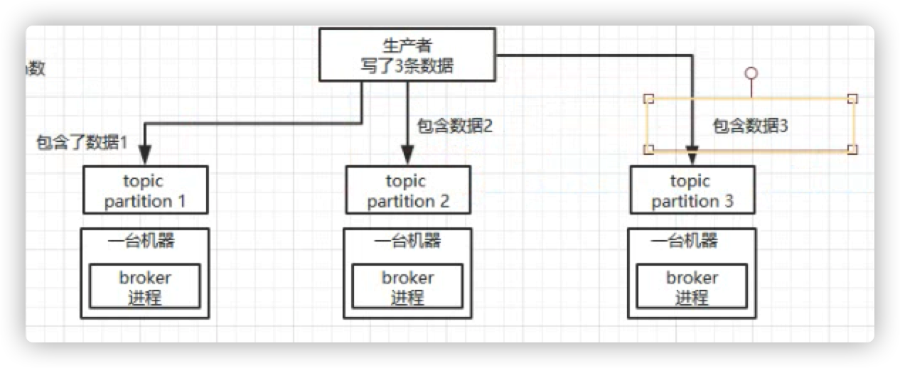

以上，如果没有任何高可用机制的保障，假设第二台机器宕机，三分之一的数据就丢了。

因此，Kafka提供了一套高可用的机制。每个Partition都有一个副本。

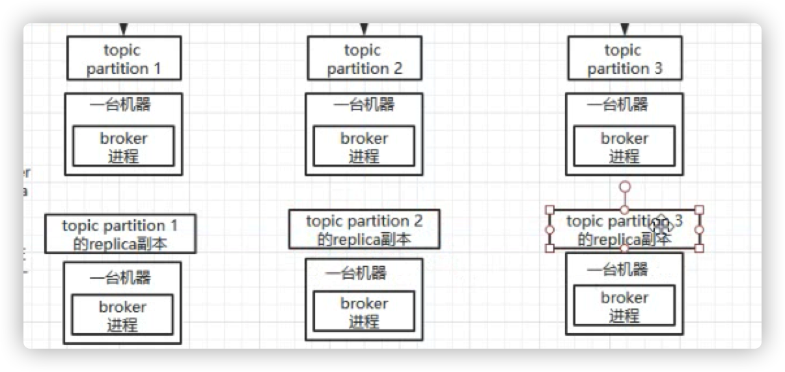

leader选举，生产者和消费者只能基于leader去操作。如果某个leader挂了，会重新选举leader来维持集群的高可用性。

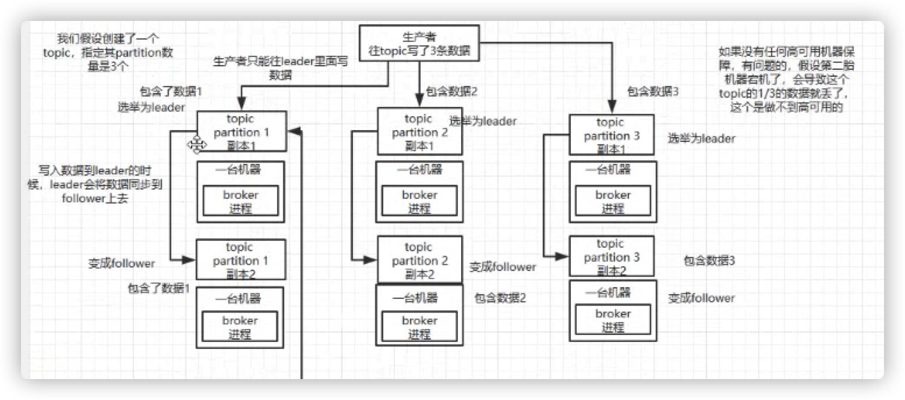

## MQ的常见问题

### 如何保证消息不被重复消费（幂等性）？

无论是rabbitmq、rocketmq、kafka，都会出现重复消费的问题，他们能保证消息不丢，但是不保证消息不会被重复发送，去重机制由自己的系统去保证与实现。

#### kafka消费端可能出现的重复消费问题

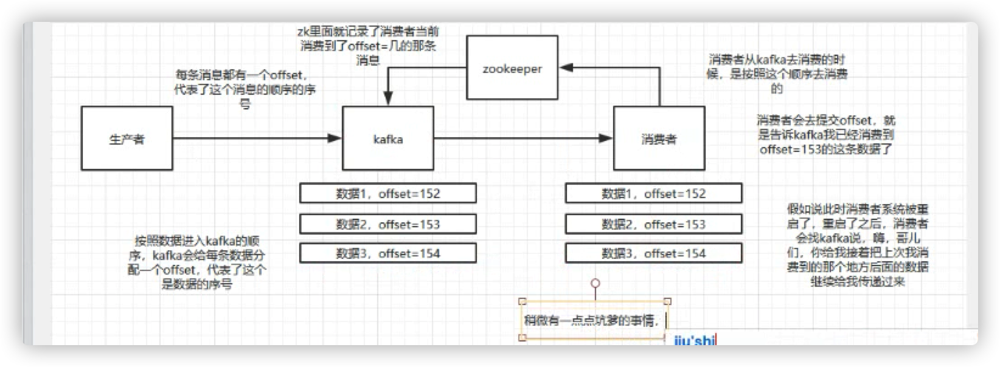

消费者不是说消费完一条数据就立刻提交offset，而是定时定期提交offset。如果消费者消费到某个offset的时候，这个offset还没有被提交，消费者进程此时被重启，那么这个offset是无法提交到Zookeeper中去的。消费者一旦重启，马上会找Kafka去消费数据，此时Kafka会重新把之前传送过的消息又重新传递了一遍。

> 消息重发是有可能发生的，程序中必须要去规避重复消费的问题。

#### 如何保证系统的幂等性？

一条数据重复出现两次，数据库里就只有一条数据，这就保证了系统的幂等性。

以下这张图的这种情况是绝对不行的。 

解决方案

* 写数据库，先用主键查一下，如果有了就不插了
* 如果是redis，不用担心，反正都是set，天然幂等性。
* 也可以用数据库的唯一键来保证

具体还要看业务场景。

### 消息丢失了怎么办？

用mq有一个基本原则，数据不能多一条，也不能少一条。

**RabbitMQ**

MQ一般都是用来承载公司的核心业务的，数据是绝对不允许丢失的。先来看看可能存在的数据丢失问题。

1. 写消息过程中，消息都没到RabbitMQ在网络传输过程中就丢了

   解决方案：**confirm**机制——异步模式，不会阻塞，因此不会降低系统的吞吐量。

   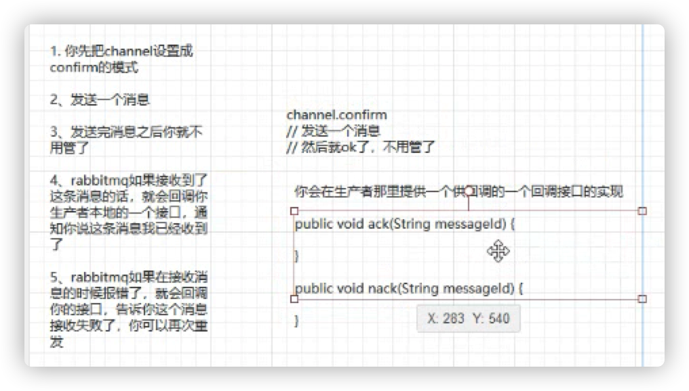

2. 写消息过程中，RabbitMQ内部出错

   解决方案：**持久化**到磁盘中去

   哪怕是个MQ开启了持久化机制，也有一种可能，就是这个消息写到了RabbitMQ中，还没来得及持久化，mq过了，会导致内存离得一点数据丢失。

3. RabbitMQ接收到消息之后，挂掉了，内存中的消息就会丢失

   因为打开了autoack这种机制，也就是说消费者消费了消息之后会自动通知RabbitMQ我已经消费了这条消息，如果你消费了一条消息，还在处理中，还没处理完，此时消费者就自动通知MQ我已经消费了这条消息，此时消费者宕机了，那条消息就丢了。

   解决方案：**关闭autoack**，自己去确定消息是否已经处理完，处理完了在发送ack给RabbitMQ。

4. 消费者消费到了这个消息，但是还没来得及处理就挂了，内存中的消息也丢了，但是RabbitMQ就以为这个消息已经处理完了

### 如何保证消息的顺序性？

#### RabbitMQ可能出现数据顺序不对的场景

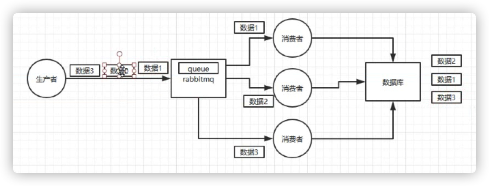

#### RabbitMQ如何保证消息的顺序性

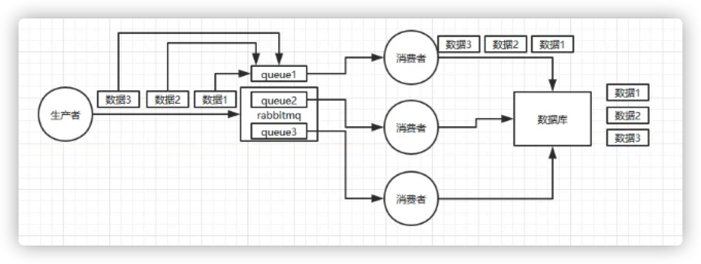

### 消息积压如何解决

生产上一般不会设置消息的过期时间。

## 是否考虑过自己如何进行MQ的架构设计

1. 至少要支持可伸缩，就是需要快速扩容，就可以增加吞吐量和容量可以采用分布式设计，broker->topic->partition
2. 避免数据丢失，数据落盘，顺序写
3. mq的高可用保障机制，多副本->leader&follower->broker

RabbitMQ要看一下入门的demo

