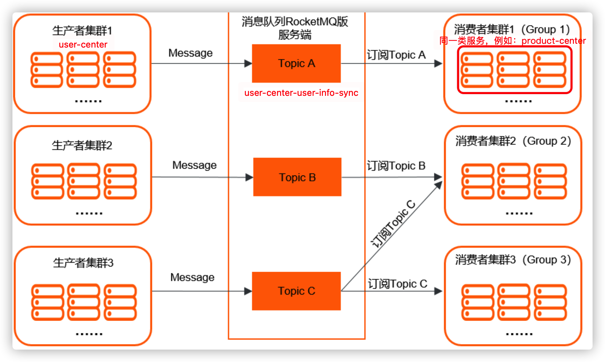
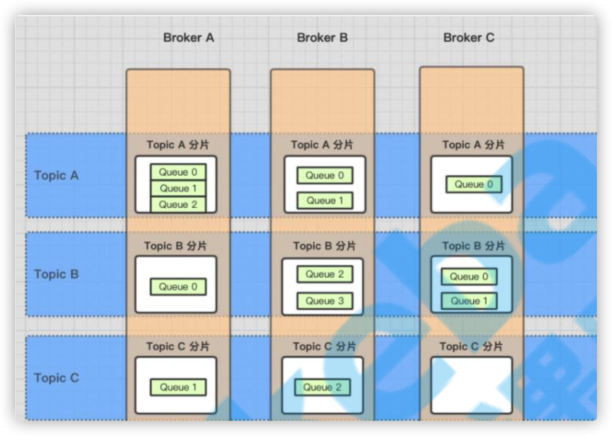
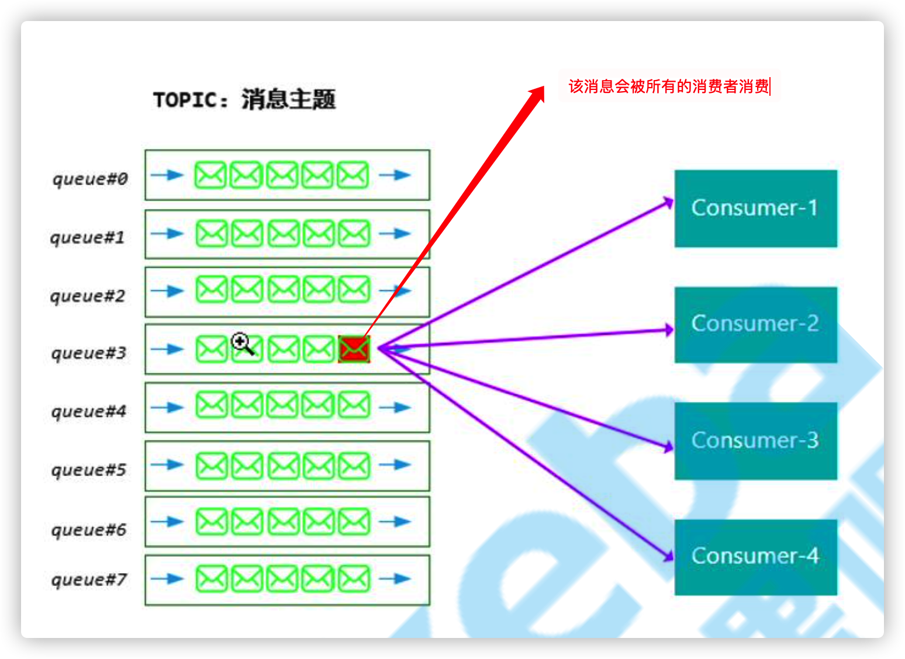
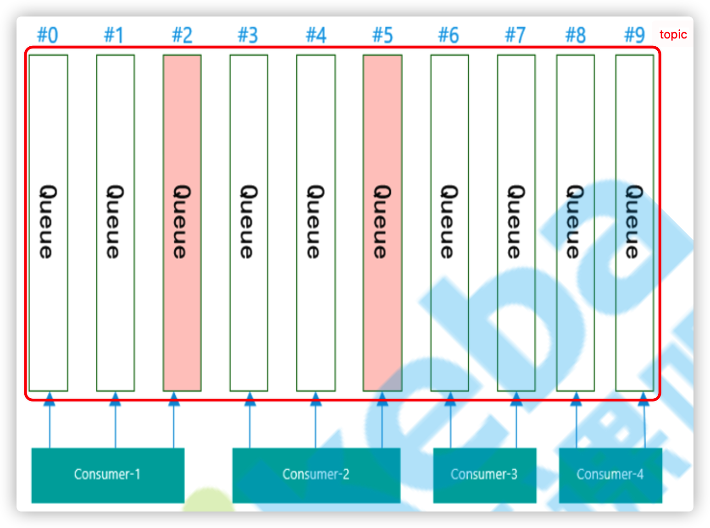
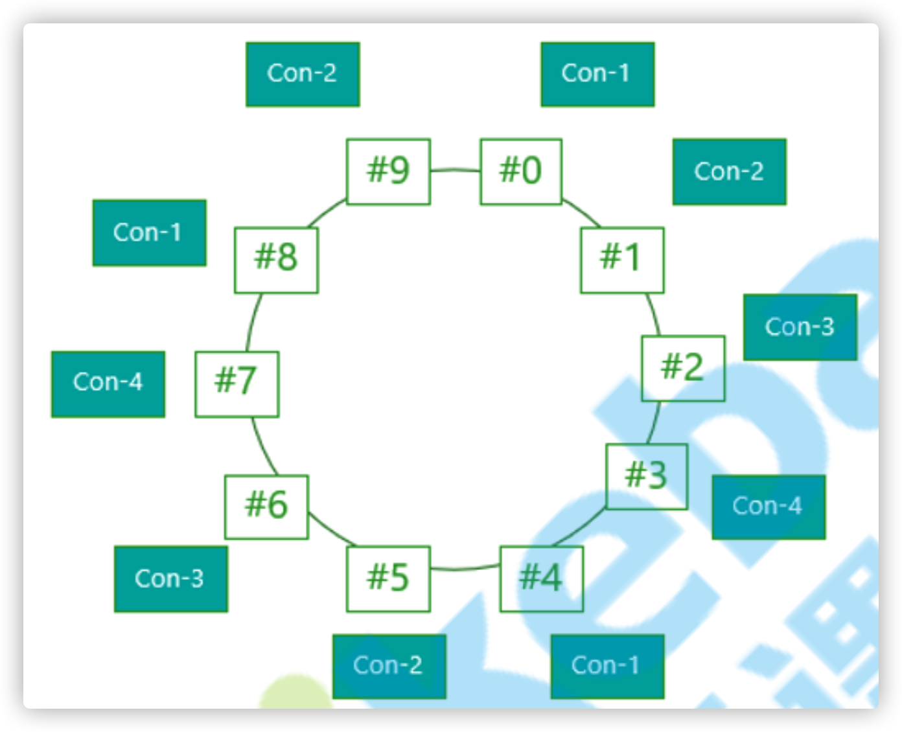

# RocketMQ

## 前置知识

### RocketMQ能够解决的问题

学习任何一个中间件，第一步都必须是要知道他的产生是为了解决哪些问题。

* 异步
* 解耦
* 流量消费
* 日志处理
* 消息通讯（几乎没见过应用场景）

### 常见MQ的对比

| 特性       | ActiveMQ                                                     | RabbitMQ                                                     | RocketMQ             | Kafka                                               |
| ---------- | ------------------------------------------------------------ | ------------------------------------------------------------ | :------------------- | --------------------------------------------------- |
| 开发语言   | java                                                         | erlang                                                       | java                 | scala                                               |
| 单机吞吐量 | 万级                                                         | 万级                                                         | 10万级               | 10万级                                              |
| 时效性     | ms                                                           | us                                                           | ms                   | ms级以内                                            |
| 可用性     | 高（主从架构）                                               | 高（主从架构）                                               | 非常高（分布式架构） | 非常高（分布式架构）                                |
| 优点       | 成熟，早些年在很多公司得到了应用； 有较多的文档； 各种协议支持的比较好 | 基于erlang开发，因此并发能力很强，性能极好，延时很低； 管理界面很丰富； 社区相对较为活跃 | 功能完备，扩展性强   | 提供超高的吞吐量； 延时较低 可用性非常高;     |
| 缺点       | 偶尔会有较低的概率丢失消息； 在国内应用越来越少； 官方维护也变得很少； 主要是基于解耦和异步来用的，较少在大规模吞吐的场景中使用 | 吞吐量比较低； erlang开发，看不懂源码； 集群动态扩展很麻烦 | 暂无                 | 提供较少的功能； topic的数量变多会对吞吐量有影响 |

### 引入MQ要考虑的风险

* 系统可用性降低

* 系统复杂性增加

  使用MQ要考虑很多的问题，比如：

  * 一致性问题
  * 如何保证消息不被重复消费
  * 如何保证消息可靠传输

## RocketMQ基本理论

### RocketMQ的消息收发模型

### 消息存储

* 逻辑上，一个topic由多个队列组成，消息就存储在这些队列当中
* 物理上，每个topic会被切片到多个broker上进行存储

### 消息发送

TODO

### 消息消费

消息消费有两种模式：

* 广播消费
* 集群消费

#### 广播消费

即使consumer-1、consumer-2、consumer-3、consumer-4属于同一个消费者组，消息也会被每个consumer都消费一次。

#### 集群消费

与广播消费的方式不同，在集群消费中，一条消息只会被每个消费者组中的一个consumer进行消费。为了满足集群消费的需求，RocketMQ采取了一些算法：

* 平均分配算法
* 环形平均算法

##### 平均分配算法

这破算法没啥可说的，一看就明白。

##### 环形平均算法

这个破算法也没啥好说的。

### 两个小问题

1. 消费者组groupB组能否消费生产者组groupA组的消息？

   答案：可以，消费者组跟生产者组没有半毛钱关系。

2. groupA组2个消费者同时监听不同的topicA和topicB，能否消费消息？

   答案：不能，会发生消息丢失的情况。

   原因：RocketMQ会先根据消费者组，给组内的consumer1和consumer2分配topicA和topicB这两个主题上的队列；分配好之后consumer1却只监听了topicA，consumer2只监听了topicB。这个时候，如果有消息发送至topicA，并且发送到了consumer1没有监听的队列上，那么这个消息就会没有消费者去消费他。

   我的理解：RocketMQ的消费端分为了两步：

   1. 给消费者分配队列
   2. 消费者进行监听

   RocketMQ的设计规则就是在第一阶段分配的时候，我就默认我给你分配的队列你一定会进行监听，像问题中所说的那种情况，明显就是没有对所有的已分配的队列进行监听，那消息丢失就是一个必然的现象了。

## RocketMQ原理

### RocketMQ架构图

## RocketMQ的存储设计

主要存储文件

* commitlog
* consumequeue
* IndexFile

## 实验

### 实验一

实验准备：

1. 1个生产者
2. 1个消费者
3. 一个生产者组
4. 一个消费者组
5. 一个Topic

观察结果：

消费者消费消息是无序的 => 负载均衡导致的

## 主题相关无法短时间内解决的问题

1. 若Broker当中没有对应的Topic，Producer在向Broker发送与这个主题相关的消息的时候会报错，这是一种正常的行为吗？我是否需要设置一下在Broker当中没有这个Topic的时候就自动新创建一个Topic？
2. 异步消息的发送是如何实现的？
3. CONSUME_FROM_FIRST_OFFSET是什么意思？

## 主题无关扩展知识

1. 到底什么是分布式？

2. 使用Docker安装RocketMQ的管理工具。

3. CountDownLatch

4. AtomicLong

5. 能否根据服务注册发现机制去优化辅助分析系统中的客户端注册UDP监听？

6. Dubbo与Zookeeper的关系是什么？

7. 内存映射

8. 文件顺序写为什么能够提高写性能？

所解决的问题

组成原理

使用注意事项

优秀设计理念

最佳实践

面试八股文

## 附录

### 基本概念

### 1 消息模型（Message Model）

RocketMQ主要由 Producer、Broker、Consumer 三部分组成，其中Producer 负责生产消息，Consumer 负责消费消息，Broker 负责存储消息。Broker 在实际部署过程中对应一台服务器，每个 Broker 可以存储多个Topic的消息，每个Topic的消息也可以分片存储于不同的 Broker。Message Queue 用于存储消息的物理地址，每个Topic中的消息地址存储于多个 Message Queue 中。ConsumerGroup 由多个Consumer 实例构成。

### 2 消息生产者（Producer）

负责生产消息，一般由业务系统负责生产消息。一个消息生产者会把业务应用系统里产生的消息发送到broker服务器。RocketMQ提供多种发送方式，同步发送、异步发送、顺序发送、单向发送。同步和异步方式均需要Broker返回确认信息，单向发送不需要。

### 3 消息消费者（Consumer）

负责消费消息，一般是后台系统负责异步消费。一个消息消费者会从Broker服务器拉取消息、并将其提供给应用程序。从用户应用的角度而言提供了两种消费形式：拉取式消费、推动式消费。

### 4 主题（Topic）

表示一类消息的集合，每个主题包含若干条消息，每条消息只能属于一个主题，是RocketMQ进行消息订阅的基本单位。

### 5 代理服务器（Broker Server）

消息中转角色，负责存储消息、转发消息。代理服务器在RocketMQ系统中负责接收从生产者发送来的消息并存储、同时为消费者的拉取请求作准备。代理服务器也存储消息相关的元数据，包括消费者组、消费进度偏移和主题和队列消息等。

### 6 名字服务（Name Server）

名称服务充当路由消息的提供者。生产者或消费者能够通过名字服务查找各主题相应的Broker IP列表。多个Namesrv实例组成集群，但相互独立，没有信息交换。

### 7 拉取式消费（Pull Consumer）

Consumer消费的一种类型，应用通常主动调用Consumer的拉消息方法从Broker服务器拉消息、主动权由应用控制。一旦获取了批量消息，应用就会启动消费过程。

### 8 推动式消费（Push Consumer）

Consumer消费的一种类型，该模式下Broker收到数据后会主动推送给消费端，该消费模式一般实时性较高。

### 9 生产者组（Producer Group）

同一类Producer的集合，这类Producer发送同一类消息且发送逻辑一致。如果发送的是事务消息且原始生产者在发送之后崩溃，则Broker服务器会联系同一生产者组的其他生产者实例以提交或回溯消费。

### 10 消费者组（Consumer Group）

同一类Consumer的集合，这类Consumer通常消费同一类消息且消费逻辑一致。消费者组使得在消息消费方面，实现负载均衡和容错的目标变得非常容易。要注意的是，消费者组的消费者实例必须订阅完全相同的Topic。RocketMQ 支持两种消息模式：集群消费（Clustering）和广播消费（Broadcasting）。

### 11 集群消费（Clustering）

集群消费模式下,相同Consumer Group的每个Consumer实例平均分摊消息。

### 12 广播消费（Broadcasting）

广播消费模式下，相同Consumer Group的每个Consumer实例都接收全量的消息。

### 13 普通顺序消息（Normal Ordered Message）

普通顺序消费模式下，消费者通过同一个消费队列收到的消息是有顺序的，不同消息队列收到的消息则可能是无顺序的。

### 14 严格顺序消息（Strictly Ordered Message）

严格顺序消息模式下，消费者收到的所有消息均是有顺序的。

### 15 消息（Message）

消息系统所传输信息的物理载体，生产和消费数据的最小单位，每条消息必须属于一个主题。RocketMQ中每个消息拥有唯一的Message ID，且可以携带具有业务标识的Key。系统提供了通过Message ID和Key查询消息的功能。

### 16 标签（Tag）

为消息设置的标志，用于同一主题下区分不同类型的消息。来自同一业务单元的消息，可以根据不同业务目的在同一主题下设置不同标签。标签能够有效地保持代码的清晰度和连贯性，并优化RocketMQ提供的查询系统。消费者可以根据Tag实现对不同子主题的不同消费逻辑，实现更好的扩展性。

