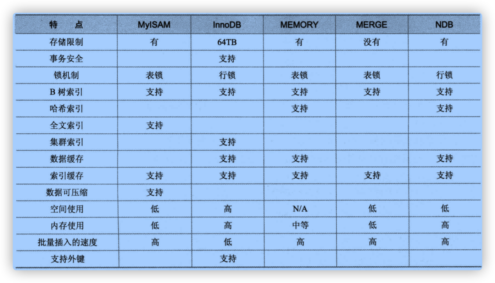

## 存储引擎的选择



### InnoDB

#### 自增长序列

* 可以手工插入，插入0和null的时候，会默认插入增长后的值
* 可以通过`alter table t6 auto_increment 1;` 来改变一开始建表时候自增长字段的默认值
* 改变后的默认值存在于内存中，重启数据库该值会丢失
* 可以通过`last_insert_id()`来获取上次插入的记录的自增长字段的值
* 一次性插入多条记录的后，通过last_insert_id()获取到的是插入的第一条记录的自增长字段的值
* InnoDB中，自增长字段必须是索引，若是组合索引，必须是组合索引的第一列


## 选择合适的数据类型

### CHAR与VARCHAR

#### **异同**

* CHAR固定长度，处理速度更快，但是浪费空间
* CHAR会对行位空格进行处理
* CHAR适用于那些**长度变化不大**并对**查询速度有较高要求**的数据
* VARCHAR随着MySQL版本的提升，性能也变得越来越好

#### 使用原则

* MyISAM中，建议使用CHAR
* InnoDB中，建议使用VARCHAR

### TEXT与BLOB

这两个东西用来保存较长的文本。他们都有相应的TINY，MEDIUM，LONG版本。与CHAR一样，都会占用固定的空间，因此应该根据具体的场景，选用占用空间最小的类型。

#### 异同

* BLOB能够用来保存二进制数据，比如照片；TEXT只能保存字符数据，比如一篇文章或日记

#### 常见问题

* 在执行大量的删除操作时，会引起性能问题

  解释：删除操作会在数据表中留下`空洞`，以后填入这些空洞的记录，在插入性能上会有影响。

  解决：可以通过定期`OPTIMIZE TABLE [table]`功能，对这类表进行碎片整理

* 可以通过合成的索引来提升大文本字段的查询性能

  解释：可以把大文本列进行散列计算，然后存储在一个新的列中，使用散列值进行查找比直接查找大文本字段效率要高很多

  > 合成索引只能用于精确匹配

* 在不必要的时候，避免检索大型的BLOB或TEXT值

* 把BLOB或TEXT分离到单独的表中

  > 如果能让原数据表获得固定长度的数据行的优势的话，这么做是有意义的

### 浮点数与定点数

MySQL中用`float,double`来表示浮点数。数据**小数位超长**的时候会四舍五入的截断式插入到表中，**整数位超长**会报错。例如：定义了一个列是 `column float(5,2)`。那么可推得：

> 整数位最大长度= 列长度 - 小数位长度 = 5 - 2 = 3

整数位最多能插3位，最大值是999。该列能插入的最大值是999.99。

MySQL中用`decimal,numberic`来表示定点数。实际上是以字符串形式存放，能够更精确的保存数据。数据**小数位超长**的时候会四舍五入的截断式插入到表中，**整数位超长**会报错。

> 注意：精度敏感的数据，千万不要用浮点数存储！千万不要用浮点数存储！千万不要用浮点数存储！并且，在非精度敏感的数据上使用了浮点类型的时候，要避免浮点数的比较。

### 日期类型选择

* 根据实际需要选择能够满足应用的最小存储的日期类型
* TIMESTAMP比DATETIME表示的日期范围要短得多
* 如果记录的日期需要让不同时区的用户使用，最好使用TIMESTAMP


## 索引的概念与设计

### 索引概述

MySQL的索引在不同的存储引擎下有各种异同之处。

每种存储引擎对每个表至少支持**16**个索引，总索引长度至少为256字节。MyISAM和InnoDB存储引擎默认创建的都是BTREE索引。MySQL不支持函数索引，但支持前缀索引。前缀索引的长度与存储引擎相关。MyISAM支持的前缀长度可达**1000**字节长；InnoDB支持的前缀长度最长是**767**字节。

> 注意：CREATE TABLE语句中指定的前缀长度的单位是字符数，在为多字符集的列指定前缀长度时，需要多加注意。

MySQL还支持**全文本（FULLTEXT）索引**。只有MyISAM支持全文本索引，并且只限于CHAR、VARCHAR的TEXT列。

### 索引类型

1. 普通索引

```mysql
CREATE TABLE mytable ( name VARCHAR(32) , INDEX index_mytable_name (name) );
CREATE INDEX index_mytable_name ON mytable(name);
ALTER TABLE mytable ADD INDEX index_mytable_name (name);
```

2. 唯一索引

```mysql
CREATE TABLE mytable ( `name` VARCHAR(32) , UNIQUE index_unique_mytable_name (`name`) );
CREATE UNIQUE INDEX index_mytable_name ON mytable(name);
ALTER TABLE mytable ADD UNIQUE INDEX index_mytable_name (name);
```

3. 主键索引

```mysql
CREATE TABLE mytable ( `id` int(11) NOT NULL AUTO_INCREMENT , `name` VARCHAR(32) , PRIMARY KEY (`id`) );
ALTER TABLE test.t1 ADD CONSTRAINT t1_pk PRIMARY KEY (id);
```

4. 组合索引

```mysql
CREATE TABLE mytable ( `id` int(11) , `name` VARCHAR(32) , INDEX index_mytable_id_name (`id`,`name`) );
CREATE INDEX index_mytable_id_name ON mytable(id,name);
ALTER TABLE mytable ADD INDEX index_mytable_id_name　(id,name);
```

5. 全文索引

```mysql
CREATE TABLE `article` ( `id` int(11) NOT NULL AUTO_INCREMENT , `title` char(250) NOT NULL , `contents` text NULL , `create_at` int(10) NULL DEFAULT NULL , PRIMARY KEY (`id`), FULLTEXT (contents) );
CREATE FULLTEXT INDEX index_article_contents ON article(contents);
ALTER TABLE article ADD FULLTEXT INDEX index_article_contents　(contents);
```

### 索引设计的原则

* 搜索的索引列，不一定是所要选择的列
* 使用唯一索引
* 使用段索引
* 利用最左前缀
* 不要过度索引
* 尽量指定经常访问条件的唯一字段为主键
* 主键要尽量选择较短的数据类型


##  视图

视图是一种虚拟存在的表，在数据库中并不实际存在，行和列数据来自**自定义视图的查询中所使用的表**。

### 视图操作

#### 创建或修改视图

```Mysql
CREATE OR REPLACE VIEW [VIEW_NAME] AS [SQL];
ALTER VIEW [VIEW_NAME] AS [SQL];
```

> 定义视图的时候，`FROM`后不能是子查询

以下情况下，视图不能更新：

* 包含以下关键字的SQL语句
  * 聚合函数（SUM,MIN,MAX,COUNT等）
  * DISTINCT
  * GROUP BY
  * HAVING
  * UNION
  * UNION ALL
* 常量视图
* SELECT中包含子查询
* JION
* FROM一个不能更新的视图
* WHERE子句的子查询引用了FROM子句中的表

`WITH [CASCADED|LOCAL] CHECK OPTION`决定了是否允许更新数据，**使记录不再满足视图的条件**。

* `LOCAL`满足当前视图的条件就可以更新数据
* `CASCADED`不但要满足当前视图，还要满足所有跟此视图相关的视图

#### 删除视图

```sql
DROP VIEW [VIEW_NAME]
```

#### 查看视图

```sql
SHOW TABLE STATUS LIKE '[VIEW_NAME]'；
SHOW CREATE VIEW [VIEW_NAME];
```


## 存储过程和函数

存储过程和函数，是事先编译好的存储在数据库上的SQL的一段SQL语句的集合。其好处有：

* 简化应用开发人员的很多工作
* 减少数据在数据库和服务器之间的传输

存储过程和函数的差异：

* 函数必须有返回值，存储过程没有返回值
* 函数的参数的类型只能是`IN`类型，存储过程可以是`IN、OUT、INOUT`

### 存储过程和函数的好处

* 简单
* 安全
* 高性能

在拥有权限的情况下应该尽量的使用它

### 相关操作

存储过程和函数的操作权限：`[CREATE | ALTER | EXECUTE] ROUTINE`。

#### 创建存储过程

```sql
DELIMITER ;;
CREATE DEFINER=`root`@`%` PROCEDURE `getProducts`()
BEGIN
	SELECT * FROM products;
END ;;
DELIMITER ;
```

#### 删除存储过程

```sql
DROP PROCEDURE getProducts IF EXISTS;	
```

#### 使用参数

存储过程一般并**不显示结果**，而是把结果返回给指定的变量。

```SQL
-- 创建存储过程
DELIMITER ;;

CREATE PROCEDURE productsPrice(OUT lowestPrice DECIMAL(8,2),OUT highestPrice DECIMAL(8,2),OUT avgPrice DECIMAL(8,2))
BEGIN
	SELECT MIN(`prod_price`) INTO lowestPrice  FROM products;
	SELECT MAX(`prod_price`) INTO highestPrice  FROM products;
	SELECT AVG(`prod_price`) INTO avgPrice  FROM products;
END;;

DELIMITER ;

-- 调用并传参
CALL productsPrice(@lowestPrice,@highestPrice,@avgPrice);
-- 查询OUT参数
SELECT @lowestPrice,@highestPrice,@avgPrice;
```

#### 建立复杂（带有逻辑）存储过程

只有在存储过程中**包含业务规则和智能处理**时，他们的威力才能真正显示出来。

下边这个例子用来计算某个订单的总费用，在有税和无税的时候，会返回不同的结果。

```sql
DELIMITER ;;

CREATE PROCEDURE orderTotal(
  IN oNumber INT,
  IN taxable BOOLEAN,
  IN taxrate DECIMAL(3,2),
  OUT orderTotal DECIMAL(8,2)) 
    BEGIN
    DECLARE total DECIMAL(8,2);

    SELECT SUM(`item_price` * `quantity`)  FROM `orderitems` WHERE `order_num` = oNumber INTO total;

    IF taxable THEN
      SELECT total + (total * taxrate) INTO total;
    END IF;
      SELECT total INTO orderTotal;
		END ;;

DELIMITER ;

call orderTotal(20005,true,0.6,@orderTotal);

SELECT @orderTotal;
```

#### 定义条件和处理

```txt
DECLARE handler_type HANDLER FOR condition_value[,...] sp_statement

handler_type:
       CONTINUE | EXIT | UNDO(暂不支持)
condition_value:
  SQLSTATE [VALUE] sqlstate_value
  | condition_name
  | SQLWARNING（对所有01开头的SQLSTATE的速记）
  | NOT FOUND（对所有02开头的SQLSTATE的速记）
  | SQLEXCEPTION（其他的SQL出问题的速记）
  | mysql_error_code（比如：1062）
```

#### 光标的使用

在存储过程和函数中可以使用光标**对结果集进行循环的处理**。

```
DECLARE cursor_name CURSOR FOR select_statement
OPEN cursor_name
FETCH cursor_name INTO var_name [, var_name] ...
CLOSE cursor_name
```

案例

```sql
delimiter $$

CREATE PROCEDURE payment_stat ()
BEGIN
  DECLARE i_staff_id int;
  DECLARE d_amount decimal(5,2);
  DECLARE cur_payment cursor for select staff_id,amount from payment;
  DECLARE EXIT HANDLER FOR NOT FOUND CLOSE cur_payment;
  set @x1 = 0;
  set @x2 = 0;
  OPEN cur_payment;
  REPEAT
  FETCH cur_payment INTO i_staff_id, d_amount;
  if i_staff_id = 2 then
  	set @x1 = @x1 + d_amount;
  else
  	set @x2 = @x2 + d_amount;
  end if;
  UNTIL 0 END REPEAT; 
  CLOSE cur_payment; 
END $$

delimiter ;
```

#### 流程控制

`IF、CASE、LOOP、LEAVE、ITERATE、REPEAT、WHILE`


## 触发器

### 创建触发器

```sql
DELIMITER $$

CREATE TRIGGER [TRIGGER_NAME] [TRIGGER_TIME] [TRIGGER_EVENT] ON [TABLE_NAME] FOR EACH ROW 
BEGIN
[SQL] 
END $$

DELIMITER ;
```

案例

```sql
DELIMITER ;;

CREATE TRIGGER ins_trigger BEFORE INSERT ON t FOR EACH ROW
BEGIN
INSERT INTO t1 VALUES (1,2,3);
END;;

DELIMITER ;
```

### 删除触发器

```SQL
DROP TRIGGER [SCHEMA_NAME.TRIGGER_NAME]
```

### 查看触发器

```
SHOW TRIGGERS \G;
```

### 触发器的两点限制

1. 触发程序不能调用将数据返回客户端的存储程序，也不能使用采用 CALL 语句的动态 SQL 语句，但是允许存储程序通过参数将数据返回触发程序。也就是存储过程或者函数通过 OUT 或者 INOUT 类型的参数将数据返回触发器是可以的，但是不能调用直接返回数据的过程。

2. 不能在触发器中使用以显式或隐式方式开始或结束事务的语句，如 START TRANSACTION、 COMMIT 或 ROLLBACK。


## 事务控制

简单来说，事务就是要保证一组数据库操作，要么全部成功，要么全部失败。事务的四大特性：

* Atomicity（原子性）
* Consistency（一致性）
* Isolation（隔离性）
* Durability（持久性）

### 隔离性

在 MySQL 中，事务支持是在引擎层实现的。当数据库上有多个事务同时执行的时候，就可能出现

* 脏读（dirty read）
* 不可重复读（non-repeatable read）
* 幻读（phantom read）

的问题，为了解决这些问题，就有了**“隔离级别”**的概念。在谈隔离级别之前，你首先要知道，你**隔离得越严实，效率就会越低**。因此很多时候，我们都要在二者之间寻找一个**平衡点**。

标准的事务隔离级别包括：

* 读未提交（read uncommitted）（此事务还没提交，别人就能读到在该事务中更新后的结果），一个事务还没提交时，它做的变更就能被别的事务看到；
* 读提交（read committed）（此事务还没提交，别人无法读到在该事务中更新后的结果），一个事务提交之后，它做的变更才会被其他事务看到；
* 可重复读（repeatable read）（别人做的任何数据更改，不影响本事务，本事务始终读的都是事务开始时候的快照），一个事务执行过程中看到的数据，总是跟这个事务在启动时看到的数据是一致的。当然在可重复读隔离级别下，未提交变更对其他事务也是不可见的；
* 串行化（serializable），顾名思义是对于同一行记录，“写”会加“写锁”，“读”会加“读锁”。当出现读写锁冲突的时候，后访问的事务必须等前一个事务执行完成，才能继续执行；

在实现上，数据库里面会创建一个视图，访问的时候以视图的逻辑结果为准。

在“可重复读”隔离级别下，这个视图是在**事务启动时**创建的，整个事务存在期间都用这个视图；

> 是个整个数据库建立一个视图吗？

在“读提交”隔离级别下，这个视图是在**每个 SQL 语句开始执行**的时候创建的；

这里需要注意的是，“读未提交”隔离级别下直接返回记录上的最新值，**没有视图概念**；

而“串行化”隔离级别下**直接用加锁的方式**来避免并行访问。

MySQL 通过 `SET AUTOCOMMIT`、`START TRANSACTION`、`COMMIT` 和 `ROLLBACK` 等语句支持本地事务。

默认情况下，MySQL 是**自动提交**(Autocommit)的，如果需要通过明确的`Commit` 和`Rollback`来提交和回滚事务，那么需要通过明确的**事务控制命令**来开始事务。

以下是事务控制命令：

* `START TRANSACTION` 或 `BEGIN` 语句可以开始一项新的事务
* `COMMIT` 和 `ROLLBACK` 用来提交或者回滚事务
* `CHAIN` 和 `RELEASE` 子句分别用来定义在事务**提交或者回滚之后**的操作
  * `CHAIN` 会立即启动一个新事物，并且和刚才的事务具有相同的隔离级别
  * `RELEASE` 则会断开和客户端的连接

* `SET AUTOCOMMIT` 可以修改当前连接的提交方式，如果设置了 `SET AUTOCOMMIT=0`， 则设置之后的所有事务都需要通过明确的命令进行提交或者回滚


> 如果在锁表期间，用 `start transaction` 命令开始一个新事务，会造成一个隐含的 unlock tables 被执行
>
> 如果在锁表期间，设置`SET AUTOCOMMIT=0`，`unlock tables`会隐式提交事务


