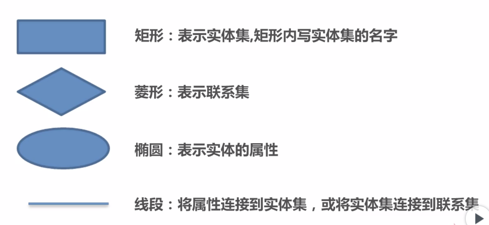
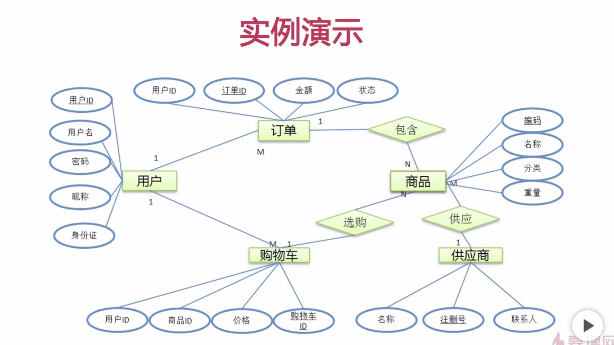
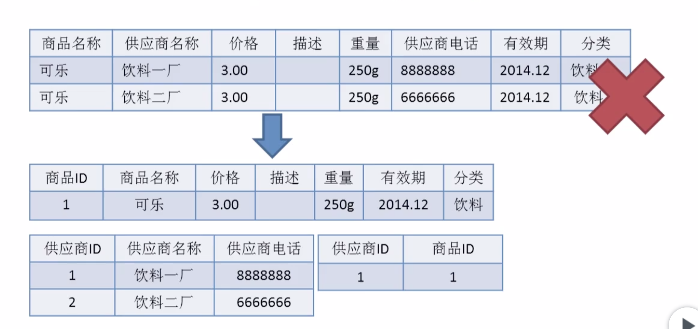
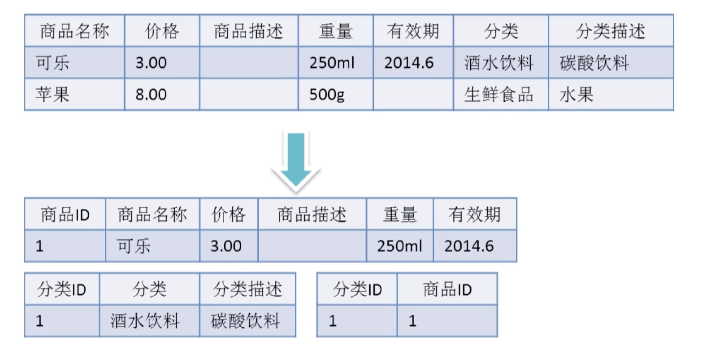
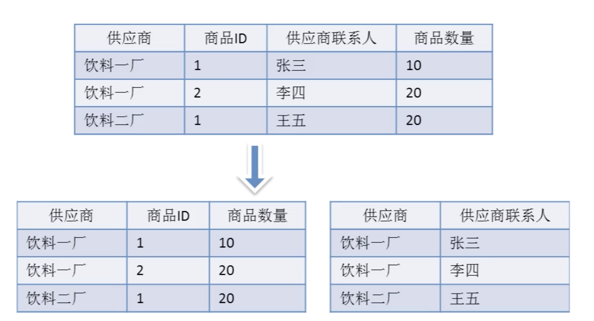
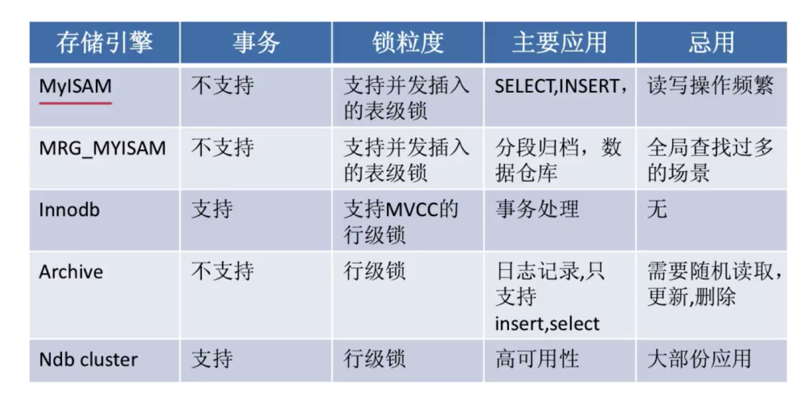
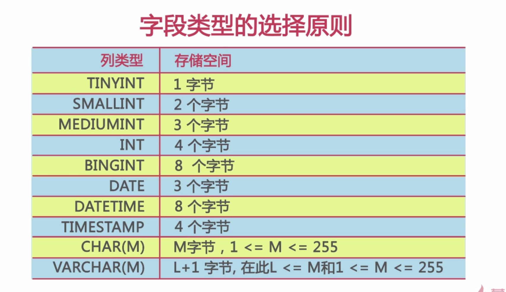

# 数据库设计

* 需求分析
* 逻辑设计
* 物理设计
* 维护优化

## 需求分析

### 了解数据

1. 了解你的系统当中需要存储的数据。
2. 了解数据的特点。
3. 了解数据的生命周期。

### 需要搞清楚的问题

1. 实体及实体之间的关系。
2. 实体包含的属性是什么？
3. 哪些属性或属性的组合可以唯一标识一个实体。

### 举例（一个电商系统）

## 逻辑设计

### 做什么

1. 将需求转化为数据库的逻辑模型。
2. 通过ER图的形式对逻辑模型进行展示。
3. 与之后要选用的DBMS系统没有关系。

### 名词解释

### ER图说明

### 数据库设计范式

1. **第一范式**（最容易）
2. **第二范式**
3. **第三范式**
4. BC范式

#### 第一范式

数据库表中所有的字段都是单一属性，不可再分的。单一属性是由基本的数据类型构成的，如整数、字符串。

#### 第二范式

数据库的表中不存在非关键字段对任一候选关键字段的部分函数依赖。

部分函数依赖是指存在着组合关键字中的某一关键字决定非非关键字的情况。

#### 第三范式

第三范式是在第二范式的基础之上定义的。

如果数据表中不存在非关键字段，对任意候选关键字段的传递函数依赖则符合第三范式。

#### BC范式

在第三范式的基础之上，数据库表中不存在任何字段对任一候选人字段的传递函数依赖则符合BC范式。

也就是说如果是复合关键字，则符合关键字之间也不能存在函数依赖关系。

## 物理设计(重点)

### 做什么

1. 选择合适的数据库管理系统。
2. 定义数据库、表、及字段的命名规范。
3. 根据所选的数据库管理系统选择合适的字段类型。
4. 反范式化设计。

#### 选择数据库管理系统

##### 成本问题

* Oracle 

* SQLServer

这两个数据库是商业数据库。

* MySQL
* PgSQL

这两个是开源数据库。

##### 功能上

* Oracle

适合在程序中经常用到比较大的事务性操作的场合。

##### 操作系统兼容

* SQLServer 

只能在Widows上运行。

##### 开发语言

java php 适合 MySQL、PgSQL、Oracle。

.net 适合用SQLServer。

##### 综合

商业数据库适合企业级项目开发，Oracle，如电信、金融类，扩展容易，安全。

开源数据库比较适合互联网应用的开发，MySQL。

##### MySQL存储引擎的选择

#### 定义库、表及字段的命名规则

* 可读性原则。
* 表意性原则。
* 长名原则。

#### 数据库字段类型选择

##### 常规选择

优先考虑数字类型

其次考虑日期或二进制类型

最后是字符串类型

对于相同级别的数据类型，应该优先选择占用空间小的数据类型。

主要是基于以下两个角度进行考虑的：

1. 在对数据进行比较（查询条件、JOIN条件及排序）操作时，同样的数据，字符处理往往比数字处理要慢。
2. 在数据库中，数据处理**以页为单位**，列的长度越小，利于性能提升。

##### char与varchar的选择

1. 如果列中要存储的数据长度差不多是一致的，则应该考虑用char；否则考虑用varchar。
2. 如果列中的最大数据长度小于50byte，则一般也考虑用char。因为varchar除了会存储数据本身的信息之外还要存储一些提供变长功能的一些信息，这样在查询的时候就要先确定我们的数据的其实位置在哪里，就会让查询变慢（以为做了确定位置的操作），当然如果列很少用，基于节省空间和IO的考虑，还是可以使用varchar的。
3. 一般不宜定义50Byte的char类型列。

##### decimal与float的选择

##### 时间类型的存储

##### 其他需要注意的事项

###### 如何设计主键

###### 避免使用外键约束

###### 严禁使用预留字段

#### 反范式化设计

##### 为什么反范式化

* 减少表的关联数量。
* 增加数据的读取效率。
* 反范式化一定要适度。

## 维护优化

### 做什么

* 维护数据字典（表定义书）
* 维护索引
* 维护表结构
* 在适当的时候对表进行水平查分或垂直拆分。

#### 维护数据字典

1. 使用合适的第三方数据字典维护工具。
2. 利用数据库本身的备注字段来维护数据字典。

#### 维护索引

#### 维护表结构

#### 拆分

