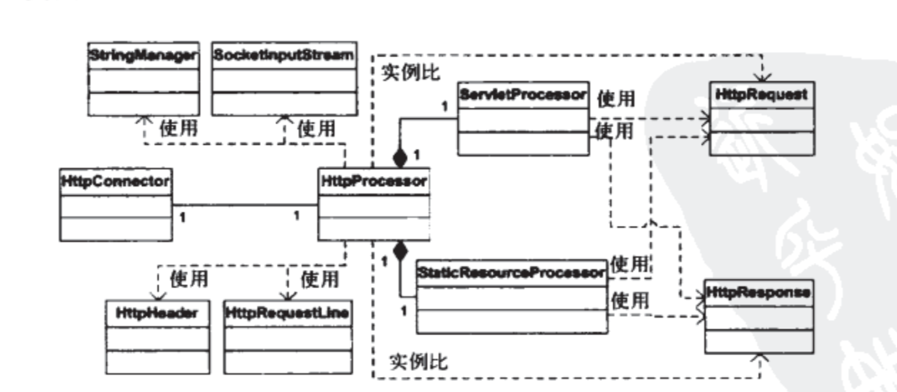
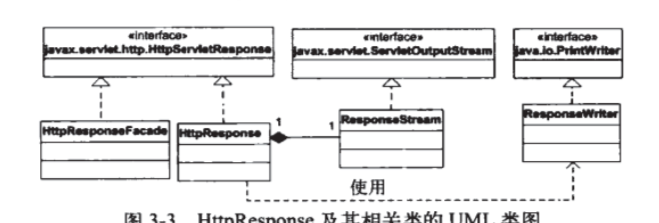

# 连接器

## 内容

本章分为三个模块：

* 连接器
* 启动模块
* 核心模块

HttpConnector的职责：

* 等待HTTP请求asss                                                                                                                                    

Processor的职责：

* 创建Request类
* 创建Response类
* HTTP协议（其实是应用层协议）解析

## HTTPResponse响应处理

## 设计模式

* 单例模式

## 并发

* StringManager的getManager方法使用**synchronize**关键字来保证并发情况下的单例的安全创建。
* 每个HttpConnector都运行在自己的线程当中。

