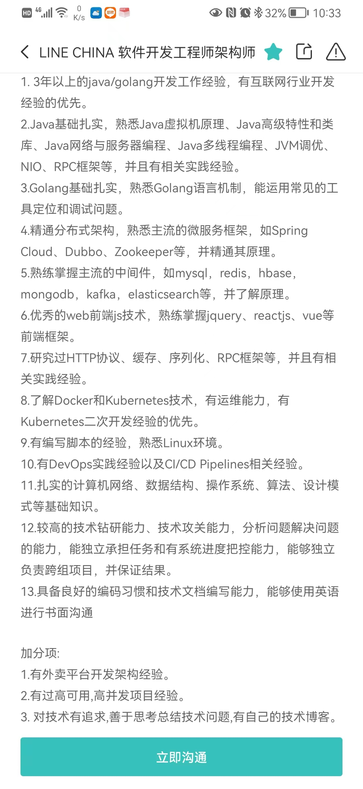

## 架构师

1. 计算机、软件工程、工业自动化等相关专业
2. 8年软件行业工作经历，其中至少3年软件架构工作经验
3. 主导进行过软件架构设计，精通windows，linux操作系统，至少精通java/C#/C/C++/python中的一种，有大型分布式、高并发、高负载、高可用系统软件的设计、开发、调优经验
4. 掌握后台调度、缓存、消息、分布事务、数据库及跨平台技术
5. 具备独立完成业务架构设计、方案设计能力
6. 有责任心，逻辑严谨、思维敏锐，学习高效，善于沟通、协作，有团队合作精神。

## 高工

1. 计算机软件等相关专业
2. 5年以上软件开发经验；     
3. 熟练使用SpringBoot、SpringCloud开发技术，了解常见开源微服务框架，有微服务项目开发经验，对微服务项目常见问题有独立解决的能力
4. 了解虚拟化技术，对Docker、Kubernetes原理清楚；具备一定的Kubernetes应用部署、维护、资源配置经验；了解持续集成部署的原理，熟悉关键节点
5. 了解JVM
6. 熟悉HTML/CSS、JavaScript等前端开发技术；对jquery、vue等相关技术熟悉；熟悉websocket等相关技术
7. 熟悉Redis、Mq等常见中间件，对Redis、Mq的使用方式，调优策略熟悉
8. 熟悉OLTP、OLAP类型数据库，能够根据业务场景设计对应的存储方案
9. 有云平台如阿里云EDAS、ECS等产品使用经验优先，有devops经验优先

## Line China公司的一份招聘简章

