## 一、云服务器ECS的概念

### 服务器的发展历程

#### 服务器的部署模式

### 云服务器ECS的优势

### 云服务的灵魂：虚拟化

​		

### 云服务器ECS概念

### 	ECS中的相关组件

## 二、ECS实例

### 实例的分类

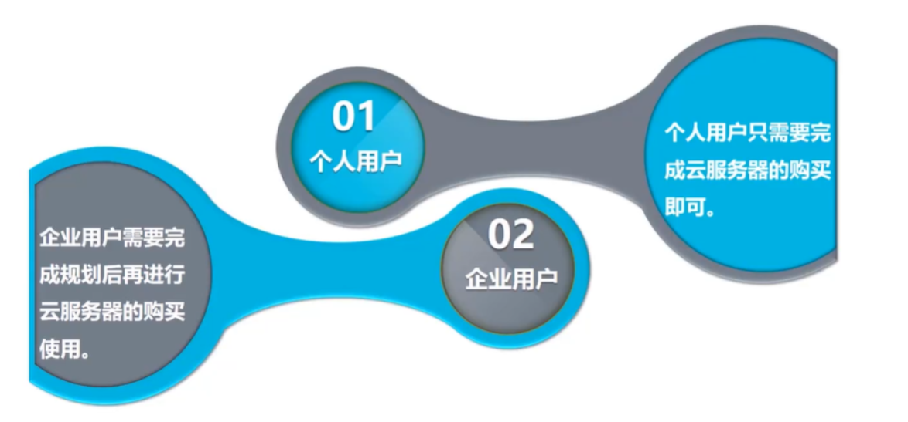

### 实例的规格

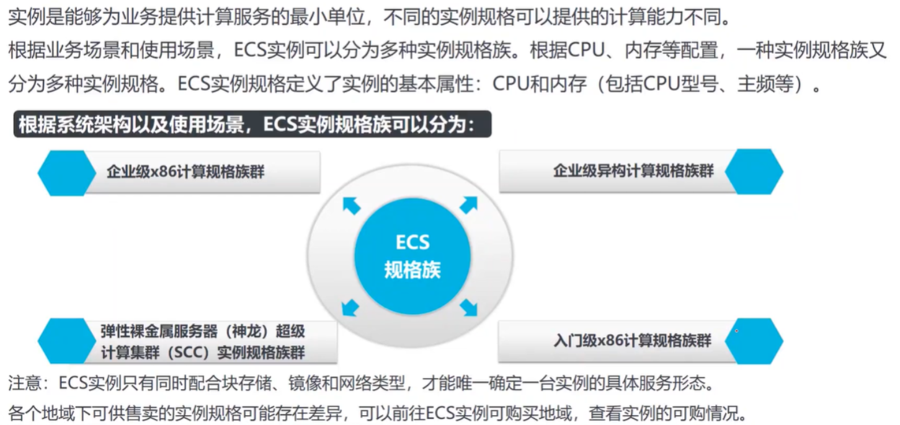

### 弹性裸金属服务器

性能要求比较高的时候，可以考虑选用这个。

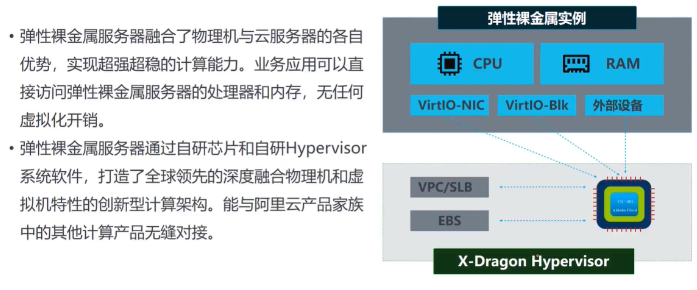

#### 弹性裸金属服务器的架构

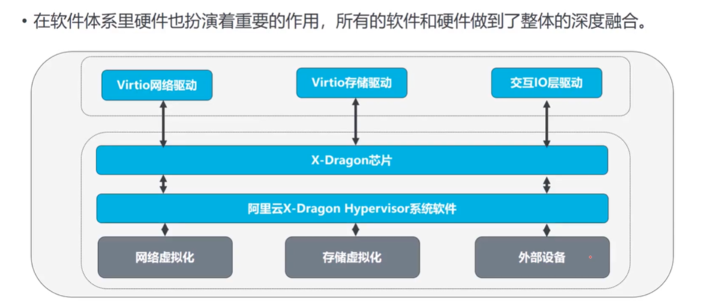

### ECS的生命周期

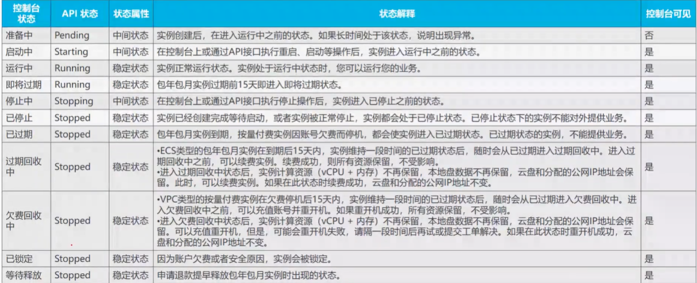

###  镜像的概念（其实就是装机盘）

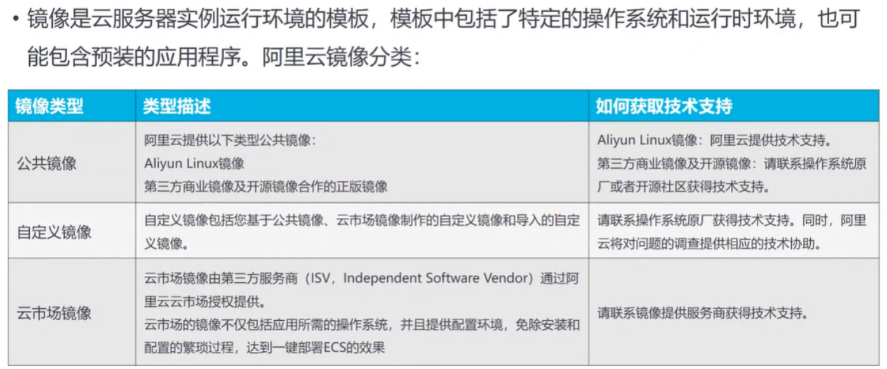

### VPC概述

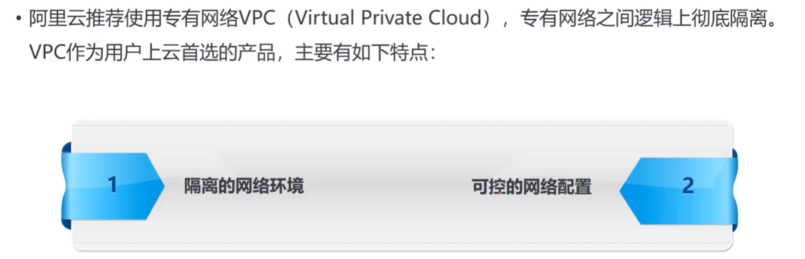

### 安全组

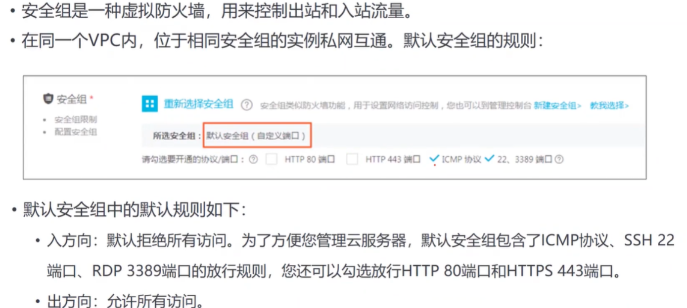

### VPC安全组的默认规则

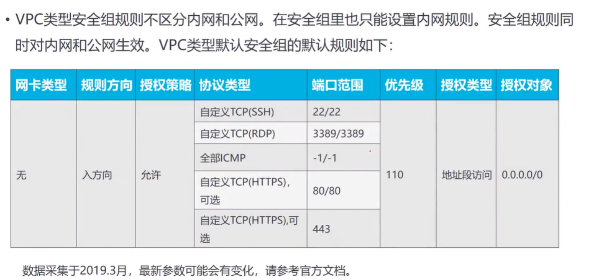

## 三、ECS的优势（与IDC相比）

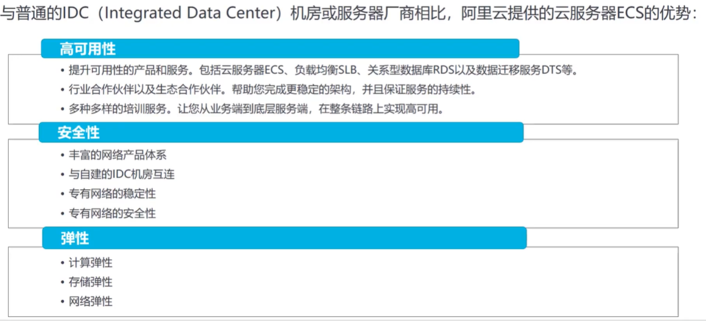

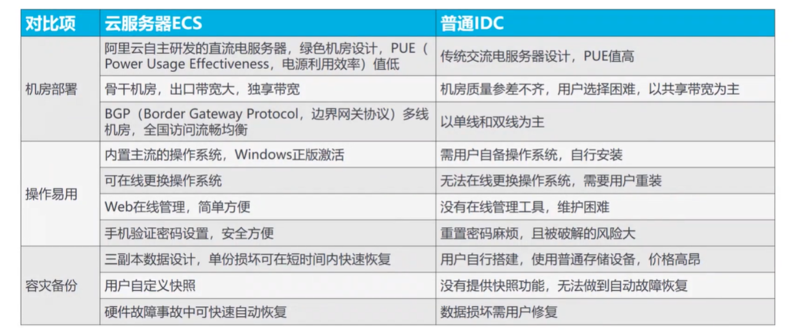

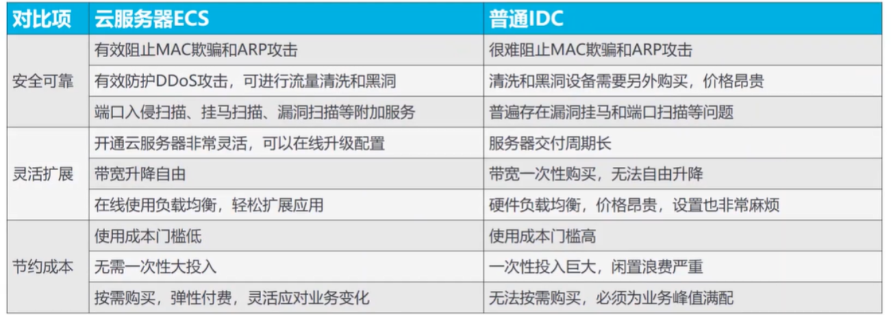

## 四、ECS的使用

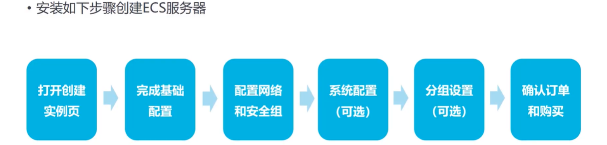

### 配置安全组

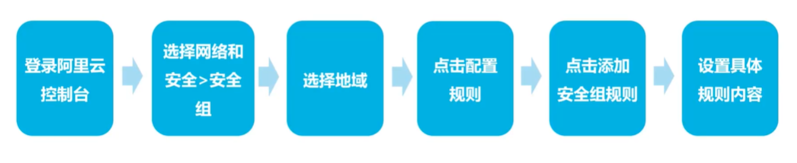

