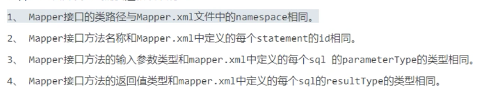
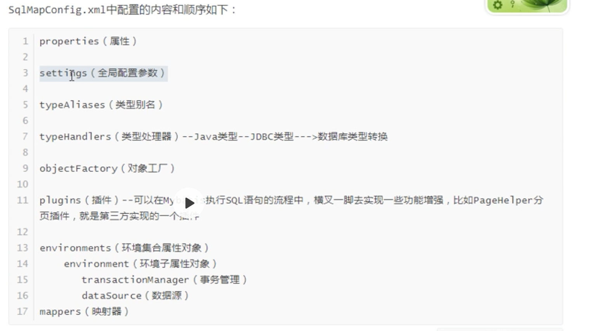

## 基础应用篇

### 使用流程

1. 编写全局配置文件:SqlMapConfig.xml
2. 映射文件:xxxMapper.xml
3. 编写dao代码:xxxDao接口
4. 编写xxxDaoImpl实现类 （**在使用mapper代理开发的时候，不需要编写这个东西**）
5. POJO类
6. 单元测试类


###开发方式

平时用mybatis进行开发的时候可以发现只需要关注两个类即可，一个是mapper接口类，另一个是mapper的xml文件。这是因为，mybatis采用了**动态代理的方式为我们生成了mapper的实现类**。所以我们根本不用手动编写mapper的实现类。

```java
sqlSession.getMapper(xxx.Class);
```


#### xml方式

使用xml进行开发的时候有一些开发规范




#### 注解开发方式

这个了解一下就行了，个人不喜欢这种开发方式。


### 全局配置文件



**settings与缓存和延时加载有关**


### 输入输出映射

就是简单是输入输出映射，跟平时用的差不多，平时用的时候多总结多注意即可。


### 一对一和一对多关联查询

#### 一对一

举例：一个订单对应一个用户

sql

```mysql
SELECT
   orders.*, user.username, user.address
FROM
	orders LEFT JOIN user
	ON orders.user_id = user.id
```

pojo

```java
public class OrdersExt extends Order {
	private User user;// 用户对象 // get/set。。。。
}
```

mapper.xml

```xml
<resultMap type="OrdersExt" id="ordersAndUserRstMap">
    <id column="id" property="id" />
    <result column="user_id" property="userId" />
    <result column="number" property="number" />
    <result column="createtime" property="createtime" />
    <result column="note" property="note" />
    <!-- 一对一关联映射 -->
    <association property="user" javaType="com.kkb.mybatis.po.User">
        <!-- column:user表的主键对应的列 property:user对象中id属性-->
        <id column="user_id" property="id" />
        <result column="username" property="username" />
        <result column="address" property="address" />
    </association>
</resultMap>

<select id="findOrdersAndUserRstMap" resultMap="ordersAndUserRstMap"> 
    SELECT
        o.id, o.user_id, o.number, o.createtime, o.note, u.username, u.address
    FROM
    orders o
    JOIN `user` u ON u.id = o.user_id 
</select>
```

mapper接口

```java
public List<OrdersExt> findOrdersAndUserRstMap() throws Exception;
```

测试代码

```java
public void testfindOrdersAndUserRstMap()throws Exception{ 
  	//获取session
    SqlSession session = sqlSessionFactory.openSession(); 
    //获限mapper接口实例
    UserMapper userMapper = session.getMapper(UserMapper.class); 
    //查询订单信息
    List<OrdersExt> list = userMapper.findOrdersAndUserRstMap(); 
    System.out.println(list);
    //关闭session
    session.close();
}
```


#### 一对多

举例：一个用户对应多个订单

sql

```mysql
SELECT u.*,
  o.id oid, o.number, o.createtime, o.note
  FROM
  `user` u
LEFT JOIN orders o ON u.id = o.user_id
```

pojo

```java
public class UserExt extends User {
	private List<Order> orders;// 用户对象 // get/set。。。。
}
```

mapper.xml

```xml
<resultMap type="userExt" id="userAndOrderRstMap">
    <!-- 用户信息映射 -->
    <id property="id" column="id" />
    <result property="username" column="username" />
    <result property="birthday" column="birthday" />
    <result property="sex" column="sex" />
    <result property="address" column="address" /> <!-- 一对多关联映射 -->
    <collection property="orders" ofType="order">
        <id property="id" column="oid" />
        <result property="userId" column="id" />
        <result property="number" column="number" />
        <result property="createtime" column="createtime" />
        <result property="note" column="note" />
    </collection>
</resultMap>
<select id="findUserAndOrderRstMap" resultMap="userAndOrderRstMap">
    SELECT
    u.*, o.id oid,
    o.number, o.createtime, o.note
    FROM
    `user` u
    LEFT JOIN orders o ON u.id = o.user_id
</select>

```

mapper接口

```java
public List<User> findUserAndOrdersRstMap() throws Exception;
```

测试程序

```java
@Test
public void testFindUserAndOrdersRstMap() {
    SqlSession session = sqlSessionFactory.openSession(); 
    UserMapper userMapper = session.getMapper(UserMapper.class); 
    List<User> result = userMapper.findUserAndOrdersRstMap(); 
    for (User user : result) {
    	System.out.println(user); 
    }
    session.close()
}
```


### 动态Sql

* if
* choose, when, otherwise
* trim, where, set
* foreach
* script
* bind
* Multi-db vendor support
* Pluggable Scripting Languages For Dynamic SQL

直接看官网吧，这里只记录一下将来使用的时候遇到的一些问题。


### 延时加载（懒加载）

* 发生在关联查询中，目的是**减少数据库压力**。
* resultMap中的association和collection标签来实现
* 也被成为嵌套查询
* 只对关联对象进行延时加载，主对象没有延时加载


延时加载分为：

* 直接加载（直接就执行了关联对象的查询）
* 侵入式延迟（使用到主对象的时候就执行关联对象的查询）
* 深度延迟（使用到关联对象的时候才执行关联对象的查询）


以上三种加载分类的配置方式如下：

```xml
<!-- 1.直接加载 -->
<settings>
    <!-- 延迟加载总开关 -->
    <setting name="lazyLoadingEnabled" value="false"/>
</settings>

<!-- 2.嵌入式延时加载 -->
<settings>
    <!-- 延迟加载总开关 -->
    <setting name="lazyLoadingEnabled" value="true"/> 
  	<!-- 侵入式延迟加载开关 -->
    <setting name="aggressiveLazyLoading" value="true"/>
</settings>

<!-- 3.深度延时加载 -->
<settings>
    <!-- 延迟加载总开关 -->
    <setting name="lazyLoadingEnabled" value="true"/> 
  	<!-- 侵入式延迟加载开关 -->
    <setting name="aggressiveLazyLoading" value="false"/>
</settings>
```


以查询商品类别以及类别下的所有商品为例。

mapper.xml

```xml
<?xml version="1.0" encoding="UTF-8"?>
<!DOCTYPE mapper 
    PUBLIC "-//mybatis.org//DTD Mapper 3.0//EN" 
    "http://mybatis.org/dtd/mybatis-3-mapper.dtd">
<mapper namespace="com.sl.mapper.LazyLoadMapper">
        <!-- 分类信息查询 -->
        <select id="lazyLoadTest"  resultMap="lazyLoadProductsByCategoryTest">
            select * from category where id=#{id}
        </select>
        <resultMap id="lazyLoadProductsByCategoryTest" type="com.sl.po.Category">
            <id column="id" property="Id"></id>
            <result column="name" property="Name"></result>
            <result column="remark" property="Remark"></result>
            <!-- 一个分类对应多个产品，此处使用collection -->
            <collection property="productList" 
                        ofType="com.sl.po.Product"  
                        column="id" 		
                        select="selectProductsByCategoryId">
          	</collection>
        </resultMap>
        
        <!-- 嵌套查询返回商品信息，延迟加载将要执行的sql -->
        <select id="selectProductsByCategoryId"  resultType="com.sl.po.Product">
            select * from products where categoryid=#{id} 
        </select>
        
</mapper>
```


### 缓存

在分布式开饭当中Mybatis的缓存没有太大用处。

缓存分为两个级别：

* 一级缓存：SqlSession级别（默认开启）
* 二级缓存：Mapper（namespace）级别（默认不开启）

二级缓存粒度很大，同一个mapper下边如果进行了增删改操作，那么二级缓存就会被清空，如果频繁的进行这种操作，也很影响效率。

从java后端整体上来看，MyBatis自身的二级缓存用处不大。但是，在小公司里边进行简单的单体应用开发的时候，可能在某些时候能起到奇效。


#### 开启二级缓存

```xml
<!-- 开启二级缓存总开关 --> <settings>
<setting name="cacheEnabled" value="true"/> </settings>
```

```xml
<!-- 开启本mapper下的namespace的二级缓存，默认使用的是mybatis提供的PerpetualCache -->
 <cache></cache>
```

注意：**二级缓存不一定都缓存到内存中，可能会缓存到磁盘，因此被缓存的对象需要实现序列化**。


#### 可定制的二级缓存

某个mapper中的select不想用二级缓存的话，可以这样做：

```xml
<select id="findUserById" parameterType="int" resultType="com.kkb.mybatis.po.User" useCache="true">
	SELECT * FROM user WHERE id = #{id}
</select>
```

默认情况下，select语句不会刷新缓存，insert、update、delete会刷新二级缓存。这一切都可以用`flushCache`这个属性来进行控制。

```xml
<select id="findUserById" parameterType="int" resultType="com.kkb.mybatis.po.User" useCache="true" flushCache="true">
  SELECT * FROM user WHERE id = #{id} 
</select>
```


#### 应用场景

根据二级缓存的特性可以发现，在一些访问速度要求较高，但是实时性要求不高的场景下，可以使用二级缓存。


#### 使用注意事项

在使用二级缓存的时候，要设置一下刷新间隔(cache标签中有一个`flashInterval`属性)来定时刷新二级缓存，这个刷新间隔根据具体需求来设置，比如设置30分钟、60分钟等， 单位为毫秒。


#### 个人感悟

我感觉MyBatis的二级缓存其实在某些业务场景下还是有一定的用处的。他的弊端在于，**需要花费时间去进行合理的设计才能达到有限的功能**，然而在软件开发当中，这种费力不讨好的事情大家是不愿意干的，所以导致了MyBatis的二级缓存处于了一种尴尬的局面。

了解下就好了，我不会再项目中大量的应用二级缓存，只会在某些特定的场景下，使用它能很好的解决问题的时候才会去碰他。


### 分页插件的使用

1. 添加依赖

```xml
<dependency> 
  <groupId>com.github.pagehelper</groupId> 
  <artifactId>pagehelper</artifactId>
  <version>5.1.6</version>
</dependency>
```

2. spring配置文件

```xml
<bean id="sqlSessionFactory" class="org.mybatis.spring.SqlSessionFactoryBean">
    <!-- other configuration -->
    <property name="plugins">
        <array>
            <bean class="com.github.pagehelper.PageInterceptor">
                <property name="properties">
                    <!-- config params as the following -->
                    <value>
                        helperDialect=mysql
                    </value>
                </property>
            </bean>
        </array>
    </property>
</bean>
```

3. 使用

```java
private void test() {
		// 获取第1页，10条内容，默认查询总数count PageHelper.startPage(1, 10);
		List<Country> list = countryMapper.selectAll(); 
  	// 用PageInfo对结果进行包装
		PageInfo page = new PageInfo(list); 
  	// 测试PageInfo全部属性 //PageInfo包含了非常全面的分页属性
		assertEquals(1, page.getPageNum());
		assertEquals(10, page.getPageSize());
		assertEquals(1, page.getStartRow());
		assertEquals(10, page.getEndRow());
		assertEquals(183, page.getTotal());
		assertEquals(19, page.getPages());
		assertEquals(1, page.getFirstPage());
		assertEquals(8, page.getLastPage());
		assertEquals(true, page.isFirstPage());
		assertEquals(false, page.isLastPage());
		assertEquals(false, page.isHasPreviousPage());
		assertEquals(true, page.isHasNextPage());
	}
```


### XML映射文件

#### SELECT

Mybatis能够节省时间的地方在于，他能够自动的将结果集映射到对应的实例当中。而使用JDBC需要手动编写这些转换代码。

select元素有很多的属性来配置每条语句的细节。

| 属性            | 描述                                                         |
| :-------------- | :----------------------------------------------------------- |
| `id`            | 在命名空间中唯一的标识符，可以被用来引用这条语句。           |
| `parameterType` | 将会传入这条语句的参数类的完全限定名或别名。这个属性是可选的，因为 MyBatis 可以通过类型处理器（TypeHandler） 推断出具体传入语句的参数，默认值为未设置（unset）。 |
| parameterMap    | 这是引用外部 parameterMap 的已经被废弃的方法。请使用内联参数映射和 parameterType 属性。 |
| `resultType`    | 从这条语句中返回的期望类型的类的完全限定名或别名。 注意如果返回的是集合，那应该设置为集合包含的类型，而不是集合本身。可以使用 resultType 或 resultMap，但不能同时使用。 |
| `resultMap`     | 外部 resultMap 的命名引用。结果集的映射是 MyBatis 最强大的特性，如果你对其理解透彻，许多复杂映射的情形都能迎刃而解。可以使用 resultMap 或 resultType，但不能同时使用。 |
| `flushCache`    | 将其设置为 true 后，只要语句被调用，都会导致本地缓存和二级缓存被清空，默认值：false。 |
| `useCache`      | 将其设置为 true 后，将会导致本条语句的结果被二级缓存缓存起来，默认值：对 select 元素为 true。 |
| `timeout`       | 这个设置是在抛出异常之前，驱动程序等待数据库返回请求结果的秒数。默认值为未设置（unset）（依赖驱动）。 |
| `fetchSize`     | 这是一个给驱动的提示，尝试让驱动程序每次批量返回的结果行数和这个设置值相等。 默认值为未设置（unset）（依赖驱动）。 |
| `statementType` | STATEMENT，PREPARED 或 CALLABLE 中的一个。这会让 MyBatis 分别使用 Statement，PreparedStatement 或 CallableStatement，默认值：PREPARED。 |
| `resultSetType` | FORWARD_ONLY，SCROLL_SENSITIVE, SCROLL_INSENSITIVE 或 DEFAULT（等价于 unset） 中的一个，默认值为 unset （依赖驱动）。 |
| `databaseId`    | 如果配置了数据库厂商标识（databaseIdProvider），MyBatis 会加载所有的不带 databaseId 或匹配当前 databaseId 的语句；如果带或者不带的语句都有，则不带的会被忽略。 |
| `resultOrdered` | 这个设置仅针对嵌套结果 select 语句适用：如果为 true，就是假设包含了嵌套结果集或是分组，这样的话当返回一个主结果行的时候，就不会发生有对前面结果集的引用的情况。 这就使得在获取嵌套的结果集的时候不至于导致内存不够用。默认值：`false`。 |
| `resultSets`    | 这个设置仅对多结果集的情况适用。它将列出语句执行后返回的结果集并给每个结果集一个名称，名称是逗号分隔的。 |


#### insert, update 和 delete

仍然是有一些属性

| 属性               | 描述                                                         |
| :----------------- | :----------------------------------------------------------- |
| `id`               | 命名空间中的唯一标识符，可被用来代表这条语句。               |
| `parameterType`    | 将要传入语句的参数的完全限定类名或别名。这个属性是可选的，因为 MyBatis 可以通过类型处理器推断出具体传入语句的参数，默认值为未设置（unset）。 |
| `parameterMap`     | 这是引用外部 parameterMap 的已经被废弃的方法。请使用内联参数映射和 parameterType 属性。 |
| `flushCache`       | 将其设置为 true 后，只要语句被调用，都会导致本地缓存和二级缓存被清空，默认值：true（对于 insert、update 和 delete 语句）。 |
| `timeout`          | 这个设置是在抛出异常之前，驱动程序等待数据库返回请求结果的秒数。默认值为未设置（unset）（依赖驱动）。 |
| `statementType`    | STATEMENT，PREPARED 或 CALLABLE 的一个。这会让 MyBatis 分别使用 Statement，PreparedStatement 或 CallableStatement，默认值：PREPARED。 |
| `useGeneratedKeys` | （仅对 insert 和 update 有用）这会令 MyBatis 使用 JDBC 的 getGeneratedKeys 方法来取出由数据库内部生成的主键（比如：像 MySQL 和 SQL Server 这样的关系数据库管理系统的自动递增字段），默认值：false。 |
| `keyProperty`      | （仅对 insert 和 update 有用）唯一标记一个属性，MyBatis 会通过 getGeneratedKeys 的返回值或者通过 insert 语句的 selectKey 子元素设置它的键值，默认值：未设置（`unset`）。如果希望得到多个生成的列，也可以是逗号分隔的属性名称列表。 |
| `keyColumn`        | （仅对 insert 和 update 有用）通过生成的键值设置表中的列名，这个设置仅在某些数据库（像 PostgreSQL）是必须的，当主键列不是表中的第一列的时候需要设置。如果希望使用多个生成的列，也可以设置为逗号分隔的属性名称列表。 |
| `databaseId`       | 如果配置了数据库厂商标识（databaseIdProvider），MyBatis 会加载所有的不带 databaseId 或匹配当前 databaseId 的语句；如果带或者不带的语句都有，则不带的会被忽略。 |

如果想插入或者更新完后能够返回自动生成的主键，就这样写：

```sql
<insert id="insertAuthor" useGeneratedKeys="true"
    keyProperty="id">
  insert into Author (username, password, email, bio) values
  <foreach item="item" collection="list" separator=",">
    (#{item.username}, #{item.password}, #{item.email}, #{item.bio})
  </foreach>
</insert>
```

selectKey对应的一些属性：

| 属性            | 描述                                                         |
| :-------------- | :----------------------------------------------------------- |
| `keyProperty`   | selectKey 语句结果应该被设置的目标属性。如果希望得到多个生成的列，也可以是逗号分隔的属性名称列表。 |
| `keyColumn`     | 匹配属性的返回结果集中的列名称。如果希望得到多个生成的列，也可以是逗号分隔的属性名称列表。 |
| `resultType`    | 结果的类型。MyBatis 通常可以推断出来，但是为了更加精确，写上也不会有什么问题。MyBatis 允许将任何简单类型用作主键的类型，包括字符串。如果希望作用于多个生成的列，则可以使用一个包含期望属性的 Object 或一个 Map。 |
| `order`         | 这可以被设置为 BEFORE 或 AFTER。如果设置为 BEFORE，那么它会首先生成主键，设置 keyProperty 然后执行插入语句。如果设置为 AFTER，那么先执行插入语句，然后是 selectKey 中的语句 - 这和 Oracle 数据库的行为相似，在插入语句内部可能有嵌入索引调用。 |
| `statementType` | 与前面相同，MyBatis 支持 STATEMENT，PREPARED 和 CALLABLE 语句的映射类型，分别代表 PreparedStatement 和 CallableStatement 类型。 |


#### SQL

这个元素可以被用来定义可重用的 SQL 代码。

```sql
<sql id="sometable">
  ${prefix}Table
</sql>

<sql id="someinclude">
  from
    <include refid="${include_target}"/>
</sql>

<select id="select" resultType="map">
  select
    field1, field2, field3
  <include refid="someinclude">
    <property name="prefix" value="Some"/>
    <property name="include_target" value="sometable"/>
  </include>
</select>

```


## 高级进阶篇

### 架构图


### MyBatis执行流程

TODO：看完整个源码后，用一个比较抽象级别的语言来描述这个过程


* 全局配置文件和映射文件中的信息最终会被封装到Configuration对象中。
* SqlSessionFactory是用来产生SqlSession对象的。**他需要Configuration对象。**

* SqlSession是对外提供的接口。一次CRUD对应一个SqlSession会话。**他需要Configuration对象。**
* Executor是执行器，它是真正执行CRUD的类，也就是说Executor会执行JDBC代码，**他需要Configuration**对象
* 配置文件的加载是通过XMLConfigParse来做的。


#### 几个重要的角色

* SqlSession

* TypeHandler

* Configuration

  **最高级别的封装**，了两种配置文件中的内容，一个是全局配置文件，一个是映射配置文件，映射配置文件中的每一个Select/Insert/Update标签都对应一个MappedStatement

* MapperdStatement

  对应一个Select/Insert/Update标签，封装了SqlSource以及入参和返回结果的类型

* SqlSource

  对应一整个Sql的信息，封装了SqlNode

* SqlNode

  **最细级别的封装**，对应一小段Sql的信息，，封装的是Sql的信息

  ------

  MyBatis的四大组件

* **Executor**

* **StatementHandler**

* **ParameterHandler**

* **ResultSetHandler**

  针对四大组件可以使用自定义插件去处理相关的代码（分页插件）


### 手写框架（仅以Select流程为例）

#### 思路分析

##### 一、配置文件的编写与加载

配置文件的编写

 1.  全局配置文件（会去加载Mapper配置文件）

 2.  映射文件

     注：将配置文件分为两类，主要是为了便于维护，他不是必然的

加载配置文件

	1.  指定全局配置文件的路径
 	2.  获取InputStream
 	3.  创建Doucument对象
 	4.  解析Document对象——按照MyBatis标签的语义去解析（这里边还包含映射文件的解析，但是那是另外的一个流程） 

​		映射文件中的信息最后也是通过对象去封装的。

5. 使用一个对象将整个配置文件的信息进行封装——Configuration对象

​	**4和5涉及到`SqlSource、SqlNode、BoundSql`等信息的封装。**

##### 二、SqlSession的执行

​	Object selectOne(Stirng statementId,Object paramObj);

​	底层依然是用JDBC代码完成处理

  		1. 获取连接（在全局配置文件中，配置数据源），此处就可以通过配置的数据源连接池获取连接
  		2. 获取SQL语句
  		3. 创建Statement对象
  		4. 设置参数（参数值是通过接口传入的，入参信息（参数类型、参数位置）都是通过解析SQL得到的）
  		5. 执行statement
  		6. 处理结果集合（要映射的结果类型是在映射文件中配置的）


#### 编写全局配置文件

```xml
<configuration>
	<!-- mybatis 数据源环境配置 -->
	<environments default="dev">
		<environment id="dev">
			<!-- 配置数据源信息 -->
			<dataSource type="DBCP">
				<property name="driver" value="com.mysql.jdbc.Driver"></property>
				<property name="url" value="jdbc:mysql://localhost:3306/ssm"></property>
				<property name="username" value="root"></property>
				<property name="password" value="root"></property>
			</dataSource>
		</environment>
	</environments>

	<!-- 映射文件加载 -->
	<mappers>
		<!-- resource指定映射文件的类路径 -->
		<mapper resource="mapper/UserMapper.xml"></mapper>
	</mappers>
</configuration>
```


#### 编写映射文件

```xml
<mapper namespace="test">
	<!-- select标签，封装了SQL语句信息、入参类型、结果映射类型 -->
	<select id="findUserById" parameterType="com.kkb.mybatis.po.User" resultType="com.kkb.mybatis.po.User" statementType="prepared">
		SELECT * FROM user WHERE id = #{id} AND username like '%${username}'
		<if test="username != null and username !='' ">
			AND username like '%${username}'
			<if test="userVjname != null and username !=''">
				AND 1=1
			</if>
		</if>
	</select>
</mapper>
```


#### 配置文件的加载

配置文件的加载分为两部分：

* 全局配置文件的加载

  比较简单，就是对全局文件的解析，在这主要就是为了封装DataSource的信息

* 映射文件的加载

  映射文件的加载是比较复杂的涉及到SqlSource和SqlNode的封装以及MappedSatement的封装

以下会对映射文件的加载在这里做一个比较详细的记录，全局配置文件略。


##### MapedStatement

一个MappedStatement对应一个Select标签的所有信息。

```java
public class MappedStatement {
	private String statementId;
	private Class<?> parameterTypeClass;//参数类型
	private Class<?> resultTypeClass;//结果类型
	private String statementType;
	private SqlSource sqlSource;
}
```

##### SqlSource与SqlNode

SqlSource封装了一个Select标签下所有的配置信息，而Select标签下的结构是一种树状结构，树状结构一般由两种类型的节点组成:

* 文本结点(StaticTextSqlNode和TextSqlNode，这两种类型取决于文本当中是否包含`${}`)

* 动态标签结点(如if、where标签)

  动态结点标签的每种标签都会对应一种处理器

树状结构的每一个结点都会封装成一个SqlNode。整个的封装过程代码如下：

```java
public SqlSource parseScriptNode(Element selectElement) {
		// 首先先将sql脚本按照不同的类型，封装到不同的SqlNode
		MixedSqlNode mixedSqlNode = parseDynamicTags(selectElement);
		// 再将SqlNode集合封装到SqlSource中
		SqlSource sqlSource = null;
		if (isDynamic) {
			sqlSource = new DynamicSqlSource(mixedSqlNode);
		} else {
			sqlSource = new RawSqlSource(mixedSqlNode);
		}
		// 由于带有#{}和${}、动态标签的sql处理方式不同，所以需要封装到不同的SqlSource中
		return sqlSource;
}
```

```java
private MixedSqlNode parseDynamicTags(Element selectElement) {
		List<SqlNode> contents = new ArrayList<SqlNode>();
		int nodeCount = selectElement.nodeCount();
		for (int i = 0; i < nodeCount; i++) {
			Node node = selectElement.node(i);
			// 需要去区分select标签的子节点类型
			// 如果是文本类型则封装到TextSqlNode或者StaticTextSqlNode
			if (node instanceof Text) {
				String sqlText = node.getText().trim();
				if (sqlText == null || sqlText.equals("")) {
					continue;
				}
				TextSqlNode sqlNode = new TextSqlNode(sqlText);
				// 判断文本中是否带有${}
				if (sqlNode.isDynamic()) {
					contents.add(sqlNode);
					isDynamic = true;
				} else {
					contents.add(new StaticTextSqlNode(sqlText));
				}
			} else if (node instanceof Element) {// 则递归解析
				// 比如说if\where\foreach等动态sql子标签就需要在这处理
				// 根据标签名称，封装到不同的节点信息
				Element nodeToHandle = (Element) node;
				String nodeName = nodeToHandle.getName().toLowerCase();
				// 每一种动态标签都应该有相应的处理逻辑
				// if("if".equals(nodeName)){
				// NodeHandler nodeHandler =new IfNodeHandler();
				// nodeHandler.handleNode(nodeToHandle, contents);
				// }
				NodeHandler nodeHandler = nodeHandlerMap.get(nodeName);
				nodeHandler.handleNode(nodeToHandle, contents);

				isDynamic = true;
			}
		}
		return new MixedSqlNode(contents);
}
```

```java
public class IfNodeHandler implements NodeHandler {

		@Override
		public void handleNode(Element nodeToHandle, List<SqlNode> contents) {
			// 解析test中表达式
			String test = nodeToHandle.attributeValue("test");
			// 解析if标签（其实也就是解析子标签）
			MixedSqlNode rootSqlNode = parseDynamicTags(nodeToHandle);

			// 将解析到的内容封装成一个SqlNode（只是这个SqlNode还包含子SqlNode）
			IfSqlNode ifSqlNode = new IfSqlNode(test, rootSqlNode);

			contents.add(ifSqlNode);
		}

	}
```


##### 递归解析的结构


#### SqlSession的执行

##### 几个执行器

* Executor 

  这是一个接口，有一个query方法

  * BaseExecutor

    实现了Executor接口，是一个模板基类

    1. 从一级缓存中获取数据

       这里的一级缓存实际上是个HashMap，它的key的设计有些学问

    2. 一级缓存中没有对应的key的数据，就调用子类需要实现的方法`queryFromDB`

  * CachingExecutor

    不干活的执行器，把活代理给了SimpleExecutor，实现了Executor接口

  * SimpleExecutor

    真正干活的执行器，实现了Executor，并且继承了BaseExecutor，亲自实现了`queryFromDB`方法，从之前所有的准备工作当中获取为了进行JDBC操作的参数，最终机型JDBC操作，并最终将结果返回。

##### BoundSql的获取

SqlSession比较难理解的部分就是BoundSql的获取。BoundSql是从SqlSource中获取的，SqlSource有一个`getBountSql`方法。BoundSql本身是对JDBC的`PreparedStatement`所需要的参数的封装，它封装了两部分内容：

1. Sql语句，这个Sql语句是带`?`的。
2. 参数列表

根据这两部分内容，在底层进行数据库查询的时候，就能够构造出一个完整的`PreparedStatement`。整体代码如下：

```java
private BoundSql getBoundSql(SqlSource sqlSource, Object param) {
		BoundSql boundSql = sqlSource.getBoundSql(param);
		return boundSql;
}
```

```java
@Override
	public BoundSql getBoundSql(Object param) {
		
		DynamicContext context = new DynamicContext(param);
    // 首先先调用SqlNode的处理，将动态标签和${}处理一下，
    // 并且把sql信息封装到了context里边
		mixedNode.apply(context);

		// 再调用SqlSourceParser来处理#{}
		SqlSourceParser sqlSourceParser = new SqlSourceParser();
    //这行代码执行完，对所有sql语句的处理就都处理完了，这里这个sqlSource就会返回一个StaticSqlSource类型		//的SqlSource
		SqlSource sqlSource = sqlSourceParser.parse(context.getSql());
		return sqlSource.getBoundSql(param);
}
```

MixedSqlNode的`apply`就是循环调用它封装的所有`SqlNode`的apply方法，每个不同类型的SqlNode的apply方法的实现都是不一样的，这是一个比较难理解的部分。但是如果站在一个较高级别的抽象层级上去理解的话，这块的作用就是:

**在把封装在每个SqlNode中的Sql信息进行逻辑拼接，形成JDBC的`PreparedStatement`的所需要的Sql语句，这个Sql语句在之后会连带着参数信息一同封装进一个BounSql对象当中。**

**类MixedSqlNode的apply方法**

```java
@Override
	public void apply(DynamicContext context) {
		for (SqlNode sqlNode : sqlNodes) {
			sqlNode.apply(context);
		}
}
```

**类StaticTextSqlNode的apply方法就是简单的拼接字符串**

```java
@Override
	public void apply(DynamicContext context) {
		// sql文本追加
		context.appendSql(sqlText);
	}
```

**类TextSqlNode的apply方法会处理`${}`**

```java
@Override
	public void apply(DynamicContext context) {
		TokenHandler tokenHandler = new BindingTokenParser(context);
		GenericTokenParser tokenParser = new GenericTokenParser("${", "}", tokenHandler);
		// tokenParser.parse(sqlText)参数是未处理的，返回值是已处理的（没有${}）
		String sql = tokenParser.parse(sqlText);
		System.out.println(sql);
		context.appendSql(sql);
	}
```

**类IfSqlNode的apply方法满足条件则拼接**

```java
@Override
	public void apply(DynamicContext context) {
		// 使用Ognl的api来对test标签属性中的布尔表达式进行处理，获取布尔值
		boolean evaluateBoolean = OgnlUtils.evaluateBoolean(test, 			context.getBindings().get("_parameter"));
		// 如果test标签属性中的表达式判断为true，才进行子节点的处理
		if (evaluateBoolean) {
			rootSqlNode.apply(context);
		}
	}
```


##### 任务

- [ ] 使用构建者模式改造XMLStatement中的MappedStatemet的构造。
- [ ] 理解MyBatis中的动态代理

##  问题

1. MyBatis的缓存问题

   > SqlSession和Mapper的关系是怎样的？
   >
   > 1. 最原始的MyBatis的使用，是我们自己实现Mapper的实现类，然后在实现类中创建SqlSession的实例对象，并用该对象进行数据库交互。
   >
   > 2. 因为创建SqlSession对象和进行数据库交互工作是一种重复性工作，所以MyBatis给SqlSession加了一个Api：getMapper，通过该Api就可以获取到Mapper的动态代理实现类，从而节省掉这部分重复性工作。
   >
   > 3. **所以，无论是我们自己实现的Mapper实现类，还是MyBatis提供的动态代理实现类，都会在执行Mapper的某个方法的时候，创建SqlSession。**
   >
   >    > 衍生问题：
   >    >
   >    > 1. 如果SqlSession是在Mapper的实现类中创建的，那MyBatis和Spring整合的时候，service当中执行Mapper的方法调用的时候，每次调用都会在mapper的这个方法中创建一个SqlSession，而MyBatis的一级缓存是SqlSession级别的，每次Mapper的方法调用完毕，SqlSession对象就销毁了，而每个Mapper的方法对应一次数据库操作，那这个一级缓存还有什么用？
   >    > 2. 在Service中的方法上如果是有事务的，那在service方法刚开始执行的时候，Spring会利用AOP机制在一开始就为我们创建SqlSession，并开启事务，那在SqlSeesion提交事务之前，Mapper又是怎样利用这个Session进行数据库交互的呢？因为之前得出的结论是，mapper和SqlSession的关系是：在Mapper的实现类的方法中会创建SqlSession，而Service中也创建了SqlSession，这是两个不同的SqlSession。如果想要利用以及缓存机制，那mapper必定要用service中创建的那个SqlSession才行。


2. JDBC的三个不同的Statement类型的区别是什么？
3. MyBatis中XMLMapper中的StatementType属性是用来干嘛用的？
4. 为什么采用构造者模式来构造SqlSessionFactory？他的好处是什么？
5. 为什么采用工厂设计模式来构造SqlSession？他的好处是什么？
6. 树形结构的递归遍历有什么比较好的技巧去进行理解？


- [ ] 看手写的mybatis代码
- [ ] 看mybatis源码
- [ ] 整理笔记


