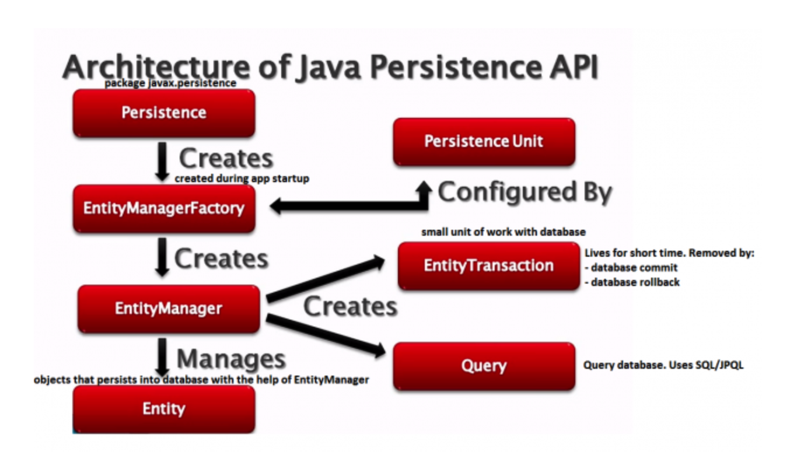
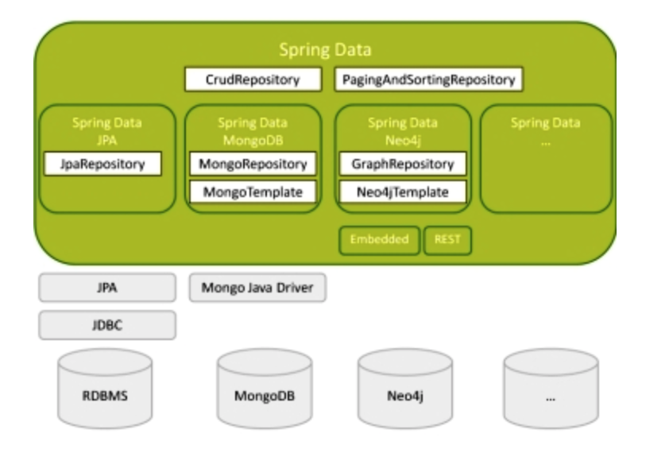
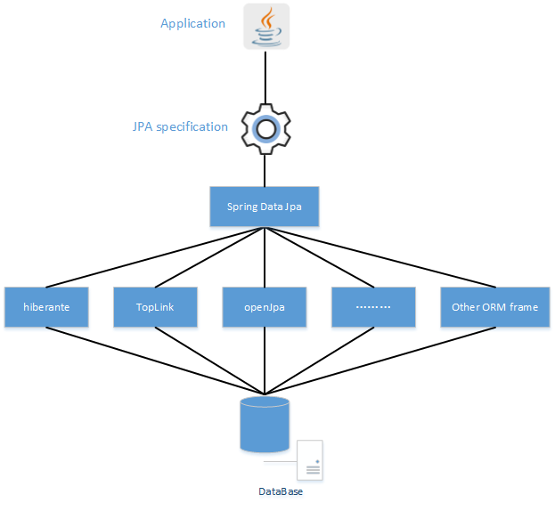

## JPA

### When I need JPA?

Java has created a **specification** called Java Persistent API. It aims towards bringing consistency around accessing different databases. 

The JPA is all about creating Objects which can map to the Database objects. The application will use JPA specification to push or retrieve an object from the database, and underlying JPA implementations will take care of the low-level SQL queries. That is called Object Relational Mapping (ORM). 

### JPA Architecture

## Spring Data JPA

* Hibernate

  * SessionFactory
  * Session	

* Spring Data JPA

  > Speaking precisely, Spring Data JPA is an add-on for JPA. It provides a framework that works with JPA and provides a complete abstraction over the Data Access Layer.
  >
  > Spring Data JPA brings in the concept of **JPA Repositories**, a set of Interfaces that defines query methods.

