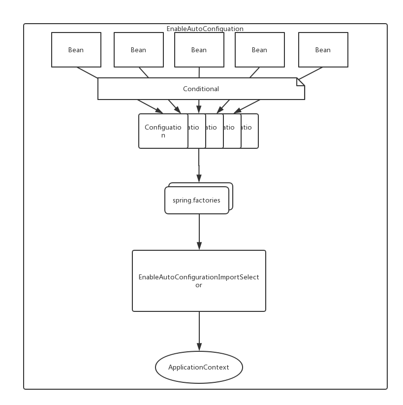

## Spring Boot

纵然Spring已经能够为我们提供种种我们所需要的功能了，但是它依然还是不完美的。**基于Spring的程序需要进行很多的配置**。比如我们要开发web应用程序，我们需要考虑使用哪些Spring模块以及其他的框架，并且还需要考虑框架之间的版本是否兼容。除此之外，我们还要进行大量的基础配置，配置来配置去，这种重复操作总会让人闻到一股怀味道。

Spring的开发者们注意到了这些问题，于是Spring Boot诞生了。

Spring Boot通过两个方式使得我们从上述的重复操作中得以解脱：

* Spring Boot Starter Project
* Spring Boot Auto Configuration


### 一、Spring Boot Starter Project

Spring Boot像是一个大管家，我们只需要告诉他，我们要做什么类型的程序，由他来负责帮助我们去做具体的事情。还是以web开发为例，我们只需要告诉Spring Boot我要干一个web项目，去给我准备相关的东西，Spring Boot就会去干事了。具体到操作上就是，我们提供给Spring Boot一个**spring-boot-starter-web**的选项，Spring Boot就会知道我们的意思，然后为我们生成出来一个工程，这个工程就已经具备了所有web应用程序开发所需要的所有依赖，完全没必要我们自己再去到pom中手动配置。Spring Boot的文档是这样解释的：

> Starters are a set of convenient dependency descriptors that you can include in your application. You get a one-stop-shop for all the Spring and related technology that you need, without having to hunt through sample code and copy paste loads of dependency descriptors. For example, if you want to get started using Spring and JPA for database access, just include the spring-boot-starter-data-jpa dependency in your project, and you are good to go.

```xml
<?xml version="1.0" encoding="UTF-8"?>
<project xmlns="http://maven.apache.org/POM/4.0.0" xmlns:xsi="http://www.w3.org/2001/XMLSchema-instance"
	xsi:schemaLocation="http://maven.apache.org/POM/4.0.0 http://maven.apache.org/xsd/maven-4.0.0.xsd">
	<modelVersion>4.0.0</modelVersion>
	<parent>
		<groupId>org.springframework.boot</groupId>
		<artifactId>spring-boot-starter-parent</artifactId>
		<version>2.1.3.RELEASE</version>
		<relativePath/> <!-- lookup parent from repository -->
	</parent>
	<groupId>xin.desertcamel</groupId>
	<artifactId>helloworld</artifactId>
	<version>0.0.1-SNAPSHOT</version>
	<name>demo</name>
	<description>Demo project for Spring Boot</description>

	<properties>
		<java.version>1.8</java.version>
	</properties>

	<dependencies>
		<dependency>
			<groupId>org.springframework.boot</groupId>
			<artifactId>spring-boot-starter-web</artifactId>
		</dependency>
	</dependencies>

	<build>
		<plugins>
			<plugin>
				<groupId>org.springframework.boot</groupId>
				<artifactId>spring-boot-maven-plugin</artifactId>
			</plugin>
		</plugins>
	</build>

</project>
```

`spring-boot-starter-web` 一个起步依赖。通过Maven的依赖传递，可以得到一个web工程所需要的全部基础依赖。可以理解为，`Spring Boot为我们提供了一层高级抽象，屏蔽了底层细节，在这个实例代码中，开发者所应该关注的事情是我要做一个什么样的项目，要实现这个项目的功能需要依赖哪些功能，而不用再去关心我要具体依赖哪些库，起步依赖同时也管理了所要依赖的库的版本，让开发者从繁琐的包管理中解脱出来，而更关注应用程序的业务实现。`

<parent>标签的意义是，我们可以继承spring boot的一些默认的选项:

* 默认编译级别为Java 1.6

* 源码编码为UTF-8

* 一个依赖管理节点，允许你省略普通依赖的<version>标签。

如果不想从spring boot parent继承，可以这样做：

```xml
<dependencyManagement>
<dependencies>
        <dependency>   
          <groupId>org.springframework.boot</groupId>         
          <artifactId>spring-boot-dependencies</artifactId>  
          <version>1.2.6</version>    
          <type>pom</type>  
          <scope>import</scope> 
       </dependency> 
   </dependencies>
</dependencyManagement>
```


### 二、Spring Boot自动配置

除了自动管理项目依赖之外，Spring Boot也提供了自动配置的能力。

当我们开发web应用程序时，我们需要在xml中或java以代码的形式来配置基于Spring的开发环境。比如我们需要配置Dispatcher Servlet、DataSource、ViewResolver等等这些必须的bean，这些操作每次都是重复的，所以Spring Boot就把它们也自动化掉了。Spring Boot会检测ClassPath当中的jar包，如果包含了web开发所需要使用jar包（Spring MVC），Spring就会把上述所说的配置都配置好，不用我们再去配置。同样贴上官方的解释：

> *Spring Boot looks at a) Frameworks available on the CLASSPATH b) Existing configuration for the application. Based on these, Spring Boot provides basic configuration needed to configure the application with these frameworks. This is called* `Auto Configuration`.


Spring Boot会根据类路径中的jar包、类，为jar包里的类自动配置，这样可以极大的减少配置的数量。简单点说就是它会根据定义在classpath下的类，自动的给你生成一些Bean，并加载到Spring的Context中。自动配置充分的利用了spring 4.0的条件化配置特性，能够自动配置特定的Spring bean，用来启动某项特性。

#### 条件化配置

假设你希望一个或多个bean只有在某种特殊的情况下才需要被创建，比如，一个应用同时服务于中美用户，要在中美部署，有的服务在美国集群中需要提供，在中国集群中就不需要提供。在Spring 4之前，要实现这种级别的条件化配置是比较复杂的，但是，**Spring 4**引入了一个新的`@Conditional`注解可以有效的解决这类问题。

```java
@Bean
@Conditional(ChinaEnvironmentCondition.class)
public ServiceBean serviceBean(){
    return new ServiceBean();
}
```

当`@Conditional(ChinaEnvironmentCondition.class)`条件的值为true的时候，该`ServiceBean`才会被创建，否则该bean就会被忽略。

`@Conditional`指定了一个条件。他的条件的实现是一个Java类——`ChinaEnvironmentCondition`，要实现以上功能就要定义`ChinaEnvironmentCondition`类，并继承`Condition`接口并重写其中的`matches`方法。

```java
class ChinaEnvironmentCondition implements Condition{
    public final boolean matches(ConditionContext context, AnnotatedTypeMetadata metadata) {

        Environment env = context.getEnvironment();
        return env.containProperty("ENV_CN");
    }
}
```

在上面的代码中，matches方法的内容比较简单，他通过给定的`ConditionContext`对象进而获取`Environment`对象，然后使用该对象检查环境中是否存在`ENV_CN`属性。如果存在该方法则直接返回true，反之返回false。当该方法返回true的时候，就符合了`@Conditional`指定的条件，那么`ServiceBean`就会被创建。反之，如果环境中没有这个属性，那么这个`ServiceBean`就不会被创建。

除了可以自定义一些条件之外，Spring 4本身提供了很多已有的条件供直接使用，如：

```java
@ConditionalOnBean
@ConditionalOnClass
@ConditionalOnExpression
@ConditionalOnMissingBean
@ConditionalOnMissingClass
@ConditionalOnNotWebApplication
```


### Spring Boot自动配置原理

#### Spring Boot应用的启动入口

**自动配置**充分的利用了spring 4.0的条件化配置特性，那么，Spring Boot是如何实现自动配置的？Spring 4中的条件化配置又是怎么运用到Spring Boot中的呢？这要从Spring Boot的启动类说起。Spring Boot应用通常有一个名为`*Application`的入口类，入口类中有一个`main`方法，这个方法其实就是一个标准的Java应用的入口方法。一般在`main`方法中使用`SpringApplication.run()`来启动整个应用。值得注意的是，这个入口类要使用`@SpringBootApplication`注解声明。`@SpringBootApplication`是Spring Boot的核心注解，他是一个组合注解。

```java
@Target({ElementType.TYPE})
@Retention(RetentionPolicy.RUNTIME)
@Documented
@Inherited
@SpringBootConfiguration
@EnableAutoConfiguration
@ComponentScan(
    excludeFilters = {@Filter(
    type = FilterType.CUSTOM,
    classes = {TypeExcludeFilter.class}
), @Filter(
    type = FilterType.CUSTOM,
    classes = {AutoConfigurationExcludeFilter.class}
)}
)
public @interface SpringBootApplication {
    // 略
}
```

`@SpringBootApplication`是一个组合注解，它主要包含`@SpringBootConfiguration`、`@EnableAutoConfiguration`等几个注解。也就是说可以直接在启动类中使用这些注解来代替`@SpringBootApplication`注解。 关于Spring Boot中的Spring自动化配置主要是`@EnableAutoConfiguration`的功劳。该注解可以让Spring Boot根据类路径中的jar包依赖为当前项目进行自动配置。

至此，我们知道，Spring Boot的自动化配置主要是通过`@EnableAutoConfiguration`来实现的，因为我们在程序的启动入口使用了`@SpringBootApplication`注解，而该注解中组合了`@EnableAutoConfiguration`注解。所以，在启动类上使用`@EnableAutoConfiguration`注解，就会开启自动配置。

那么，本着刨根问底的原则，当然要知道`@EnableAutoConfiguration`又是如何实现自动化配置的，因为目前为止，我们还没有发现Spring 4中条件化配置的影子。

#### EnableAutoConfiguration

其实Spring框架本身也提供了几个名字为`@Enable`开头的Annotation定义。比如`@EnableScheduling`、`@EnableCaching`、`@EnableMBeanExport`等，`@EnableAutoConfiguration`的理念和这些注解其实是一脉相承的。

> `@EnableScheduling`是通过`@Import`将Spring调度框架相关的bean定义都加载到IoC容器。
>
> `@EnableMBeanExport`是通过`@Import`将JMX相关的bean定义加载到IoC容器。
>
> `@EnableAutoConfiguration`也是借助`@Import`的帮助，将所有符合自动配置条件的bean定义加载到IoC容器。

下面是`EnableAutoConfiguration`注解的源码：

```java
@Target({ElementType.TYPE})
@Retention(RetentionPolicy.RUNTIME)
@Documented
@Inherited
@AutoConfigurationPackage
@Import({EnableAutoConfigurationImportSelector.class})
public @interface EnableAutoConfiguration {
    //略
}
```

观察`@EnableAutoConfiguration`可以发现，这里**Import**了`@EnableAutoConfigurationImportSelector`，这就是Spring Boot自动化配置的“始作俑者”。

至此，我们知道，由于我们在Spring Boot的启动类上使用了`@SpringBootApplication`注解，而该注解组合了`@EnableAutoConfiguration`注解，`@EnableAutoConfiguration`是自动化配置的“始作俑者”，而`@EnableAutoConfiguration`中Import了`@EnableAutoConfigurationImportSelector`注解，该注解的内部实现已经很接近我们要找的“真相”了。

#### EnableAutoConfigurationImportSelector

`EnableAutoConfigurationImportSelector`的源码在这里就不贴了，感兴趣的可以直接去看一下，其实实现也比较简单，主要就是使用Spring4 提供的的`SpringFactoriesLoader`工具类。通过`SpringFactoriesLoader.loadFactoryNames()`读取了ClassPath下面的`META-INF/spring.factories`文件。

> 这里要简单提一下`spring.factories`文件，它是一个典型的java properties文件，配置的格式为**Key = Value**形式。

`EnableAutoConfigurationImportSelector`通过读取`spring.factories`中的key为`org.springframework.boot.autoconfigure.EnableAutoConfiguration`的值。如`spring-boot-autoconfigure-1.5.1.RELEASE.jar`中的`spring.factories`文件包含以下内容：

```java
# Auto Configure
org.springframework.boot.autoconfigure.EnableAutoConfiguration=\
org.springframework.boot.autoconfigure.admin.SpringApplicationAdminJmxAutoConfiguration,\
org.springframework.boot.autoconfigure.aop.AopAutoConfiguration,\
org.springframework.boot.autoconfigure.amqp.RabbitAutoConfiguration,\
org.springframework.boot.autoconfigure.batch.BatchAutoConfiguration,\
org.springframework.boot.autoconfigure.cache.CacheAutoConfiguration,\
org.springframework.boot.autoconfigure.cassandra.CassandraAutoConfiguration,\
org.springframework.boot.autoconfigure.cloud.CloudAutoConfiguration,\
......
org.springframework.boot.autoconfigure.webservices.WebServicesAutoConfiguration
```

上面的`EnableAutoConfiguration`配置了多个类，这些都是Spring Boot中的自动配置相关类；在启动过程中会解析对应类配置信息。每个`Configuation`都定义了相关bean的实例化配置。都说明了哪些bean可以被自动配置，什么条件下可以自动配置，并把这些bean实例化出来。

> 如果我们新定义了一个starter的话，也要在该starter的jar包中提供 `spring.factories`文件，并且为其配置`org.springframework.boot.autoconfigure.EnableAutoConfiguration`对应的配置类。

#### Configuation

我们从`spring-boot-autoconfigure-1.5.1.RELEASE.jar`中的`spring.factories`文件随便找一个Configuration，看看他是如何自动加载bean的。

```java
@Configuration
@AutoConfigureAfter({JmxAutoConfiguration.class})
@ConditionalOnProperty(
    prefix = "spring.application.admin",
    value = {"enabled"},
    havingValue = "true",
    matchIfMissing = false
)
public class SpringApplicationAdminJmxAutoConfiguration {
    @Bean
    @ConditionalOnMissingBean
    public SpringApplicationAdminMXBeanRegistrar springApplicationAdminRegistrar() throws MalformedObjectNameException {
        String jmxName = this.environment.getProperty("spring.application.admin.jmx-name", "org.springframework.boot:type=Admin,name=SpringApplication");
        if(this.mbeanExporter != null) {
            this.mbeanExporter.addExcludedBean(jmxName);
        }

        return new SpringApplicationAdminMXBeanRegistrar(jmxName);
    }
}
```

看到上面的代码，终于找到了我们要找的东西——Spring 4的条件化配置。上面`SpringApplicationAdminJmxAutoConfiguration`在决定对哪些bean进行自动化配置的时候，使用了两个条件注解：`ConditionalOnProperty`和`ConditionalOnMissingBean`。只有满足这种条件的时候，对应的bean才会被创建。这样做的好处是什么？这样可以保证某些bean在没满足特定条件的情况下就可以不必初始化，避免在bean初始化过程中由于条件不足，导致应用启动失败。

至此，我们可以总结一下Spring Boot的自动化配置的实现：



通过Spring 4的条件配置决定哪些bean可以被配置，将这些条件定义成具体的`Configuation`，然后将这些`Configuation`配置到`spring.factories`文件中，作为key: `org.springframework.boot.autoconfigure.EnableAutoConfiguration`的值，这时候，容器在启动的时候，由于使用了EnableAutoConfiguration注解，该注解Import的`EnableAutoConfigurationImportSelector`会去扫描classpath下的所有`spring.factories`文件，然后进行bean的自动化配置。

所以，如果我们想要自定义一个starter的话，可以通过以上方式将自定义的starter中的bean自动化配置到Spring的上下文中，从而避免大量的配置。

