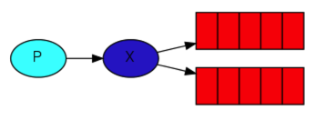
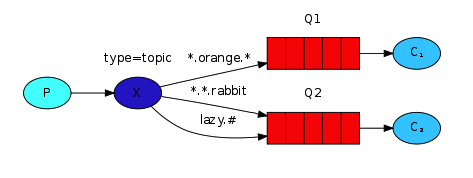

## Message Mode

The core idea in the messaging model in RabbitMQ is that the producer never sends any messages directly to a queue. Actually, quite often the producer doesn't even know if a message will be delivered to any queue at all.

Instead, the producer can only send messages to an exchange. An exchange is a very simple thing. On one side it receives messages from producers and the other side it pushes them to queues. The exchange must know exactly what to do with a message it receives. Should it be appended to a particular queue?  Should it be appended to many queues?  Or should it get discarded. **The rules for that are defined by the exchange type**.



## Exchange

### Exchange type

* direct

  A message goes to the queues whose **binding key exactly matches the routing key** of the message.

  

​	

* topic

  


* headers

  

* fanout

  It just broadcasts all the messages it receives to all the queues it knows.

  

## Usage

### Work Queue

Default Exchange -> The message is sent to the work queue and accepted by one consumer listening on the queue. Only one consumer can receive the message at a time.


### Publish Subscribe

Fanout exchange -> It just broadcasts all the messages to all the queues it knows.


### Routing

Direct exchange -> 

## Publisher Confirms

When publisher confirms are enabled on a channel, messages the client publishes are confirmed asynchronously by the broker, meaning they have been taken care of on the server side.


### Publishing Messages Individually

```java
while (thereAreMessagesToPublish()) {
    byte[] body = ...;
    BasicProperties properties = ...;
    channel.basicPublish(exchange, queue, properties, body);
    // uses a 5 second timeout
    channel.waitForConfirmsOrDie(5_000);
}
```

缺点：

It significantly slows down publishing.


### Publishing Messages in Batches

```java
int batchSize = 100;
int outstandingMessageCount = 0;
while (thereAreMessagesToPublish()) {
    byte[] body = ...;
    BasicProperties properties = ...;
    channel.basicPublish(exchange, queue, properties, body);
    outstandingMessageCount++;
    if (outstandingMessageCount == batchSize) {
        channel.waitForConfirmsOrDie(5_000);
        outstandingMessageCount = 0;
    }
}
if (outstandingMessageCount > 0) {
    channel.waitForConfirmsOrDie(5_000);
}
```

缺点：

We do not know exactly what went wrong in case of failure, so we may have to keep a whole batch in memory to log something meaningful or to re-publish the messages.


### Hadling Publisher Confirms Asynchronously

```java
Channel channel = connection.createChannel();
channel.confirmSelect();
channel.addConfirmListener((sequenceNumber, multiple) -> {
    // code when message is confirmed
}, (sequenceNumber, multiple) -> {
    // code when message is nack-ed
});
```

> Re-publishing nack-ed Messages?
> It can be tempting to re-publish a nack-ed message from the corresponding callback but this should be avoided, as **confirm callbacks are dispatched in an I/O thread where channels are not supposed to do operations**. A better solution consists in enqueuing the message in an in-memory queue which is polled by a publishing thread. A class like ConcurrentLinkedQueue would be a good candidate to transmit messages between the confirm callbacks and a publishing thread.


