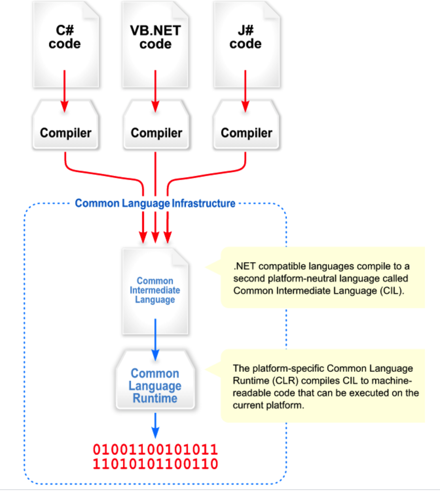

## 术语

### CLI

通用语言基础架构，Common Language Infrastructure，简称CLI。是一个开放的技术规范。

### CIL

可以理解为一种中间语言，可与Java的字节码作对比。

.NET中编译分为两阶段

1. 将高级语言编译为**CIL**
2. 将CIL编译为平台相关的机器代码，**这是由CLR去做的**，之后会提到。

### CLR

公共语言运行时库(Common Language Runtime,CLR) ，**是NET Framework的核心**。通常在CLR下运行的代码叫做托管代码。

## .Net

一个开发者平台，微软的一个商业策略。

## .Net Framework

