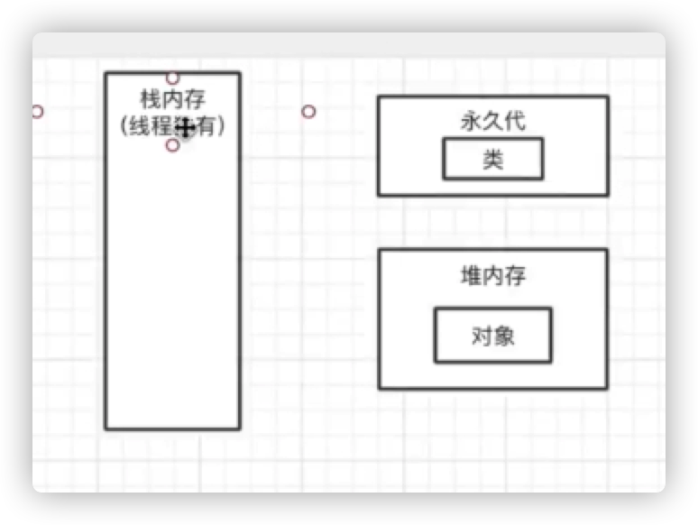
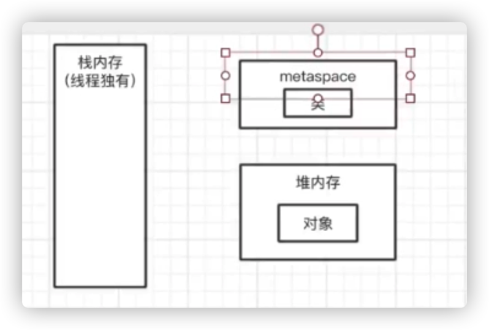
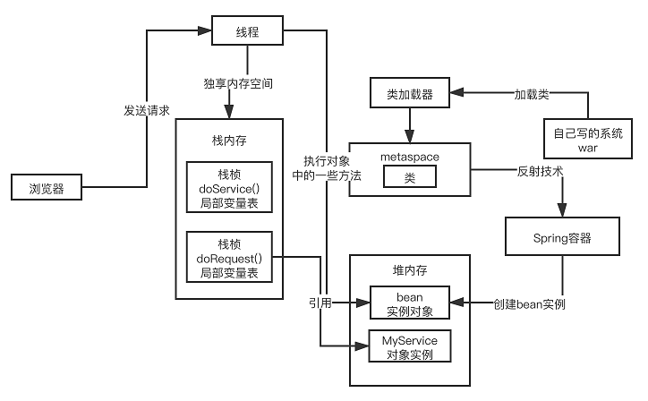
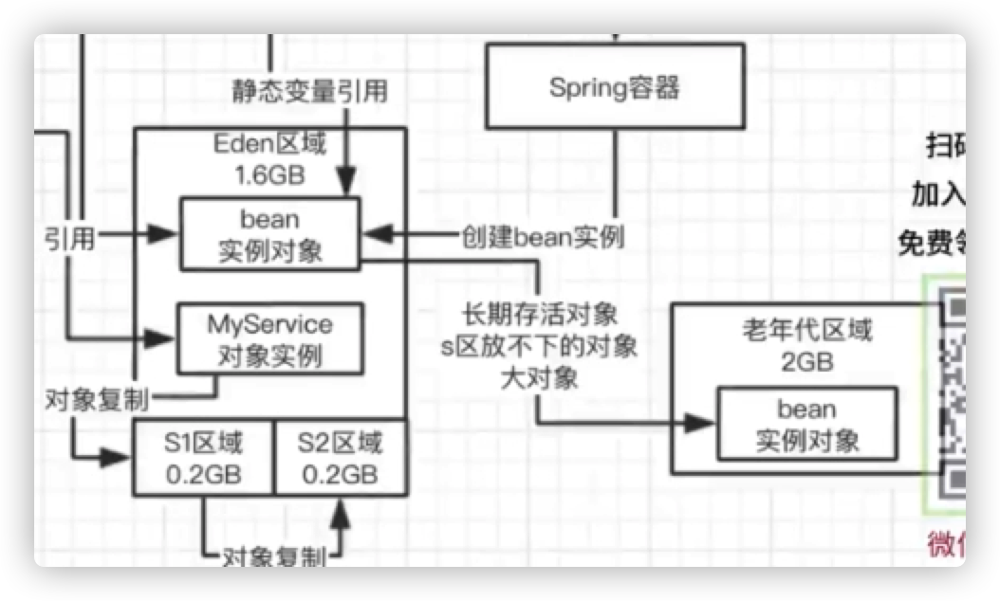

tomcat就是基于java来开发的，我们启动的不是自己的系统，而是一个tomcat的jvm进程，我们写的系统不过是一些代码，放在tomcat的目录中，tomcat会加载我们的代码到jvm中去。

### JVM中有哪几块内存区域？Java8之后对内存分代做了什么改进？

### JVM是如何运行起来的？我们的对象是如何分配的？

### JVM在哪些情况下会触发垃圾回收

Eden区域满了，会触发垃圾回收。

### JVM的年轻代的垃圾回收算法，什么时候会转移到老年代

**年轻代，复制算法。**

1. 把Eden区中的存活的对象复制到S1区域，Eden区中的其他对象都清除
2. 把Eden区中存活的对象和S1中存活的对象复制到S2区域，Eden区和S1区中的其他对象都清除
3. 把Eden区中存活的对象和S2中存活的对象复制到S1区域，Eden区和S2区中的其他对象都清除
4. 循环第2步骤和第3步骤

**移交老年代的时机**

三种场景。

1. 有的对象在年轻代里边熬过了很多次垃圾回收，此时会把这种长期存活的对象移交到老年代区域中
2. 某次垃圾回收，s区放不下了
3. 某次垃圾回收，发现了大对象仍然存活，会把这个大对象移交到老年代

### 老年代的垃圾回收算法，常用的垃圾回收器有什么

**标记-整理算法**

老年代不能使用复制算法，因为老年代对象很多都是被长期引用的，长期存活的对象比较多，可能会达到几百兆。复制来，复制去，很耗费时间。

老年代中没有那么多垃圾对象，可以采用**标记-清理**算法，直接标记出来哪些是垃圾对象，然后老年代满了之后直接清除掉。但是可能会产生内存碎片（内存碎片：内存不是连续可用的）。

因此，老年代采用了**标记-整理**算法，把老年代里存活的对象标记出来，移动到一起，存活对象压缩到一片内存空间里去。剩余的空间都是垃圾对象整个给清理掉，剩余的都是连续的可用的内存空间，解决了内存碎片的问题。

**垃圾回收器**

* parnew（多线程，对Eden区域进行回收） + cms（分多个阶段对老年代进行回收，尽可能让垃圾回收和工作线程并发者进行，减少stop the world对系统的影响）
* G1（能够同时回收年轻代和老年代）

老年代的垃圾回收一般都是比较慢的。一般会比年轻代慢十倍。

