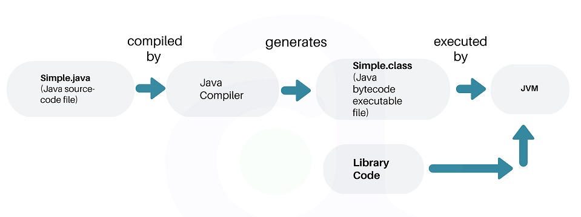

## Java技术体系

Java如果**按照功能**划分，可以这样划分：

* Java程序设计语言
* Java虚拟机
* Java API类库

这三部分统称为JDK，JDK是用于支持Java程序开发的最小环境。

* Java API类库中的Java SE API子集
* Java虚拟机

这两部分统称为JRE。

## 编译OpenJDK

编译环境：

macOS Mojave 10.14 Beta

XCode9.4.1

OpenJDK10

## 宏观认识JVM

