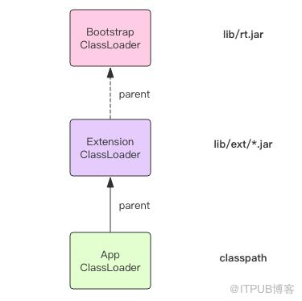
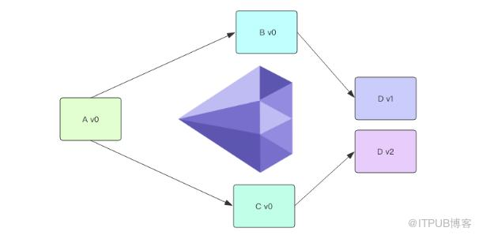
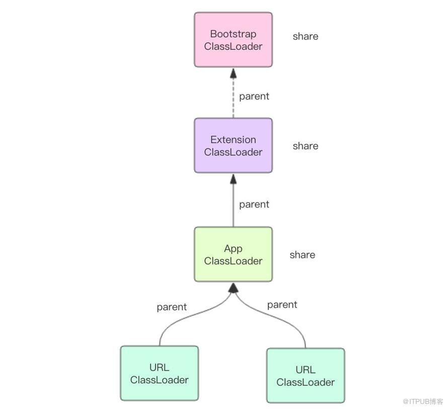

## 做什么的

* 用来加载Class的，负责将Class的字节码形式转化为内存形式的Class对象。

* 字节码可以来自于磁盘文件，jar包里的*.class文件，也可以来自远程服务器提供的字节流

* 字节码的本质就是一个字节数组byte[]

  
  
* 每个Class对象当中都有一个ClassLoader加载的


## 延迟加载

* JVM不会一次性加载所有需要使用的类，而是**按需加载**，也就是总被叨叨的懒加载
* 类被某个./assets/ClassLoader加载完后，不会再被重复加载，会缓存在这个./assets/ClassLoader当中


## 各司其职

* JVM中内置的三个重要的./assets/ClassLoader
  * BootStrap./assets/ClassLoader
  * Extention./assets/ClassLoader
  * App./assets/ClassLoader
* BootStrap./assets/ClassLoader负责加载运行时核心类，这些类位于JAVA_HOME/lib/rt.jar，常用的java.xxx.*都在里边，由C实现，将之称为**根加载器**
* Extension./assets/ClassLoader负责加载JVM的扩展类，这些类库位于JAVA_HOME/lib/ext/*.jar当中，比如Swing系列、内置的js引擎等
* App./assets/ClassLoader是面向我们用户的加载器，它会加载 Classpath 环境变量里定义的路径中的 jar 包和目录。我们自己编写的代码以及使用的第三方 jar 包通常都是由它来加载的。他也叫系统加载器，通常当main方法执行的时候，用户的第一个./assets/ClassLoader就是他
* URL./assets/ClassLoader可以加载位于网络上的jar包或者class文件，只需在构造函数中传递规范的URL路径即可。上述所说的加载器都是它的子类。


## ./assets/ClassLoader的传递性

* 遇到一个新的类，会使用调用者Class对象的./assets/ClassLoader来加载当前类。
* 因为 ./assets/ClassLoader 的传递性，所有延迟加载的类都会由初始调用 main 方法的这个 ./assets/ClassLoader 全全负责，它就是 App./assets/ClassLoader。


## 双亲委派



* 三个./assets/ClassLoader形成了级联父子关系
* 每个./assets/ClassLoader都会尽量把工作交给其父加载器去做，直到**根加载器**
* 每个加载器都有parent字段，代表的是这个加载器的父加载器
* Extension./assets/ClassLoader的parent是null


## Class.forName

```java
Class.forName("com.mysql.cj.jdbc.Driver");
```

```java
class Driver {
  static {
    try {
       java.sql.DriverManager.registerDriver(new Driver());
    } catch (SQLException E) {
       throw new RuntimeException("Can't register driver!");
    }
  }
  ...
}
```

* 以上代码能够将Driver注册到DriverManager中
* forName方法会用调用者的类加载器来加载Driver类，从而出发静态模块代码的执行


## 自定义加载器

* 三个重要的方法loadClass()、findClass() 和 defineClass()
* loadClass是入口
* 自定义加载器要覆盖findClass()方法，而不是loadClass()，以避免破坏双亲委派模型
* 源码的执行流程

```java
class ./assets/ClassLoader {

  // 加载入口，定义了双亲委派规则
  Class loadClass(String name) {
    // 是否已经加载了
    Class t = this.findFromLoaded(name);
    if(t == null) {
      // 交给双亲
      t = this.parent.loadClass(name)
    }
    if(t == null) {
      // 双亲都不行，只能靠自己了
      t = this.findClass(name);
    }
    return t;
  }

  // 交给子类自己去实现
  Class findClass(String name) {
    throw ClassNotFoundException();
  }

  // 组装Class对象
  Class defineClass(byte[] code, String name) {
    return buildClassFromCode(code, name);
  }
}

class Custom./assets/ClassLoader extends ./assets/ClassLoader {

  Class findClass(String name) {
    // 寻找字节码
    byte[] code = findCodeFromSomewhere(name);
    // 组装Class对象
    return this.defineClass(code, name);
  }
}
```

* 双亲委派规则可能会变成三亲委派，四亲委派，取决于你使用的父加载器是谁，它会一直递归委派到根加载器

```java
protected ./assets/ClassLoader(String name, ./assets/ClassLoader parent);
```


## Class.forName vs ./assets/ClassLoader.loadClass

* Class.forName() 方法可以获取原生类型的 Class，而 ./assets/ClassLoader.loadClass() 则会报错


## 钻石依赖




* maven的处理方式非常的简单粗暴，它会从多个冲突的版本中选择一个来使用，如果不同的版本之间兼容性很糟糕，那么程序将无法正常编译运行。Maven 这种形式叫「扁平化」依赖管理
* 使用 ./assets/ClassLoader 可以解决钻石依赖问题
* **位于不同 ./assets/ClassLoader 中名称一样的类实际上是不同的类**
* ./assets/ClassLoader 固然可以解决依赖冲突问题，不过它也**限制了不同软件包的操作界面必须使用反射或接口**的方式进行动态调用。
* sofa-ark包管理工具，能够完美解决钻石依赖


## 分工与合作



* ./assets/ClassLoader 是类名称的容器，是类的沙箱
* 不同的 ./assets/ClassLoader 之间也会有合作，它们之间的合作是通过 parent 属性和双亲委派机制来完成的
* parent 具有更高的加载优先级。除此之外
* parent 还表达了一种共享关系，Bootstrap./assets/ClassLoader 被所有的类加载器视为祖先加载器，JVM 核心类库自然应该被共享


## Thread.context./assets/ClassLoader

```java
class Thread {
  ...
  private ./assets/ClassLoader context./assets/ClassLoader;

  public ./assets/ClassLoader getContext./assets/ClassLoader() {
    return context./assets/ClassLoader;
  }

  public void setContext./assets/ClassLoader(./assets/ClassLoader cl) {
    this.context./assets/ClassLoader = cl;
  }
  ...
}
```

* context./assets/ClassLoader 是那种需要显示使用的类加载器
* 线程的 context./assets/ClassLoader 是从父线程那里继承过来的，所谓父线程就是创建了当前线程的线程。程序启动时的 main 线程的 context./assets/ClassLoader 就是 App./assets/ClassLoader。这意味着如果没有人工去设置，那么所有的线程的 context./assets/ClassLoader 都是 App./assets/ClassLoader

* 它可以做到跨线程共享类，只要它们共享同一个 context./assets/ClassLoader
* 如果不同的线程使用不同的 context./assets/ClassLoader，那么不同的线程使用的类就可以隔离开来
* 如果我们对业务进行划分，不同的业务使用不同的线程池，线程池内部共享同一个 context./assets/ClassLoader，线程池之间使用不同的 context./assets/ClassLoader，就可以很好的起到隔离保护的作用，避免类版本冲突
* **线程的 context./assets/ClassLoader 使用场合比较罕见**


