## Class文件的结构


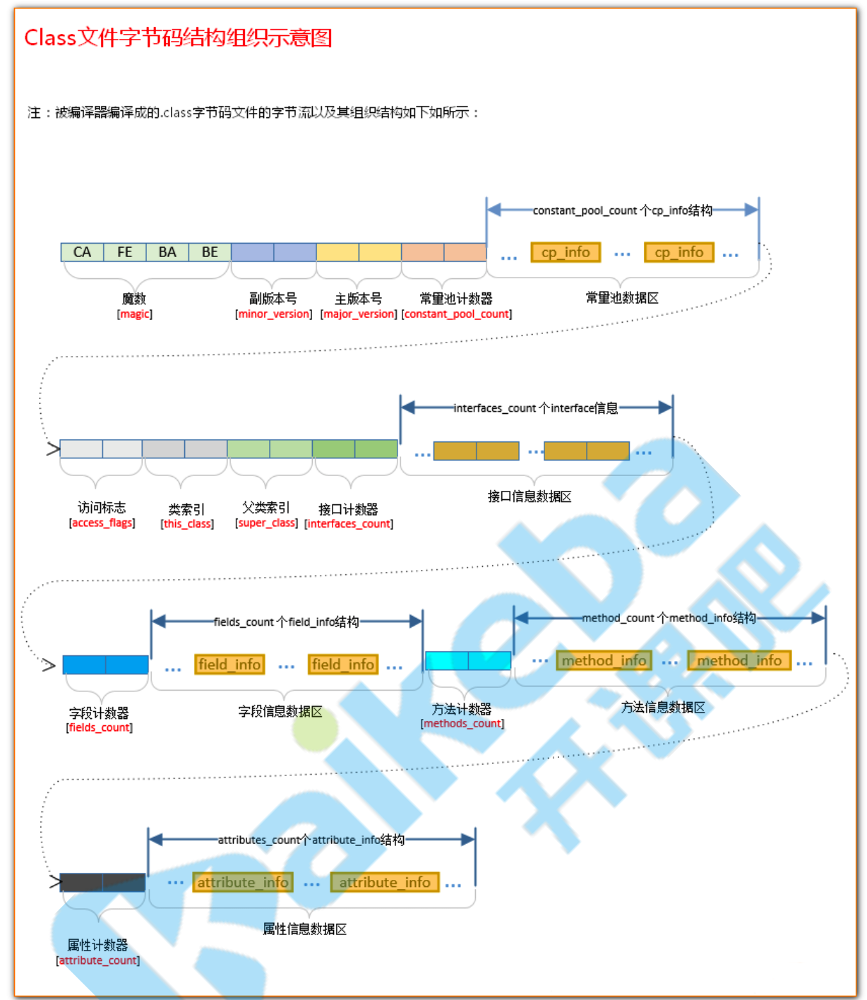


### 基本概念

Class文件采用一种类似于C语言的结构体的伪结构来存储数据，这种结构只有两种数据类型：无符号数和表。

**无符号数**

基本的数据类型，以u1,u2,u4,u8来分别代表1、2、4、8个字节的无符号数。无符号数**可以用来描述数字、索引引用、数量值或者按照UTF-8编码构成字符串值**。

**表**

由多个无符号数或者其他表作为数据项构成的复合数据类型，所有表都习惯性的用`_info`结尾。表用于描述有层次关系的复合结构的数据，整个Class文件本质上就是一张表，它由下表所示的数据项构成。


### 魔数和class文件版本信息

魔术用来标识是否是一个Class文件，Class文件的魔数用16进制标识是`CAFEBABE`。

版本信息分为次版本和主版本，主版本号从`45`开始，对应JDK1.1。

JDK1.1 <——> 45

JDK**向下兼容**旧版本的Class文件。例如，Class文件的major_version（主版本号）为0x34（52），则支持的JDK为，1 + (52 -45) = 8，也就是1.8以及1.8以上版本的JDK都可以执行这个Class文件。


> 可见**JVM是要和Class文件相兼容的**。如果Class的主版本号过高导致JDK无法兼容，则会抛出“*java.lang.UnsupportedClassVersionError: Bad version number in .class file*”异常。


另外，可以采用`javap -v ${ClassFileName} `来查看Class文件的版本号。


### 常量池计数器

首先要知道，常量池是由一组 `cp_info`结构体数组组成，暂且把这个数组叫做A。

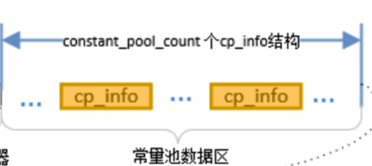

常量池计数器的作用主要是为常量池计数。他的数量是常量池中的常量的数量的值加一。例如，常量池中的常量的数量为100，那么这个计数器的值为101。`constant_pool`表的**索引值**只有在大于 0 且小于`constant_pool_count`时才会被认为是有效的。

> 也就是说，常量池计数器的计数=A的长度。

A的0号索引处的值被空出，当某些数据在特定的情况下想表达“**不引用任何一个常量池项**”的意思时，就可以将其引用的常量的索引值设置为0来表示。这也是常量池计数器大于等于一的原因。


### 常量池

上边说到的`constant_pool`，其中表示的是一个`cp_info`数组，`cp_info`表示的是**常量池项**，下图表示的是其结构。


### 访问标志

用于表示某个类或者接口的**访问权限**及**基础属性**。

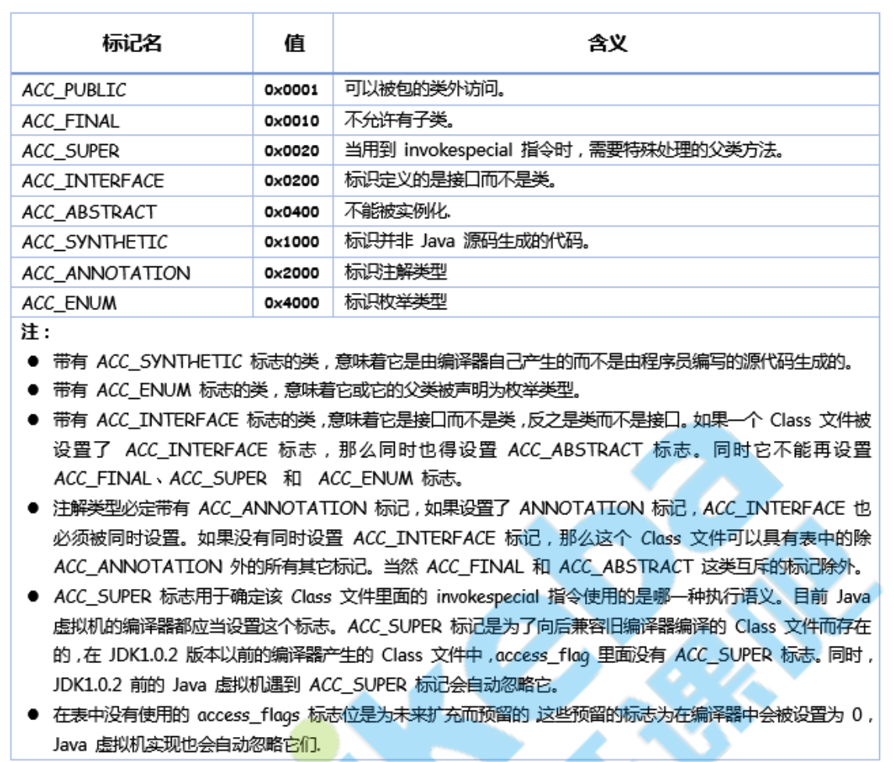

表示这个 Class 文件所定义的类或接 口。


### 类索引

`this_class`的值必须是constant_pool表的一个有效索引，索引处的类型为`Constant_Class_info`，表示这个 Class 文件所定义的类或接 口。


### 父类索引

父类索引，对于类来说，`super_class` 的值必须为 0 或者是对constant_pool 表中项目的一个有 效索引值。

如果它的值不为 0，那 constant_pool 表在这个索引处的项必须为Constant_Class_info类型常 量，表示这个 Class 文件所定义的类的直接父类。当前类的直接父类，以及它所有间接父类的 `access_flag` 中都不能带有`ACC_FINAL` 标记。对于接口来说，它的Class文件的super_class项的 值必须是对constant_pool表中项目的一个有效索引值，这个索引处的项必须为代表 java.lang.Object 的 CONSTANT_Class_info 类型常量 。

如果 Class 文件的 super_class的值为 0，那这个Class文件只可能是定义的是 java.lang.Object类，只有它是唯一没有父类的类。


### 接口计数器

接口计数器，interfaces_count的值表示当前类或接口的【直接父接口数量】。

```java
public class ClassA implements InterfaceA,InterfaceB
{

}
```

接口计数器的值为2。


### 接口信息数据区

`interfaces`每个成员的值必须是一个constant_pool的一个有效索引值，索引处所对应的值必须为 Constant_Class_info类型常量。interfaces的长度为 interfaces_count。在interfaces中，成员所表示的接口顺序和对应的源代码中给定的接口顺序(从左至右)一样，即interfaces[0]对 应的是源代码中最左边的接口。

```java
public class ClassA implements InterfaceA,InterfaceB
{

}
```

interfaces[0] 处的值引用constant_pool中的某个Constant_Class_info类型的常量，表示的是InterfaceA

interfaces[1] 处的值引用constant_pool中的某个Constant_Class_info类型的常量，表示的是InterfaceB

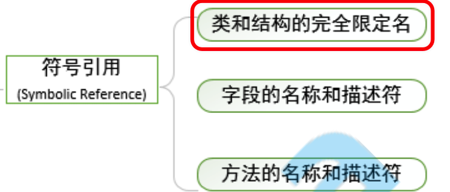

### 字段计数器

`fields_count`的值表示当前 Class 文件 fields的成员个数。 fields 中每一项都是一个field_info结构的数据项，它用于表示该类或接口声明的类字段或者实例字段。

```java
public class ClassA implements InterfaceA,InterfaceB
{
		private String str0;
    private String str1;
}
```

字段计数器的值 = 2。


### 字段信息数据区

`fields`中的每个成员都必须是一个fields_info结构的数据项，用于表示当前类或接 口中某个字段的完整描述。 fields[]数组描述当前类或接口声明的所有字段，但不包括从父类或父接 口继承的部分。


### 方法计数器

`methods_count`的值表示当前Class 文件 methods的成员个数。methods中每一项都是一个 method_info 结构的数据项。


### 方法信息数据区

`methods`中的每个成员都必须是一个 method_info 结构的数据项，用于表示当前类或接口中某个方法的完整描述。

如果某个method_info 结构的`access_flags`项既没有设置 ACC_NATIVE 标志也没有设置 ACC_ABSTRACT 标志，那么它所对应的方法体就应当可以被 Java 虚拟机直接从当前类加载，而不需 要引用其它类。

method_info结构可以表示类和接口中定义的所有方法，包括实例方法、类方法、实例初始化方法和类 或接口初始化方法 。


> methods只描述当前类或接口中声明的方法，**不包括从父类或父接口继承的方法**。


### 属性计数器

`attributes_count`的值表示当前 Class 文件attributes表的成员个数。 attributes表中每一项都是一个attribute_info 结构的数据项。


### 属性信息数据区

`attributes` 表的每个项的值必须是attribute_info结构。

在Java 7 规范里，Class文件结构中的attributes表的项包括下列定义的属性: 

* InnerClasses 
* EnclosingMethod 
* Synthetic 
* Signature
* SourceFile
* SourceDebugExtension 
* Deprecated
* RuntimeVisibleAnnotations 
* RuntimeInvisibleAnnotations
* BootstrapMethods

> 对于支持 Class 文件格式版本号为 49.0 或更高的 Java 虚拟机实现，必须正确识别并读取 attributes表中的Signature、RuntimeVisibleAnnotations和 RuntimeInvisibleAnnotations属性。
>
> 对于支持Class文件格式版本号为 51.0 或更高的 Java 虚拟机实现，必须正确识别并读取 attributes表中的BootstrapMethods属性。
>
> Java 7 规范 要求 任一 Java 虚拟机实现可以自动忽略 Class 文件的 attributes表中的若干 (甚至全部) 它不可 识别的属性项。任何本规范未定义的属性不能影响Class文件的语义，只能提供附加的描述信息。


## 常量池

### 常量池项的结构


### 常量池项的结构

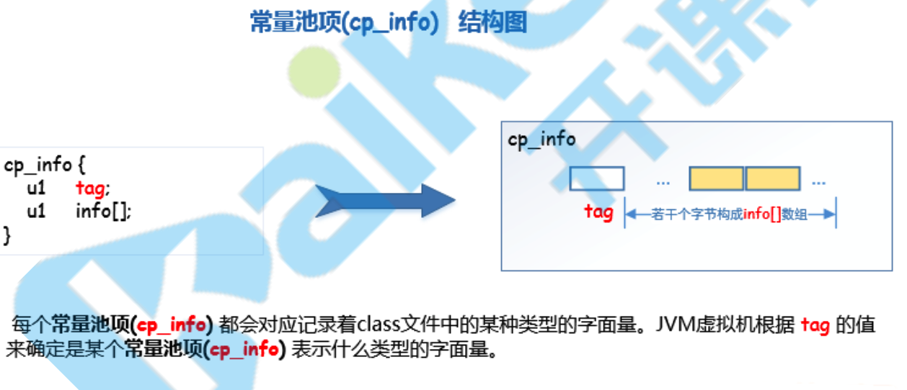

> cp_info会记录class文件中某种类型的字面量。JVM根据tag值确定cp_info表示什么类型的字面量


tag有多种取值，**不同tag值表示的不同结构**。

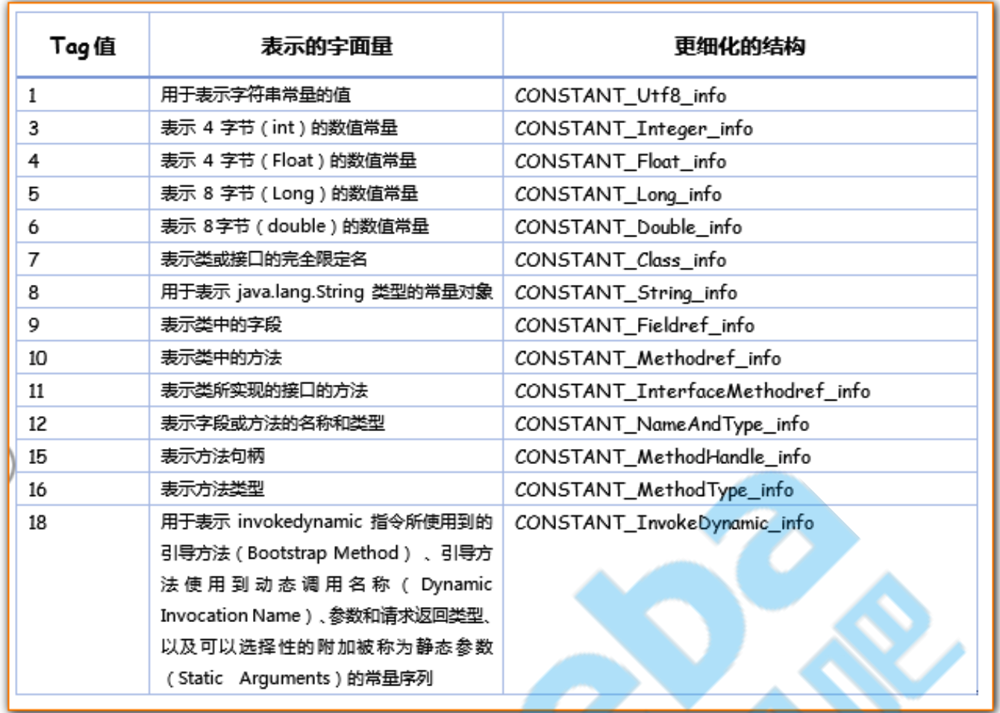

细化后的常量池结构

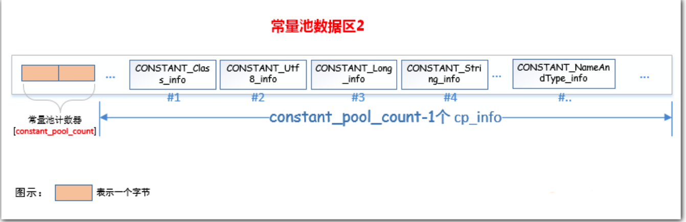


### 不同类型的常量池项的存储方式

#### int和float类型

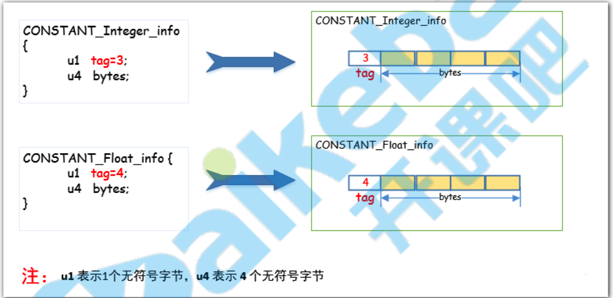

`CONSTANT_Integer_info`和`CONSTANT_Float_info`直接用四个字节进行数据的存储。


#### long和double类型

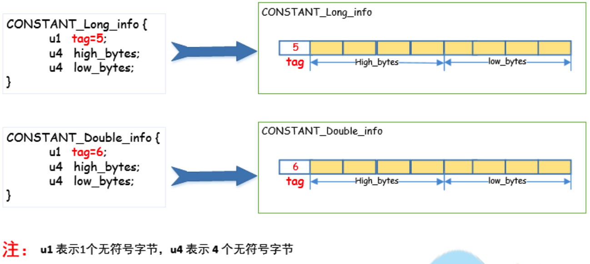

`CONSTANT_Long_info`和`CONSTANT_Double_info`直接用两个u4进行存储。


#### String类型

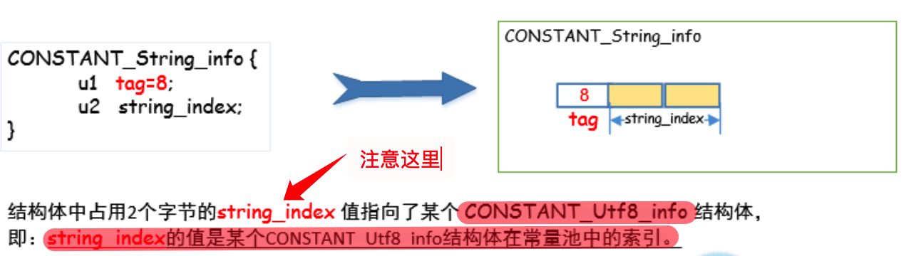

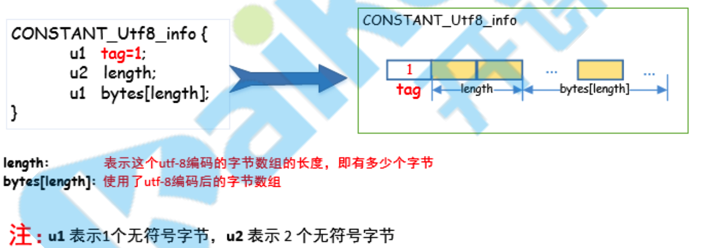

由上两图可以看出，String类型相较于前两种类型的存储方式的不同之处在于：它并没有直接在`CONSTANT_String_info`中直接存储字符串的数据。它先用`CONSTANT_String_info`这种高级结构中的`tag`指定了cp_info的结构是String，然后用一个两字节的`string_index`存储了一个指向`CONSTANT_Utf8_info`结构的指针，在`CONSTANT_Utf8_info`中存储的了真正的字符串数据。

> 问题：
>
> 为什么不在CONSTANT_String_info中，直接存储字符串数据呢？


#### 类文件中定义的类名和类中使用到的类

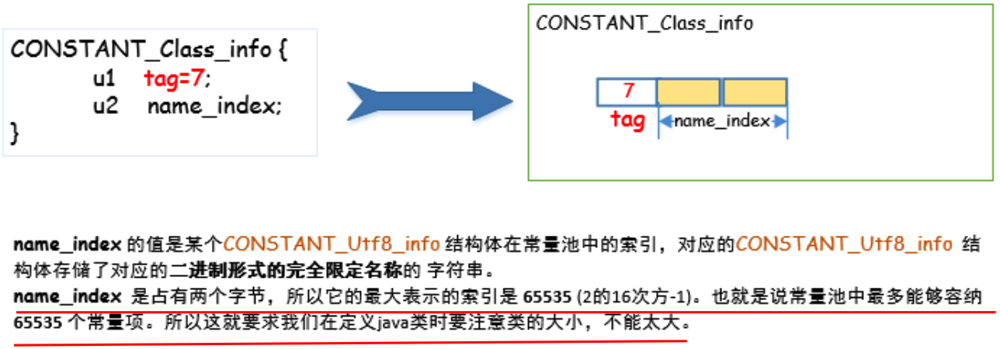


与字符串的存储结构几乎相同。


### 哪些字面量会被存储进常量池

1. final类型的8种**基本类型**的值会进入常量池。
2. 非final类型(包括static的)的8种基本类型的值，只有`double`、`float`、`long`的值会进入常量池。
3. 字符串类型字面量(**双引号**引起来的字符串值)。


## Class文件中的引用和特殊字符串

### 符号引用

**符号引用以一组符号来描述所引用的目标，符号可以是任何形式的字面量，使用时能够正确的定义到目标即可。**

Java源代码会被编译为Class文件，在**编译期**可能无法得知当前类引用的累的地址，因此使用符号引用进行代替。符号引用在Class文件中的结构有以下几种：

* CONSTANT_Class_info
* CONSTANT_Fieldref_info
* CONSTANT_Methodref_info

> 猜想
>
> `CONSTANT_Fieldref_info`、`CONSTANT_Methodref_info`这两种结构应该跟`CONSTANT_Class_info`的存储方式是一致的。

符号引用与虚拟机的内存布局无关，引用的目标不一定会被加载到内存当中。


### 直接引用

直接引用可以是：

* 直接指向目标的指针（如：指向类方法的直接引用可能是指向方法区的指针）。
* 相对偏移量
* 一个能间接定义到目标的句柄

直接引用与虚拟机的内存布局相关，上边所说的符号引用会被替换成直接引用，同一个符号引用在不同的虚拟机上被替换成的直接引用一般不会相同。**如果有了直接引用，那么所引用的对象一定是已经被加载到内存当中了**。


### 符号引用替换成直接引用

#### 替换时机

类的加载过程分为：

1. 加载
2. 连接
   1. 验证
   2. 准备
   3. 解析  *
3. 初始化

在解析阶段符号引用会被替换为直接引用。


### 特殊字符串

##### 类的完全限定名

##### 描述符

###### 各数据类型的描述符

###### 字段描述符

###### 方法描述符

##### 特殊方法的方法名


