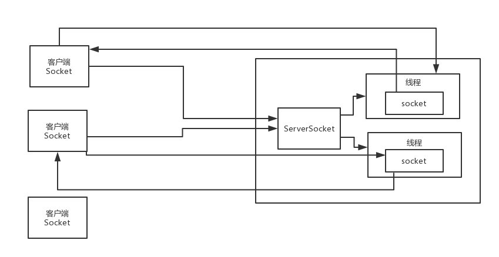
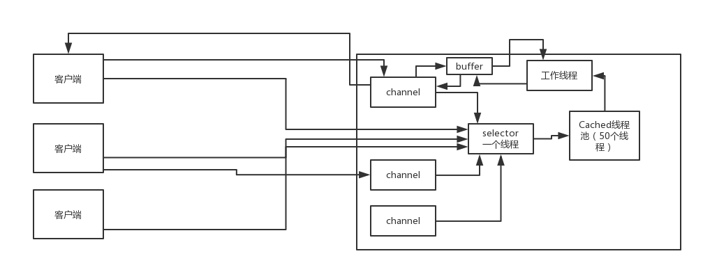

### BIO、NIO、AIO都是什么以及区别？

**BIO网络通信原理**

**坑**

大量连接的时候，服务器需要维护大量的线程。

客户端不多的时候，还可以这么搞，后来来了NIO。

**BIO的同步阻塞**

针对的磁盘文件的IO读写。线程读写数据的时候，不能干其他的事。

**NIO通信原理**

多路复用。

**NIO的同步非阻塞**

线程读数据的时候，可以去干别的事，但是需要自己去轮询操作系统是否已经把数据读写好了。

**AIO通信原理**

常用的是NIO，AIO用的比较少。读buffer和写buffer不需要工作线程堵塞在那，只需要提供一个回调方法，然后就可以去干其他事情了。

**AIO的异步非阻塞**

线程读数据的时候，可以去干别的事，不需要自己去轮询操作系统是否已经把数据读写好了，操作系统读写好了之后会通知你。

**BIO、NIO、AIO代码示例**

