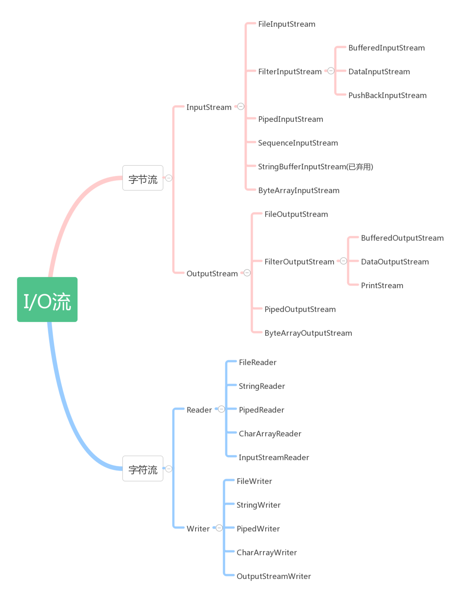

## IO结构浏览



## ByteStream

* Programs use *byte streams* to perform input and output of 8-bit bytes. All byte stream classes are descended from [`InputStream`](https://docs.oracle.com/javase/8/docs/api/java/io/InputStream.html) and [`OutputStream`](https://docs.oracle.com/javase/8/docs/api/java/io/OutputStream.html).

```java
public class CopyBytes {
    public static void main(String[] args) throws IOException {

        FileInputStream in = null;
        FileOutputStream out = null;

        try {
            in = new FileInputStream("xanadu.txt");
            out = new FileOutputStream("outagain.txt");
            int c;

            while ((c = in.read()) != -1) {
                out.write(c);
            }
        } finally {
            if (in != null) {
                in.close();
            }
            if (out != null) {
                out.close();
            }
        }
    }
}
```


## Character Streams

* The Java platform stores character values using **Unicode conventions**. Character stream I/O automatically translates this internal format to and from the local character set. In Western locales, the local character set is usually an 8-bit superset of ASCII.**java会利用本地字符集对要读写的文件进行编解码。**比如，操作系统的系统配置的字符集是UTF-8那Java就会默认用UTF-8去解码所要读取的文件

* 读行

```java
public class CopyCharacters {
    public static void main(String[] args) throws IOException {

        FileReader inputStream = null;
        FileWriter outputStream = null;

        try {
            inputStream = new FileReader("xanadu.txt");
            outputStream = new FileWriter("characteroutput.txt");

            int c;
            while ((c = inputStream.read()) != -1) {
                outputStream.write(c);
            }
        } finally {
            if (inputStream != null) {
                inputStream.close();
            }
            if (outputStream != null) {
                outputStream.close();
            }
        }
    }
}
```


## Buffered Streams

* 代表有缓冲的流。
* 之前所说的流都是无缓冲的，每次读写都需要进行系统调用，然后操作系统从磁盘或者网卡上读取数据。带缓冲的流则在内存当中设置一个缓冲，每次读取先针对缓冲区进行操作，这样就减少了系统调用的次数，提高了效率。


