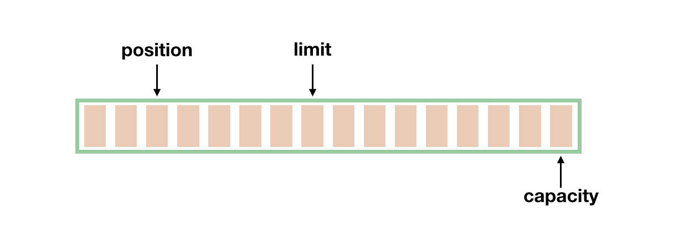
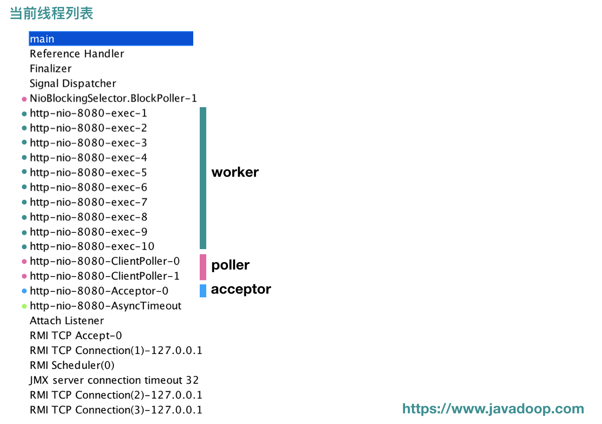

# Java NIO：Buffer、Channel 和 Selector

本文将介绍 Java NIO 中三大组件 **Buffer、Channel、Selector** 的使用。

本来要一起介绍**非阻塞 IO** 和 JDK7 的**异步 IO** 的，不过因为之前的文章真的太长了，有点影响读者阅读，所以这里将它们放到另一篇文章中进行介绍。

## Buffer

一个 Buffer 本质上是**内存中的一块**，我们可以将数据写入这块内存，之后从这块内存获取数据。

java.nio 定义了以下几个 Buffer 的实现，这个图读者应该也在不少地方见过了吧。


其实核心是最后的 **ByteBuffer**，前面的一大串类只是包装了一下它而已，我们使用最多的通常也是 ByteBuffer。

**我们应该将 Buffer 理解为一个数组**，IntBuffer、CharBuffer、DoubleBuffer 等分别对应 int[]、char[]、double[] 等。

**MappedByteBuffer** 用于实现内存映射文件，也不是本文关注的重点。

我觉得操作 Buffer 和操作数组、类集差不多，只不过大部分时候我们都把它放到了 NIO 的场景里面来使用而已。下面介绍 Buffer 中的几个重要属性和几个重要方法。

### position、limit、capacity

就像数组有数组容量，每次访问元素要指定下标，Buffer 中也有几个重要属性：position、limit、capacity。



最好理解的当然是 capacity，它代表这个缓冲区的容量，一旦设定就不可以更改。比如 capacity 为 1024 的 IntBuffer，代表其一次可以存放 1024 个 int 类型的值。一旦 Buffer 的容量达到 capacity，需要清空 Buffer，才能重新写入值。

position 和 limit 是变化的，我们分别看下读和写操作下，它们是如何变化的。

**position** 的初始值是 0，每往 Buffer 中写入一个值，position 就自动加 1，代表下一次的写入位置。读操作的时候也是类似的，每读一个值，position 就自动加 1。

从写操作模式到读操作模式切换的时候（**flip**），position 都会归零，这样就可以从头开始读写了。

**Limit**：写操作模式下，limit 代表的是最大能写入的数据，这个时候 limit 等于 capacity。写结束后，切换到读模式，此时的 limit 等于 Buffer 中实际的数据大小，因为 Buffer 不一定被写满了。


### 初始化 Buffer

每个 Buffer 实现类都提供了一个静态方法 `allocate(int capacity)` 帮助我们快速实例化一个 Buffer。如：

```java
ByteBuffer byteBuf = ByteBuffer.allocate(1024);
IntBuffer intBuf = IntBuffer.allocate(1024);
LongBuffer longBuf = LongBuffer.allocate(1024);
// ...
```

另外，我们经常使用 wrap 方法来初始化一个 Buffer。

```java
public static ByteBuffer wrap(byte[] array) {
    ...
}
```

### 填充 Buffer

#### 第一种方式：直接填充

各个 Buffer 类都提供了一些 put 方法用于将数据填充到 Buffer 中，如 ByteBuffer 中的几个 put 方法：

```java
// 填充一个 byte 值
public abstract ByteBuffer put(byte b);
// 在指定位置填充一个 int 值
public abstract ByteBuffer put(int index, byte b);
// 将一个数组中的值填充进去
public final ByteBuffer put(byte[] src) {...}
public ByteBuffer put(byte[] src, int offset, int length) {...}
```

上述这些方法需要自己控制 Buffer 大小，不能超过 capacity，超过会抛 **java.nio.BufferOverflowException** 异常。

#### 第二种方式：通道填充(就是从通道中读数据填充)

对于 Buffer 来说，另一个常见的操作中就是，我们要**将来自 Channel 的数据填充到 Buffer 中**，在系统层面上，这个操作我们称为**读操作**，因为数据是从外部（文件或网络等）读到内存中。

```java
int num = channel.read(buf);
```

上述方法会返回从 Channel 中读入到 Buffer 的数据大小。

### 提取 Buffer 中的值

#### 填充->提取的模式切换

前面介绍了写操作，每写入一个值，position 的值都需要加 1，所以 position 最后会指向**最后一次写入的位置的后面一个**，如果 Buffer 写满了，那么 position 等于 capacity（position 从 0 开始）。

如果要读 Buffer 中的值，需要切换模式，从写入模式切换到读出模式。注意，通常在说 NIO 的读操作的时候，我们说的是从 Channel 中读数据到 Buffer 中，对应的是对 Buffer 的写入操作，初学者需要理清楚这个。

调用 Buffer 的 **flip()** 方法，可以从写入模式切换到读取模式。其实这个方法也就是设置了一下 position 和 limit 值罢了。

```java
public final Buffer flip() {
    limit = position; // 将 limit 设置为实际写入的数据数量
    position = 0; // 重置 position 为 0
    mark = -1; // mark 之后再说
    return this;
}
```

#### 直接读

对应写入操作的一系列 put 方法，读操作提供了一系列的 get 方法：

```java
// 根据 position 来获取数据
public abstract byte get();
// 获取指定位置的数据
public abstract byte get(int index);
// 将 Buffer 中的数据写入到数组中
public ByteBuffer get(byte[] dst)
```

附一个经常使用的方法：

```java
new String(buffer.array()).trim();
```

#### 通道读

当然了，除了将数据从 Buffer 取出来使用，更常见的操作是**将我们写入的数据传输到 Channel 中**，如通过 FileChannel 将数据写入到文件中，通过 SocketChannel 将数据写入网络发送到远程机器等。对应的，这种操作，我们称之为**写操作**。

```java
int num = channel.write(buf);
```

### mark() & reset()(基本上是成对使用)

除了 position、limit、capacity 这三个基本的属性外，还有一个常用的属性就是 **mark**。

**mark 用于临时保存 position 的值**，每次调用 mark() 方法都会将 mark 设值为当前的 position，便于后续需要的时候使用。

```java
public final Buffer mark() {
    mark = position;
    return this;
}
```

那到底什么时候用呢？考虑以下场景，我们在 position 为 5 的时候，先 mark() 一下，然后继续往下读，读到第 10 的时候，我想重新回到 position 为 5 的地方重新来一遍，那只要调一下 reset() 方法，position 就回到 5 了。

```java
public final Buffer reset() {
    int m = mark;
    if (m < 0)
        throw new InvalidMarkException();
    position = m;
    return this;
}
```

### rewind() & clear() & compact()

**rewind()**：会重置 position 为 0，通常用于重新从头读写 Buffer。

```java
public final Buffer rewind() {
    position = 0;
    mark = -1;
    return this;
}
```

**clear()**：有点重置 Buffer 的意思，相当于重新实例化了一样。

**通常，我们会先填充 Buffer，然后从 Buffer 读取数据，之后我们再重新往里填充新的数据，我们一般在重新填充之前先调用 clear()**。

```java
public final Buffer clear() {
    position = 0;
    limit = capacity;
    mark = -1;
    return this;
}
```

**compact()**：和 clear() 一样的是，它们都是在准备往 Buffer 填充新的数据之前调用。

前面说的 clear() 方法会重置几个属性，但是我们要看到，clear() 方法并不会将 Buffer 中的数据清空，只**不过后续的写入会覆盖掉原来的数据**，也就相当于清空了数据了。

而 compact() 方法有点不一样，调用这个方法以后，会先处理还没有读取的数据，也就是 position 到 limit 之间的数据（还没有读过的数据），先将这些数据移到左边，然后在这个基础上再开始写入。很明显，此时 limit 还是等于 capacity，position 指向原来数据的右边。

## Channel

所有的 NIO 操作始于通道，通道是数据来源或数据写入的目的地，主要地，我们将关心 java.nio 包中实现的以下几个 Channel：


- **FileChannel**：文件通道，用于文件的读和写
- **DatagramChannel**：用于 UDP 连接的接收和发送
- **SocketChannel**：把它理解为 TCP 连接通道，简单理解就是 TCP 客户端
- **ServerSocketChannel**：TCP 对应的服务端，用于监听某个端口进来的请求

**这里不是很理解这些也没关系，后面介绍了代码之后就清晰了。还有，我们最应该关注，也是后面将会重点介绍的是 `SocketChannel` 和 `ServerSocketChannel`。**

Channel 经常翻译为通道，类似 IO 中的流，用于读取和写入。它与前面介绍的 Buffer 打交道，读操作的时候将 Channel 中的数据填充到 Buffer 中，而写操作时将 Buffer 中的数据写入到 Channel 中。


至少读者应该记住一点，这两个方法都是 channel 实例的方法。

### FileChannel

我想文件操作对于大家来说应该是最熟悉的，不过我们在说 NIO 的时候，其实 FileChannel 并不是关注的重点。而且后面我们说非阻塞的时候会看到，**FileChannel 是不支持非阻塞的**。

**这里算是简单介绍下常用的操作吧，感兴趣的读者瞄一眼就是了。**

**初始化：**

```java
FileInputStream inputStream = new FileInputStream(new File("/data.txt"));
FileChannel fileChannel = inputStream.getChannel();
```

当然了，我们也可以从 RandomAccessFile#getChannel 来得到 FileChannel。

**读取文件内容：**

```java
ByteBuffer buffer = ByteBuffer.allocate(1024);

int num = fileChannel.read(buffer);
```

前面我们也说了，所有的 Channel 都是和 Buffer 打交道的。

**写入文件内容：**

```java
ByteBuffer buffer = ByteBuffer.allocate(1024);
buffer.put("随机写入一些内容到 Buffer 中".getBytes());
// Buffer 切换为读模式
buffer.flip();
while(buffer.hasRemaining()) {
    // 将 Buffer 中的内容写入文件
    fileChannel.write(buffer);
}
```

### SocketChannel

我们前面说了，我们可以将 SocketChannel 理解成一个 TCP 客户端。虽然这么理解**有点狭隘**(确实有点狭隘)，因为我们在介绍 ServerSocketChannel 的时候会看到另一种使用方式。

打开一个 TCP 连接：

```java
SocketChannel socketChannel = SocketChannel.open(new InetSocketAddress("https://www.javadoop.com", 80));
```

当然了，上面的这行代码等价于下面的两行：

```java
// 打开一个通道
SocketChannel socketChannel = SocketChannel.open();
// 发起连接
socketChannel.connect(new InetSocketAddress("https://www.javadoop.com", 80));
```

SocketChannel 的读写和 FileChannel 没什么区别，就是操作缓冲区。

```java
// 读取数据
socketChannel.read(buffer);//Read data from net.

// 写入数据到网络连接中
while(buffer.hasRemaining()) {
    socketChannel.write(buffer);//Write data to net.
}
```

不要在这里停留太久，先继续往下走。

### ServerSocketChannel

之前说 SocketChannel 是 TCP 客户端，这里说的 ServerSocketChannel 就是对应的服务端。

ServerSocketChannel 用于监听机器端口，管理从这个端口进来的 TCP 连接。

```java
// 实例化
ServerSocketChannel serverSocketChannel = ServerSocketChannel.open();
// 监听 8080 端口
serverSocketChannel.socket().bind(new InetSocketAddress(8080));

while (true) {
    // 一旦有一个 TCP 连接进来，就对应创建一个 SocketChannel 进行处理
    SocketChannel socketChannel = serverSocketChannel.accept();
}
```

> 这里我们可以看到 SocketChannel 的第二个实例化方式

到这里，我们应该能理解 SocketChannel 了，它不仅仅是 TCP 客户端，**它代表的是一个网络通道，可读可写**。

**ServerSocketChannel 不和 Buffer 打交道**，因为它并不实际处理数据，它一旦接收到请求后，实例化 SocketChannel，之后在这个连接通道上的数据传递它就不管了，因为**它需要继续监听端口，等待下一个连接**。

### DatagramChannel

UDP 和 TCP 不一样，DatagramChannel 一个类处理了服务端和客户端。

> 科普一下，UDP 是面向无连接的，不需要和对方握手，不需要通知对方，就可以直接将数据包投出去，至于能不能送达，它是不知道的

**监听端口：**

```java
DatagramChannel channel = DatagramChannel.open();
channel.socket().bind(new InetSocketAddress(9090));
ByteBuffer buf = ByteBuffer.allocate(48);

channel.receive(buf);
```

**发送数据：**

```java
String newData = "New String to write to file..."
                    + System.currentTimeMillis();

ByteBuffer buf = ByteBuffer.allocate(48);
buf.put(newData.getBytes());
buf.flip();//变为读数据

int bytesSent = channel.send(buf, new InetSocketAddress("jenkov.com", 80));
```

## Selector

NIO 三大组件就剩 Selector 了，Selector 建立在**非阻塞**的基础之上，大家经常听到的 **多路复用** 在 Java 世界中指的就是它，用于实现一个线程管理多个 Channel。

多路复用这个概念，可以再开启一篇文章。

读者在这一节不能消化 Selector 也没关系，因为后续在介绍非阻塞 IO 的时候还得说到这个，这里先介绍一些基本的接口操作。

1. 首先，我们开启一个 Selector。你们爱翻译成**选择器**也好，**多路复用器**也好。

   ```java
   Selector selector = Selector.open();
   ```

2. 将 Channel 注册到 Selector 上。前面我们说了，Selector 建立在非阻塞模式之上，所以注册到 Selector 的 Channel 必须要支持非阻塞模式，**FileChannel 不支持非阻塞**，我们这里讨论最常见的 SocketChannel 和 ServerSocketChannel。

   ```java
   // 将通道设置为非阻塞模式，因为默认都是阻塞模式的
   channel.configureBlocking(false);
   // 注册
   SelectionKey key = channel.register(selector, SelectionKey.OP_READ);
   ```

   register 方法的第二个 int 型参数（使用二进制的标记位）**用于表明需要监听哪些感兴趣的事件**，共以下四种事件：

   - SelectionKey.OP_READ

     > 对应 00000001，通道中有数据可以进行读取

   - SelectionKey.OP_WRITE

     > 对应 00000100，可以往通道中写入数据

   - SelectionKey.OP_CONNECT

     > 对应 00001000，成功建立 TCP 连接

   - SelectionKey.OP_ACCEPT

     > 对应 00010000，接受 TCP 连接

   我们可以同时监听一个 Channel 中的发生的多个事件，比如我们要监听 ACCEPT 和 READ 事件，那么指定参数为二进制的 000**1**000**1** 即十进制数值 17 即可。

   注册方法返回值是 **SelectionKey** 实例，它包含了 Channel 和 Selector 信息，也包括了一个叫做 Interest Set 的信息，即我们设置的我们感兴趣的正在监听的事件集合。

3. 调用 select() 方法获取通道信息。用于判断是否有我们感兴趣的事件已经发生了。

Selector 的操作就是以上 3 步，这里来一个简单的示例，大家看一下就好了。之后在介绍非阻塞 IO 的时候，会演示一份可执行的示例代码。

```java
Selector selector = Selector.open();//获取多路复用器

channel.configureBlocking(false);//设置通道非阻塞

SelectionKey key = channel.register(selector, SelectionKey.OP_READ);//把通道感兴趣的事件向多路复用器注册

while(true) {
  // 判断是否有事件准备好
  int readyChannels = selector.select();
  if(readyChannels == 0) continue;

  // 遍历
  Set<SelectionKey> selectedKeys = selector.selectedKeys();
  Iterator<SelectionKey> keyIterator = selectedKeys.iterator();
  while(keyIterator.hasNext()) {
    SelectionKey key = keyIterator.next();

    if(key.isAcceptable()) {
        // a connection was accepted by a ServerSocketChannel.

    } else if (key.isConnectable()) {
        // a connection was established with a remote server.

    } else if (key.isReadable()) {
        // a channel is ready for reading

    } else if (key.isWritable()) {
        // a channel is ready for writing
    }

    keyIterator.remove();
  }
}
```

对于 Selector，我们还需要非常熟悉以下几个方法：

1. **select()**

   调用此方法，会将**上次 select 之后的**准备好的 channel 对应的 SelectionKey 复制到 selected set 中。如果没有任何通道准备好，这个方法会阻塞，直到至少有一个通道准备好。

2. **selectNow()**

   功能和 select 一样，区别在于如果没有准备好的通道，那么此方法会**立即返回** 0。

3. **select(long timeout)**

   看了前面两个，这个应该很好理解了，如果没有通道准备好，此方法会**等待一会**。

4. **wakeup()**

   这个方法是用来唤醒等待在 select() 和 select(timeout) 上的线程的。如果 wakeup() 先被调用，此时没有线程在 select 上阻塞，那么之后的一个 select() 或 select(timeout) 会立即返回，而不会阻塞，当然，它只会作用一次。


## 内存映射

内存映射文件和之前说的 标准IO操作最大的不同之处就在于它虽然最终也是要从磁盘读取数据，但是它并不需要将数据读取到OS内核缓冲区，而是直接将进程的用户私有地址空间中的一 部分区域与文件对象建立起映射关系，就好像直接从内存中读、写文件一样，速度当然快了。

**内存映射经过实际测量，发现在小文件读取的时候不如传统的方式读取文件性能好。因此比较适用于读取大文件。**


## 小结

到此为止，介绍了 Buffer、Channel 和 Selector 的常见接口。

Buffer 和数组差不多，它有 position、limit、capacity 几个重要属性。put() 一下数据、flip() 切换到读模式、然后用 get() 获取数据、clear() 一下清空数据、重新回到 put() 写入数据。

Channel 基本上只和 Buffer 打交道，最重要的接口就是 channel.read(buffer) 和 channel.write(buffer)。

**Selector 用于实现非阻塞 IO**，这里仅仅介绍接口使用。

# Java 非阻塞 IO 和异步 IO

以上介绍了 Java NIO 中 Buffer、Channel 和 Selector 的基本操作，主要是一些接口操作，比较简单。

在此将介绍**非阻塞 IO** 和**异步 IO**，也就是大家耳熟能详的 NIO 和 AIO。很多初学者可能分不清楚异步和非阻塞的区别，只是在各种场合能听到**异步非阻塞**这个词。

本文会先介绍并演示阻塞模式，然后引入非阻塞模式来对阻塞模式进行优化，最后再介绍 JDK7 引入的异步 IO，由于网上关于异步 IO 的介绍相对较少，所以这部分内容我会介绍得具体一些。

希望看完本文，读者可以对非阻塞 IO 和异步 IO 的迷雾看得更清晰些，或者为初学者解开一丝丝疑惑也是好的。


## 阻塞模式 IO

我们已经介绍过使用 Java NIO 包组成一个简单的**客户端-服务端**网络通讯所需要的 ServerSocketChannel、SocketChannel 和 Buffer，我们这里整合一下它们，给出一个完整的可运行的例子：

```java
public class Server {

    public static void main(String[] args) throws IOException {

        //如果不显示设置，默认ServerSocketChannel是阻塞的
        ServerSocketChannel serverSocketChannel = ServerSocketChannel.open();

        // 监听 8080 端口进来的 TCP 链接
        serverSocketChannel.socket().bind(new InetSocketAddress(8080));

        while (true) {

            // 这里会阻塞，直到有一个请求的连接进来
            SocketChannel socketChannel = serverSocketChannel.accept();

            // 开启一个新的线程来处理这个请求，然后在 while 循环中继续监听 8080 端口
            SocketHandler handler = new SocketHandler(socketChannel);
            new Thread(handler).start();
        }
    }
}
```

这里看一下新的线程需要做什么，SocketHandler：

```java
public class SocketHandler implements Runnable {

    private SocketChannel socketChannel;

    public SocketHandler(SocketChannel socketChannel) {
        this.socketChannel = socketChannel;
    }

    @Override
    public void run() {

        ByteBuffer buffer = ByteBuffer.allocate(1024);
        try {
            // 将请求数据读入 Buffer 中
            int num;
            while ((num = socketChannel.read(buffer)) > 0) {//这里也可能会发生阻塞
                // 读取 Buffer 内容之前先 flip 一下
                buffer.flip();

                // 提取 Buffer 中的数据
                byte[] bytes = new byte[num];
                buffer.get(bytes);

                String re = new String(bytes, "UTF-8");
                System.out.println("收到请求：" + re);

                // 回应客户端
                ByteBuffer writeBuffer = ByteBuffer.wrap(("我已经收到你的请求，你的请求内容是：" + re).getBytes());
                //把Buffer当中的数据写入socket通道，也可能会发生阻塞，因为通道此时可能不可写入
                socketChannel.write(writeBuffer);

                buffer.clear();
            }
        } catch (IOException e) {
            IOUtils.closeQuietly(socketChannel);
        }
    }
}
```

最后，贴一下客户端 SocketChannel 的使用，客户端比较简单：

```java
public class SocketChannelTest {
    public static void main(String[] args) throws IOException {
        SocketChannel socketChannel = SocketChannel.open();
        socketChannel.connect(new InetSocketAddress("localhost", 8080));

        // 发送请求
        ByteBuffer buffer = ByteBuffer.wrap("1234567890".getBytes());
        socketChannel.write(buffer);

        // 读取响应
        ByteBuffer readBuffer = ByteBuffer.allocate(1024);
        int num;
        if ((num = socketChannel.read(readBuffer)) > 0) {
            readBuffer.flip();

            byte[] re = new byte[num];
            readBuffer.get(re);

            String result = new String(re, "UTF-8");
            System.out.println("返回值: " + result);
        }
    }
}
```

上面介绍的阻塞模式的代码应该很好理解：来一个新的连接，我们就新开一个线程来处理这个连接，之后的操作全部由那个线程来完成。

那么，这个模式下的性能瓶颈在哪里呢？

1. 首先，**每次来一个连接都开一个新的线程**这肯定是不合适的。当活跃连接数在几十几百的时候当然是可以这样做的，但如果活跃连接数是几万几十万的时候，这么多线程明显就不行了。每个线程都需要一部分内存，内存会被迅速消耗，同时，线程切换的开销非常大。

   > 活跃连接数：服务端正在处理事情的（没有sleep的）线程数。
   >
   > 缺点：活跃连接数很多的时候：
   >
   > * 消耗内存
   > * 线程切换开销大

2. 其次，阻塞操作在这里也是一个问题。首先，accept() 是一个阻塞操作，当 accept() 返回的时候，代表有一个连接可以使用了，我们这里是马上就新建线程来处理这个 SocketChannel 了，但是，但是这里不代表对方就将数据传输过来了。所以，SocketChannel#read 方法将阻塞，等待数据，明显这个等待是不值得的。同理，write 方法也需要等待通道可写才能执行写入操作，这边的阻塞等待也是不值得的。

> 缺点：read和write都会造成线程阻塞，低效


## 非阻塞 IO

说完了阻塞模式的使用及其缺点以后，我们这里就可以介绍非阻塞 IO 了。

非阻塞 IO 的核心在于**使用一个 Selector 来管理多个通道**，可以是 SocketChannel，也可以是 ServerSocketChannel，将各个通道注册到 Selector 上，指定监听的事件。

之后可以只用一个线程来轮询这个 Selector，看看上面是否有通道是准备好的，当通道准备好可读或可写，然后才去开始真正的读写，这样速度就很快了。我们就完全没有必要给每个通道都起一个线程。

**NIO 中 Selector 是对底层操作系统实现的一个抽象**，管理通道状态其实都是底层系统实现的，这里简单介绍下在不同系统下的实现。

**select**：上世纪 80 年代就实现了，它支持注册 FD_SETSIZE(1024) 个 socket，在那个年代肯定是够用的，不过现在嘛，肯定是不行了。

**poll**：1997 年，出现了 poll 作为 select 的替代者，最大的区别就是，**poll 不再限制 socket 数量**。

select 和 poll 都有一个共同的问题，那就是**它们都只会告诉你有几个通道准备好了，但是不会告诉你具体是哪几个通道**。所以，一旦知道有通道准备好以后，自己还是需要进行一次扫描，显然这个不太好，通道少的时候还行，一旦通道的数量是几十万个以上的时候，扫描一次的时间都很可观了，时间复杂度 O(n)。所以，后来才催生了以下实现。

**epoll**：2002 年随 Linux 内核 2.5.44 发布，**epoll 能直接返回具体的准备好的通道**，时间复杂度 O(1)。

除了 Linux 中的 epoll，2000 年 FreeBSD 出现了 **Kqueue**，还有就是，Solaris 中有 **/dev/poll**。

> 前面说了那么多实现，但是没有出现 Windows，Windows 平台的非阻塞 IO 使用 select，我们也不必觉得 Windows 很落后，在 Windows 中 IOCP 提供的异步 IO 是比较强大的。

我们回到 Selector，毕竟 JVM 就是这么一个屏蔽底层实现的平台，**我们面向 Selector 编程就可以了**。

之前在介绍 Selector 的时候已经了解过了它的基本用法，这边来一个可运行的实例代码，大家不妨看看：

```java
public class SelectorServer {

    public static void main(String[] args) throws IOException {
        //获取多路复用器
        Selector selector = Selector.open();

        ServerSocketChannel server = ServerSocketChannel.open();
        server.socket().bind(new InetSocketAddress(8080));

        server.configureBlocking(false);
         // 将其注册到 Selector 中，监听 OP_ACCEPT 事件
        server.register(selector, SelectionKey.OP_ACCEPT);

      	//在本线程当中进行轮询
        while (true) {
            int readyChannels = selector.select();//会阻塞
            if (readyChannels == 0) {
                continue;
            }
            Set<SelectionKey> readyKeys = selector.selectedKeys();
            // 遍历
            Iterator<SelectionKey> iterator = readyKeys.iterator();
            while (iterator.hasNext()) {
                SelectionKey key = iterator.next();
                iterator.remove();

                if (key.isAcceptable()) {
                    // 有已经接受的新的到服务端的连接
                    SocketChannel socketChannel = server.accept();

                    // 有新的连接并不代表这个通道就有数据，
                    // 这里将这个新的 SocketChannel 注册到 Selector，监听 OP_READ 事件，等待数据
                    socketChannel.configureBlocking(false);
                    socketChannel.register(selector, SelectionKey.OP_READ);
                } else if (key.isReadable()) {
                    // 有数据可读
                    // 上面一个 if 分支中注册了监听 OP_READ 事件的 SocketChannel
                    SocketChannel socketChannel = (SocketChannel) key.channel();
                    ByteBuffer readBuffer = ByteBuffer.allocate(1024);
                  	//读取通道当中的数据
                    int num = socketChannel.read(readBuffer);
                    if (num > 0) {
                        // 处理进来的数据...
                        System.out.println("收到数据：" + new String(readBuffer.array()).trim());
                        ByteBuffer buffer = ByteBuffer.wrap("返回给客户端的数据...".getBytes());
                       //利用socket通道，把数据写回客户端
                      socketChannel.write(buffer);
                    } else if (num == -1) {
                        // -1 代表连接已经关闭
                        socketChannel.close();
                    }
                }
            }
        }
    }
}
```

至于客户端，大家可以继续使用上一节介绍阻塞模式时的客户端进行测试。

## NIO.2 异步 IO

More New IO，或称 NIO.2，随 JDK 1.7 发布，包括了**引入异步 IO 接口和 Paths 等文件访问接口**。

异步这个词，我想对于绝大多数开发者来说都很熟悉，很多场景下我们都会使用异步。

通常，我们会**有一个线程池用于执行异步任务**，提交任务的线程将任务提交到线程池就可以立马返回，不必等到任务真正完成。如果想要知道任务的执行结果，通常是通过传递一个回调函数的方式，任务结束后去调用这个函数。

同样的原理，Java 中的异步 IO 也是一样的，都是由一个线程池来负责执行任务，然后使用回调或自己去查询结果。

大部分开发者都知道为什么要这么设计了，这里再啰嗦一下。**异步 IO 主要是为了控制线程数量，减少过多的线程带来的内存消耗和 CPU 在线程调度上的开销。**

**在 Unix/Linux 等系统中，JDK 使用了并发包中的线程池来管理任务**，具体可以查看 AsynchronousChannelGroup 的源码。

在 Windows 操作系统中，提供了一个叫做 [I/O Completion Ports](https://msdn.microsoft.com/en-us/library/windows/desktop/aa365198.aspx) 的方案，通常简称为 **IOCP**，操作系统负责管理线程池，其性能非常优异，所以**在 Windows 中 JDK 直接采用了 IOCP 的支持**，使用系统支持，把更多的操作信息暴露给操作系统，也使得操作系统能够对我们的 IO 进行一定程度的优化。

> 在 Linux 中其实也是有异步 IO 系统实现的，但是限制比较多，性能也一般，所以 JDK 采用了自建线程池的方式。

本文还是以实用为主，想要了解更多信息请自行查找其他资料，下面对 Java 异步 IO 进行实践性的介绍。

总共有三个类需要我们关注，分别是 **AsynchronousSocketChannel**，**AsynchronousServerSocketChannel** 和 **AsynchronousFileChannel**，只不过是在之前介绍的 FileChannel、SocketChannel 和 ServerSocketChannel 的类名上加了个前缀 **Asynchronous**。

Java 异步 IO 提供了两种使用方式，分别是**返回 Future 实例和使用回调函数**。

### 返回 Future 实例

返回 java.util.concurrent.Future 实例的方式我们应该很熟悉，JDK 线程池就是这么使用的。Future 接口的几个方法语义在这里也是通用的，这里先做简单介绍。

- future.isDone();

  判断操作是否已经完成，包括了**正常完成、异常抛出、取消**

- future.cancel(true);

  取消操作，方式是中断。参数 true 说的是，即使这个任务正在执行，也会进行中断。

- future.isCancelled();

  是否被取消，只有在任务正常结束之前被取消，这个方法才会返回 true

- future.get();

  这是我们的老朋友，获取执行结果，阻塞。

- future.get(10, TimeUnit.SECONDS);

  如果上面的 get() 方法的阻塞你不满意，那就设置个超时时间。

### 提供 CompletionHandler 回调

java.nio.channels.CompletionHandler 接口定义：

```java
public interface CompletionHandler<V,A> {

    void completed(V result, A attachment);

    void failed(Throwable exc, A attachment);
}
```

> 注意，参数上有个 attachment，虽然不常用，我们可以在各个支持的方法中传递这个参数值

```java
AsynchronousServerSocketChannel listener = AsynchronousServerSocketChannel.open().bind(null);

// accept 方法的第一个参数可以传递 attachment
listener.accept(attachment, new CompletionHandler<AsynchronousSocketChannel, Object>() {
    public void completed(
      AsynchronousSocketChannel client, Object attachment) {
          // 
      }
    public void failed(Throwable exc, Object attachment) {
          // 
      }
});
```

### AsynchronousFileChannel

首先，我们就来关注异步的文件 IO，前面我们说了，**文件 IO 在所有的操作系统中都不支持非阻塞模式**，但是我们可以对文件 IO 采用异步的方式来提高性能。

下面，我会介绍 AsynchronousFileChannel 里面的一些重要的接口，都很简单，读者要是觉得无趣，直接滑到下一个标题就可以了。

实例化：

```java
AsynchronousFileChannel channel = AsynchronousFileChannel.open(Paths.get("/Users/hongjie/test.txt"));
```

一旦实例化完成，我们就可以着手准备将数据读入到 Buffer 中：

```java
ByteBuffer buffer = ByteBuffer.allocate(1024);
Future<Integer> result = channel.read(buffer, 0);
```

> 异步文件通道的读操作和写操作都需要提供一个文件的开始位置，文件开始位置为 0

除了使用返回 Future 实例的方式，也可以采用回调函数进行操作，接口如下：

```java
public abstract <A> void read(ByteBuffer dst,
                              long position,
                              A attachment,
                              CompletionHandler<Integer,? super A> handler);
```

顺便也贴一下写操作的两个版本的接口：

```java
public abstract Future<Integer> write(ByteBuffer src, long position);

public abstract <A> void write(ByteBuffer src,
                               long position,
                               A attachment,
                               CompletionHandler<Integer,? super A> handler);
```

我们可以看到，AIO 的读写主要也还是与 Buffer 打交道，这个与 NIO 是一脉相承的。

另外，还提供了用于将内存中的数据刷入到磁盘的方法：

```java
public abstract void force(boolean metaData) throws IOException;
```

> 因为我们对文件的写操作，操作系统并不会直接针对文件操作，系统会缓存，然后周期性地刷入到磁盘。如果希望将数据及时写入到磁盘中，以免断电引发部分数据丢失，可以调用此方法。参数如果设置为 true，意味着同时也将文件属性信息更新到磁盘。

还有，还提供了对文件的锁定功能，我们可以锁定文件的部分数据，这样可以进行排他性的操作。

```java
public abstract Future<FileLock> lock(long position, long size, boolean shared);
```

> position 是要锁定内容的开始位置，size 指示了要锁定的区域大小，shared 指示需要的是共享锁还是排他锁

当然，也可以使用回调函数的版本：

```java
public abstract <A> void lock(long position,
                              long size,
                              boolean shared,
                              A attachment,
                              CompletionHandler<FileLock,? super A> handler);
```

文件锁定功能上还提供了 tryLock 方法，此方法会快速返回结果：

```java
public abstract FileLock tryLock(long position, long size, boolean shared)
    throws IOException;
```

> 这个方法很简单，就是尝试去获取锁，如果该区域已被其他线程或其他应用锁住，那么立刻返回 null，否则返回 FileLock 对象。

AsynchronousFileChannel 操作大体上也就以上介绍的这些接口，还是比较简单的，这里就少一些废话早点结束好了。

### AsynchronousServerSocketChannel

这个类对应的是非阻塞 IO 的 ServerSocketChannel，大家可以类比下使用方式。

我们就废话少说，用代码说事吧：

```java
package com.javadoop.aio;

import java.io.IOException;
import java.net.InetSocketAddress;
import java.net.SocketAddress;
import java.nio.ByteBuffer;
import java.nio.channels.AsynchronousServerSocketChannel;
import java.nio.channels.AsynchronousSocketChannel;
import java.nio.channels.CompletionHandler;

public class Server {

    public static void main(String[] args) throws IOException {

          // 实例化，并监听端口
        AsynchronousServerSocketChannel server =
                AsynchronousServerSocketChannel.open().bind(new InetSocketAddress(8080));

        // 自己定义一个 Attachment 类，用于传递一些信息
        Attachment att = new Attachment();
        att.setServer(server);

        server.accept(att, new CompletionHandler<AsynchronousSocketChannel, Attachment>() {
            @Override
            public void completed(AsynchronousSocketChannel client, Attachment att) {
                try {
                    SocketAddress clientAddr = client.getRemoteAddress();
                    System.out.println("收到新的连接：" + clientAddr);

                    // 收到新的连接后，server 应该重新调用 accept 方法等待新的连接进来
                    att.getServer().accept(att, this);

                    Attachment newAtt = new Attachment();
                    newAtt.setServer(server);
                    newAtt.setClient(client);
                    newAtt.setReadMode(true);
                    newAtt.setBuffer(ByteBuffer.allocate(2048));

                    // 这里也可以继续使用匿名实现类，不过代码不好看，所以这里专门定义一个类
                  	//从通道当中异步读取数据
                    client.read(newAtt.getBuffer(), newAtt, new ChannelHandler());
                } catch (IOException ex) {
                    ex.printStackTrace();
                }
            }

            @Override
            public void failed(Throwable t, Attachment att) {
                System.out.println("accept failed");
            }
        });
        // 为了防止 main 线程退出
        try {
            Thread.currentThread().join();
        } catch (InterruptedException e) {
        }
    }
}
```

看一下 ChannelHandler 类：

```java
package com.javadoop.aio;

import java.io.IOException;
import java.nio.ByteBuffer;
import java.nio.channels.CompletionHandler;
import java.nio.charset.Charset;

public class ChannelHandler implements CompletionHandler<Integer, Attachment> {

    @Override
    public void completed(Integer result, Attachment att) {
        if (att.isReadMode()) {
            // 读取来自客户端的数据
            ByteBuffer buffer = att.getBuffer();
            buffer.flip();
            byte bytes[] = new byte[buffer.limit()];
            buffer.get(bytes);
            String msg = new String(buffer.array()).toString().trim();
            System.out.println("收到来自客户端的数据: " + msg);

            // 响应客户端请求，返回数据
            buffer.clear();
            buffer.put("Response from server!".getBytes(Charset.forName("UTF-8")));
            att.setReadMode(false);
            buffer.flip();
            // 写数据到客户端也是异步
            att.getClient().write(buffer, att, this);
        } else {
            // 到这里，说明往客户端写数据也结束了，有以下两种选择:
            // 1. 继续等待客户端发送新的数据过来
//            att.setReadMode(true);
//            att.getBuffer().clear();
//            att.getClient().read(att.getBuffer(), att, this);
            // 2. 既然服务端已经返回数据给客户端，断开这次的连接
            try {
                att.getClient().close();
            } catch (IOException e) {
            }
        }
    }

    @Override
    public void failed(Throwable t, Attachment att) {
        System.out.println("连接断开");
    }
}
```

顺便再贴一下自定义的 Attachment 类：

```java
public class Attachment {
    private AsynchronousServerSocketChannel server;
    private AsynchronousSocketChannel client;
    private boolean isReadMode;
    private ByteBuffer buffer;
    // getter & setter
}
```

这样，一个简单的服务端就写好了，接下来可以接收客户端请求了。上面我们用的都是回调函数的方式，读者要是感兴趣，可以试试写个使用 Future 的。

### AsynchronousSocketChannel

其实，说完上面的 AsynchronousServerSocketChannel，基本上读者也就知道怎么使用 AsynchronousSocketChannel 了，和非阻塞 IO 基本类似。

这边做个简单演示，这样读者就可以配合之前介绍的 Server 进行测试使用了。

```java
package com.javadoop.aio;

import java.io.IOException;
import java.net.InetSocketAddress;
import java.nio.ByteBuffer;
import java.nio.channels.AsynchronousSocketChannel;
import java.nio.charset.Charset;
import java.util.concurrent.ExecutionException;
import java.util.concurrent.Future;

public class Client {

    public static void main(String[] args) throws Exception {
        AsynchronousSocketChannel client = AsynchronousSocketChannel.open();
          // 来个 Future 形式的
        Future<?> future = client.connect(new InetSocketAddress(8080));
        // 阻塞一下，等待连接成功
        future.get();

        Attachment att = new Attachment();
        att.setClient(client);
        att.setReadMode(false);
        att.setBuffer(ByteBuffer.allocate(2048));
        byte[] data = "I am obot!".getBytes();
        att.getBuffer().put(data);
        att.getBuffer().flip();

        // 异步发送数据到服务端
        client.write(att.getBuffer(), att, new ClientChannelHandler());

        // 这里休息一下再退出，给出足够的时间处理数据
        Thread.sleep(2000);
    }
}
```

往里面看下 ClientChannelHandler 类：

```java
package com.javadoop.aio;

import java.io.IOException;
import java.nio.ByteBuffer;
import java.nio.channels.CompletionHandler;
import java.nio.charset.Charset;

public class ClientChannelHandler implements CompletionHandler<Integer, Attachment> {

    @Override
    public void completed(Integer result, Attachment att) {
        ByteBuffer buffer = att.getBuffer();
        if (att.isReadMode()) {
            // 读取来自服务端的数据
            buffer.flip();
            byte[] bytes = new byte[buffer.limit()];
            buffer.get(bytes);
            String msg = new String(bytes, Charset.forName("UTF-8"));
            System.out.println("收到来自服务端的响应数据: " + msg);

            // 接下来，有以下两种选择:
            // 1. 向服务端发送新的数据
//            att.setReadMode(false);
//            buffer.clear();
//            String newMsg = "new message from client";
//            byte[] data = newMsg.getBytes(Charset.forName("UTF-8"));
//            buffer.put(data);
//            buffer.flip();
//            att.getClient().write(buffer, att, this);
            // 2. 关闭连接
            try {
                att.getClient().close();
            } catch (IOException e) {
            }
        } else {
            // 写操作完成后，会进到这里
            att.setReadMode(true);
            buffer.clear();
            att.getClient().read(buffer, att, this);
        }
    }

    @Override
    public void failed(Throwable t, Attachment att) {
        System.out.println("服务器无响应");
    }
}
```

以上代码都是可以运行调试的，如果读者碰到问题，请在评论区留言。

### Asynchronous Channel Groups

为了知识的完整性，有必要对 group 进行介绍，其实也就是介绍 AsynchronousChannelGroup 这个类。之前我们说过，异步 IO 一定存在一个线程池，这个线程池负责接收任务、处理 IO 事件、回调等。这个线程池就在 group 内部，group 一旦关闭，那么相应的线程池就会关闭。

AsynchronousServerSocketChannels 和 AsynchronousSocketChannels 是属于 group 的，当我们调用 AsynchronousServerSocketChannel 或 AsynchronousSocketChannel 的 open() 方法的时候，相应的 channel 就属于默认的 group，这个 group 由 JVM 自动构造并管理。

如果我们想要配置这个默认的 group，可以在 JVM 启动参数中指定以下系统变量：

- java.nio.channels.DefaultThreadPool.threadFactory

  此系统变量用于设置 ThreadFactory，它应该是 java.util.concurrent.ThreadFactory 实现类的全限定类名。一旦我们指定了这个 ThreadFactory 以后，group 中的线程就会使用该类产生。

- java.nio.channels.DefaultThreadPool.initialSize

  此系统变量也很好理解，用于设置线程池的初始大小。

可能你会想要使用自己定义的 group，这样可以对其中的线程进行更多的控制，使用以下几个方法即可：

- AsynchronousChannelGroup.withCachedThreadPool(ExecutorService executor, int initialSize)
- AsynchronousChannelGroup.withFixedThreadPool(int nThreads, ThreadFactory threadFactory)
- AsynchronousChannelGroup.withThreadPool(ExecutorService executor)

熟悉线程池的读者对这些方法应该很好理解，它们都是 AsynchronousChannelGroup 中的静态方法。

至于 group 的使用就很简单了，代码一看就懂：

```java
AsynchronousChannelGroup group = AsynchronousChannelGroup
        .withFixedThreadPool(10, Executors.defaultThreadFactory());
AsynchronousServerSocketChannel server = AsynchronousServerSocketChannel.open(group);
AsynchronousSocketChannel client = AsynchronousSocketChannel.open(group);
```

**AsynchronousFileChannels 不属于 group**。但是它们也是关联到一个线程池的，如果不指定，会使用系统默认的线程池，如果想要使用指定的线程池，可以在实例化的时候使用以下方法：

```java
public static AsynchronousFileChannel open(Path file,
                                           Set<? extends OpenOption> options,
                                           ExecutorService executor,
                                           FileAttribute<?>... attrs) {
    ...
}
```

到这里，异步 IO 就算介绍完成了。

## 小结

我想，本文应该是说清楚了非阻塞 IO 和异步 IO 了，对于异步 IO，由于网上的资料比较少，所以不免篇幅多了些。

我们也要知道，看懂了这些，确实可以学到一些东西，多了解一些知识，但是我们还是很少在工作中将这些知识变成工程代码。一般而言，我们需要在网络应用中使用 NIO 或 AIO 来提升性能，但是，在工程上，绝不是了解了一些概念，知道了一些接口就可以的，需要处理的细节还非常多。

这也是为什么 Netty/Mina 如此盛行的原因，因为它们帮助封装好了很多细节，提供给我们用户友好的接口，后面有时间我也会对 Netty 进行介绍。

# Tomcat 中的 NIO 源码分析

之前写了两篇关于 NIO 的文章，第一篇介绍了 NIO 的 Channel、Buffer、Selector 使用，第二篇介绍了非阻塞 IO 和异步 IO，并展示了简单的用例。

本文将介绍 Tomcat 中的 NIO 使用，使大家对 Java NIO 的生产使用有更加直观的认识。

虽然本文的源码篇幅也不短，但是 Tomcat 的源码毕竟不像 Doug Lea 的并发源码那么“变态”，对于大部分读者来说，阅读难度比之前介绍的其他并发源码要简单一些，所以读者不要觉得有什么压力。

本文基于 Tomcat 当前（2018-03-20）**最新版本 9.0.6**。

先简单画一张图示意一下本文的主要内容：


## 源码环境准备

由于上面下载的 tomcat 的源码并没有使用 maven 进行组织，不方便我们看源码，也不方便我们进行调试。这里我们将使用 maven 仓库中的 tomcat-embed-core，自己编写代码进行启动的方式来进行调试。

首先，创建一个空的 maven 工程，然后添加以下依赖。

```xml
<dependency>
    <groupId>org.apache.tomcat.embed</groupId>
    <artifactId>tomcat-embed-core</artifactId>
    <version>9.0.6</version>
</dependency>
```

> 上面的依赖，只会将 tomcat-embed-core-9.0.6.jar 和 tomcat-annotations-api-9.0.6.jar 两个包引进来，对于本文来说，已经足够了，如果你需要其他功能，需要额外引用其他的依赖，如 Jasper。

然后，使用以下启动方法：

```java
public static void main(String[] args) throws LifecycleException {

   Tomcat tomcat = new Tomcat();

   Connector connector = new Connector("HTTP/1.1");
   connector.setPort(8080);
   tomcat.setConnector(connector);

   tomcat.start();
   tomcat.getServer().await();
}
```

经过以上的代码，我们的 Tomcat 就启动起来了。

> Tomcat 中的其他接口感兴趣的读者请自行探索，如设置 webapp 目录，设置 resources 等

这里，介绍第一个重要的概念：**Connector**。在 Tomcat 中，使用 Connector 来处理连接，一个 Tomcat 可以配置多个 Connector，分别用于监听不同端口，或处理不同协议。

在 Connector 的构造方法中，我们可以传 `HTTP/1.1` 或 `AJP/1.3` 用于指定协议，也可以传入相应的协议处理类，毕竟协议不是重点，将不同端口进来的连接对应不同处理类才是正道。典型地，我们可以指定以下几个协议处理类：

- org.apache.coyote.http11.Http11NioProtocol：对应非阻塞 IO
- org.apache.coyote.http11.Http11Nio2Protocol：对应异步 IO
- org.apache.coyote.http2.Http2Protocol：对应 http2 协议，对 http2 感兴趣的读者，赶紧看起来吧。

~~本文的重点当然是非阻塞 IO 了，之前已经介绍过`异步 IO`的基础知识了，读者看完本文后，如果对异步 IO 的处理流程感兴趣，可以自行去分析一遍。~~


> 如果你使用 9.0 以前的版本，Tomcat 在启动的时候是会自动配置一个 connector 的，我们可以不用显示配置。
>
> 9.0 版本的 Tomcat#start() 方法：
>
> ```java
> public void start() throws LifecycleException {
>     getServer();
>     server.start();
> }
> ```
>
> 8.5 及之前版本的 Tomcat#start() 方法：
>
> ```java
> public void start() throws LifecycleException {
>     getServer();
>     // 自动配置一个使用非阻塞 IO 的 connector
>     getConnector();
>     server.start();
> }
> ```

## endpoint

前面我们说过一个 Connector 对应一个协议，当然这描述也不太对，NIO 和 NIO2 就都是处理 HTTP/1.1 的，只不过一个使用非阻塞，一个使用异步。进到指定 protocol 代码，我们就会发现，它们的代码及其简单，只不过是指定了特定的 **endpoint**。

打开 `Http11NioProtocol` 和 `Http11Nio2Protocol`源码，我们可以看到，在构造方法中，它们分别指定了 NioEndpoint 和 Nio2Endpoint。

```java
// 非阻塞模式
public class Http11NioProtocol extends AbstractHttp11JsseProtocol<NioChannel> {
    public Http11NioProtocol() {
        // NioEndpoint
        super(new NioEndpoint());
    }
    ...
}
// 异步模式
public class Http11Nio2Protocol extends AbstractHttp11JsseProtocol<Nio2Channel> {

    public Http11Nio2Protocol() {
        // Nio2Endpoint
        super(new Nio2Endpoint());
    }
    ...
}
```

这里介绍第二个重要的概念：**endpoint**。Tomcat 使用不同的 endpoint 来处理不同的协议请求，今天我们的重点是 **NioEndpoint**，其使用**非阻塞 IO** 来进行处理 HTTP/1.1 协议的请求。

**NioEndpoint** 继承 => **AbstractJsseEndpoint** 继承 => **AbstractEndpoint**。中间的 AbstractJsseEndpoint 主要是提供了一些关于 `HTTPS` 的方法，这块我们暂时忽略它，后面所有关于 HTTPS 的我们都直接忽略，感兴趣的读者请自行分析。

## init 过程分析

下面，我们看看从 tomcat.start() 一直到 NioEndpoint 的过程。

**1. AbstractProtocol** # **init**

```java
@Override
public void init() throws Exception {
    ...
    String endpointName = getName();
    endpoint.setName(endpointName.substring(1, endpointName.length()-1));
    endpoint.setDomain(domain);
    // endpoint 的 name=http-nio-8089,domain=Tomcat
    endpoint.init();
}
```

**2. AbstractEndpoint** # **init**

```java
public final void init() throws Exception {
    if (bindOnInit) {
        bind(); // 这里对应的当然是子类 NioEndpoint 的 bind() 方法
        bindState = BindState.BOUND_ON_INIT;
    }
    ...
}
```

**3. NioEndpoint** # **bind**

这里就到我们的 NioEndpoint 了，要使用到我们之前学习的 NIO 的知识了。

```java
@Override
public void bind() throws Exception {
    // initServerSocket(); 原代码是这行，我们 “内联” 过来一起说

    // 开启 ServerSocketChannel
    serverSock = ServerSocketChannel.open();
    socketProperties.setProperties(serverSock.socket());

    // getPort() 会返回我们最开始设置的 8080，得到我们的 address 是 0.0.0.0:8080
    InetSocketAddress addr = (getAddress()!=null?new InetSocketAddress(getAddress(),getPort()):new InetSocketAddress(getPort()));

    // ServerSocketChannel 绑定地址、端口，
    // 第二个参数 backlog 默认为 100，超过 100 的时候，新连接会被拒绝(不过源码注释也说了，这个值的真实语义取决于具体实现)
    serverSock.socket().bind(addr,getAcceptCount());

    // ※※※ 设置 ServerSocketChannel 为阻塞模式 ※※※
    serverSock.configureBlocking(true);

    // 设置 acceptor 和 poller 的数量，至于它们是什么角色，待会说
    // acceptorThreadCount 默认为 1
    if (acceptorThreadCount == 0) {
        // FIXME: Doesn't seem to work that well with multiple accept threads
        // 作者想表达的意思应该是：使用多个 acceptor 线程并不见得性能会更好
        acceptorThreadCount = 1;
    }

    // poller 线程数，默认值定义如下，所以在多核模式下，默认为 2
    // pollerThreadCount = Math.min(2,Runtime.getRuntime().availableProcessors());
    if (pollerThreadCount <= 0) {
        pollerThreadCount = 1;
    }

    // 
    setStopLatch(new CountDownLatch(pollerThreadCount));

    // 初始化 ssl，我们忽略 ssl
    initialiseSsl();

    // 打开 NioSelectorPool，先忽略它
    selectorPool.open();
}
```

1. ServerSocketChannel 已经打开，并且绑定要了之前指定的 8080 端口，设置成了**阻塞模式**。
2. 设置了 acceptor 的线程数为 1
3. 设置了 poller 的线程数，单核 CPU 为 1，多核为 2
4. 打开了一个 SelectorPool，我们先忽略这个

到这里，我们还不知道 Acceptor 和 Poller 是什么东西，我们只是设置了它们的数量，我们先来看看最后面提到的 SelectorPool。

## start 过程分析

刚刚我们分析完了 init() 过程，下面是启动过程 start() 分析。

AbstractProtocol # start

```java
@Override
public void start() throws Exception {
    ...
    // 调用 endpoint 的 start 方法
    endpoint.start();

    // Start async timeout thread
    asyncTimeout = new AsyncTimeout();
    Thread timeoutThread = new Thread(asyncTimeout, getNameInternal() + "-AsyncTimeout");
    int priority = endpoint.getThreadPriority();
    if (priority < Thread.MIN_PRIORITY || priority > Thread.MAX_PRIORITY) {
        priority = Thread.NORM_PRIORITY;
    }
    timeoutThread.setPriority(priority);
    timeoutThread.setDaemon(true);
    timeoutThread.start();
}
```

AbstractEndpoint # start

```java
public final void start() throws Exception {
    // 按照我们的流程，刚刚 init 的时候，已经把 bindState 改为 BindState.BOUND_ON_INIT 了，
    // 所以下面的 if 分支我们就不进去了
    if (bindState == BindState.UNBOUND) {
        bind();
        bindState = BindState.BOUND_ON_START;
    }
    // 往里看 NioEndpoint 的实现
    startInternal();
}
```

下面这个方法还是比较重要的，这里会创建前面说过的 acceptor 和 poller。

NioEndpoint # startInternal

```java
@Override
public void startInternal() throws Exception {

    if (!running) {
        running = true;
        paused = false;

        // 以下几个是缓存用的，之后我们也会看到很多这样的代码，为了减少 new 很多对象出来
        processorCache = new SynchronizedStack<>(SynchronizedStack.DEFAULT_SIZE,
                socketProperties.getProcessorCache());
        eventCache = new SynchronizedStack<>(SynchronizedStack.DEFAULT_SIZE,
                        socketProperties.getEventCache());
        nioChannels = new SynchronizedStack<>(SynchronizedStack.DEFAULT_SIZE,
                socketProperties.getBufferPool());

        // 创建【工作线程池】，Tomcat 自己包装了一下 ThreadPoolExecutor，
        // 1. 为了在创建线程池以后，先启动 corePoolSize 个线程(这个属于线程池的知识了，不熟悉的读者可以看看我之前的文章)
        // 2. 自己管理线程池的增长方式（默认 corePoolSize 10, maxPoolSize 200），不是本文重点，不分析
        if ( getExecutor() == null ) {
            createExecutor();
        }

        // 设置一个栅栏（tomcat 自定义了类 LimitLatch），控制最大的连接数，默认是 10000
        initializeConnectionLatch();

        // 开启 poller 线程
        // 还记得之前 init 的时候，默认地设置了 poller 的数量为 2，所以这里启动 2 个 poller 线程
        pollers = new Poller[getPollerThreadCount()];
        for (int i=0; i<pollers.length; i++) {
            pollers[i] = new Poler();
            Thread pollerThread = new Thread(pollers[i], getName() + "-ClientPoller-"+i);
            pollerThread.setPriority(threadPriority);
            pollerThread.setDaemon(true);
            pollerThread.start();
        }

        // 开启 acceptor 线程，和开启 poller 线程组差不多。
        // init 的时候，默认地，acceptor 的线程数是 1
        startAcceptorThreads();
    }
}
```

到这里，我们启动了**工作线程池**、 **poller 线程组**、**acceptor 线程组**。同时，工作线程池初始就已经启动了 10 个线程。我们用 **jconsole** 来看看此时的线程，请看下图：



从 jconsole 中，我们可以看到，此时启动了 BlockPoller、worker、poller、acceptor、AsyncTimeout，大家应该都已经清楚了每个线程是哪里启动的吧。

> Tomcat 中并没有 Worker 这个类，此名字是我瞎编。

此时，我们还是不知道 acceptor、poller 甚至 worker 到底是干嘛的，下面，我们从 acceptor 线程开始看起。

## Acceptor

它的结构非常简单，在构造函数中，已经把 endpoint 传进来了，此外就只有 threadName 和 state 两个简单的属性。

```java
private final AbstractEndpoint<?,U> endpoint;
private String threadName;
protected volatile AcceptorState state = AcceptorState.NEW;

public Acceptor(AbstractEndpoint<?,U> endpoint) {
    this.endpoint = endpoint;
}
```

**threadName** 就是一个线程名字而已，Acceptor 的状态 **state** 主要是随着 endpoint 来的。

```java
public enum AcceptorState {
    NEW, RUNNING, PAUSED, ENDED
}
```

我们直接来看 acceptor 的 run 方法吧：

Acceptor # run

```java
@Override
public void run() {

    int errorDelay = 0;

    // 只要 endpoint 处于 running，这里就一直循环
    while (endpoint.isRunning()) {

        // 如果 endpoint 处于 pause 状态，这边 Acceptor 用一个 while 循环将自己也挂起
        while (endpoint.isPaused() && endpoint.isRunning()) {
            state = AcceptorState.PAUSED;
            try {
                Thread.sleep(50);
            } catch (InterruptedException e) {
                // Ignore
            }
        }
        // endpoint 结束了，Acceptor 自然也要结束嘛
        if (!endpoint.isRunning()) {
            break;
        }
        state = AcceptorState.RUNNING;

        try {
            // 如果此时达到了最大连接数(之前我们说过，默认是10000)，就等待
            endpoint.countUpOrAwaitConnection();

            // Endpoint might have been paused while waiting for latch
            // If that is the case, don't accept new connections
            if (endpoint.isPaused()) {
                continue;
            }

            U socket = null;
            try {
                // 这里就是接收下一个进来的 SocketChannel
                // 之前我们设置了 ServerSocketChannel 为阻塞模式，所以这边的 accept 是阻塞的
                socket = endpoint.serverSocketAccept();
            } catch (Exception ioe) {
                // We didn't get a socket
                endpoint.countDownConnection();
                if (endpoint.isRunning()) {
                    // Introduce delay if necessary
                    errorDelay = handleExceptionWithDelay(errorDelay);
                    // re-throw
                    throw ioe;
                } else {
                    break;
                }
            }
            // accept 成功，将 errorDelay 设置为 0
            errorDelay = 0;

            if (endpoint.isRunning() && !endpoint.isPaused()) {
                // setSocketOptions() 是这里的关键方法，也就是说前面千辛万苦都是为了能到这里进行处理
                if (!endpoint.setSocketOptions(socket)) {
                    // 如果上面的方法返回 false，关闭 SocketChannel
                    endpoint.closeSocket(socket);
                }
            } else {
                // 由于 endpoint 不 running 了，或者处于 pause 了，将此 SocketChannel 关闭
                endpoint.destroySocket(socket);
            }
        } catch (Throwable t) {
            ExceptionUtils.handleThrowable(t);
            String msg = sm.getString("endpoint.accept.fail");
            // APR specific.
            // Could push this down but not sure it is worth the trouble.
            if (t instanceof Error) {
                Error e = (Error) t;
                if (e.getError() == 233) {
                    // Not an error on HP-UX so log as a warning
                    // so it can be filtered out on that platform
                    // See bug 50273
                    log.warn(msg, t);
                } else {
                    log.error(msg, t);
                }
            } else {
                    log.error(msg, t);
            }
        }
    }
    state = AcceptorState.ENDED;
}
```

大家应该发现了，Acceptor 绕来绕去，都是在调用 NioEndpoint 的方法，我们简单分析一下这个。

在 NioEndpoint init 的时候，我们开启了一个 ServerSocketChannel，后来 start 的时候，我们开启多个 acceptor（实际上，默认是 1 个，多核则为2个），每个 acceptor 启动以后就开始循环调用 ServerSocketChannel 的 accept() 方法获取新的连接，然后调用 endpoint.setSocketOptions(socket) 处理新的连接，之后再进入循环 accept 下一个连接。

到这里，大家应该也就知道了，为什么这个叫 acceptor 了吧？接下来，我们来看看 setSocketOptions 方法到底做了什么。

NioEndpoint # setSocketOptions

```java
@Override
protected boolean setSocketOptions(SocketChannel socket) {
    try {
        // 设置该 SocketChannel 为非阻塞模式
        socket.configureBlocking(false);
        Socket sock = socket.socket();
        // 设置 socket 的一些属性
        socketProperties.setProperties(sock);

        // 还记得 startInternal 的时候，说过了 nioChannels 是缓存用的。
        // 限于篇幅，这里的 NioChannel 就不展开了，它包括了 socket 和 buffer
        NioChannel channel = nioChannels.pop();
        if (channel == null) {
            // 主要是创建读和写的两个 buffer，默认地，读和写 buffer 都是 8192 字节，8k
            SocketBufferHandler bufhandler = new SocketBufferHandler(
                    socketProperties.getAppReadBufSize(),
                    socketProperties.getAppWriteBufSize(),
                    socketProperties.getDirectBuffer());
            if (isSSLEnabled()) {
                channel = new SecureNioChannel(socket, bufhandler, selectorPool, this);
            } else {
                channel = new NioChannel(socket, bufhandler);
            }
        } else {
            channel.setIOChannel(socket);
            channel.reset();
        }

        // getPoller0() 会选取所有 poller 中的一个 poller
        getPoller0().register(channel);
    } catch (Throwable t) {
        ExceptionUtils.handleThrowable(t);
        try {
            log.error("",t);
        } catch (Throwable tt) {
            ExceptionUtils.handleThrowable(tt);
        }
        // Tell to close the socket
        return false;
    }
    return true;
}
```

我们看到，这里又没有进行实际的处理，而是将这个 SocketChannel **注册**到了其中一个 poller 上。因为我们知道，**acceptor 应该尽可能的简单**，只做 accept 的工作，简单处理下就往后面扔。acceptor 还得回到之前的循环去 accept 新的连接呢。

我们只需要明白，此时，往 poller 中注册了一个 NioChannel 实例，此实例包含客户端过来的 SocketChannel 和一个 SocketBufferHandler 实例。

## Poller

之前我们看到 acceptor 将一个 NioChannel 实例 register 到了一个 poller 中。在看 register 方法之前，我们需要先对 poller 要有个简单的认识。

```java
public class Poller implements Runnable {

    public Poller() throws IOException {
        // 每个 poller 开启一个 Selector
        this.selector = Selector.open();
    }
    private Selector selector;
    // events 队列，此类的核心
    private final SynchronizedQueue<PollerEvent> events =
            new SynchronizedQueue<>();

    private volatile boolean close = false;
    private long nextExpiration = 0;//optimize expiration handling

    // 这个值后面有用，记住它的初始值为 0
    private AtomicLong wakeupCounter = new AtomicLong(0);

    private volatile int keyCount = 0;

    ...
}
```

> 敲重点：每个 poller 关联了一个 Selector。

Poller 内部围着一个 events 队列转，来看看其 events() 方法：

```java
public boolean events() {
    boolean result = false;

    PollerEvent pe = null;
    for (int i = 0, size = events.size(); i < size && (pe = events.poll()) != null; i++ ) {
        result = true;
        try {
            // 逐个执行 event.run()
            pe.run();
            // 该 PollerEvent 还得给以后用，这里 reset 一下(还是之前说过的缓存)
            pe.reset();
            if (running && !paused) {
                eventCache.push(pe);
            }
        } catch ( Throwable x ) {
            log.error("",x);
        }
    }
    return result;
}
```

events() 方法比较简单，就是取出当前队列中的 PollerEvent 对象，逐个执行 event.run() 方法。

然后，现在来看 Poller 的 run() 方法，该方法会一直循环，直到 poller.destroy() 被调用。

Poller # run

```java
public void run() {
    while (true) {

        boolean hasEvents = false;

        try {
            if (!close) {
                // 执行 events 队列中每个 event 的 run() 方法
                hasEvents = events();
                // wakeupCounter 的初始值为 0，这里设置为 -1
                if (wakeupCounter.getAndSet(-1) > 0) {
                    //if we are here, means we have other stuff to do
                    //do a non blocking select
                    keyCount = selector.selectNow();
                } else {
                    // timeout 默认值 1 秒
                    keyCount = selector.select(selectorTimeout);
                }
                wakeupCounter.set(0);
            }
            // 篇幅所限，我们就不说 close 的情况了
            if (close) {
                events();
                timeout(0, false);
                try {
                    selector.close();
                } catch (IOException ioe) {
                    log.error(sm.getString("endpoint.nio.selectorCloseFail"), ioe);
                }
                break;
            }
        } catch (Throwable x) {
            ExceptionUtils.handleThrowable(x);
            log.error("",x);
            continue;
        }
        //either we timed out or we woke up, process events first
        // 这里没什么好说的，顶多就再执行一次 events() 方法
        if ( keyCount == 0 ) hasEvents = (hasEvents | events());

        // 如果刚刚 select 有返回 ready keys，进行处理
        Iterator<SelectionKey> iterator =
            keyCount > 0 ? selector.selectedKeys().iterator() : null;
        // Walk through the collection of ready keys and dispatch
        // any active event.
        while (iterator != null && iterator.hasNext()) {
            SelectionKey sk = iterator.next();
            NioSocketWrapper attachment = (NioSocketWrapper)sk.attachment();
            // Attachment may be null if another thread has called
            // cancelledKey()
            if (attachment == null) {
                iterator.remove();
            } else {
                iterator.remove();
                // ※※※※※ 处理 ready key ※※※※※
                processKey(sk, attachment);
            }
        }//while

        //process timeouts
        timeout(keyCount,hasEvents);
    }//while

    getStopLatch().countDown();
}
```

poller 的 run() 方法主要做了调用 events() 方法和处理注册到 Selector 上的 ready key，这里我们暂时不展开 processKey 方法，因为此方法必定是及其复杂的。

我们回过头来看之前从 acceptor 线程中调用的 register 方法。

Poller # register

```java
public void register(final NioChannel socket) {
    socket.setPoller(this);
    NioSocketWrapper ka = new NioSocketWrapper(socket, NioEndpoint.this);
    socket.setSocketWrapper(ka);
    ka.setPoller(this);
    ka.setReadTimeout(getConnectionTimeout());
    ka.setWriteTimeout(getConnectionTimeout());
    ka.setKeepAliveLeft(NioEndpoint.this.getMaxKeepAliveRequests());
    ka.setSecure(isSSLEnabled());

    PollerEvent r = eventCache.pop();
    ka.interestOps(SelectionKey.OP_READ);//this is what OP_REGISTER turns into.

    // 注意第三个参数值 OP_REGISTER
    if ( r==null) r = new PollerEvent(socket,ka,OP_REGISTER);
    else r.reset(socket,ka,OP_REGISTER);

    // 添加 event 到 poller 中
    addEvent(r);
}
```

这里将这个 socket（包含 socket 和 buffer 的 NioChannel 实例） 包装为一个 PollerEvent，然后添加到 events 中，此时调用此方法的 acceptor 结束返回，去处理新的 accepted 连接了。

接下来，我们已经知道了，poller 线程在循环过程中会不断调用 events() 方法，那么 PollerEvent 的 run() 方法很快就会被执行，我们就来看看刚刚这个新的连接被**注册**到这个 poller 后，会发生什么。

PollerEvent # run

```java
@Override
public void run() {
    // 对于新来的连接，前面我们说过，interestOps == OP_REGISTER
    if (interestOps == OP_REGISTER) {
        try {
            // 这步很关键！！！
            // 将这个新连接 SocketChannel 注册到该 poller 的 Selector 中，
            // 设置监听 OP_READ 事件，
            // 将 socketWrapper 设置为 attachment 进行传递(这个对象可是什么鬼都有，往上看就知道了)
            socket.getIOChannel().register(
                    socket.getPoller().getSelector(), SelectionKey.OP_READ, socketWrapper);
        } catch (Exception x) {
            log.error(sm.getString("endpoint.nio.registerFail"), x);
        }
    } else {
        /* else 这块不介绍，省得大家头大 */

        final SelectionKey key = socket.getIOChannel().keyFor(socket.getPoller().getSelector());
        try {
            if (key == null) {
                // The key was cancelled (e.g. due to socket closure)
                // and removed from the selector while it was being
                // processed. Count down the connections at this point
                // since it won't have been counted down when the socket
                // closed.
                socket.socketWrapper.getEndpoint().countDownConnection();
            } else {
                final NioSocketWrapper socketWrapper = (NioSocketWrapper) key.attachment();
                if (socketWrapper != null) {
                    //we are registering the key to start with, reset the fairness counter.
                    int ops = key.interestOps() | interestOps;
                    socketWrapper.interestOps(ops);
                    key.interestOps(ops);
                } else {
                    socket.getPoller().cancelledKey(key);
                }
            }
        } catch (CancelledKeyException ckx) {
            try {
                socket.getPoller().cancelledKey(key);
            } catch (Exception ignore) {}
        }
    }
}
```

到这里，我们再回顾一下：刚刚在 PollerEvent 的 run() 方法中，我们看到，新的 SocketChannel 注册到了 Poller 内部的 Selector 中，监听 OP_READ 事件，然后我们再回到 Poller 的 run() 看下，一旦该 SocketChannel 是 readable 的状态，那么就会进入到 poller 的 processKey 方法。

## processKey

Poller # processKey

```java
protected void processKey(SelectionKey sk, NioSocketWrapper attachment) {
    try {
        if ( close ) {
            cancelledKey(sk);
        } else if ( sk.isValid() && attachment != null ) {
            if (sk.isReadable() || sk.isWritable() ) {
                // 忽略 sendfile
                if ( attachment.getSendfileData() != null ) {
                    processSendfile(sk,attachment, false);
                } else {
                    // unregister 相应的 interest set，
                    // 如接下来是处理 SocketChannel 进来的数据，那么就不再监听该 channel 的 OP_READ 事件
                    unreg(sk, attachment, sk.readyOps());
                    boolean closeSocket = false;
                    // Read goes before write
                    if (sk.isReadable()) {
                        // 处理读
                        if (!processSocket(attachment, SocketEvent.OPEN_READ, true)) {
                            closeSocket = true;
                        }
                    }
                    if (!closeSocket && sk.isWritable()) {
                        // 处理写
                        if (!processSocket(attachment, SocketEvent.OPEN_WRITE, true)) {
                            closeSocket = true;
                        }
                    }
                    if (closeSocket) {
                        cancelledKey(sk);
                    }
                }
            }
        } else {
            //invalid key
            cancelledKey(sk);
        }
    } catch ( CancelledKeyException ckx ) {
        cancelledKey(sk);
    } catch (Throwable t) {
        ExceptionUtils.handleThrowable(t);
        log.error("",t);
    }
}
```

接下来是 processSocket 方法，注意第三个参数，上面进来的时候是 true。

AbstractEndpoint # processSocket

```java
public boolean processSocket(SocketWrapperBase<S> socketWrapper,
        SocketEvent event, boolean dispatch) {
    try {
        if (socketWrapper == null) {
            return false;
        }
        SocketProcessorBase<S> sc = processorCache.pop();
        if (sc == null) {
            // 创建一个 SocketProcessor 的实例
            sc = createSocketProcessor(socketWrapper, event);
        } else {
            sc.reset(socketWrapper, event);
        }
        Executor executor = getExecutor();
        if (dispatch && executor != null) {
            // 将任务放到之前建立的 worker 线程池中执行
            executor.execute(sc);
        } else {
            sc.run(); // ps: 如果 dispatch 为 false，那么就当前线程自己执行
        }
    } catch (RejectedExecutionException ree) {
        getLog().warn(sm.getString("endpoint.executor.fail", socketWrapper) , ree);
        return false;
    } catch (Throwable t) {
        ExceptionUtils.handleThrowable(t);
        // This means we got an OOM or similar creating a thread, or that
        // the pool and its queue are full
        getLog().error(sm.getString("endpoint.process.fail"), t);
        return false;
    }
    return true;
}
```

NioEndpoint # createSocketProcessor

```java
@Override
protected SocketProcessorBase<NioChannel> createSocketProcessor(
        SocketWrapperBase<NioChannel> socketWrapper, SocketEvent event) {
    return new SocketProcessor(socketWrapper, event);
}
```

我们看到，提交到 worker 线程池中的是 NioEndpoint.SocketProcessor 的实例，至于它的 run() 方法之后的逻辑，我们就不再继续往里分析了。

## 总结

最后，再祭出文章开始的那张图来总结一下：


这里简单梳理下前面我们说的流程，帮大家回忆一下：

1. 指定 Protocol，初始化相应的 Endpoint，我们分析的是 NioEndpoint；
2. init 过程：在 NioEndpoint 中做 bind 操作；
3. start 过程：启动 worker 线程池，启动 1 个 Acceptor 和 2 个 Poller，当然它们都是默认值，可配；
4. Acceptor 获取到新的连接后，getPoller0() 获取其中一个 Poller，然后 register 到 Poller 中；
5. Poller 循环 selector.select(xxx)，如果有通道 readable，那么在 processKey 中将其放到 worker 线程池中。

后续的流程，感兴趣的读者请自行分析，本文就说到这里了。


# IO和NIO的选择

IO和NIO的区别主要体现在：

| **IO**          | **NIO**         |
| --------------- | --------------- |
| Stream oriented | Buffer oriented |
| Blocking IO     | Non blocking IO |
|                 | Selectors       |

IO面向Stream，每次读取一定数量的字节，并且不能在流中的数据中来回移动。如果需要来回移动从流读取的数据，则需要首先将其缓存到缓冲区中。

NIO面向Buffer，每次读取一定数量的数据进入缓冲区，可以通过操纵缓冲区来处理数据。这增加了一些灵活性，但是同时也增加了一些数据处理的复杂度，因为需要知道缓冲区当中是否存有全部的数据并且要保证缓冲区数据的正确性。

IO是阻塞式的读写方式，这就意味着每次读写操作未完成的时候，线程会阻塞在那里等待，什么也干不了，直到数据读写完毕。

NIO则是非阻塞的读写方式，每次从通道进行数据读取的时候，有数据就读，没数据就返回，完全不会阻塞线程。这就意味着，我们没法在一次读写之后，确定缓冲区当中的数据是否是全部想要读取的数据。

NIO通过Selector增加了对IO多路复用的支持，可以将不同的通道注册到Selector上，然后在一条单线程当中通过轮询的方式查看是否有准备好的通道可供读写。


因此，

NIO允许您仅使用一个(或几个)线程管理多个通道(网络连接或文件)，但代价是解析数据可能比从阻塞流读取数据要复杂一些。

如果需要同时管理数千个打开的连接(每个连接只发送少量数据，例如聊天服务器)，那么在NIO中实现服务器可能是一个优势。类似地，如果您需要保持与其他计算机的大量开放连接，例如在P2P网络中，使用一个线程管理所有出站连接可能是一个优势。

如果您有非常高带宽的少量连接，一次发送大量数据，那么经典的IO服务器实现可能是最佳选择。

