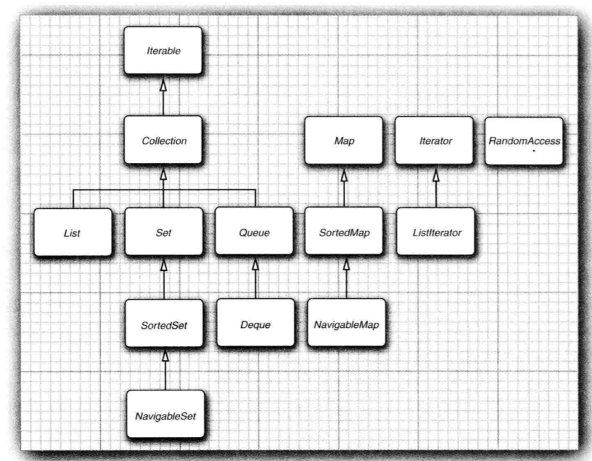
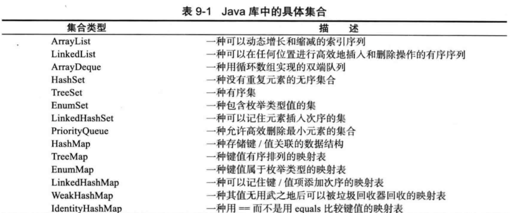
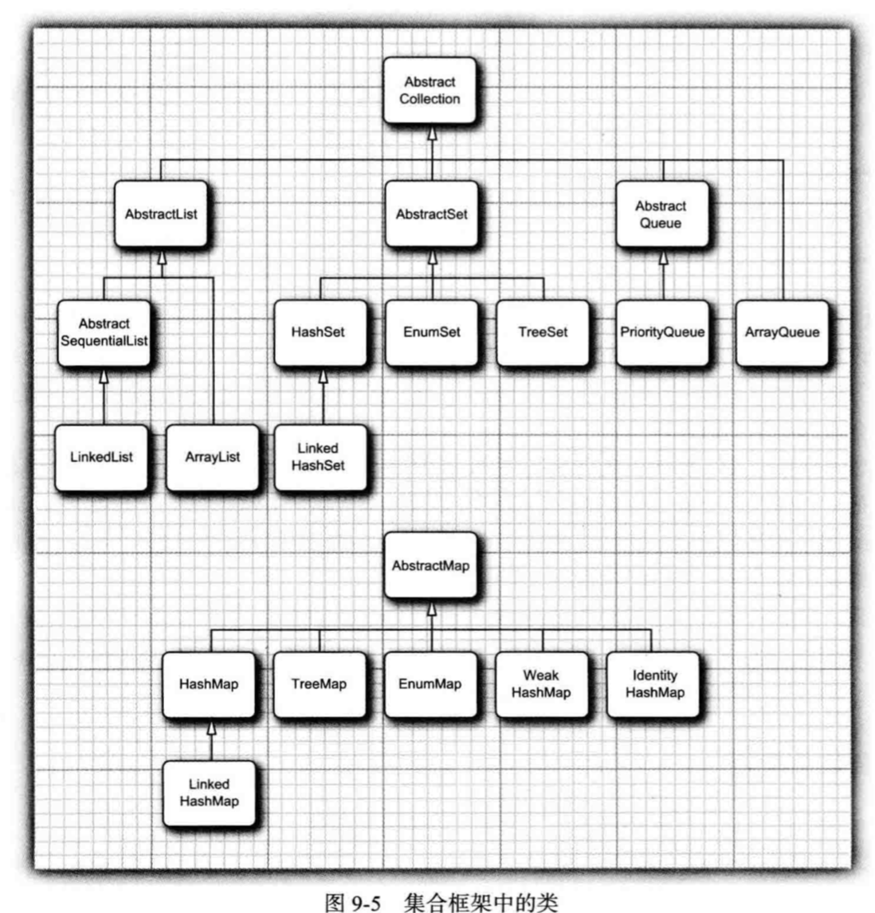
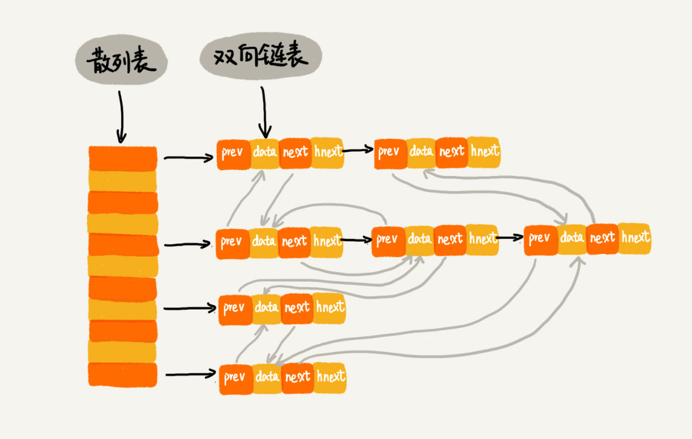

记录java当中的集合使用什么数据结构实现的，并且记录一下由这些数据结构所实现的集合有哪些特性，用以判断将来在开发的过程当中应该选用那种集合来高效合理的实现业务逻辑。

## 集合框架中的接口

**Collection**和**Map**是两个基本的接口。

**List**接口用于描述一个有序的集合，并且集合中每个元素的位置十分重要。

## 集合

### LinkedList

LinkedList实现了List接口。

java当中LinkedList实现的是**链表**这种数据结构。并且是**双向链表**。可以使用ListIterator这个接口对其进行迭代，可以双向迭代。链表这种数据结构在需要**频繁的删除和增加元素**的情况下效率很高，但是**随机访问**却很慢。因此需要在合适的场合使用

* 数据结构：双向链表
* 特点：有序，删除、增加操作性能好，随机访问性能差

### ArrayList

ArrayList也实现了List接口。

他封装了一个动态再分配的对象数组。

Vector也是一个动态数组，但是他的所有方法都是同步的，因此在单线程访问一个Vector对象的时候会很慢。由此可知，在多线程并发访问的时候Vector会有他的用武之地。

* 数据结构：数组
* 特点：有序，删除、增加操作性能差，随机访问性能好

### HashSet

优点：查找元素快。

缺点：不保存元素位置，无法根据位置进行随机访问。

如果不在意元素的顺序，可以使用散列表这种数据结构进行**快速的查找元素**。

HashSet的实现，是基于**散列表**这种数据结构实现的。关于散列表有几个比较重要的点：

* 散列函数
* 散列冲突
* 装载因子
* 动态扩容
  * 如何避免低效的动态扩容
  * 避免动态扩容后，如何处理查询操作
* 散列冲突的解决方案
  * 开放寻址法
  * 链表法
    * 链表法的改造，红黑树。

散列表本质上**是利用数组进行实现**充分的利用了数组随机访问的优点，使得数据元素的查找速度相对于遍历查找大大加快。散列表利用散列函数计算数据元素在数组当中的存放位置

> locate = f(key)

f即为散列函数，locate就是数据元素在数组当中的位置，key则为数据元素的关键字，可用来将来对数据元素进行查找。

散列表这种数据结构所存储的数据在逻辑上是没有关系的，这是它区别于线性表、树、图等数据结构的地方。

回到HashSet中来，HashSet为其存储的每一个元素计算一个整数，根据对象的实例域得来，这个整数称为**散列码**。如果是自己实现的类，则需要自己实现这个自定义类的hashCode方法。**散列码将会作为散列函数的输入，从而计算出需要存储的元素在数组当中存放的位置。**

HashSet默认的装载因子为75%，并且用链表法实现从而解决散列冲突，其默认的桶的数量为16。

### LinkedHashSet

### TreeSet

Treeset是**基于红黑树这种数据结构实现的**。红黑树是一种特殊的二叉查找树，之所以使用红黑树对其进行实现是因为，二叉查找树这种动态数据结构在动态的添加和删除元素的过程当中其时间复杂度有可能会退化，极端情况下会退化成链表，所以他的查找操作的时间复杂度就变成了O(n)，显然这种查找性能是不能够被接受的。为了避免二叉查找树这种极端情况发生，就需要对其进行平衡从而得到一棵**平衡二叉树**，红黑树就是对二叉查找树平衡后的结果。

因为红黑树属于二叉查找树的一种，对二叉查找树进行**中序遍历**会顺序将其中的元素遍历出来，所以红黑树也拥有这种能力。所以TreeSet也就拥有了这个能力，可以按任意顺序把元素插入到TreeSet当中，对其进行遍历就可顺序的获取到集合当中的元素。但是集合中的元素要实现了**Comparable**接口，或者在构造函数当中提供**Comparator**对象。

> 从 JavaSE 6 起， TreeSet 类实现了 **NavigableSet** 接口。 这个接口增加了几个便于
> 定位元素以及反向遍历的方法。

* 数据结构：红黑树(特殊的二叉查找树)
* 特点：有序性、唯一性

### PriorityQueue

优先级队列是基于**堆**这种数据结构实现的。堆分为**大顶堆和小顶堆**，而优先级队列我推测他是小顶堆。这从优先级队列的操作上就可以看得出来，每次从优先级队列当中remove一个数据元素的时候，都会移除最小的那个元素。但是对优先级队列进行遍历则不是按顺序输出的。

可以在某些需要验证优先级的情况下使用优先级队列。

## 映射（Map）

### HashMap

基于散列表实现，经常用，不多说。

### WeakHashMap

暂无，最后看。

### LinkedHashMap

LinkedHashMap 是通过**双向链表和散列表**这两种数据结构组合实现的。LinkedHashMap 中的“Linked”实际上是指的是双向链表，并非指用链表法解决散列冲突。

LinkedHashMap是对HashMap的一种增强。分析这两个Map，HashMap本身是由**散列表**这种数据结构实现的，由于散列表当中数据的存储顺序是通过散列函数打乱之后无规律存储的，所以HashMap无法支持按照某种顺序对其进行遍历。而LinkedHashMap是基于**散列表和双向列表**实现的，双向列表能够保持数据的顺序，散列表能够支持数据的快速查找，所以LinkedHashMap集这两种数据结构的优点于一身。

**LinkedHashMap能够用来实现LRU缓存算法。**

LinkedHashMap能够记住元素插入的顺序，并且按照**访问顺序**对自身进行迭代，访问顺序对实现高速缓存的**最近最少使用**原则非常重要。

### IdentityHashMap

类 IdentityHashMap 有特殊的作用。 在这个类中， 键的散列值不是用 hashCode 函数计算的， 而是用 **System.identityHashCode** 方法计算的。 这是 Object.hashCode 方法根据对象的内存地址来计算散列码时所使用的方式。 而且， 在对两个对象进行比较时， IdentityHashMap 类使用 == , 而不使用 equals。

也就是说， 不同的键对象， **即使内容相同， 也被视为是不同的对象**。 在实现**对象遍历算法** (如对象串行化)时， 这个类非常有用， 可以用来跟踪每个对象的遍历状况。

