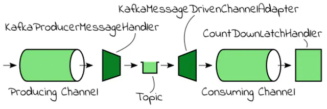

Spring Integration uses the concept of a Message Channel to pass along information from one component to another. It represents the “pipe” of a pipes-and-filters architecture. A Message Channel may follow either Point-to-Point or Publish/Subscribe semantics.

A Message Endpoint represents the “filter” of a pipes-and-filters architecture. Spring Integration has a number of endpoint types that are supported. In this example, we will look at the endpoint types that allow us to connect to Kafka.

The first one is a Service Activator which simply connects any existing Spring-managed bean to a channel. Spring Integration Kafka provides a KafkaProducerMessageHandler which handles a given message by using a KafkaTemplate to send data to Kafka topics. By connecting a channel as input to this Message Handler we can send messages to the Kafka bus.

The second one is a Channel Adapter endpoint that connects a Message Channel to some other system or transport. Channel Adapters may be either inbound (towards a channel) or outbound (from a channel). Spring Integration Kafka ships with an inbound KafkaMessageDrivenChannelAdapter which uses a spring-kafka KafkaMessageListenerContainer or ConcurrentListenerContainer to receive messages from Kafka topics.

