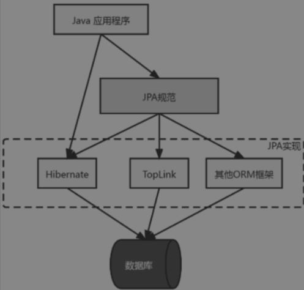
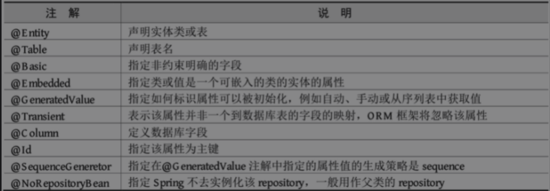

## JPA

### What is JPA

JPA不是一种新的ORM框架，它的出现主要是为了简化现有的持久化开发工作和整合ORM技术，结束现在Hibernate，TopLink，JDO等ORM框架各自为营的局面。它是一套规范而不是产品，而像Hibernate、TopLink等产品实现了JPA规范，我们就可以称它们为JPA的实现产品。



总体来说，**ORM是一种思想，JPA（Java Persistence API）是对这种思想进行规范，也就是一套标准（接口和抽象类），Hibernate和TopLink等产品则通过实现JPA规范实现数据持久化的框架**，通过JPA规范使得所有的数据持久化框架达到统一、规范，减少开发者的学习成本。

JPA主要有以下三方面的功能：

* **ORM映射元数据**：JPA支持XML和JDK 5.0注解两种元数据的形式，元数据描述对象和表之间的映射关系，框架据此将实体对象持久化到数据库表中。
* **Java持久化API**：用来操作实体对象，执行增、删、改、查（CRUD）操作，框架在后台替代我们完成所有的事情，将开发者从烦琐的JDBC和SQL代码中解脱出来。
* ORM映射元数据：JPA支持XML和JDK 5.0注解两种元数据的形式，元数据描述对象和表之间的映射关系，框架据此将实体对象持久化到数据库表中。2）Java持久化API：用来操作实体对象，执行增、删、改、查（CRUD）操作，框架在后台替代我们完成所有的事情，将开发者从烦琐的JDBC和SQL代码中解脱出来。3）查询语言（JPQL）：这是持久化操作中重要的一个方面，通过面向对象而非面向数据库的查询语言查询数据，避免程序的SQL语句紧密耦合。：这是持久化操作中重要的一个方面，通过面向对象而非面向数据库的查询语言查询数据，避免程序的SQL语句紧密耦合。


## SpringData JPA

Spring Data JPA是Spring在ORM框架、JPA规范的基础上封装的一套JPA应用框架。虽然主流的ORM框架都实现了JPA规范，但是在不同ORM框架之间切换需要编写各自的代码，而通过使用Spring Data Jpa能够方便开发者在不同的ORM框架之间进行切换而无需要更改任何代码。这样方便开发者在Spring Boot项目中使用JPA技术。


### 集成

```xml
<dependency>
    <groupId>org.springframework.boot</groupId>
    <artifactId>spring-boot-starter-data-jpa</artifactId>
</dependency>
<dependency>
    <groupId>mysql</groupId>
    <artifactId>mysql-connector-java</artifactId>
</dependency>
```

```properties
# 数据库连接
spring.datasource.url=jdbc:mysql://localhost:3306/jpa_test?serverTimezone=UTC&useUnicode=true&characterEncoding=utf-8&useSSL=true
spring.datasource.username=root
spring.datasource.password=root
spring.datasource.driver-class-name=com.mysql.cj.jdbc.Driver
# JPA配置
spring.jpa.properties.hibernate.hbm2ddl.auto=create
spring.jpa.properties.hibernate.dialect=org.hibernate.dialect.MySQL5InnoDBDialect
# SQL输出
spring.jpa.show-sql=true
# format 下SQL输出
spring.jpa.properties.hibernate.format_sql=true
```

```java
@Entity
@Table(name = "Users")
public class User {
    @GeneratedValue(strategy=GenerationType.IDENTITY)
    @Id
    private Long id;
    @Column(length = 64)
    private String name;
    @Column(length = 64)
    private String password;
    private int age;

    public User(){
    }
    public User(String name, String password, int age) {
        this.name = name;
        this.password = password;
        this.age = age;
    }

   // 省略getter、setter方法
}
```


实体类常用注解




### JpaRepository

