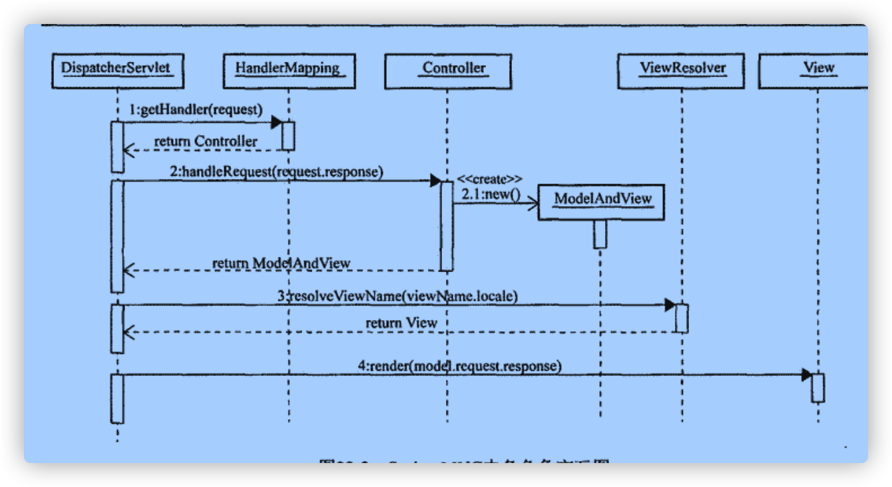

## 鸟瞰SpringMVC

早期的WEB开发在经历了Servlet时代和JSP时代混乱的局面之后，聪明的开发者们终于进入了WEB框架时代，而Spring MVC框架以其出色的设计几乎一统WEB开发的江山。Spring MVC将过去需要硬编码到程序中的无法重用的代码，抽象到其各个组件当中，并通过良好的设计能够适应不同开发人员在不同开发环境下的各种扩展。

### Spring MVC中的几个重要角色

* DispatcherServlet
* HandlerMapping
* Controller
* ViewResolver
* View

Spring MVC将整个WEB处理流程抽象为以上几个重要角色，每个角色都具有一定的灵活性和扩展性。通过以上几个角色，不同的角色各司其职，各自干各自的工作，在WEB开发场景下做了非常良好的职责划分，形成了一整套优雅的开发规范，WEB开发终于开始趋于有序了。这种有序能带来很多的好处：

* 代码易维护
* 开发效率大大提生
* 开发人员学习一套框架就可以与其他开发人员共同协同工作
* 其他我看不到的

而以上这些好处，又能够促进整个WEB开发的整体效率的提高，降低了企业的开发成本，可以说一个好的技术框架的意义是非常久远的。

### Spring MVC的处理流程

此图不写自明。
