1. Mysql架构设计(SQL接口、查询解析器、查询优化器、存储引擎、执行器)
2. Mysql日志相关(undo log、redo log、binlog)
3. Innodb存储引擎(buffer pool结构、free链表作用、flush链表作用、lru链表作用)
4. Mysql数据页/数据行/表空间/数据区
5. Mysql事务隔离级别/MVCC机制原理
6. 索引原理/索引规则/索引优化
7. Explain执行计划分析

## MySQL整体架构

### 架构解析

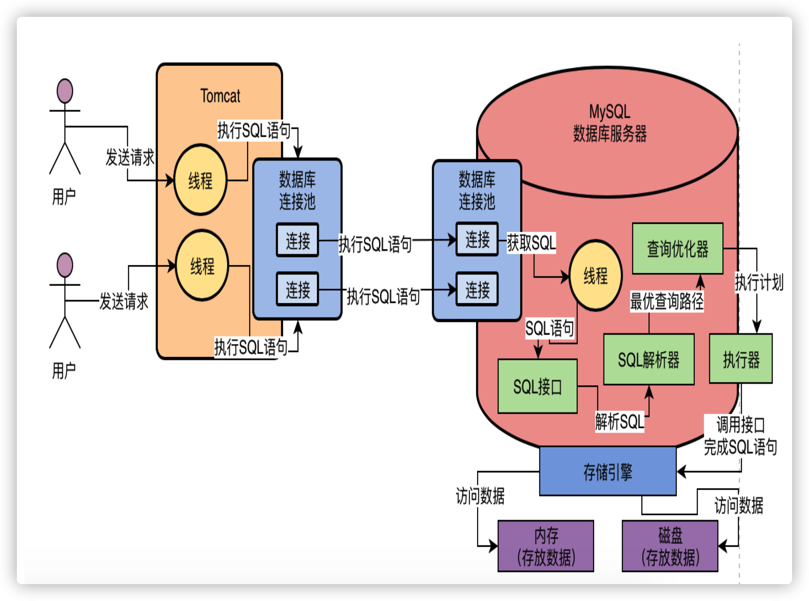

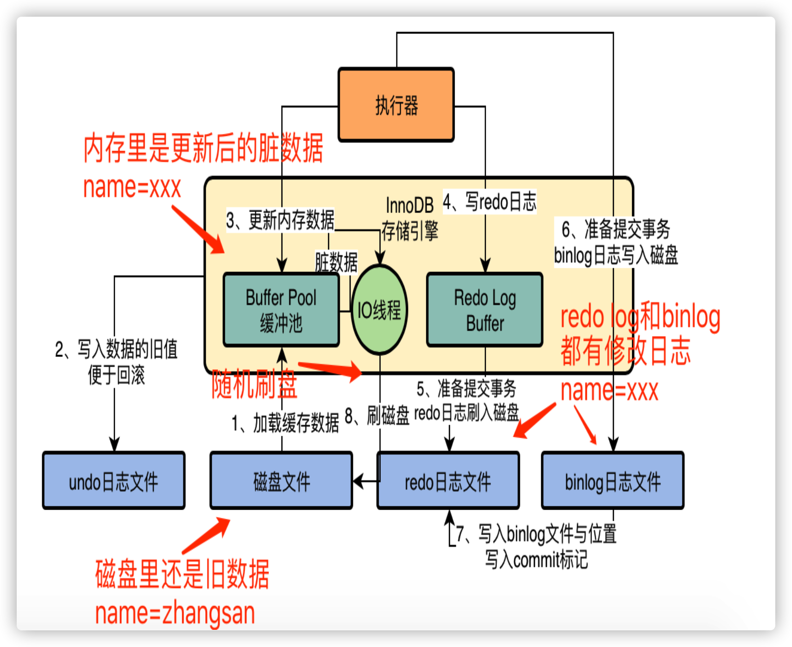

### 生产经验

#### 开发前期，与数据库紧密相关的准备工作

通过本小节，去大致的了解正规的互联网公司在开发前期，需要做哪些与数据库相关的准备工作

#### 数据库机器配置的选择


## 插曲：学习大纲

假设手上有了一个经过压测的、有了完善的监控系统的数据库开始，然后按照在在日常开发一个系统的流程当中使用数据库的顺序进行学习。

1. 增删改查的幕后原理，以及事务原理包括锁的底层机制
2. 执行复杂查询时候，涉及到的索引底层原理，查询优化的底层原理
3. 平时开发系统的时候，应该如何进行数据库建模，在数据库建模的时候应该如何注意字段类型、索引类型，如何保证数据库避免死锁高性能的运行
4. 高阶的数据库架构设计
   1. 主从架构设计
   2. 分库分表架构设计

在这个过程中会穿插着一些生产实践相关案例，这些也是非常宝贵的过来人的经验，要好好吸取。


## Buffer Pool

### 2.1 Buffer Pool内存数据结构

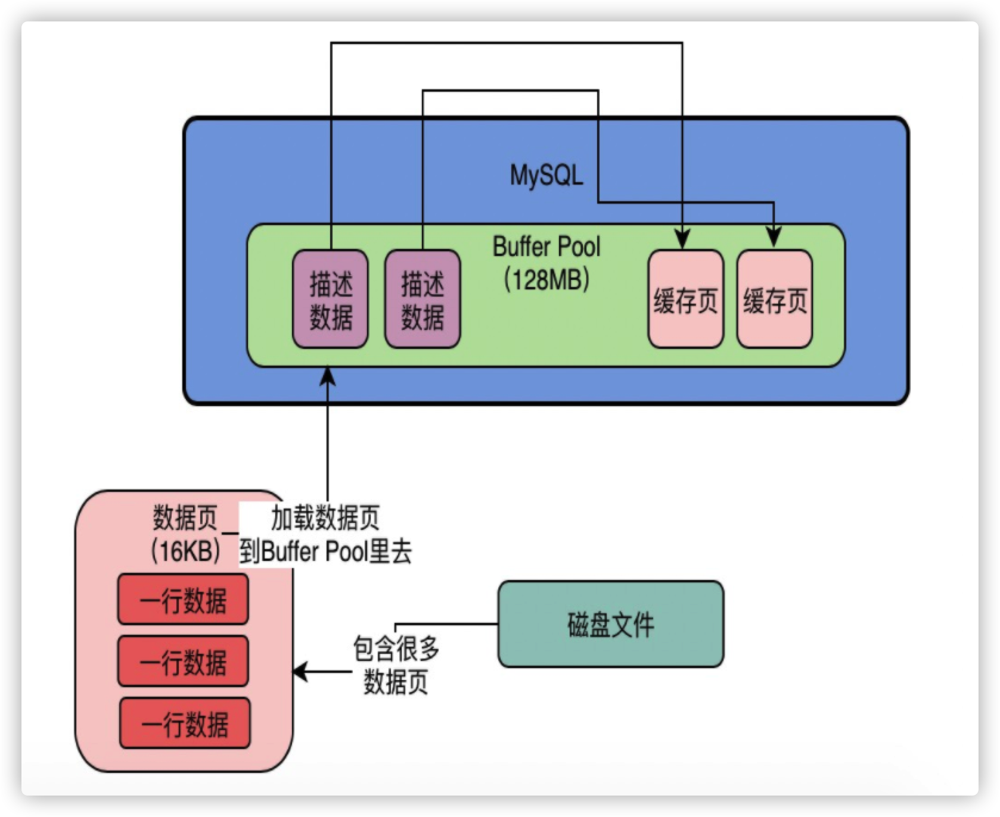

#### 如何配置Buffer Pool的大小

#### 数据页：MySQL中抽象出来的数据单位

#### 磁盘上的数据页与Buffer Pool中的缓存页是如何对应起来的

#### 缓存页中的描述信息是什么

#### 思考：关于Buffer Pool中的内存碎片


### 2.2 free链表

#### buffer pool是如何被初始化的

#### 如何知道哪些缓存页是空闲的

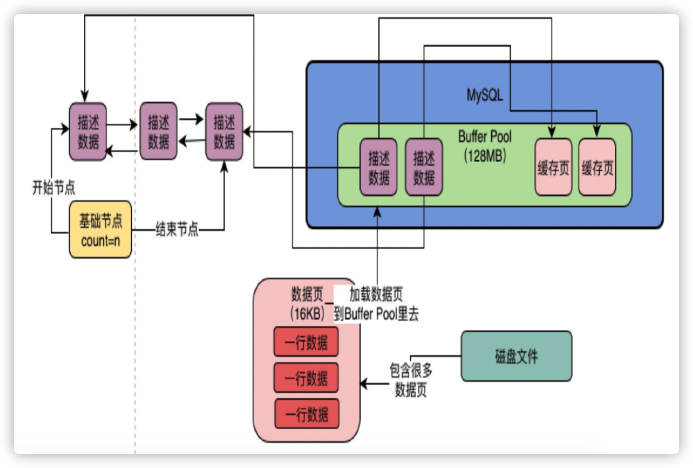

#### free链表占多少内存空间

#### 如何将磁盘上的页读到Buffer Pool的缓存页里边去

#### 怎么知道数据页有没有被缓存

**数据页哈希缓存**

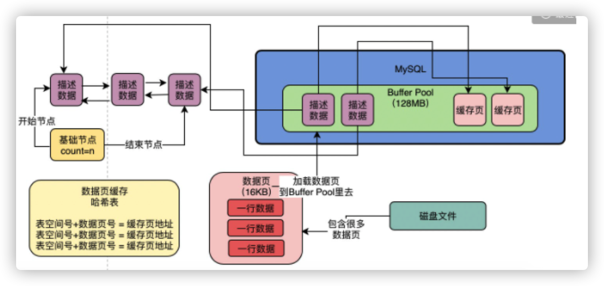

> 缓存碎片：
>
> Buffer Pool 将内存空间分配至缓存页和描述数据后，有可能会剩余一点内存空间什么都不够存放，这就产生了内存碎片。数据库，通过将缓存页和描述数据进行紧密的排列来减少缓存碎片。

### 2.3 flush链表

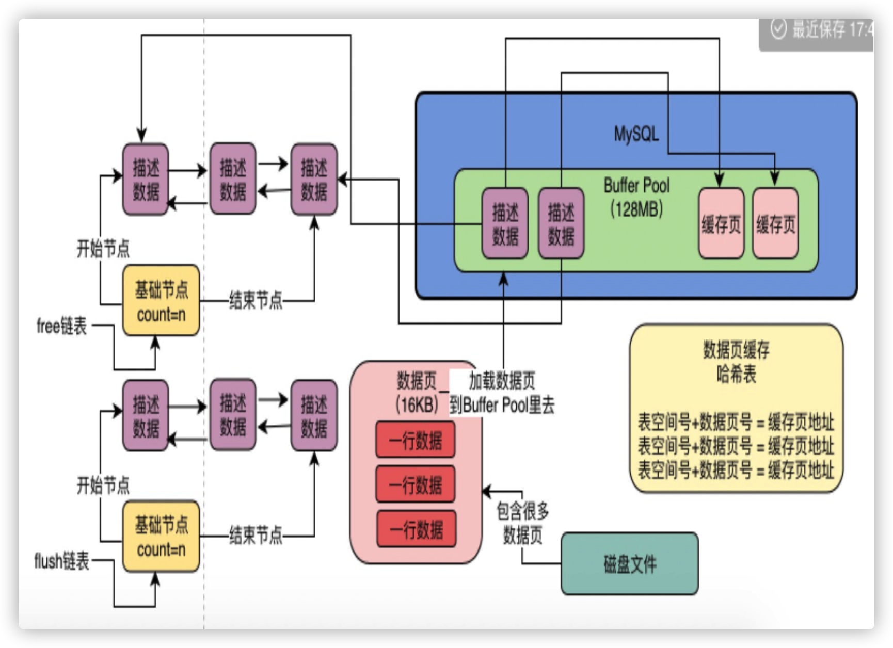

#### 脏数据页是如何产生的

#### 哪些缓存页是脏页

引入flush链表


### 2.4 基于LRU算法淘汰部分缓存

#### Buffer Pool中的缓存页不够用了怎么办？

#### 如果选择要淘汰掉的缓存，淘汰谁？

#### 缓存命中率概念的引入

#### 引入LRU链表来判断哪些缓存页是不常用的

#### 思考

#### LRU在实际运行当中，可能导致的一些问题

##### 导致频繁被访问的缓存页先被淘汰的两种情况

1. 预读
2. 全表扫描

##### 什么时候会触发预读机制

#### 思考

MySQL的预读机制有什么作用？他加载一个数据页到缓存中去的时候为什么把一些相邻的数据页也加载到缓存里去呢？这样做的意义在哪里？这是为了应对怎么样的一个场景？


### MySQL对LRU算法的优化

#### 基于冷热数据的分离的方案对LRU算法进行优化


##### 基于冷热分离的思想设计LRU链表

冷数据

热数据

innodb_old_blocks_pct


##### 冷数据区域的缓存页什么时候会被放到热数据区域

innodb_old_blocks_time


##### 思考


### 脏数据被刷回磁盘的方式

**定时把LRU链表尾部的部分刷入磁盘**

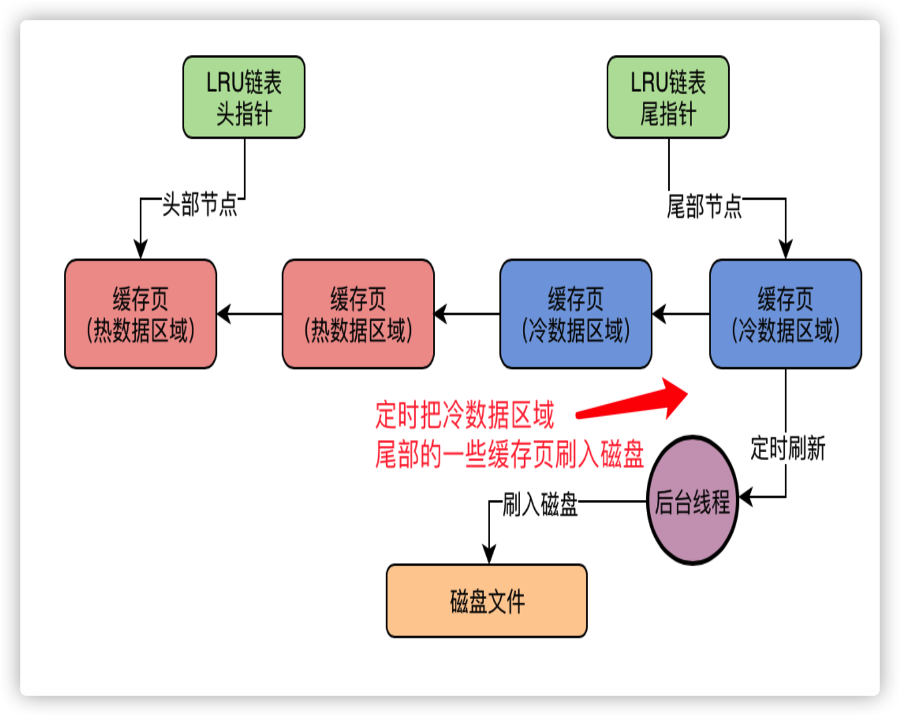


**把flush链表中的部分缓存页刷入磁盘**

上述的后台线程，会在MySQL不怎么忙的时候，把flush链表中的数据都刷到磁盘中去。


**无缓存页时候的处理**

把LRU链表的冷数据区的尾部找到一个缓存页，将其刷入磁盘，然后将这个缓存页放到free链表中去


## 数据页（MySQL存储的最小单位）

一个数据页16kb，一个数据页被加载到Buffer Pool中就变成了缓存页。

数据页的结构如下：

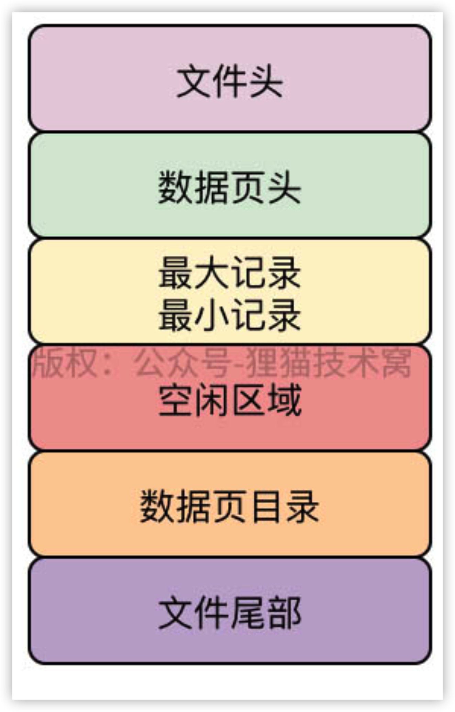

空闲区域用来存储一行一行的数据。

## 表空间

我们自己创建的表都有一个表空间的概念，再磁盘上都会对应着**表名.ibd**这样一个磁盘数据文件

数据页：最小单位 16kb

1个数据区（extent）=64个数据页  1mb

256个数据区被划分为一组  256mb

> 每一组数据区的第一个数据区的前3个数据页都是存放了一些描述信息

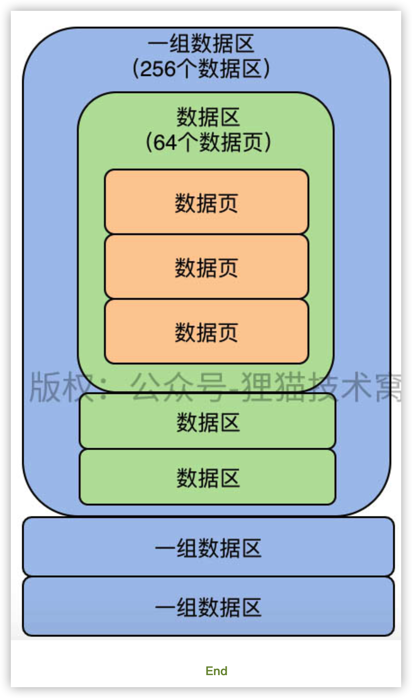


## Redo Log


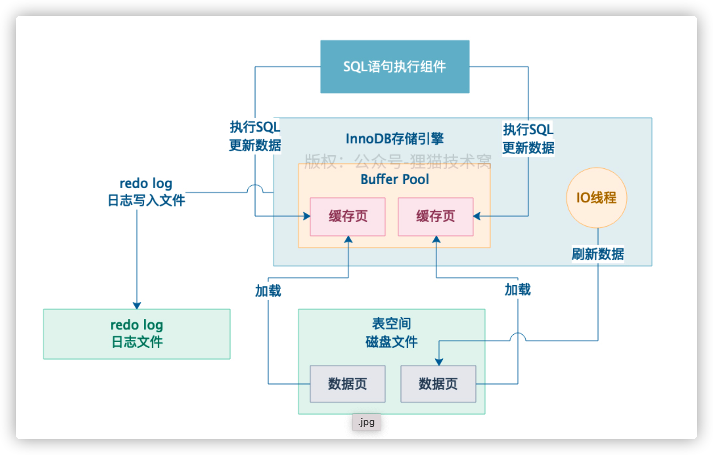


redo log用于保证在一个事务被提交了之后，本次事务所做的操作一定会被反应到磁盘上。因为为了性能，MySQL的增删改查是针对BufferPool而不是磁盘进行操作，因此在事务提交之后有可能数据仍在缓存当中没有被刷新会磁盘，此时如果MySQL服务器突然宕机，缓存中的数据将会丢失。

针对这种情况，MySQL设计了redo log。Redo log用于记录本次事务当中所有对数据库的修改。写Redo log的方式是顺序写磁盘，每次都会追加到磁盘末尾（顺序写在这里不必纠结，就知道他很快就行了），因此写Redo log不会对MySQL性能有什么影响。


### Redo log的结构

如果是MLOG_1BYTE、MLOG_2BYTE、MLOG_4BYTE类型的，其结构如下：

日志类型，表空间ID，数据页号，数据页中的偏移量，具体修改的数据

如果是MLOG_WRITE_STRING，其结构如下：

日志类型（MLOG_WRITE_STRING），表空间ID，数据页号，数据页中的偏移量，修改数据长度，具体修改的数据


### Redo log的写入方式

#### 存放Redo Log的容器——Redo Log Block

MySQL中有另外一个数据结构——redo log block，用来存放多个单行的redo log。一个Redo Log Block是512字节，共分为3个部分：

* 12字节的Header块头

  ​	Header块头又由4部分组成：

  * 4字节的block no
  * 2字节的data length
  * 2字节的first record group。每个事务都会有多个Redo Log，形成了一个Redo Log Group，group中的第一个Redo Log的偏移量就用这两个字节进行存储。
  * 4字节的checkpoint on

* 496字节的body块体

* 4字节的trailer块尾

Redo Log Block的整体结构如下图所示：

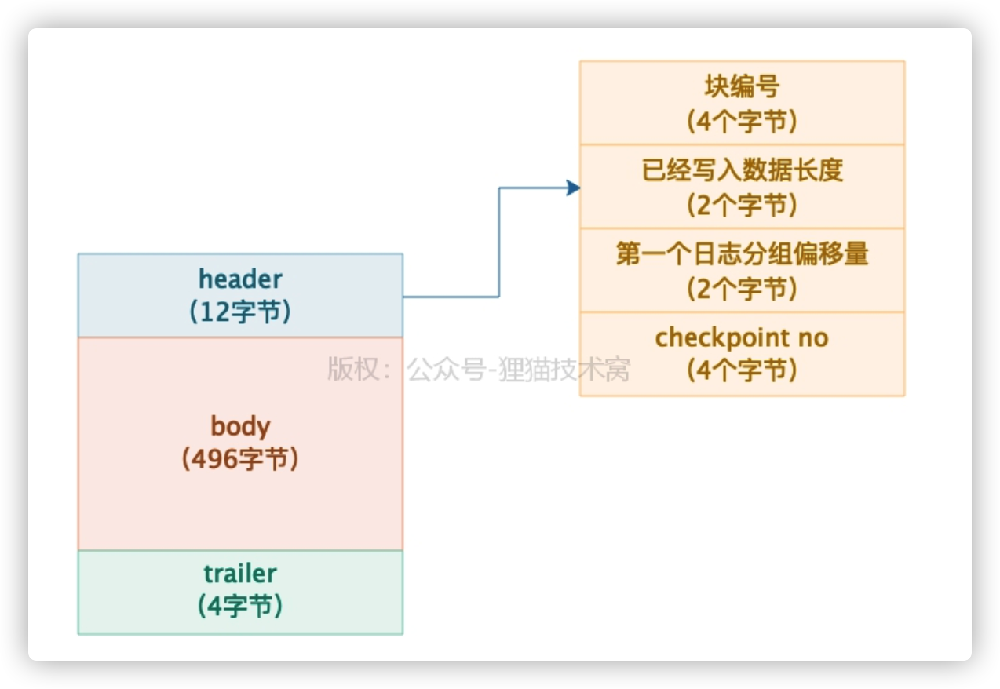

在写Redo Log的时候，现在内存当中把Redo Log写进一个Redo Log Block的数据结构当中去，当内存中的Redo Log Block的512个字节都写满了，再一次性把这个Redo Log Block写入磁盘。

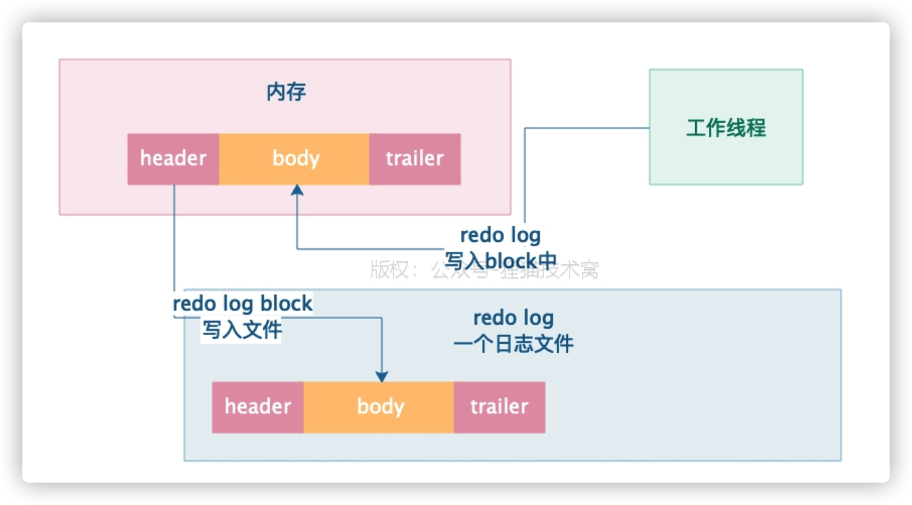


#### 内存中的缓冲区-Redo Log Buffer

Redo Log Buffer是MySQL启动的时候就跟操作系统申请的一块内存空间。Redo Log Buffer与Buffer Pool类似，也是申请出来一片连续的内存，然后里边划分出了N多个空的Redo Log Block，如下图所示：

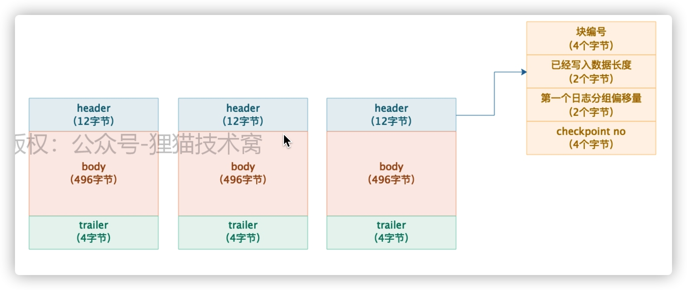

可以通过**innodb_log_buffer_size**来指定Redo Log Buffer的大小，其默认大小为**16MB**。这已经足够大了，毕竟一个Redo Log Block才512 字节，一个 Redo Log一般情况下最大可能也就几十个字节。

Redo Log会被先写入内存中Redo Log Buffer，从Redo Log Buffer中的第一个Redo Log Block开始写起。MySQL会对这块Redo Log Buffer有一定的刷盘策略，这个在下一小节详细记录。

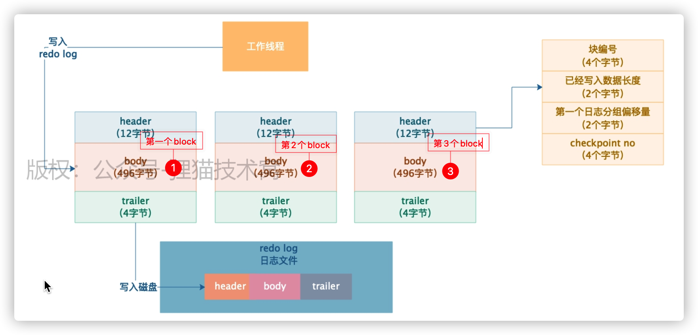

在一个事务中，会有多个增删改的操作，那么就会有多个Redo Log，他们组成了一组Redo Log，也就是**Redo Log Group**，每一组Redo Log都会在一个地方暂存，事务执行完了，再把一组Redo Log写入到Redo Log Buffer中去。

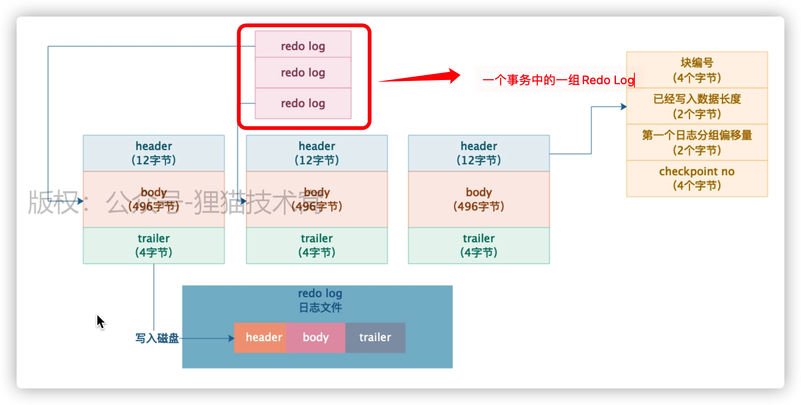


#### Redo Log Buffer中的Redo Log的刷盘时机

1. Redo Log Buffer的容量如果已经使用了一半了，也就是超过了8MB，此时就会把他们刷入到磁盘文件中去
2. 一个事务提交的时候，必须把这个事务对应的Redo Log Group所在的Redo Log Block刷入到磁盘文件中去
3. 后台线程定时刷新，每隔1秒就会把Redo Log Buffer中的Redo Log Block刷到磁盘文件中去
4. MySQL关闭的时候，Redo Log Block都会刷入到磁盘文件中去

如果产生了高并发，1s中就产生了超过8MB的Redo Log，此时必然会触发第一个刷盘条件。

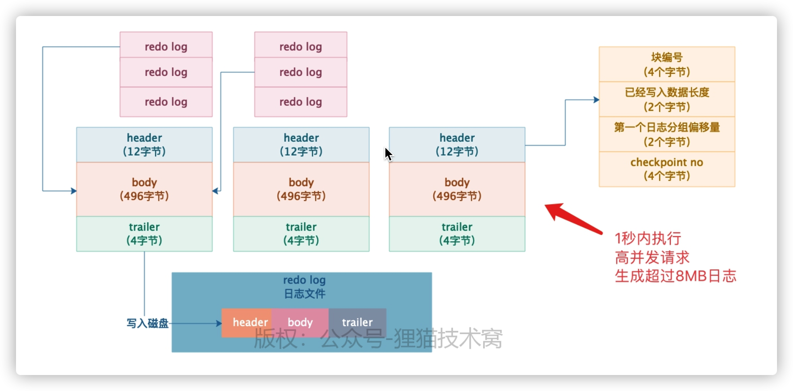

平时一个事务一般都是在几十到几百毫秒之间执行完的，事务执行完毕则会触发第二个刷盘条件。

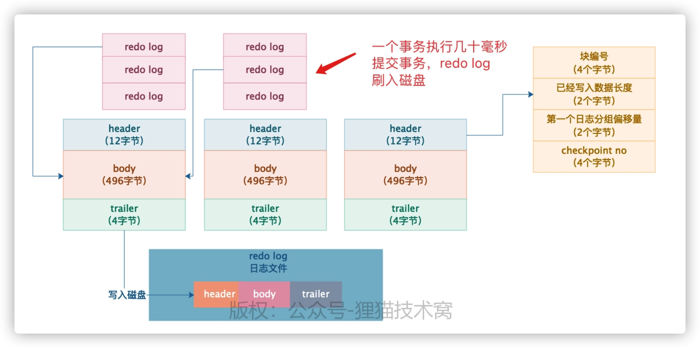


#### 磁盘Redo Log文件的大小控制

Redo Log都会写进一个目录中的文件里，可以通过`show_viriables like 'datadir'`来查看这个目录。默认有两个这样的文件，分别为ib_logfile0和ib_logfile1，写满了一个文件就会写下一个文件，其默认大小是**48MB**。默认情况下，如果两个文件都写满了，会继续写入第一个文件，也就是ib_logfile0，并且会覆盖ib_logfile0中之前写入的Redo Log，所以MySQL在默认情况下，只会保留最近的96MB的Redo Log。

MySQL也提供了几个参数来修改默认的设置：

| 参数                      | 作用                       |
| ------------------------- | -------------------------- |
| innodb_log_file_size      | 指定每个Redo Log文件大小   |
| innodb_log_files_in_group | 指定Redo Log文件的数量     |
| innodb_log_group_home_dir | 指定Redo Log文件的存放目录 |


## Undo Log

Undo Log主要用在事务的回滚上。当一个事务在执行完之前想要回滚，Undo Log就起到了他的作用，如下图：

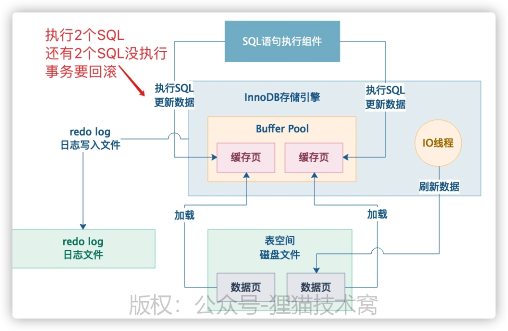

从最抽象的顶层来看，Undo Log记录的内容很简单，分增删改三种：

* insert：会记录一个主键和一个对应的delete操作
* delete：会把删除的那条数据记录下来
* update：会把更新前的那个值记录下来


### 剖析Insert语句的Undo Log

一条Inser语句的Undo Log包括以下内容：

* 这条日志的开始位置

* 主键的各列长度和值

* 表Id

* Undo Log 日志编号

  每个Undo Log都有自己的编号，每个事物里的Undo Log日志的编号都是从0开始的，依次递增。

* Undo Log日志类型

  Inser 语句的Undo Log的日志类型是：**TRX_UNDO_INSERT_REC**

* 这条日志的结束位置


## 多事务并发

MySQL的多事务并发示意图如下：

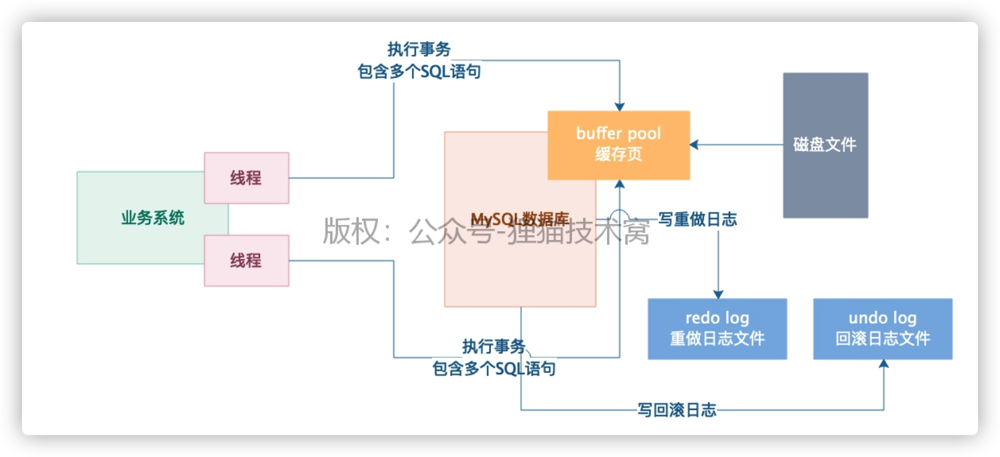

在多事务并发的情况下会产生很多的问题，比如：

* 对Buffer Pool中的同一行数据进行更新的时候，这个冲突怎么处理？
* 可能有事务事务在对一行数据做更新，但是另外一个事务在查询折行数据，这个冲突又怎么处理？

说白了就是，**在多事务并发的时候，MySQL应该如何合理的分配资源**。

接下来，在多事务并发这一节中主要围绕的就是对于资源冲突的情况，MySQL内部的一些处理机制是怎样的，包括：

* 事务的隔离级别
* MVCC多版本隔离
* 锁机制


### 多事务并发会导致的4种常见问题

#### 1. 脏写

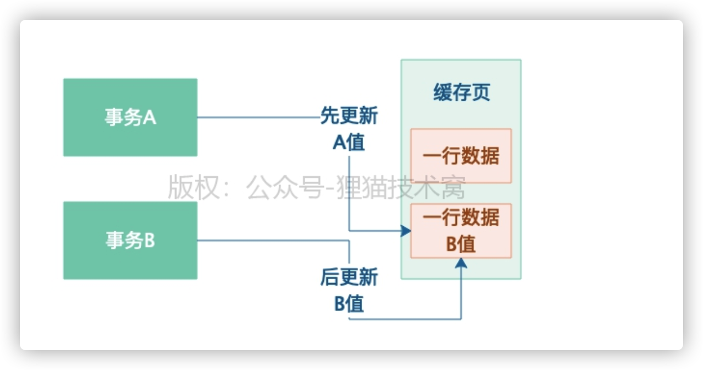


事务B明明自己已经把一行记录更新了，但是值却没了，这就是脏写。

> 脏写其实就是，对于任意一个事务，写入的某行记录的值随时可能被其他事务更改。


#### 2.脏读

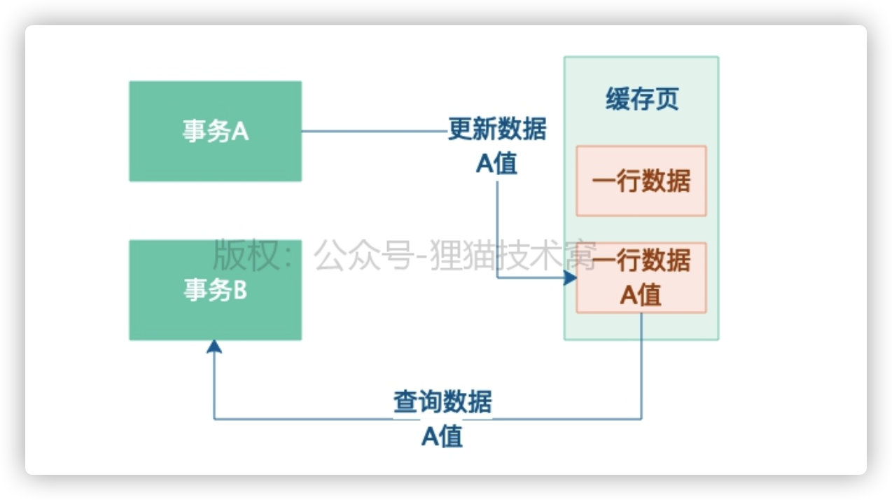

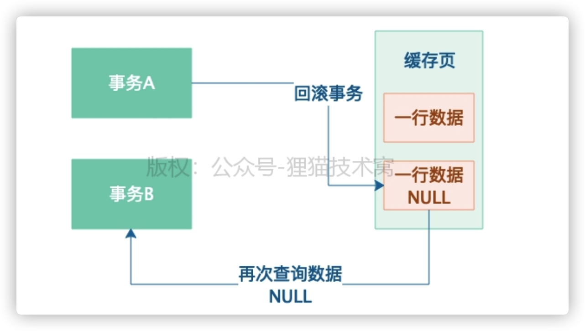

事务B第一次查出来的是A值，然后拿着A这个值去做各种业务处理，但是第二次再去查询的时候该值变成了NULL。

> 一个事务读取了另一个事务未提交的数据


#### 3.不可重复读

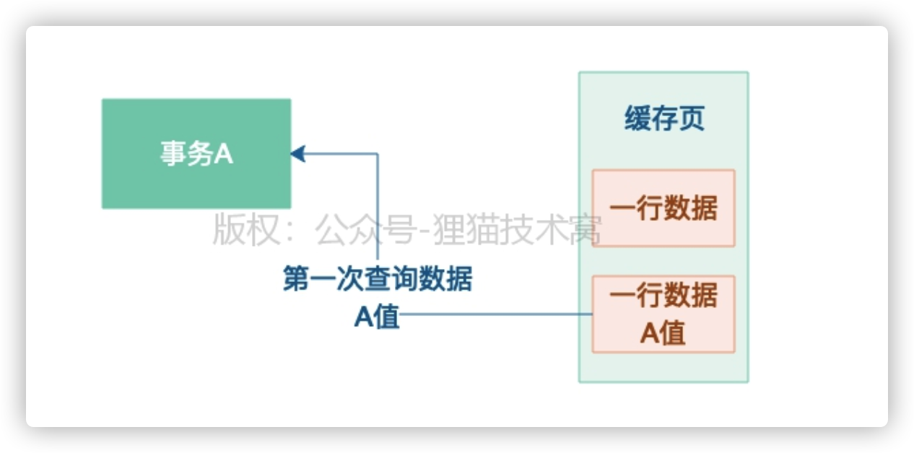

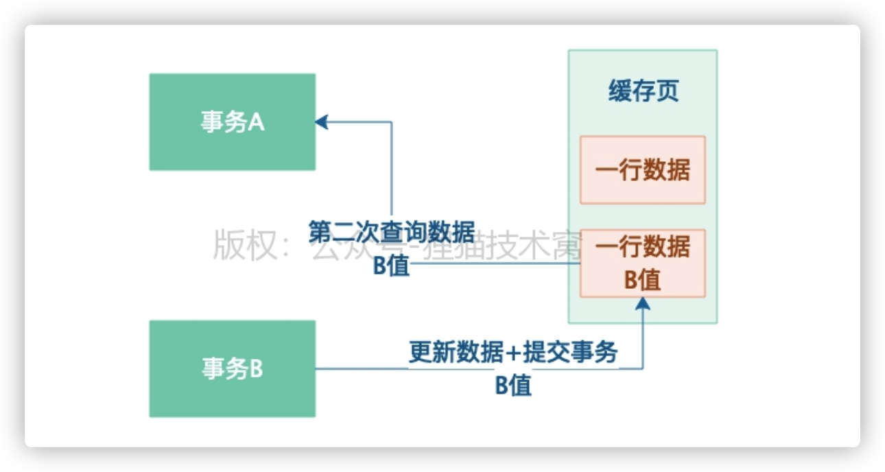

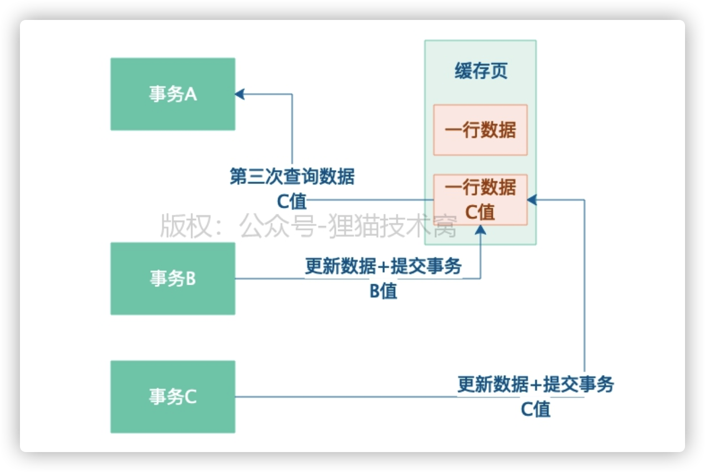

事务A每次读出来的值都是不一样的，这就叫做不可重复读。

不可重复度这个问题不一定会对业务系统产生影响，这取决于业务系统的要求。如果每次读出来的值都是不一样的，但是对于业务系统来说这没什么问题，那么不可重复读就是一种正常现象。但是如果希望事务开始之后，对于同一行记录，读到的值自始至终都是一样的，那么不可重复读就会对业务系统产生影响。

**因此，不可重复读是否会产生影响，取决于业务系统的要求。**

#### 4.幻读

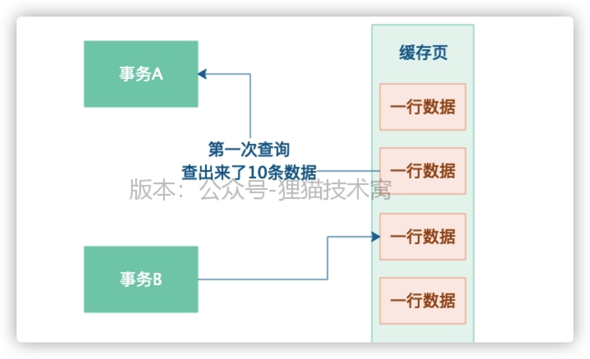

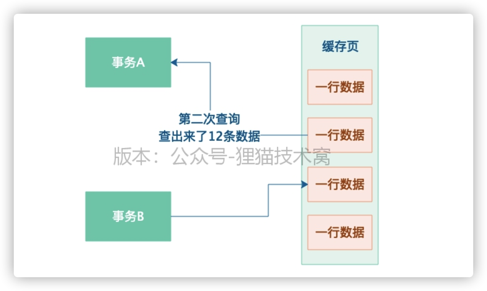

事务A用**一模一样的SQL语句**进行了两次查询，查询出来的结果是不一样的，这就是幻读。更为具体一些：select 某记录是否存在，不存在，准备插入此记录，但执行 insert 时发现此记录已存在，无法插入，此时就发生了幻读。


#### 不可重复读VS幻读

在学习的过程当中我对不可重复读和幻读没法完全的将这两个现象拆分开，现在就把这两种现象放在一块做一下分析。

从表征上来看，不可重复读和幻读的结果都是两次读取产生的结果不一样，但是如果进入到细节来看，可以发现他们还是有区别的。不可重复读，两次读取的结果不一样的地方在于两次读取的**值**不一样，重点在于读取的值，也就是其他事物的update操作和delete操作会对其产生影响，而insert却没什么影响；幻读，两次读取的结果不一样的地方在于两次读取的结果数量不一样，也就是其他事务的insert操作和delete操作对其会产生影响，而update却没什么影响。

> 幻读和不可重复读的理解，暂时先止于此，可能理解上有误，但不耽误接下来的学习。


### 事务的隔离级别

* 读未提交（read uncommitted）（此事务还没提交，别人就能读到在该事务中更新后的结果），一个事务还没提交时，它做的变更就能被别的事务看到，该隔离级别可以避免脏写。
* **读提交（read committed，RC）**（此事务还没提交，别人无法读到在该事务中更新后的结果），一个事务提交之后，它做的变更才会被其他事务看到，改革立级别可以避免脏写和脏读。
* **可重复读（repeatable read，RR）**（别人做的任何数据更改，不影响本事务，本事务始终读的都是事务开始时候的快照），一个事务执行过程中看到的数据，总是跟这个事务在启动时看到的数据是一致的。当然在可重复读隔离级别下，未提交变更对其他事务也是不可见的，该隔离级别**可避免不可重复读，但不能避免幻读**。
* 串行化（serializable），顾名思义是对于同一行记录，“写”会加“写锁”，“读”会加“读锁”。当出现读写锁冲突的时候，后访问的事务必须等前一个事务执行完成，才能继续执行，该级别可以避免幻读。

在MySQL当中，默认的隔离级别是RR级别，~~也就是说使用MySQL默认隔离级别就能避免幻读~~，这依靠了他的**MVCC机制**——多版本并发控制隔离机制，之后会详细记录这个MVCC，这是一个重点内容。


### MVCC前奏，Undo Log版本链

简单来说，数据库中的没条记录都存在两个隐藏字段：

* trx_id
* roll_pointer

trx_id就是最近更新这条数据的事务Id，roll_pointer指向了最近的一个事务对这条记录进行改动的Undo Log。举例来说：

事务A，id为50，在数据库中插入了一条数据，那么此时这条数据的trx_id为50，roll_pointer指向了一个空的Undo Log。

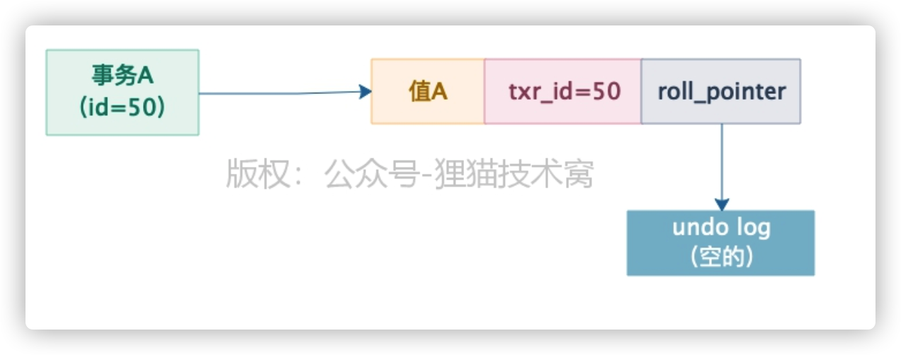

接着，事务B，id为58，更新了这条记录，那么此时这条数据的trx_id为58，roll_pointer指向了事务A生成的Undo Log，图中的Undo Log只画出来了Undo Log的一部分内容——也就是事务B更新这条记录之前的值，包括了这条记录所有的字段的值，其他部分没有画出来因为并不影响理解。

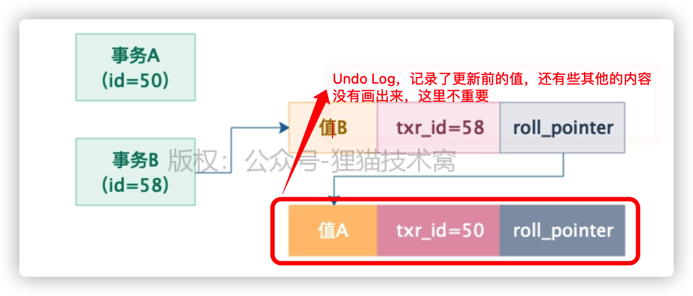

接着，事务C，跟事务B一样，不再赘述。

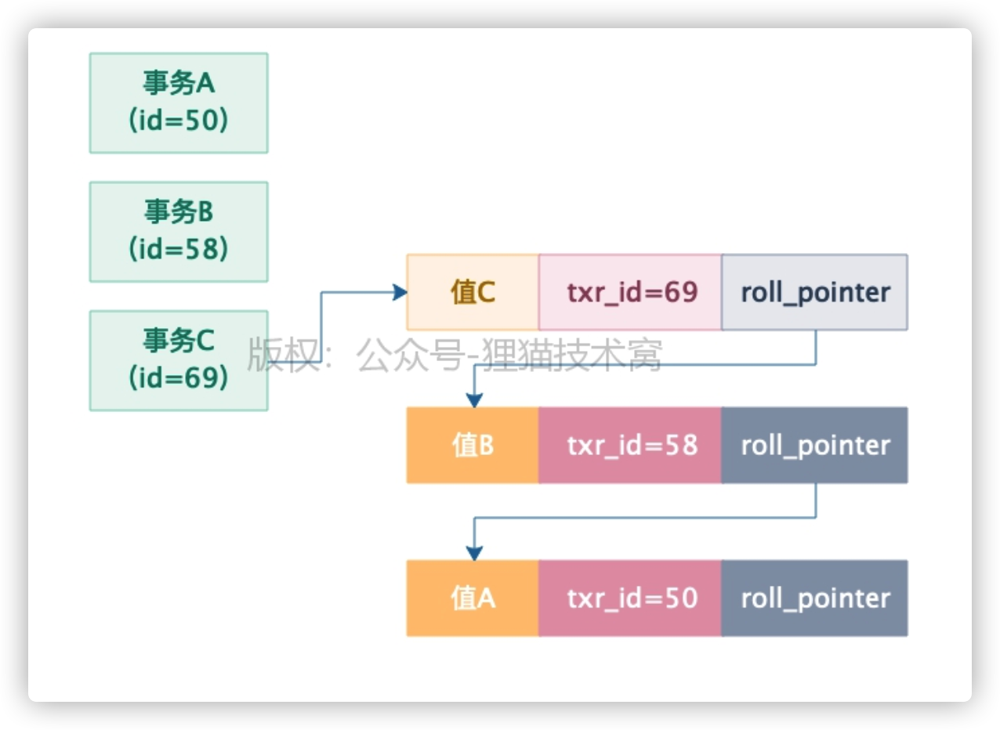

以上，在事务串行的场景下，记录了MySQL的Undo Log版本链，Undo Log版本链是MVCC的基础。


### 基于Undo Log版本链实现的ReadView机制

ReadView，简单来说就是你执行一个事务的时候，就会生成一个**ReadView**，里边有比较关键的4个东西：

* **m_ids**，数据库中还没有提交的事务的id——可以认为这是事务是与本事务并发执行的事务
* **min_trx_id**，m_ids里的最小值
* **max_trx_id**，数据库中下一个要生成的事务的id，也就是m_ids里的最大值
* **creator_id**，当前这个事务的id

下边通过举例，来描述ReadView是如何使用的。


1. 数据库中有一条最原始的记录是这样的：


2. 接着来了两个事务，事务A、事务B。事务A要读取这行记录，事务B要更新这条记录，此时事务A的ReadView的情况为：

* m_ids = [45,59]
* min_trx_id = 45
* max_tr_id = 59
* creator_id = 45

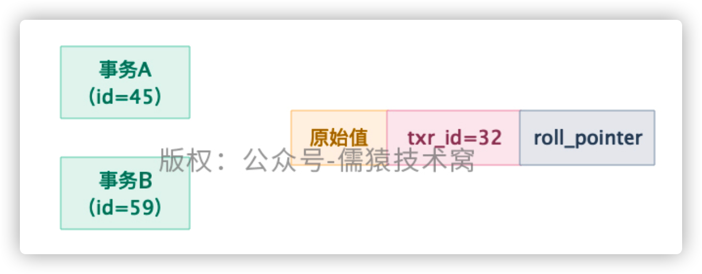

3. 事务A在查询该记录的时候，会判断该记录中的trx_id是否**小于（注：这里是严格的小于，而不是小于等于）**ReadView中的min_trx_id，发现记录的trx_id = 32,ReadView中的min_trx_id=45，这说明在ReadView生成的时候，id为32的事务就已经提交了，因此是事务A能够正常查询到这条记录的的原始值：

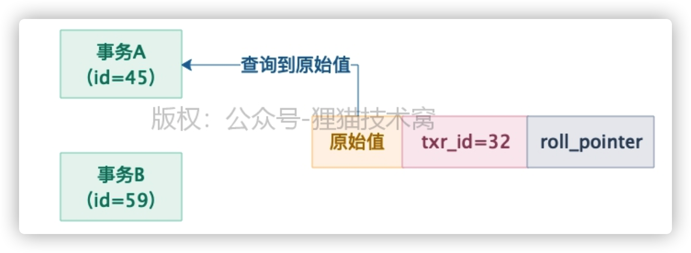

4. 接着，事务B开始更新这条数据，把数据的值更新成了B，trx_id更新成了自的id——也就是59，同时roll_pointer指向了一个Undo Log，该Undo Log记录了更新前的记录。最后，事务B提交。

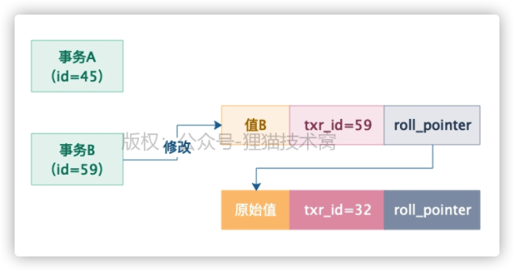

5. 然后，事务A又来查询，此时事务A发现了几个事情：

* 这条数据的trx_id = 59，比ReadView中的min_trx_id大，这说明：**自己的事务开启之后，这条记录被事务Id为59的事务更新过并且该事务已经提交**
* 这条数据的trx_id = 59，比ReadView中的max_trx_id小，这说明：**更新这条记录的这个事务基本上是跟自己同时开启的（自己开启的时候，事务id为59的事务也还没有提交）**
* 这条数据的trx_id = 59，m_ids = [45,59]，trx_id存在与m_ids中，**直接证明该事务是与本事务同期并发执行的事务**

此时，A得出了结论，**该记录不能读**。于是，A顺着roll_pointer找到了最近的那个Undo Log，trx_id是32，发现：

* 该Undo Log的trx_id是32，比ReadView中的minx_trx_id小，这说明：**这个Undo Log的版本必然是在事务A开启之前就执行切提交的。**

此时，A会从这个Undo Log中读取到原始值。

这就是Undo Log版本链的作用，**他可以保存数据的一个版本链条，让你可以读到数据之前的快照中的值。**

> 这里遗留了一个问题：Undo Log版本链中的Undo Log不可能无限增加吧，那么他是什么时候被删除的呢？

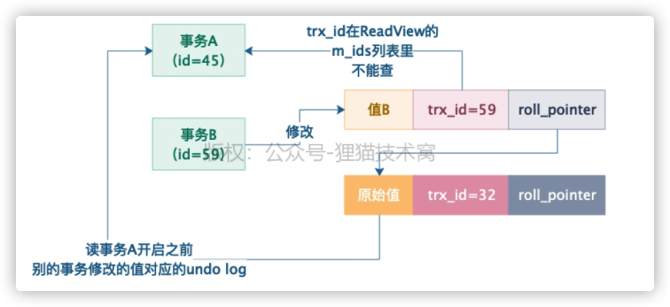

6. 接着，A自己更新了这条记录。

   * 将记录的改成了值A；trx_id修改为45；同时保存本次更新前的记录的快照；

   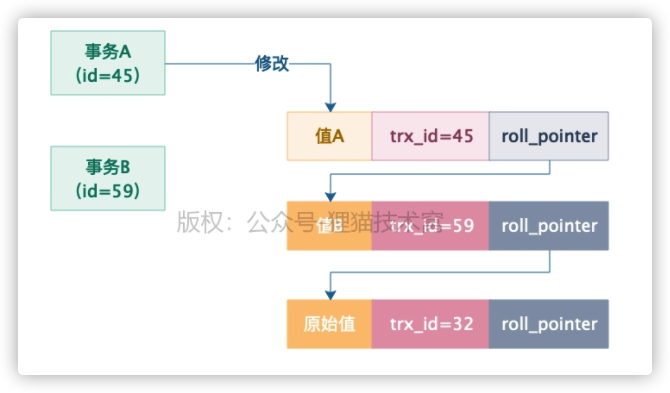

7. 然后，A自己再来查询这条记录，发现：

   * 这调数据的trx_id是45，等于min_trx_id，但是与ReadView中的creator_id相同，这说明：**这条数据就是自己改的**

   因此，A得出结论，这条记录是可以读的。

   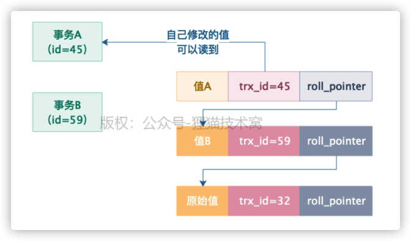

8. 接着，事务A还没有提交，又来个事务C，这个事务的id是78，将这条记录的值更新成了值C并提交：

   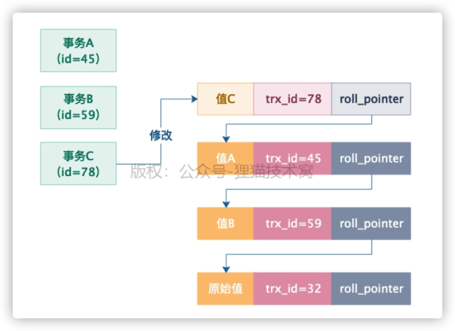

9. 事务A此时再来查询，发现：

   * 当前数据的trx_id=78，比ReadView中的max_trx_id大，这说明：**在事务A开启之后，事务C更新了数据**

   因此，事务A得出结论：该数据记录不可读，于是顺着roll_pointer开始寻找可读数据，就找到了值为A的那条记录，于是就读到了值A。

> 这里有一点自己的思考：
>
> 一个事务的开启应该是包含了几个固定的过程，其中就包含m_ids，min_trx_id，max_trx_id，creator_id这几个值捕获这个过程，这个过程会捕获所有当前事务开启时的正在活跃中的事务Id。当这几个固定的过程都完成后，一个事务才算是开启。因此，当发现一条记录的trx_id比自己m_ids中的最大id还大的时候，就完全能够说明这个事务是在本事务开启之后开启的。


**RC级别是如何基于ReadView机制实现的**

RC隔离级别，是本事务可以读其他事务已更新并且已提交了的值。该隔离级别的实现原理就是：

**在一个事务中，每次读取操作，都会生成一个ReadView。**

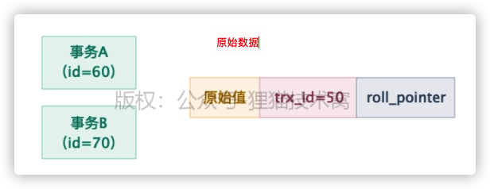

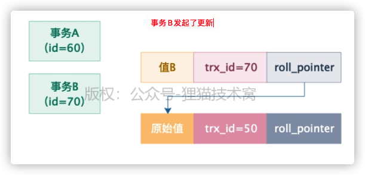

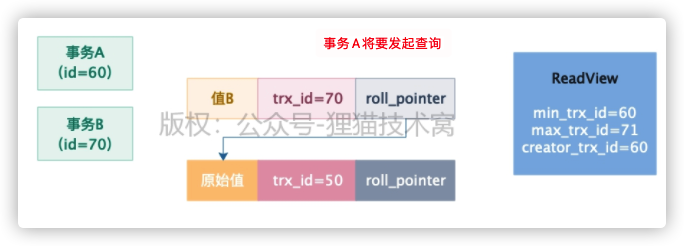

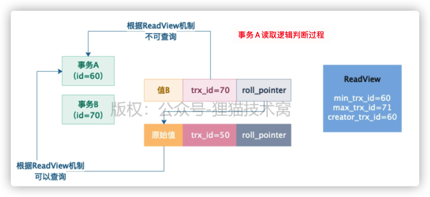

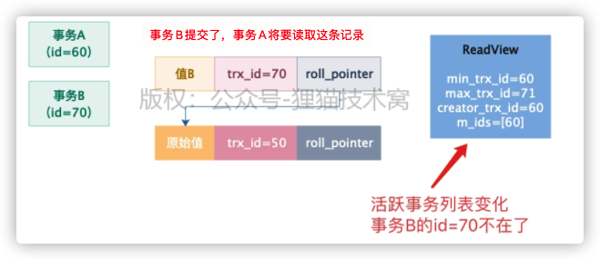

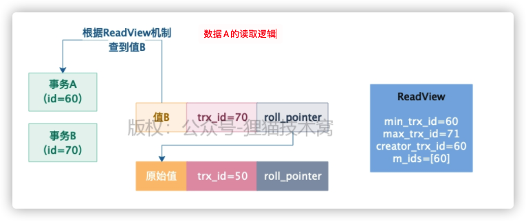


### 脏写是如何被避免的

MVCC是用来解决多事务并发的时候，读操作与其他事务的写操作之间的协调问题。而数据库的锁机制，是用来解决多个事务同时更新同一条记录时候，产生的脏写的问题。

老样子，继续举例说明。

1. 当一个事务A想要更新某条记录的时候，他会先看看这行数据此时有没有被其他事务加锁。如果没人加锁，那说明这条记录本事务是可以更新的，于是该事务会新建一个锁，锁中包含了：

   * 事务的trx_id = 50

   * 等待状态 = false

   然后，把该锁跟要更新的那条数据关联起来：

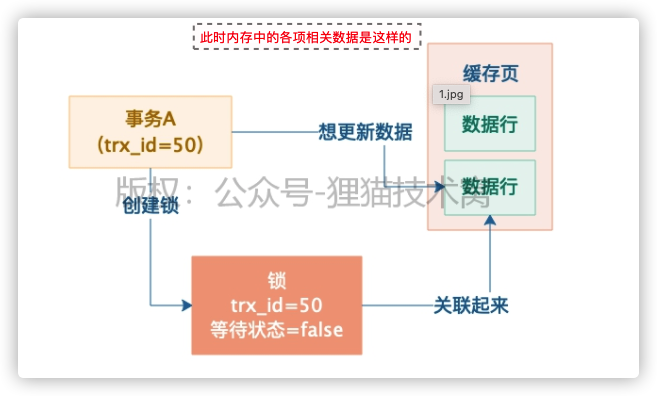

2. 此时，事务B也想更新这条记录，发现这条记录已经被加锁了，于是事务B也在内存中产生了一个锁数据结构，所数据结构中的各项状态为：

* 事务的trx_id = 60
* 等待状态 = true

然后等着该条记录的锁被释放就行了。

注意，事务B的等待状态是true。

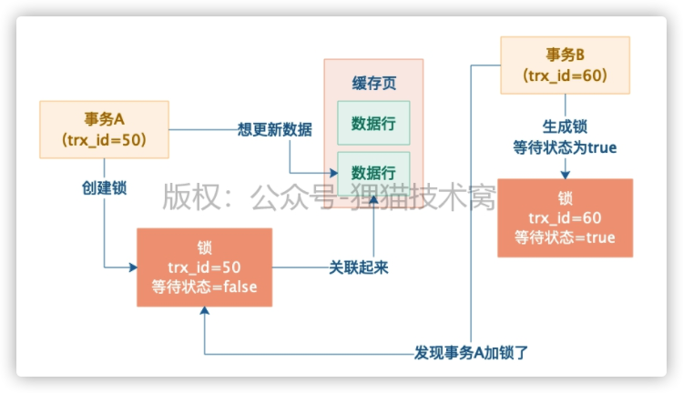

3. 接着，事务A更新完了数据，会释放掉锁，然后去找此时还有没有其他人也对这行记录加了锁，发现B也对这行记录加了锁，于是将B的等待状态改为false，接着唤醒B事务继续执行，此时事务B就获取到锁了。


### 行级锁：共享锁和独占锁

上一小节讲到的更新操作加的锁实际上是一种**独占锁**，而独占锁对于默认的读操作来说是透明的，因为读操作走的是MVCC机制，满足了MVCC机制就必然能够去读这行数据，完全不用考虑是否有其他事务正在更新这条数据。读操作默认情况下走MVCC机制，完全不考虑锁的情况，因此读操作默认情况下也不会对要读的记录加锁。

但是，**MySQL也对读操作的时候加读锁提供了支持**。

首先是读操作时候的共享锁。可以在一个查询语句的最后加上`lock in share mode`，意思就是在查询的时候对这行记录加上共享锁。但是共享锁跟独占锁是互斥的，若此时这条记录已经加上了独占锁，该查询就只能处于等待状态了。共享锁和共享锁之间是不互斥的，也就是说同一条记录，两个事务都来加共享锁是没问题的，两个事务都不会等待，直接就可以读取这条记录的值。

> 看来，读操作的时候加的共享锁，就是为了排斥更新操作的，我读的时候别人不能更新。


然后是读操作时候的独占锁。可以在一个查询语句的最后加上`for update`，意思就是在查询的时候对这行记录加上独占锁。读操作时候的独占锁代表的是，这条数据我查出来之后还要更新，其他人不要更新这条数据了。

| 锁类型 | 独占锁 | 共享锁 |
| ------ | ------ | ------ |
| 独占锁 | 互斥   | 互斥   |
| 共享锁 | 互斥   | 不互斥 |

读操作的时候手动的加锁这种情况是很少见的，一般不会在数据库层面做复杂的手动加锁的操作，因为在SQL语句里加共享锁或者独占锁，会导致这个加锁逻辑隐藏在SQL语句里，在你的Java业务系统层面其实是非常的不好维护的，所以一般是不建议这么做的。


### 表级锁

表级锁分为两种：

* 表锁
* 表级意向锁

首先说说表锁，表锁的添加语法是：

```mysql
--表级共享锁
LOCK TABLE XXX READ
--表级独占锁
LOCK TABLE XXX WRITE
```

表锁不常用，很少会手动的去加表锁。

然后说说表级意向锁，意向锁都是**自动加上去**的。有两种情况会加表级意向锁：

* 有事务在做**增删改**操作的时候，除了会在行级加独占锁，同时也会在表级加意向独占锁
* 有事务在做查询操作的时候，会在表中加一个意向共享锁

这两种锁都是在执行增删改查的时候自动在表级加的锁，他们之间是不存在互斥关系的，彼此互相透明，谁也看不见谁。然而，他们和手动加的表级所是存在互斥关系的，互斥关系如图：

| 锁类型             | 手动加的表级共享锁 | 手动加的表级独占锁 | 意向独占锁 | 意向共享锁 |
| ------------------ | ------------------ | ------------------ | ---------- | ---------- |
| 手动加的表级共享锁 | 不互斥             | 互斥               | 互斥       | 不互斥     |
| 手动加的表级独占锁 | 互斥               | 互斥               | 互斥       | 互斥       |
| 意向独占锁         | 互斥               | 互斥               | 不互斥     | 不互斥     |
| 意向共享锁         | 不互斥             | 互斥               | 不互斥     | 不互斥     |


### 案例实战：线上数据库的随机性能抖动优化

先说引起抖动的可能的原因：

* 一个查询语句，需要查询大批量的数据，导致需要将Buffer Pool中的脏页大量刷入磁盘，才能空余出空间来执行这条SQL语句。
* 所有Redo Log文件都写满了，需要开始覆盖第一个Redo Log文件中的Redo Log，此时会检查如果第一个Redo Log文件里边的一些redo log对应之前更新过的Buffer Pool中的缓存页，迄今为止都没刷入磁盘，此时必须要把那些马上那些缓存页刷入磁盘。


解决方案：

* 尽量减少缓存页flush到磁盘的频率

* 尽量提升缓存页flush到磁盘的速度

减少频率很困难，着重放在第二个解决方案上。

要提升缓存页flush到磁盘的速度，通常的建议就是：**对于数据库部署的机型，采用SSD固态硬盘，而不是机械硬盘，SDD固态硬盘最强大的地方，就是他的随机IO性能非常高。**

flush缓存页到磁盘，是典型的随机IO，需要在磁盘上找到各个缓存页所在的随机位置，把数据写入到磁盘里去。所以如果采用的是SSD固态硬盘，那么flush缓存页到磁盘的性能首先就会有很大的提高。

光用SSD还不够，还必须要设置MySQL一个非常关键的参数：`innodb_io_capacity`，这个参数就是告诉数据库采用多大的IO速率吧缓存页flush到磁盘中去。举例来说：如果SSD能承载的每秒随机IO数是600，但是这个参数设置的是300，那flush缓存页到磁盘的时候，每秒最多就稚嫩执行300次随机IO，根本没有发挥出SSD的性能。还有另外一个重要的参数：`innodb_flush_neighbors`，这个参数用于说明，在flush缓存页到磁盘的时候可能会把缓存页附近的其他缓存页也刷到磁盘，但是这样有时候会导致flush的缓存页太多了。实际上如果用的是SSD，并没有炳耀设置这个参数，设置成0就好了。


## 数据库索引

### 磁盘数据页的存储结构

磁盘上大量的数据页是按顺序一页一页存放的，两两相邻的数据页之间会采用双向链表的方式互相引用，看起来如下：

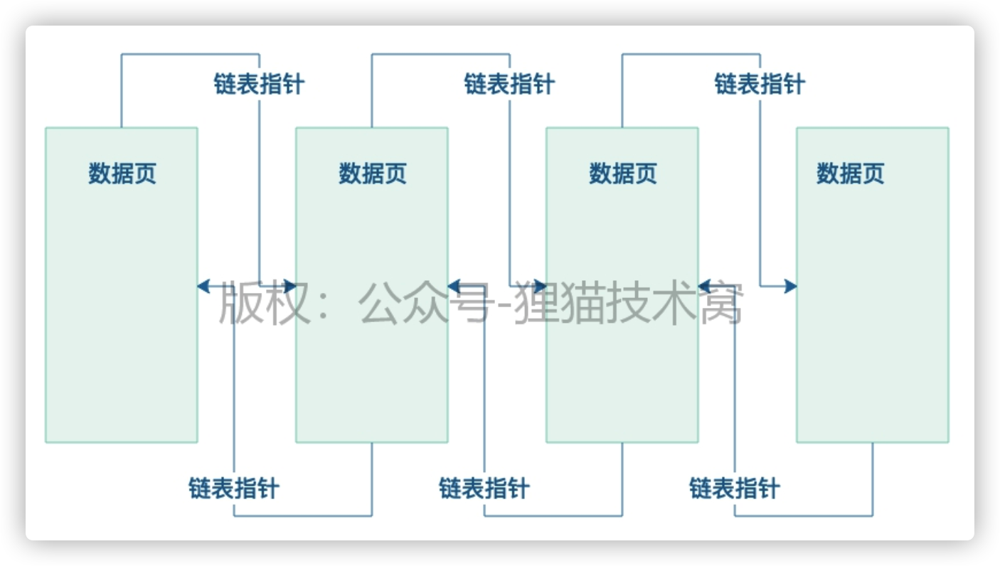

一个数据页在磁盘上存储的样子可以**大致**是这样（当然了，这是解码之后又人为臆想的，并不完全是真实如此的）：

> DataPage: xx=xx, xx=xx, linked_list_pre_pointer=15367, linked_list_next_pointer=34126 || DataPage: xx=xx, xx=xx, linked_list_pre_pointer=23789, linked_list_next_pointer=46589 || DataPage: xx=xx, xx=xx, linked_list_pre_pointer=33198, linked_list_next_pointer=55681

可以看见每个数据页都有两个指针，分别指向上一个数据页在磁盘文件中的起始物理位置和下一个数据页在磁盘文件中的起始物理地址。


然后一个数据页内部会存储一行行的数据，数据页里边的每一行数据都会按照主键的大小进行排序存储，通知每一行数据都有指向下一行数据位置的指针，组成了单项链表。

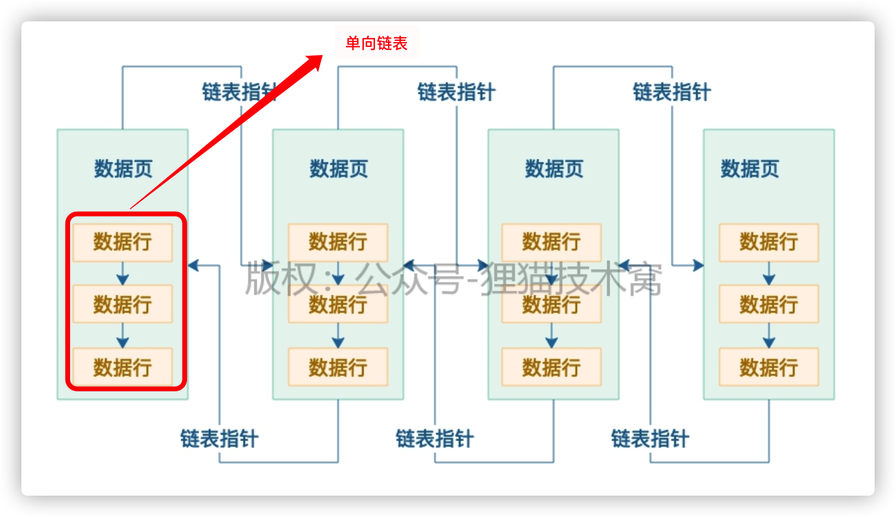


每个数据页都会有一个页目录，页目录中存放的是主键和槽位的映射关系。数据行是被分散的存储到不同的槽位中去的，每个槽位中存放了多条数据，如下图所示：

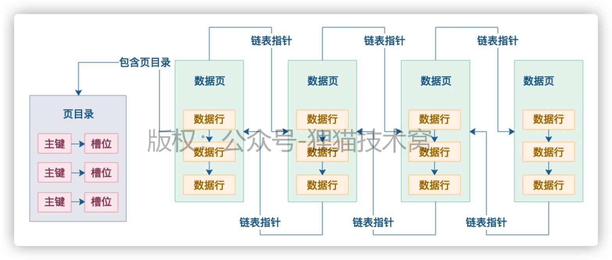


### 无索引的搜索数据搜索

假设，现在要根据主键查找一条数据，而且此时数据库表中也没有几条数据，表中**一共就一个数据页**，那么就会先到页目录中根据主键进行二分查找迅速定位到数据在哪个槽位中，然后再到槽位中遍历每一行数据，很快就能找到该主键对应的数据了。要是非主键的查找，尴尬，只能进到数据页中，根据单向链表遍历查找了。

如果是多个数据页，无论是否根据主键去查，都无法取巧。只能根据页与页之间的链表关系，以及页中的数据行之间的链表关系，如果是主键查询可以用二分查找，非主键就只能遍历了。这个过程，就是臭名昭著的**全表扫描**。就是根据双向链表，一次吧磁盘上的数据页加载到缓存中去，然后在一个缓存页内部来查找那条数据。


### 页分裂

在表中不停的插入数据的时候，会有一个页分裂的过程。数据在不停地插入的过程中，一个数据页是肯定是无法容纳所有的数据的，此时就必须搞出来一个新的数据页来容纳新的数据。但是，MySQL有一个规则，**新数据页中的主键的值必须比旧数据页中的主键值都小**。如果表的主键是自增长的，那这个天然就能满足MySQL的规则；如果不是自增长的就涉及到了**页分裂**。这个所谓的页分裂其实就是在新数据页出现的时候，让数据的主键维持上述规则，具体如何做这里不细究。


### 主键目录

前提：有多个数据页，然后根据主键进行查询。

问题：主键在哪个数据页中？不知道主键在哪个数据页中，那还是要走全局扫描啊。

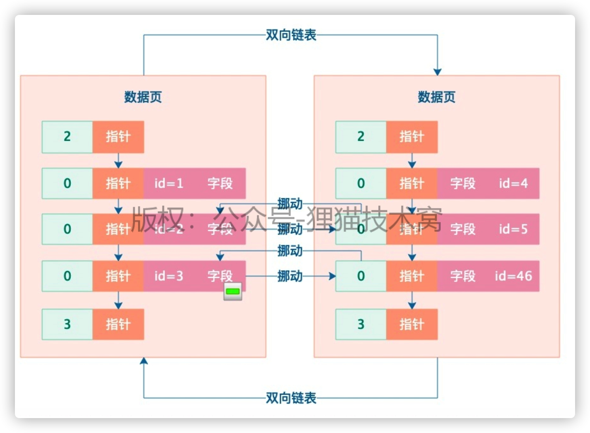

因此，出现了主键目录这个概念：**针对主键设计的目录**。目录中存放的是每个数据页的页号和每个数据页中的最小主键的值的映射关系，如图所示：

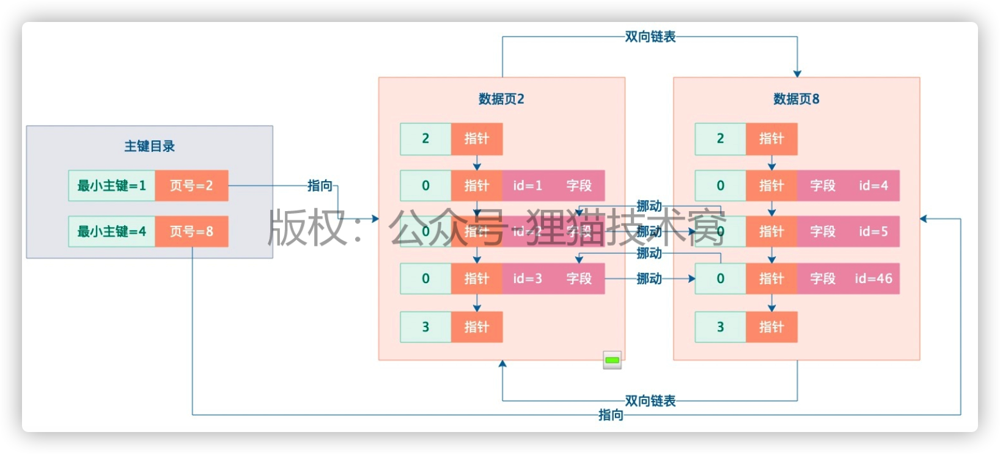

此时，问题得以完美解决，可以用主键索引到主键目录中去进行二分查找，最终就可以得到想要的数据所在的页号了，然后到所在的页中进行二分查找即可。


### 索引的存储结构——B+Tree

当表中数据非常多，几百万、几千万甚至上亿，磁盘上会有大量的数据页，因此主键目录中的数据页号和数据页中的最小主键的映射关系也会非常的多，此时基于主键进行查找的话，效率会明显降低，那么要如何解决这个问题呢？

实际上，索引也是存放在页中的，索引所在的页叫做**索引页**，数据页特别多的时候也会产生很多的索引页，如图所示。

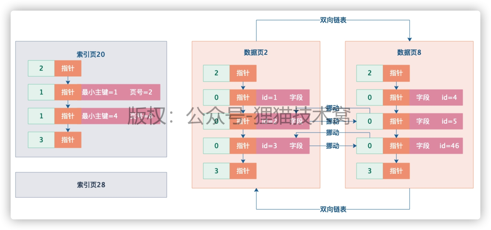

那么此时问题又来了，根据主键查询的时候，**如何能够知道主键所在的索引页呢**？解决方案其实已经有了，刚刚的上一小节已经说过，数据页比较多的时候，我们整出来了一个数据页的索引页来帮助判定数据所在的数据页，那么同理，索引页比较多的时候，我们可以整出来一个索引页的索引页，来帮助判定索引所在的索引页。

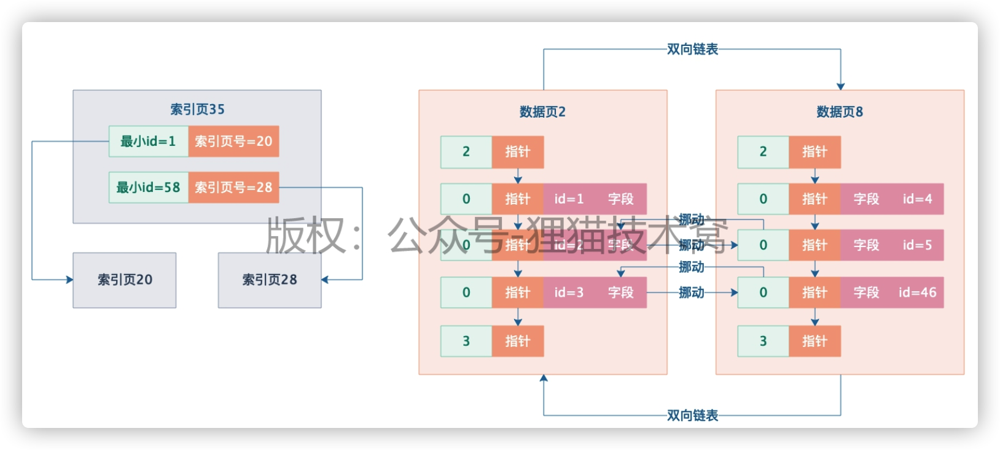

问题又来了，如果索引页的索引页又比较多了怎么办？老办法，再搞出一个索引页的索引页的索引页，一个思想进行到底，如图所示。

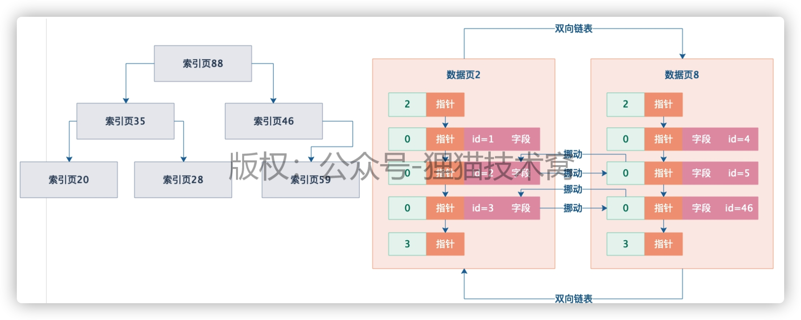

此时，索引的多层级关系已经能够很明显的看出来了，这个层级分明的结构就是我们经常所提及的B+Tree。

当主键索引建立起来之后，其实这个主键索引的结构就是一颗B+Tree，根据主键查询数据的时候，直接从B+Tree的顶层开始二分查找，一层层向下定位，最终定位到了一个数据页中，然后在数据页内部的页目录中进行二分查找就可以很快的找到主键所对应的那条数据。

总结：

* 索引数据存储在于数据页一样的索引页中。
* 一个索引就是很多索引页组成的一颗B+Tree。


### 聚簇索引

如果一颗大的B+Tree索引数据结构里，叶子节点就是数据页自己本身，那么此时既可以称这颗B+Tree为聚簇索引。

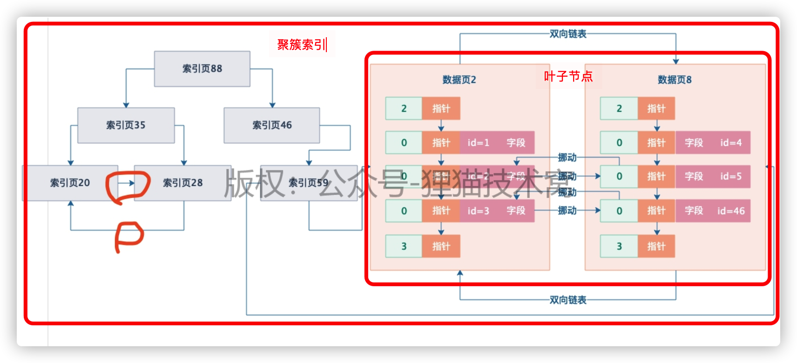

聚簇索引里就包含了数据，数据存放于聚簇索引的叶子节点。聚簇索引是按照主键来组织的。InnoDB会基于主键默认给我们建立聚簇索引。


### 二级索引

假设要根据主键之外的字段——name字段来建立索引，那么InnoDB会再重新建立一颗B+Tree，但是**数据页里仅仅放主键字段和name字段**，其他的跟聚簇索引都一样。之所以存放主键，是为了如果查询语句中还需要查询除了name之外其他字段的时候，可以现在name索引的这颗B+Tree上先查询，查询到数据之后，再用主键再到聚簇索引中进行**回表**查询其他需要的字段。

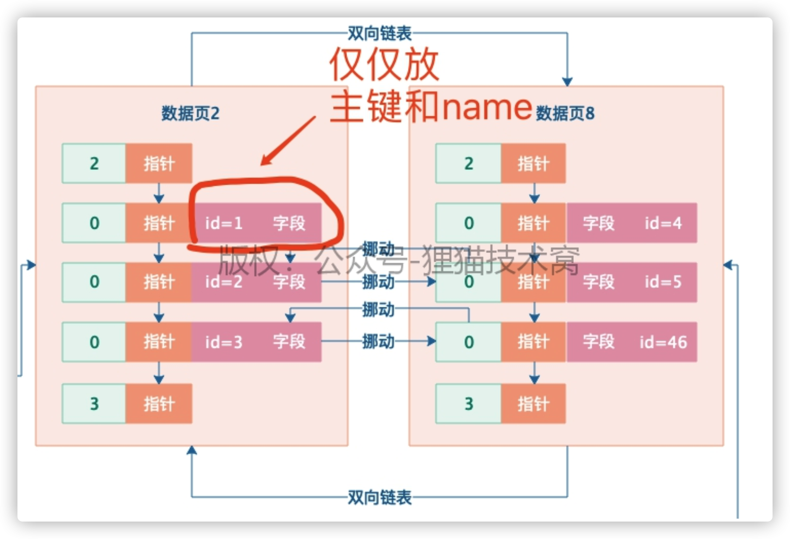

也可以把多个字段联合起来建立**联合索引**，比如 name + age。此时联合索引的运行原理也是一样的，只不过是建立一颗独立的B+Tree，然后叶子节点中存放的是id + name + age，默认按照name排序，name一样就按照age排序。


### 联合索引的使用规则

假设有一张表，用来存储学生成绩，主键id是自增的，默认会根据他建立聚簇索引，这个不用多说。然后，包含了：

* 学生班级
* 学生姓名
* 科目名称
* 成绩

四个字段。

此时，我们给可以针对学生班级、学生姓名、科目名称建立一个联合索引。索引组成的B+Tree如下图：

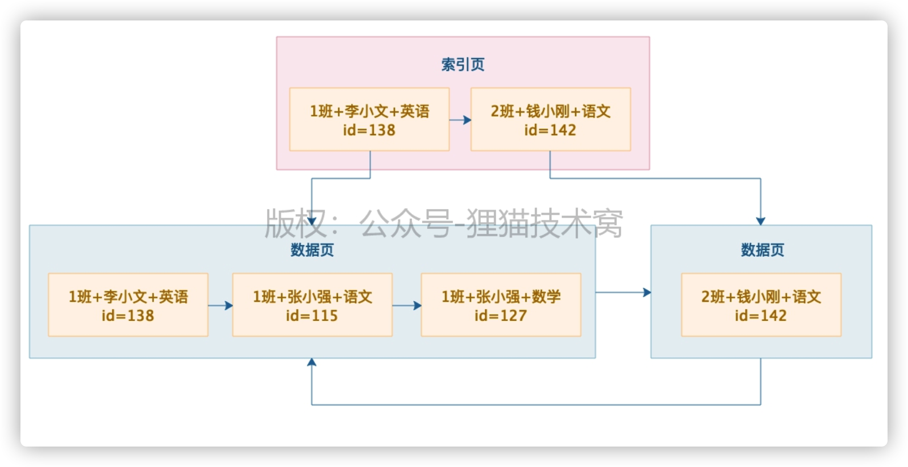

接下来，根据这个场景，来简单介绍下联合索引的几个使用规则，也就说，如果满足了这些规则，那么我们的SQL就是能够使用联合索引进行查询的，反之则不能。

#### 等值匹配规则

如果我们写了这样一个SQL：

```sql
select * from student_score where class_name='1班' and student_name='张小强' and subject_name='数学'
```

可以看到，where条件里的几个字段有几个值得注意的点：

* 都是基于等值来查询，都是用的等号
* 字段的名称和顺序跟联合索引一模一样

这个就是**等值匹配规则**。即使字段顺序和联合索引不一样，也没关系，MySQL会自动优化为按联合索引的字段顺序去找。


#### 最左侧列匹配原则

如果我们写了这样一个SQL：

```sql
select * from student_score where class_name = "" and studnt_name = ""
```

这个时候，只要根据联合索引中最左侧的部分字段进行查询就可以，这个SQL是可以用的上联合索引的。


#### 最左前缀匹配原则

如果我们写了这样一个SQL：

```sql
select * from student_score where class_name like '1%'
```

这个sql也是可以用上索引的。

但是如果把SQL写成这样：

```sql
select * from student_score where class_name like '%班'
```

这样就用不上索引了。


#### 范围查找规则

如果where条件中如果有范围查询，那只有对联合索引里最左侧的列进行范围查询才能用到索引。例如有如下SQL：

```sql
select * from student_score where class_name > '1班' and class_name < '5班' and student_name > ''
```

这条语句中，只有class_name是可以基于索引来做查询的，student_name的范围查询是没法用到索引的。


#### 等值匹配 + 范围匹配

假设有如下SQL：

```sql
select * from student_score whre class_name = '1班' and student_name> '' and subject_name < ''
```

根据等值匹配规则，class_name可以用得上索引，先根据class_name = '1班'筛选出来一波数据，筛选出来的数据中的student_name必然都是排好序的，所以student_name> ''也是可以用得上索引的，但是接下来的subject_name < ''是不能用索引的。


#### order by的索引使用规则

最好根据联合索引的顺序写order by语句，例如：

```sql
select * from student_score order by class_name , student_name , subject_name
```


#### group by的索引使用规则

最好根据联合索引的顺序写order by语句，例如：

```sql
select * from student_score group by class_name , student_name , subject_name
```


### 覆盖索引是什么

覆盖索引其实不是一种索引，他就是一种基于索引查询的方式罢了。

他的意思就是，我仅仅需要查询联合索引里的几个字段的值，那么其实就只要扫描联合索引的索引树就可以了，不需要回表去聚簇索引里找其他字段了。

因此，在写SQL的时候：

* 尽量的不要写select * ，避免回表，最好是能走覆盖索引。
* 就算是真的要回表，也尽可能用limit、where这样的语句限定下回表的次数。


### 索引设计

#### 索引设计的步骤

1. 表结构设计完毕后，不要着急设计索引，因为此时根本不知道该怎么查询表
2. 当系统差不多开发完毕了，功能都跑通了，就能完全知道如何对一张表发起一些什么样的SQL语句
3. 针对SQL语句里边的where条件、order by语句以及group by条件去设计索引
4. 可以设计一个或者两三个联合索引，每一个联合索引都尽量去包含where、order by、group by里的字段
5. 审查每个SQL语句，是否都满足最左侧列原则


#### 索引设计的原则

* （比较重要）尽量使用那些基数比较大的字段，就是值比较多的字段，那么才能**发挥出B+Tree快速二分查找的优势**
* 尽量针对那些字段的类型比较小的列来设计索引，比如tinyint之类的，这样会让索引树占用的磁盘空间更小，查询效率更高
* 如果索引字段比较大，比如varchar(255)，可以考虑一下，仅仅针对这个varchar(255)字段的前20个字符建立索引。当然，ordre by 跟 group by是用不上这样的索引的。where可以用上，但是在查询语句中的查询字段中要查询这个索引字段的时候，就需要回表了
* （比较重要）如果给索引字段搞了个函数或者搞了个计算，那么此时是无法使用索引的
* 索引别设计太多，因为插入的数据的值可能不是按照顺序来的，很可能导致索引树里边的某个页会自动分裂，这个分裂的过程很耗费时间，**一般两三个联合索引就应该覆盖掉这个表的全部查询了**
* 建议主键要是自增的，别用UUID之类的，因为主键自增的话，起码聚簇索引不会频繁的分裂，只会自然的新增一个页


#### 实战场景下的索引设计技巧

* 在有些SQL中，where和order by实际上大部分情况下是没法都用到索引的，鱼和熊掌不可兼得。一般这种时候往往都是让where条件去使用索引来快速筛选出来一部分指定的数据接着再进行排序，最后针对排序后的数据拿出来一页数据

* 基数较低的字段**但是频繁查询**的字段也可以放到联合索引的最左侧去

* 经常用于范围查询的字段，一定要放在联合索引的最后

* 针对一些**频繁使用的包含枚举值范围的一些字段，也完全可以加入到联合索引里去**，可以设计成（province, city, sex, hobby, character, age）这样的一个联合索引，此时假设出现了这样一个查询，按照省份、城市、性格和年龄进行搜索，此时SQL怎么写？就是写成：

  ```sql
  where province=xx and city=xx and sex in(xx, xx) and hobby in (xx, xx, xx, xx) and character=xx and age>=xx and age<=xx
  ```

  也就是说，即使你不需要按性别和爱好进行筛选，但是在SQL里你可以对这两个字段用in语句，把他们所有的枚举值都放进去

* 可以针对那些基数很低的字段，在家还是那个排序字段单独额外设计一个**辅助索引**，专门用于解决**where条件中都是基数低的字段，然后还需要排序后分页的问题**

* 尽量利用一两个复杂的多字段联合索引，抗下80%以上的查询，然后用一两个辅助索引抗下神域的20%的非典型查询，保证99%以上的查询都能充分利用索引，这样就能保证系统整体的查询速度和性能


## SQL语句执行计划

#### 查询级别

| 级别        | 解释                                                         |
| ----------- | ------------------------------------------------------------ |
| const       | 性能排名第一；主键索引或者二级索引是unique key唯一索引进行的查询 |
| ref         | 性能排名第二；二级索引是包含多个列的普通索引；查询语句需要满足最左侧列原则，然后必须都是等值比较 |
| ref_or_null | ref的一个特例；针对一个二级索引，比较了值还限定了IS NULL     |
| range       | 性能排名第三；查询语句中有范围查询                           |
| index       | 性能排名第四；举例：假设表的联合索引是（x1,x2,x3），现在写一个SQL语句：select x1,x2,x3 from table where x2 = xxx，查询的字段刚好是联合索引中的字段，此时MySQL会直接遍历二级索引的叶结点，然后找到x2=xxx的那些数据，然后把x1,x2,x3的值提出来就ok了 |
| all         | 性能最差；尽最大可能避免这种查询级别的发生                   |


### 多表关联

假设有如下SQL：

```sql
select * from t1,t2 where t1.x1=xxx and t1.x2 = t2.x2 and t2.x3 = xxx	
```

MySQL会先根据t1.x1=xxx这个条件筛选，去t1表里去查出来一批数据，假设筛选出来了10条数据。然后用被筛选出来的这10条数据的x2的字段的值，依次到t2表中去匹配数据，匹配完后关联起来即可。

记住：**先从一个表中查一波数据，这个表叫做“驱动表”（可能就是我们平时总说的主表），再根据这波数据区另外一个表里查一波数据，然后进行关联，另外这个表就叫做“被驱动表”。**

上述的多表关联的SQL的执行原理有一个名词可以对其进行描述：**嵌套循环关联**。嵌套循环关联在索引没有设计好的时候，会产生一些性能问题：

* 首先，从驱动表中筛选第一波数据的时候，如果没有用上索引，会走全表扫描
* 其次，从驱动表中筛选出来第一波数据之后（假设筛选出了100条），会循环这些数据，然后到被驱动表中去查，此时如果驱动表又没加索引，又得在被驱动表中走个100次全表扫描
* 再其次，如果需要关联更多的表，对性能的影响就更是雪上加霜


