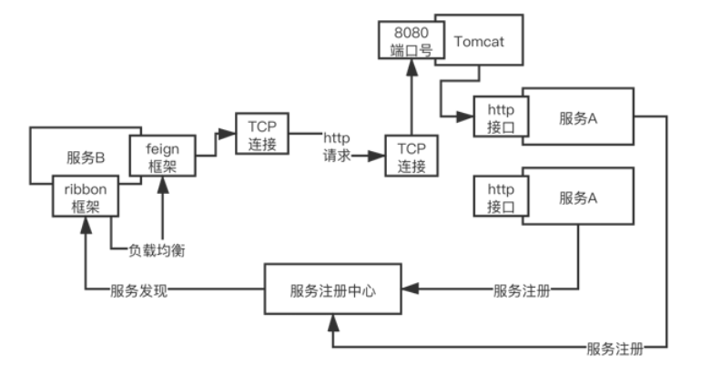
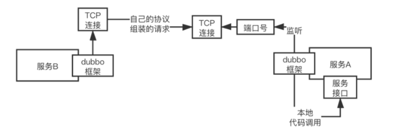
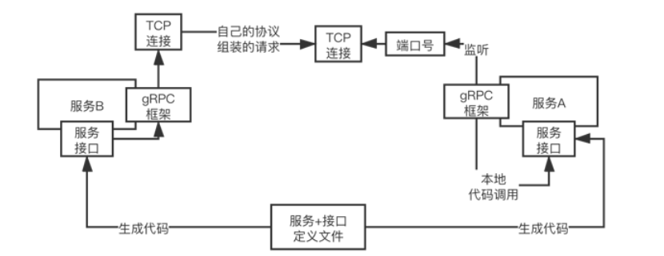

## Feign + ribbon、Dubbo、gRPC选型

### Feign + Ribbon

Ribbon做**负载均衡**。

暴露出来的实际上就是基于Spring MVC的Controller那种http接口。

轻量级，适用一般的场景，可能80%的情况都能应付。

性能一般般，能应付大多数的情况。

#### 服务调用原理图

### Dubbo

Dubbo不是基于Http协议的，而是自己自定义的一套协议。

重量级，把RPC整个的过程进行了重新定制，提供了更多的功能。

性能更好。

#### 服务调用原理图

### gRPC

更重了，但是也更好了，能够跨语言。

预计不会成为主流的RPC框架。

#### 服务调用原理图

