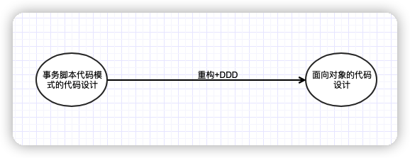

## DDD

### DDD是什么

DDD 是一种处理高度复杂领域的**设计思想**，它试图分离技术实现的复杂性，并**围绕业务概念构建领域模型**来控制业务的复杂性，以解决软件难以理解，难以演进的问题。

**DDD 不是架构，而是一种架构设计方法论**，它通过边界划分将复杂业务领域简单化，帮我们设计出清晰的领域和应用边界，可以很容易地实现架构演进。

### DDD能够做什么

* 领域建模
* 微服务架构拆分
* 微服务架构分层

### DDD的实现步骤

按照实现领域驱动设计一书中描述的DDD步骤主要有4步：

1. 根据业务需求划分出初步的领域和限界上下文，以及上下文之间的关系；
2. 进一步分析每个上下文内部，识别出哪些是实体，哪些是值对象；对实体、值对象进行关联和聚合，划分出聚合的范畴和聚合根；
3. 为聚合根设计仓储，并思考实体或值对象的创建方式；
4. 在工程中实践领域模型，并在实践中检验模型的合理性，倒推模型中不足的地方并重构。

DDD 核心思想是**通过领域驱动设计方法定义领域模型，从而确定业务和应用边界，保证业务模型与代码模型的一致性**。

### 相关资料

埃里克埃文斯——《领域驱动设计》

Martin Fowler——微服务架构

## DDD的实践

### 阿里大佬讲DDD——DP

> Domain Primitive 是一个在特定领域里，拥有精准定义的、可自我验证的、拥有行为的 Value Object 。
>
> - DP是一个传统意义上的Value Object，拥有Immutable的特性
> - DP是一个完整的概念整体，拥有精准定义
> - DP使用业务域中的原生语言
> - DP可以是业务域的最小组成部分、也可以构建复杂组合

使用DP的3个原则：

* 将隐性的概念显性化
* 将 隐性的上下文显性化
* 封装多对象行为

### 阿里大佬讲DDD——应用架构

一个好的架构要实现以下几个目标：

* 独立于框架
* 独立于底层数据源
* 独立于UI
* 独立于外部依赖
* 可测试

> 目前所开发的所有系统都是按照**事物脚本的模式**进行开发的。

代码的：

* 可维护性：当依赖变化时，有多少代码需要随之改变
* 可扩展性： 做新需求或改逻辑时，需要新增/修改多少代码
* 可测试性：运行每个测试用例所花费的时间 \* 每个需求所需要增加的测试用例数量

在事务脚本模式下，以上三点的性能都很差。

事务脚本至少违反了以下的软件设计原则：

* 单一性原则
* 依赖翻转原则
* 开放封闭原则

### 美团的实践

再一次，提到高内聚、低耦合。

敏捷实践中的重构、测试驱动设计及持续集成可以对付各种混乱问题。

* 重构

  保持行为不变的代码改善清除了不协调的局部设计

* 测试驱动设计

  确保对系统的更改不会导致系统丢失或破坏现有功能

* 持续集成

  为团队提供了同一代码库。

在解决现实问题时，我们会将问题映射到脑海中的概念模型，在模型中解决问题，再将解决方案转换为实际的代码。

