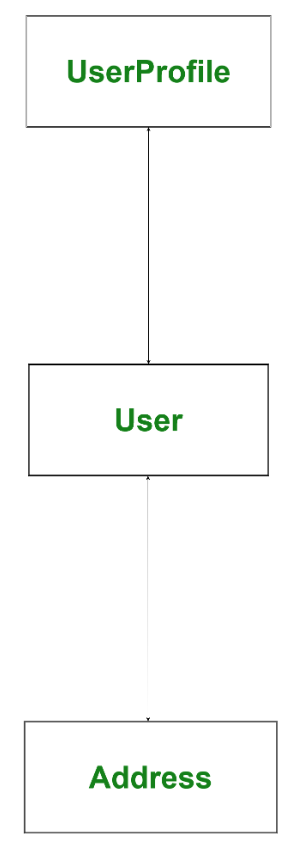
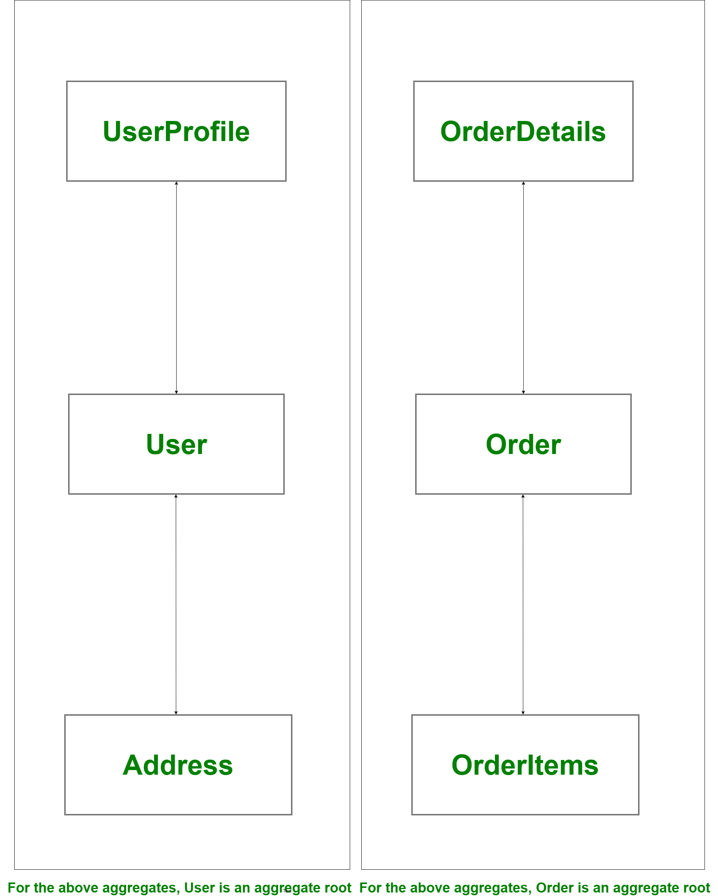

# Domain-Driven Design (DDD)

Domain-Driven Design is a concept introduced by a programmer **Eric Evans** in 2004 in his book **Domain-Driven Design: Tackling Complexity in Heart of Software**.

It is an approach for architecting software design by looking at software in top-down approach. Before discussing topic in detail let’s try to focus some light and understand what is mean by domain in this context.

**What is Domain ?**
The word Domain used in context of software development refers to **business**. In the process of application development, term domain logic or business logic is commonly used. Basically, `business logic is area of knowledge around which application logic revolves`（业务逻辑是应用程序逻辑所围绕的知识领域）. The business logic of an application is a set of rules and guidelines that explain how business object should interact with each other to process modeled data.

**Note –**
A domain in software engineering field is business on which application is intended to build.

**Domain-Driven Design :**
Suppose we have designed software using all latest tech stack and infrastructure and our software design architecture is fabulous（极好的）, but when we release this software in market, it is `ultimately`（最终） end user who decides whether our system is great or not. Also if system does not solve business need is of no use to anyone; No matter how pretty it looks or how well architecture its infrastructure. According to **Eric Evans**, When we are developing software our focus should not be primarily on technology, rather it should be primarily on business（当我们开发软件的时候，我们的注意力不应该主要放在技术上，而是业务上）. Remember,

> It is not the customer’s job to know what they want” – Steve Jobs
>
> （客户的工作不是知道他们想要什么）

Domain-driven design talks about two kinds of design tools, first one is **`Strategic`（战略性） design tools** and another one is **`Tactical`（战术性的） design tools**. The programmers or developers usually deal with tactical design tools but if we have knowledge and a good understanding of strategic design tools then it will help us in architecting good software.

The `majority`（大多数的） of frameworks under Spring data family is built considering Domain-Driven design approach.

**Strategic Design :**
The strategic design tools help us to solve all problems that are related to software modeling. It is a design approach that is similar to Object-oriented design where we are forced to think `in terms of(依据、根据)` objects. Herewith strategic design we are forced to think in terms of a context.

**Context :**
We can consider this an English word that refers to circumstances of an event, incident, statement, or idea, and in terms of which it’s meaning could be determined.
Apart from Context, Strategic design also talks about Model, Ubiquitous Language, and Bounded Context. These are common terms used in strategic Design of Domain-Driven Design. Let’s understand each one by one.

- **Model –**
  It acts as a core logic and describes selected aspects of domain. it is used to solve problems related to that business.
- **Ubiquitous Language –**
  A common language used by all team members to connect all activities of team around domain model. Consider it like using common verbs and nouns for classes, methods, services, and objects while talking with domain experts and team members.
- **Bounded Context –**
  It refers to boundary conditions of context. It is a description of a boundary and acts as a threshold(阈值) within which, a particular domain model is defined and applicable.

**Tactical Design :**
Tactical design talks about implementation details i.e., modeling domain. It generally takes care of components inside a bounded context. We might have heard or used stuff like services, entities, repositories, and factories. They have all `coined（创造、铸造）` and made popular by Domain-Driven design. The tactical design process `occurs（发生在）` during product development phase.

Let’s discuss some of important tactical design tools. These tools are high-level concepts that can be used to create and modify domain models.

1. **Entity –**
   A programmer who has worked on Object-oriented principles might be aware of concepts called class and objects. Here an entity is a class that has some properties. The instance of these classes has a global identity and keeps same identity `throughout(自始至终)` `lifespan（声明周期）`. Remember there can be a change in state of property but identity never changes. In short, an entity implements some business logic and could be uniquely identified using an ID. In context of programming, it generally persisted as a row in DB and it consists of value objects.

2. Value Objects –

   These are `immutable（不可变的）`, light-weight objects that don’t have any identity. Value objects reduce complexity by performing complex calculations, isolating heavy computational logic from entities.

   

   In the above image *User* is an entity and *Address* is a value object, address can change many times but identity of User never changes. Whenever an Address gets change then a new Address will be instantiated and assigned to User.

3. **Services –**
   A service is a stateless class that fits somewhere else other than an entity or value object. In short, a service is a functionality（泛函性、函数型） that exists somewhere between entities and values objects but it is neither related to an entity nor values objects.

4. `Aggregates（聚集）` –

   When we have bigger project, object graph becomes big, The bigger object graph harder it is to `maintain（维护）` it. An aggregate is a collection of entities and values which come under a single transaction boundary. Aggregates basically, control change and have a root entity called aggregate roots. The root entity` governs `（治理）lifetime of other entities in aggregates.

   

   In the above example if root entity *User* or *Order* gets deleted other entities associated with the root entity will be of no use and this associated information will also be deleted. That means an aggregate is always `consistent（一致的、始终如一的）` `in nature（在本质上）` and this done with help of domain events. Domain events are generated to ensure `eventual（最终的）`consistency.
   In the above example if address of User has been changed then it has to be reflected in Order as well. To do so we can **fire a domain event from User to Order** so that Order updates address so that we have eventual consistency and Order will be eventually consistent.

   Other examples of aggregates and aggregate root could be comments on a post, Question and answer details, Banking transaction details, etc. The ORM tool like **hibernate** uses aggregates a lot while creating one to many or many to one relationship.

5. **Factories and Repositories –**
   Factories and Repositories are used to handle aggregate. Factories help in managing beginning of lifecycle of aggregates whereas Repositories help in managing middle and end of lifecycle of an aggregate. Factories help in creating aggregates whereas Repositories help in persisting aggregates. **We should always create a repository per aggregate root but not for all entities**.

Factories are design patterns from GoF, Factories are useful, but not `mandatory（强制性的）` in context of rule of aggregate.

**Advantages of Domain-Driven Design :**

- It improves our `craft（工艺）`.
- It provides flexibility
- It prefers domains over interface
- It reduces communication gap between teams through Ubiquitous Language

**Disadvantages of Domain-Driven Design :**

- It requires a professional who has strong domain `expertise（专业技能）`
- It encourages team to follow `iterative（迭代的）` practices