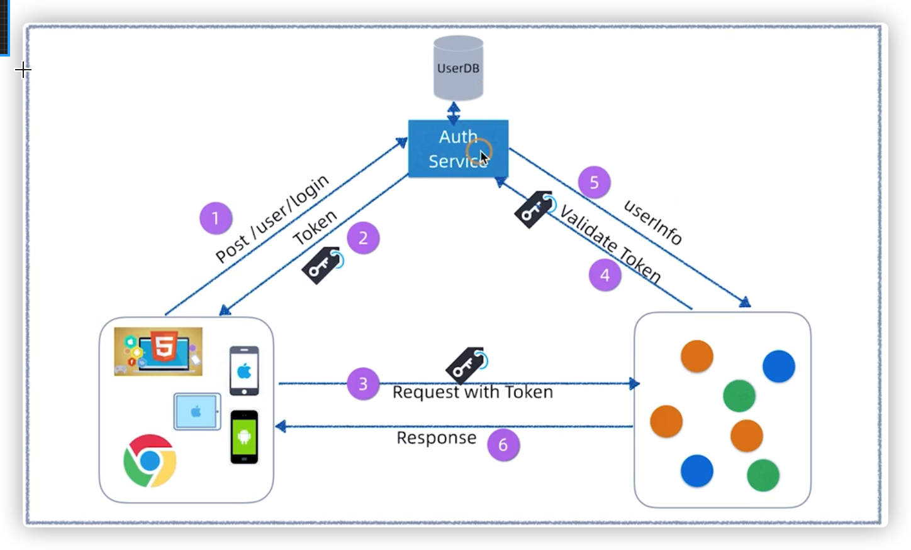
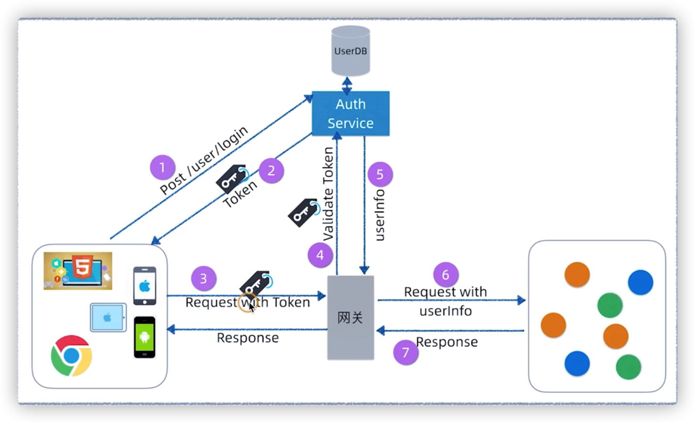

# 微服务安全框架设计

安全框架的设计通常主要考虑两方面的因素：

* 用户认证(authentication)
* 用户鉴权(authentication)


## 用户认证的设计



1. 客户端到AuthService上进行登录
2. AuthService颁发令牌（Token）
3. 客户端携带Token去访问各个服务
4. 请求到任意一个服务后，该服务回到AuthService上进行Token的有效性验证
5. 验证通过后，AuthService会返回用户信息
6. 服务将请求结果返回

该架构的问题是：每个服务都要实现去AuthService进行Token验证的功能。目前，象屿项目中采用的就是这种架构设计。

解决方案：把去AuthService进行Token验证的代码移植到网关当中去，如下图：




把Token种在浏览器的根域Cookie下边，因为浏览器在访问相同域或子域的时候会自动携带cookie，即可实现单点登录。

当然也可以放在LocalStorage中，每次发请求的时候自己决定要把Token放在哪里。


### 基于JWT的架构

该架构的问题是：Auth Service很可能成为系统的一个瓶颈，因为所有的请求都要到这里进行Token的验证，水平扩展Auth Service这也带来了一定的成本问题。

解决方案：AuthService中颁发的Token变成了JWT，JWT自包含了一些验证信息，网关层面即可进行JWT的验证，去除了网关到AuthService的Token验证。


### JWT（JSON WEB TOKEN）的原理

#### JWT的组成


* 头部：header
* 载荷：payload
* 签证：siganature

##### header

header由两部分组成：

* 声明类型，如'JWT'
* 声明加密算法，如' HMAC SHA256'

```
{
  'typ': 'JWT',
  'alg': 'HS256'
}
```

对头部进行base64加密，构成了第一部分。


##### payload

payload由三种类型的claim组成：

- Registered claims 预定义的声明
- Public claims 公开声明
- Private claims 私有声明


##### signature

Signature 部分是对前两部分的签名，用来防止数据篡改。

服务端指定密钥（secret），使用Header指定的签名算法，用转码后的JWT串产生签名：

> HMACSHA256(base64UrlEncode(header) + "." +base64UrlEncode(payload), secret)


#### JWT的局限性


可以看出来，header和payload都只是简单的用base64做了一个简单的编码，任何人拿到了JWT令牌之后都能对header和payload进行解码去查看里边的内容，因此，不要在里边放入用户的隐私信息。

JWT这种接口鉴权方式，不能防止其他人通过某种手段获取到了真实用户的JWT令牌从而进行**冒充**的行为，任何人都能用这个token去访问后端的接口。但是JWT能够保证该令牌绝对没有被**篡改**，服务端在接收到JWT令牌后，利用secret（由服务端妥善保管，如果泄漏，天王老子来了也救不了）对header和payload进行加密，然后与signature进行对比，如果不一致，则说明此token被篡改了。

综上所述，**ok**。


### JWT的流程

#### HMAC流程


#### RSA流程


## 用户角色鉴权的设计

