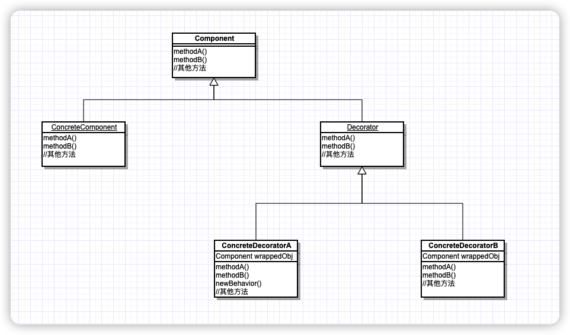

> 动态地将责任附加到对象上。想要扩展功能，装饰者提供有别于继承的另一种选择。装饰者提供了比继承更有弹性的替代方案。


## 类图




## 示例代码

```java
//Component
public abstract class Beverage{
	String description = "Unknown Beverage";
	
	public String getDescription() {
		return description;
	}
  
  public abstract doble cost();
}

//Decorator
public abstract class CondimentDecorator extends Beverage{
  //我认为这是一个“装饰方法”，用于给Beverage扩展新行为（功能）
  public abstract String getDescription();
}


//ConcreteComponent（普通饮料）
public class Espresso extends Beverage{
  public Espresso{
    	description = "Espresso";
  }
  
  public double cost(){
    return 1.99;
  }
}

//ConcreteComponent（首选咖啡）
public HouseBlend extends Beverage{
  public HouseBlend(){
    description = "house Blend Coffee";
  }
  
  public double cost(){
    return .89;
  }
}

//ConcreteDecorator
public class Mocha extends CondimentDecorator{
  Beverage beverage;
  
  public Mocha(Beverage beverage){
    this.beverage = beverage;
  }
  
  public String getDescription(){
    return beverage.getDescription + ",Mocha";
  }
  
  public double cost(){
    return .20 + beverage.cost();
  }
}
```


## 客户端代码

```java

public class StarbuzzCoffee{
  public static void main(String args[]){
    Beverage beverage = new Espresso();
    Beverage beverage2 = new Mocha(beverage);
    
    System.out.println(beverage2.getDescription()) + " $" + beverage2.cost());
  }
}

```


## 满足的OO原则

代码应该对扩展开发，对修改关闭

我们的目标是允许类容易扩展，在不修改现有代码的情况下，就可搭配新的行为。如能实现这样的目标，有什么好处呢？这样的设计具有弹性，可以应对改变，可以接受新的功能来应对改变的需求。

遵循开发-关闭原则，通常会引入新的抽象层次，增加代码的复杂度。**需要把注意力集中在设计中最有可能改变的地方，然后应用开放-关闭原则。**

每个地方都采用开放-关闭原则是一种浪费，也没必要，还会导致代码变得复杂且难以理解。


## Tip

* 尽管继承威力强大，但是他并不是总能够实现最有弹性和最好维护的设计。
* 利用组合和委托可以再运行时具有继承行为的效果。
  * 利用继承设计子类的行为，实在编译时静态决定的，而所有子类都会集成到相同的行为。
  * 如果能够利用组合的做法扩展对象的行为，就可以在运行时动态地进行扩展。
  * 通过动态的组合对象，可以写新的代码添加新的功能，而无需修改现有代码。既然没有改变现有代码，那么引进bug或产生意外副作用的机会将大幅度减少。
* 装饰者，通常是用其他类似于工厂或者生成器这样的模式创建的。
* 除了继承，装饰者模式也可以让我们扩展行为。
* 装饰者会导致设计中出现许多小对象，如果过度使用，会让程序变得很复杂。

