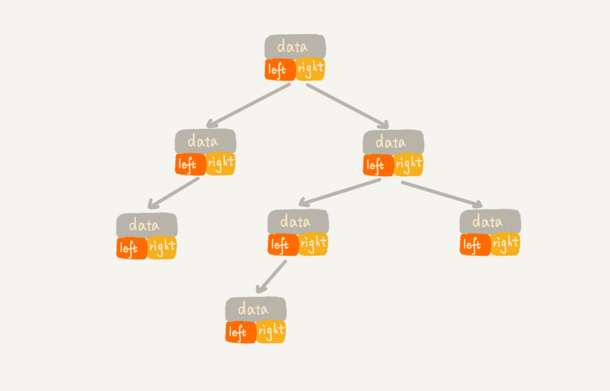

## 二叉树基础

结点分类：

* 父节点
* 子节点
* 根节点
* 叶节点

三个概念：

* 高度
* 深度
* 层


### 二叉树

每个结点**最多**有两个叉。

* 满二叉树
* 完全二叉树

完全二叉树包括了满二叉树。

要理解完全二叉树的由来，需要知道如何存储二叉树。


### 二叉树的存储

* 基于指针或者引用的二叉链式存储法
* 基于数组的顺序存储法

#### 1.链式存储




#### 2.顺序存储

**完全二叉树的顺序存储**


**非完全二叉树的顺序存储**


如果结点X存储在数组中下标为i的位置，下标为**2\*i**的位置存储的就是左子节点 ，下标为**2\*i+1**的位置就是右子节点。根节点存储在下标为1的位置上，就可以推出整个树的结点的存储位置。

可得，**完全二叉树的顺序存储（用数组存储）是最节省空间的一种方式**。非完全二叉树会浪费比较多的数组空间。


### 二叉树的遍历

* 前序遍历
* 中序遍历
* 后序遍历

```c
void preOrder(Node* root) {
  if (root == null) return;
  print root // 此处为伪代码，表示打印 root 节点
  preOrder(root->left);
  preOrder(root->right);
}

void inOrder(Node* root) {
  if (root == null) return;
  inOrder(root->left);
  print root // 此处为伪代码，表示打印 root 节点
  inOrder(root->right);
}

void postOrder(Node* root) {
  if (root == null) return;
  postOrder(root->left);
  postOrder(root->right);
  print root // 此处为伪代码，表示打印 root 节点
}

```


回答开始的两个问题：

二叉树分为顺序存储和链式存储两种方式。

完全二叉树使用数组来存储最节省内存空间，故**完全二叉树最适合用数组来存储**。


### 特殊的二叉树-二叉查找树

* 散列表是否可以完全替换二叉树？
* 哪些事情是散列表做不了却必须使用二叉树去做的？

二叉查找树支持动态数据集合的**快速插入、删除、查找**操作。这些都依赖于**二叉查找树的特殊结构**。

二叉查找树要求，**在树中的任意一个节点，其左子树中的每个节点的值，都要小于这个节点的值，而右子树节点的值都大于这个节点的值。**

> 不得不惊叹一下，二叉查找树的结构真的是非常的巧妙，依赖于他的这种特殊结构，在其上进行各种操作效率都要比线性结构更高，但是其结构的确也是比线性结构要复杂得多。

对二叉查找树进行**中序遍历**可以**顺序打印**出其中存储的元素。

#### 二叉查找树复杂度分析


 

当二叉查找树的根节点左右子树极度不平衡的时候，就会退化成链表，查找的时间复杂度就变成了O(n)。

而当他是一个完全二叉树的时候，插入、删除、查找操作的时间复杂度为O(logn)。

为了避免二叉查找树的时间复杂度退化，针对二叉查找树又设计了一种更加复杂的树，**平衡二叉查找树**，时间复杂度可以做到稳定的O(logn)。


###平衡二叉树-红黑树

红黑树是一种特殊的二叉查找树，二叉查找树这种动态数据结构在动态的添加和删除元素的过程当中其时间复杂度有可能会退化，极端情况下会退化成链表，所以他的查找操作的时间复杂度就变成了O(n)，显然这种查找性能是不能够被接受的。

为了避免二叉查找树这种极端情况发生，就需要对其进行平衡从而得到一棵**平衡二叉树**，红黑树就是对二叉查找树平衡后的结果。红黑树本身不是严格意义上的**平衡二叉树**，平衡二叉树的严格定义是这样的：

> 二叉树中任意一个节点的左右子树的高度相差不能大于 1。从这个定义来看，上一节我们讲的完全二叉树、满二叉树其实都是平衡二叉树，但是非完全二叉树也有可能是平衡二叉树。

但是很多平衡二叉查找树其实并没有严格符合上面的定义（树中任意一个节点的左右子树的高度相差不能大于 1），比如红黑树，它从根节点到各个叶子节点的最长路径，**有可能会比最短路径大一倍**。

定义是死的，人是活的，工程当中很多时候要采取折中策略。虽然红黑树没有完全按照定义来实现，但是却降低了维护定义当中那种数据结构的难度，并且也没有对性能产生不可接受的影响，所以红黑树仍然可以被称为是一种平衡二叉树。


## 堆

#### 堆定义

堆是一种特殊的树，他满足两点：

* 堆是一个**完全二叉树**
* 堆中每一个结点的值都必须大于等于（或小于等于）其子树中每个结点的值。

#### 堆分类

* 小顶堆
* 大顶堆


第四个不是堆，1，2是大顶堆，3是小顶堆。

#### 堆实现

* 堆支持哪些操作？
* 如何存储一个堆？

由于堆是一个完全二叉树，所以最好用数组来存储它。


堆一般支持的操作有：

1. 往堆中插入一个元素
2. 删除堆顶元素

向堆中插入元素需要保持前边提到的堆的两个特性，把这个过程称为**堆化**。


