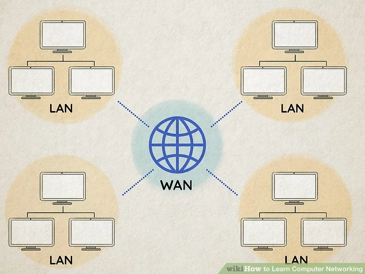
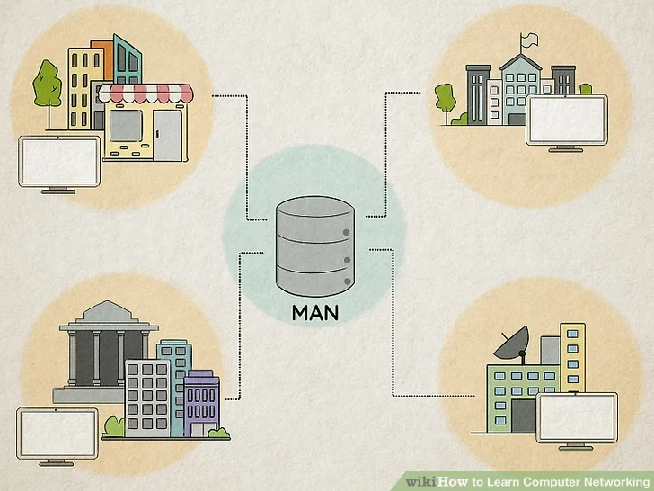
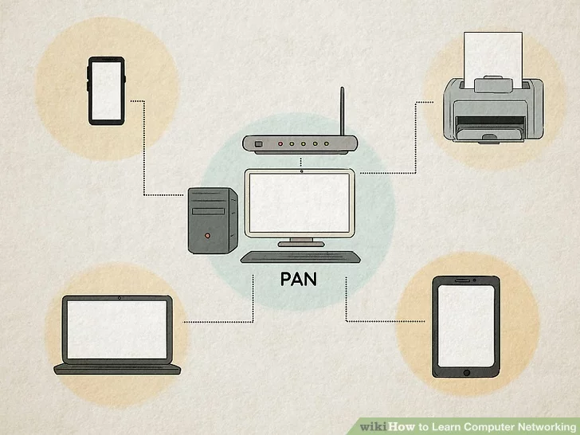
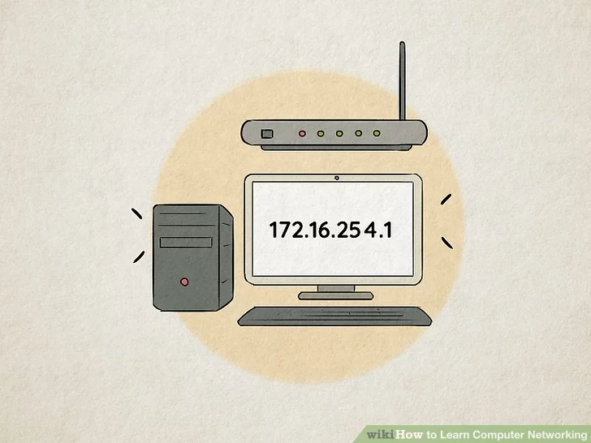
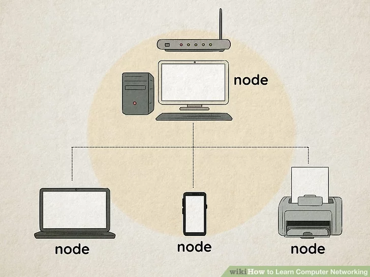
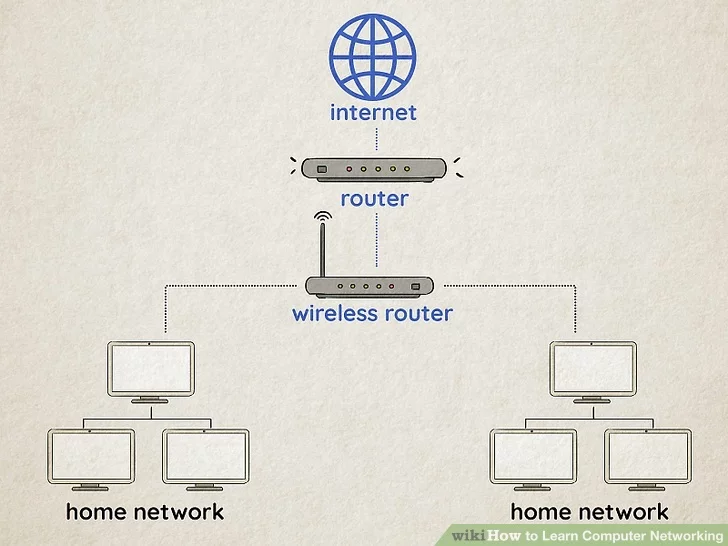
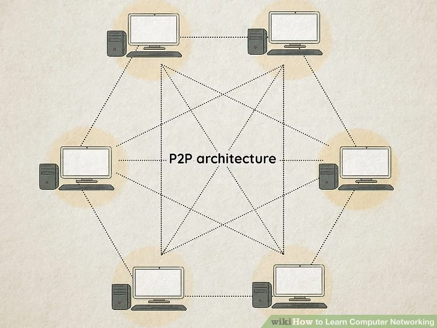

## Types of computer network

### LAN

**LAN (local area network):** a LAN connects computers over shorter distances or smaller areas, such as a school or office building. A LAN tends to be less expensive because it is built from cheaper hardware like ethernet cables, and also provides higher security and speed. They are normally privately owned.[[4\]](https://www.wikihow.com/Learn-Computer-Networking#_note-4)

- A WLAN is the wireless version of a LAN.
- Many computer networks are defined by geographical range.

### WAN

**WAN (wide area network):** a WAN connects computers over wider distances, like from state to state or continent to continent⁠. In fact, **the internet is the largest WAN** and connects billions of computers worldwide! Another example of WAN usage is when a main office connects with branches around the country. A WAN tends to be more expensive, requires more security measures, and is collectively owned.[[5\]](https://www.wikihow.com/Learn-Computer-Networking#_note-5)

- Most WANs are made of interconnected LANs.[[6\]](https://www.wikihow.com/Learn-Computer-Networking#_note-6)
- WANs are often used in business or corporate contexts.

### MAN

**MAN (metropolitan area network):** a MAN connects computers within a metropolitan area like a city. They are usually bigger than LANs but smaller than WANs. Since they are smaller than WANs, they tend to be faster. Cities and governments typically manage MANs⁠—for instance, to monitor traffic and handle accidents.[[7\]](https://www.wikihow.com/Learn-Computer-Networking#_note-7)

- MANs are also made of interconnected LANs.

### PAN

**PAN (personal area network):** a PAN is used to serve just one individual, like yourself; for example, if your smartphone, tablet, and laptop all connect and share data between each other⁠— like when you sync photos across all three⁠—then they make up a PAN. PAN networks usually use Bluetooth because it provides convenient, short-range communication.[[8\]](https://www.wikihow.com/Learn-Computer-Networking#_note-8)

- PANs can be either wired (e.g. through USB) or wireless (e.g. Bluetooth).
- A WPAN is the name for a wireless version of a PAN.

### IP Address

**IP address (Internet Protocol address):** an IP address is a unique number that each device connected to a network has. An IP address works to identify what the host network is and where that specific device is located on the host network, which helps facilitate communication between devices so that information gets to the correct place.[[9\]](https://www.wikihow.com/Learn-Computer-Networking#_note-9)

- You can think of an IP address as being like a mailing address.

### Node

**Nodes:** a node is a connection point inside the network that receives, sends, creates, and stores data. A node can process and send information to any other node. Nodes also require you to provide identification before receiving access to the information, like an IP address.[[10\]](https://www.wikihow.com/Learn-Computer-Networking#_note-10)

- For example, computers and printers both count as nodes.

### Router

**Router:** a physical or virtual device that sends info between networks in the form of data packets. It helps direct traffic so that information can reach its destination in the best way. Routers should be distinguished from switches, which send information between nodes in a single network.[[11\]](https://www.wikihow.com/Learn-Computer-Networking#_note-11)

- For example, a router would be active when you want to print a document (it would make sure your document gets to the printer and not your speaker).
- A router would also be active when you look up something on Google (it would make sure your search gets to Google’s servers).

### P2P Architecture

**P2P (peer-to-peer) architecture:** in computer networking, architecture means the physical and logical framework of the network. Under the first type, which is called P2P, the two connected computers are "peers" and have equal powers. Because of this, there is no need for a central server, and both of the computers can share resources with each other.[[12\]](https://www.wikihow.com/Learn-Computer-Networking#_note-12)

- P2P networks tend to be less expensive to implement.

### Client Server Architecture

**Client-server architecture:** in a client-server network, one computer is a "client" (the computer that requests or needs to access a service) and the other is a "server" (the computer that provides or responds with the service). Resources aren’t shared, and clients in the network have to communicate with other clients through the server.[[13\]](https://www.wikihow.com/Learn-Computer-Networking#_note-13)

- Client-server networks are also called tiered models.
- Client-server networks tend to be more expensive to implement.

