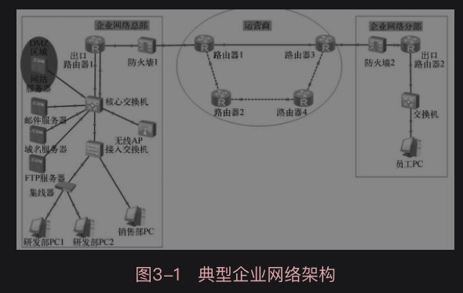
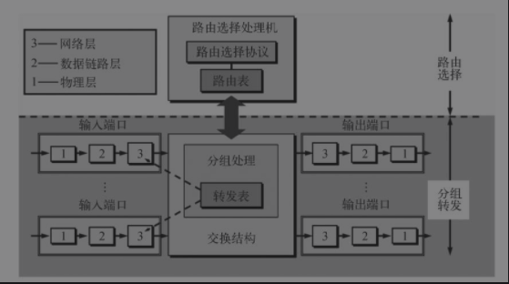

# 典型企业网络架构

## 常见企业网络架构

关键组件

* **接入设备**：在企业网络内部，各部门的员工主机通过网线连接到接入设备
* 核心交换机：核心交换机主要完成部门之间信息交换，以及连接企业各种数据服务器
* **出口路由器**：企业与Internet之间的数据交换则需要通过企业的出口路由器进行
* **防火墙**：在出口路由器与Internet之间通常需要设置防火墙
* **DMZ**：在设置了防火墙之后，企业客户在Internet中是无法直接访问公司网站服务器的，所以在企业网络中要设置专门的隔离区（Demilitarized Zone，DMZ），作为必须公开的小网络区域。

## 传输媒介

传输媒介又称传输介质，它就是数据传输系统中在发送器和接收器之间的物理通路。

传输媒介的传输特性：

* 带宽
* 延迟
* 成本
* 安装
* 维护难易程度

传输媒介分类，按照物理特性分为：

* 导引型（有线传输）

  * 双绞线

    由于双绞线成本较低，性能足够满足一般情况下的需求，所以应用非常广泛

  * 同轴电缆

    由于性能的优势，同轴电缆在有线电视和计算机城域网中得到广泛的应用。但成本较高，所以大部分局域网仍以双绞线为主

  * 光纤

    广泛用于广域网的主干网部分，而在用户本地回路仍以双绞线和同轴电缆等铜线媒介为主

* 非导引型（无线传输）

## 网络设备

网络设备的作用：

* 数据转发
* 流量控制
* 扩展网络规模

### 集线器

集线器主要用来组建星状拓扑网络。

信号在传输过程中会衰减。集线器即起到物理层**比特的整形放大功能**，能扩展网络传输距离。由于集线器只是接收物理层数据位，并对其整形放大，不解析数据帧结构，所以属于**物理层**网络设备。

集线器不能识别数据帧中的MAC地址，无法精确转发数据，只能采用共享传输媒介进行广播传输。所以集线器的**带宽会被所连接的所有主机共享**。

集线器主要有RJ-45接口和级联口两种接口：

* RJ-45接口。集线器的大部分接口属于这种接口，主要用于连接网络中的计算机，从而组建计算机网络
* 级联口。级联口主要用于连接其他集线器或网络设备。

### 交换机

交换机可实现基于存储转发的分组交换。

交换机是目前使用较广泛的网络设备之一，同样用来组建星状拓扑网络。

交换机与集线器对比：

* 交换机采用的交换技术其性能优于集线器。
* 交换机连接组成局域网，每个主机分享的带宽不会受到接入主机数的影响
* 交换机还可以连接集线器进一步扩展网络范围
* 交换机的接口也分为RJ-45接口和级联口，其中RJ-45接口用于连接计算机，级联口用于连接其他交换机或集线器

按交换机的应用场合，交换机可分为：

* 工作组级交换机
* 部门级交换机
* 企业级交换机

三种类型。

### 路由器

典型的路由器的结构如图所示：

路由器设备也可以完成分组转发的功能，路由器工作于网络层，利用网络层地址进行数据转发，路由器的转发分组正是网络层的主要工作。

路由器的结构可以分为两大部分：

* 路由选择部分
* 分组转发部分

#### 路由选择部分

其核心构件是路由选择处理机。其任务是根据路由选择协议构造出路由表，同时经常或定期和相邻路由器交换路由信息而不断更新和维护路由表。

#### 分组转发部分

分组转发部分则是根据路由表查找到达目的网络的合适输出端口，再把分组从该端口发送出去。

### 防火墙

严格控制进出网络边界的分组，禁止任何不必要的通信，从而减少潜在入侵的发生。

防火墙是一种安全隔离技术，在内部网和外部网之间进行数据的隔离和安全验证。通常不是某一个设备，而是实现一套防护策略的一组硬件和软件的组合。相当于一个隔离带，对内部网和外部网之间进出两个方向的数据，根据设置的检查条件逐条验证，只有满足所有条件验证的数据才能通过，任何一个条件不满足都会被拒绝访问而丢弃。因为防火墙对通过每一个数据都要进行检查，所以**处理速度就成为衡量防火墙质量的重要指标**，通常使用吞吐量来表示

### 无线接入点

随着时代进步，移动通信设备越来越普及，这些设备很多时候没有网线接口，只提供无线Wi-Fi接口，所以无法连接到普通交换机、集线器上。为了连接这些移动用户终端，可以使用无线接入点（Access Point，AP）。无线AP可以作为无线局域网的中心点，使得具有无线网卡的终端设备通过它接入该局域网；同时无线AP还可以衔接有线局域网和无线局域网，延伸网络覆盖范围。