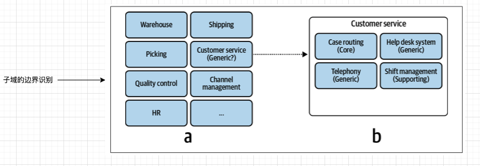

## 业务域

## 子域

> Subdomains are a tool that alleviates the process of making software design decisions.

### 分类

* 核心子域
* 通用子域
* 支撑子域

子域的类型是由公司的战略决定的。

核心子域要能够解决“复杂”的问题。

这个所谓的“复杂”包括了复杂的社会型难题，比如说：

* 路由问题
* 最佳产品推荐问题

等等。

这些问题，都有相应的软件算法作为解决方案，例如：

* 旅行商算法
* 推荐算法

但是，社会问题并不仅仅是复杂的业务问题，还有其他的一些复杂的不能由算法来解决的问题，这些问题也属于核心业务域。

我应该好好思考下自己所在的企业的子域的哪部分工作，只有在核心子域工作才能提升自己的竞争力。

### 识别子域的边界

识别子域，能够帮助做出合理的软件解决方案设计决定，同时也能够帮助**流水线化软件设计过程**。但是，首先要做的是：识别子域的边界。

#### 拆分子域

初始的时候，可能从公司的部门开始，能够识别出最粗粒度的子域。然后，在这种识别的基础之上，继续进一步的向下探索以找到更多的合理的子域。在任何一个粗粒度的子域当中（无论是什么类型）向下探索，都有可能找到更多的其他类型的子域。

But the question is: When should you stop?

The anwser is: *subdomains as a set of coherent use cases*.

在核心子域上进行细致的分解是绝对必要的。

其他两种类型的子域，可以相对的不用那么较真，可以分解到不再能够发现新的类型的子域了，这个时候就可以停止了。

重要：子域是在分析某个组织的业务，这些分析出来的子域当中的某些，可能是与要做的软件系统毫无关系的，要把这些子域排除在我们的视野之外，专注于那些与我们的目标系统相关的子域。

