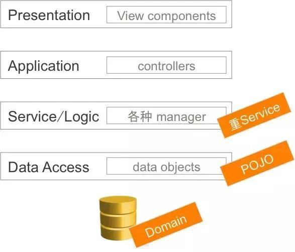
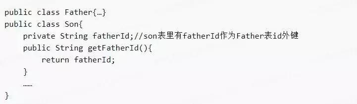
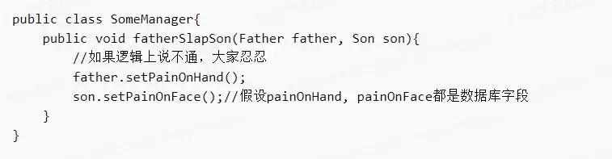
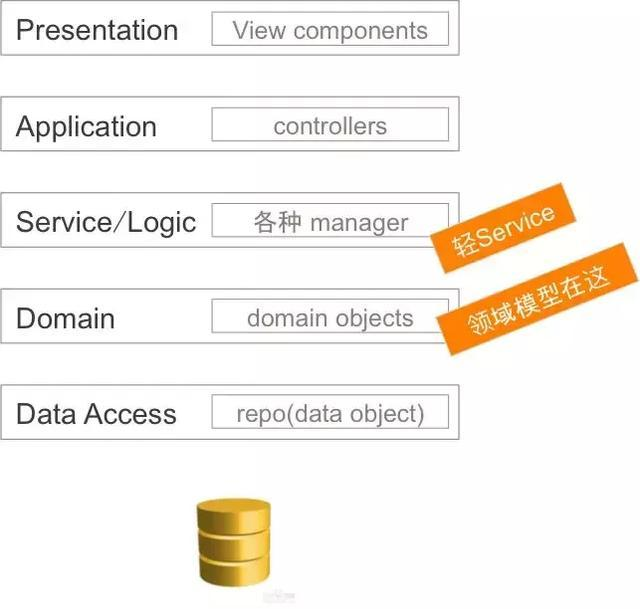
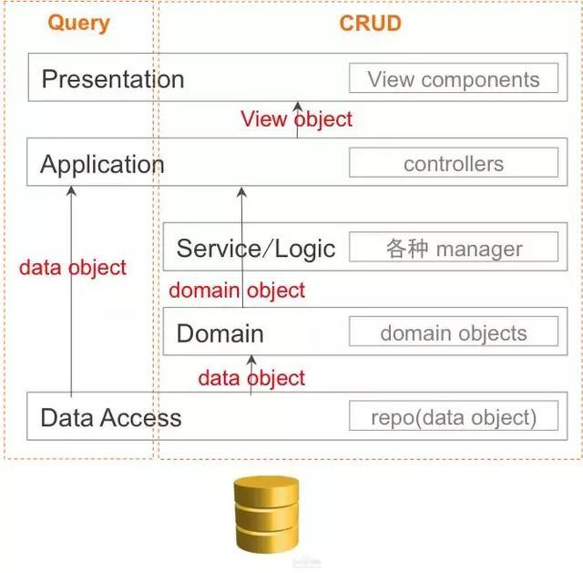
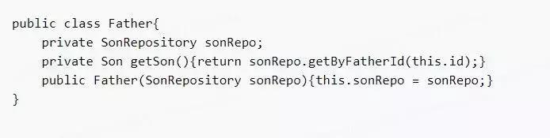
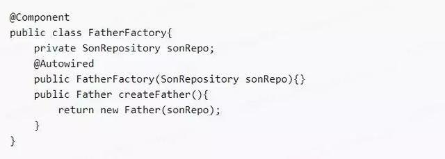
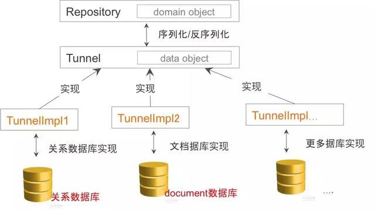
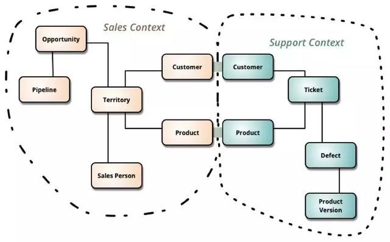
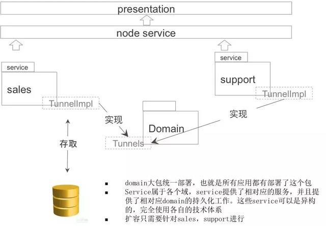

# 领域驱动设计，盒马技术团队这么做

[阿里开发者](https://www.zhihu.com/org/a-li-ji-zhu)

[原文地址](https://zhuanlan.zhihu.com/p/42565478)

关注

165 人赞同了该文章

> 阿里妹导读：好的设计模式、代码架构可以大大降低产品的故障率，提高产品的质量。大家都使用的熟悉的设计模式未必是最好的设计模式，引入新的思想，并借鉴应用到自己的设计中，是正道。
>
> 今天，我们邀请盒马资深技术专家辉子，分享他眼中的领域驱动设计及实践经验。

## 前言

从事技术多年，看了不少代码，写了不少代码，在如何设计一个优秀软件上也跟若干高手们做过各种讨论和pk。在DDD（领域驱动设计）理念上各路高手也是观点各异。

DDD只是一个流派，谈不上压倒性优势，更不是完美无缺。 我更想跟大家分享的是我们是否关注设计本身，不管什么流派的设计，有设计就是好的。

从我看到的代码上来讲，大部分代码都不属于DDD类型，有设计的也不多，更多的像“面条代码”，从端上一条线杀到数据库完成一个操作。设计集中在数据库（有时候数据库设计都没有，一堆字段也不知道是干嘛用的），代码更多是自我修养。我们依靠强大的测试保证了软件的外部质量（向苦逼的测试们致敬），而内部质量在紧张的项目周期中屡屡得不到重视，陷入日复一日的技术负债中。

盒马的业务更面向B端。从供应到配送证链条，整体性很强，关系复杂，不整理清楚，谁也搞不明白发生什么了。所以这里设计很重要，不要给未来的兄弟挖坑。在我负责的模块里，我们完整地应用了DDD的方式去完成整个系统，其中有我们自己的思考和改变，在这里我想给大家分享一下，他山之石可以攻玉。

## 领域模型探讨

**1、领域模型设计：基于对象vs基于数据库**

设计上我们通常从两种维度入手：

a. Data Modeling：通过数据抽象系统关系，也就是数据库设计

b. Object Modeling：通过面向对象方式抽象系统关系，也就是面向对象设计

**大部分架构师都是从data modeling开始设计软件系统，少部分人通过object modeling方式开始设计软件系统。这两种建模方式并不互相冲突，都很重要，但从哪个方向开始设计，对系统最终形态有很大的区别。**

★ Data Model

领域模型（在这里叫数据模型）对所有软件从业者来讲都不是一个陌生的名词，一个软件产品的内在质量好坏可能被领域模型清晰与否所决定，好的领域模型可以让产品结构清楚，修改更方便，演进成本更低。在一个开发团队里，架构师很重要，他决定了软件结构，这个结构决定了软件未来的可读性，可扩展性和可演进性。通常来说架构师设计领域模型，开发人员基于这个领域模型进行开发。“领域模型”是个潮流名词，如果拉回到10几年前，这个模型我们叫“数据字典”，说白了，领域模型就是数据库设计。

架构师们在需求讨论的过程中不停地演进更新这个数据字典，有些设计师会把这些字典写成sql语句，这些语句形成了产品/项目数据库的发育史，就像人类胚胎发育：一个细胞（一个表），多个细胞（多个表），长出尾巴（设计有问题），又把尾巴缩掉（更新设计），最后哇哇落地（上线）。传统项目中，架构师交给开发的一般是一本厚厚的概要设计文档，里面除了密密麻麻的文字就是分好了域的数据库表设计。言下之意：数据库设计是根本，一切开发围绕着这本数据字典展开，形成类似于如下的架构图：

在service层通过我们非常喜欢的manager去manage大部分的逻辑，POJO（稍后章节里的失血模型）作为数据在manager手（上帝之手）里不停地变换和组合，service层在这里是一个巨大的加工工厂（很重的一层），围绕着数据库这份DNA，完成业务逻辑。举个不恰当的例子：假如有父亲和儿子这两个表，生成的POJO应该是：

这时候儿子犯了点什么错，老爸非常不爽的扇了儿子一个耳光，老爸手疼，儿子脸疼。Manager通常这么做：

这里，manager充当了上帝的角色，扇个耳光都得他老人家帮忙。

★ Object Model

2004年，Eric Evans 发表了Domain-Driven Design –Tackling Complexity in the Heart of Software （领域驱动设计），简称Evans DDD，先在这里给大家推荐这本书，书里对领域驱动做了开创性的理论阐述。

在聊到DDD的时候，我经常会做一个假设：**假设你的机器内存无限大，永远不宕机**，在这个前提假设下，我们是不需要持久化数据的，也就是我们可以不需要数据库，那么你将会怎么设计你的软件？**这就是我们说的Persistence Ignorance：持久化无关设计。**

没了数据库，领域模型就要基于程序本身来设计了，热爱设计模式的同学们可以在这里大显身手。在面向过程，面向函数，**面向对象的编程语言中，面向对象无疑是领域建模最佳方式。**类与表有点像（不少人认为表和类就是对应的，行row和对象object就是对应的），我个人强烈地不认同这种等同关系，这种认知直接导致了软件设计变得没有意义。类和表有以下几个显著区别，这些区别对领域建模的表达丰富度有显著的差别，有了封装、继承、多态，我们对领域模型的表达要生动得多，对SOLID原则的遵守也会严谨很多。

- 【引用】关系数据库表表示多对多的关系是第三张表来实现，这个领域模型表示不具象化, 业务同学看不懂。
- 【封装】类可以设计方法，数据并不能完整地表达领域模型，数据表可以知道一个人三维，并不知道“**一个人是可以跑的**”。
- 【继承、多态】类可以多态，数据上无法识别人与猪除了三维数据还有行为的区别，数据表不知道“**一个人跑起来和一头猪跑起来是不一样的**”。

再看看老子生气扇儿子的例子：

根据这个思路，慢慢地，我们在面向对象的世界里设计了栩栩如生的领域模型，service层就是基于这些模型做的业务操作（它变薄了，很多动作交给了domain objects去处理）：**领域模型并不完成业务，每个domain object都是完成属于自己应有的行为（single responsibility），就如同人跑这个动作，person.run是一个与业务无关的行为，但这个时候manger或者service在调用 some person.run的时候可能完成的100米比赛这个业务，也可能是完成跑去送外卖这个业务。**这样的话形成了类似于如下的架构图：

我们回到假设，**假设你的机器内存无限大，永远不宕机**，现在把假设去掉，没有谁的机器是内存无限大，永远不宕机的。去掉这个假设，我们需要数据库，但数据库的职责不再承载领域模型这个沉重的包袱了，数据库回归persistence的本质，完成以下两个事情：

【存】将对象数据持久化到存储介质中

【取】高效地把数据查询返回到内存中

**由于不再承载领域建模这个特性，数据库的设计可以变得天马行空，任何可以加速存储和搜索的手段都可以用上，我们可以用column数据库，可以用document数据库，可以设计非常精巧的中间表去完成大数据的查询。总之数据库设计要做的事情就是尽可能的高效存取，而不是完美表达领域模型**（此言论有点反动，大家看看就好），这样我们再看看架构图：

这里我想跟大家强调的是：

- 领域模型是用于领域操作的，当然也可以用于查询（read），不过这个查询是代价的。在这个前提下，一个aggregate可能内含了若干数据，这些数据除了类似于getById这种方式，不适用多样化查询（query），领域驱动设计也不是为多样化查询设计的。
- 查询是基于数据库的，所有的复杂变态查询其实都应该绕过Domain层，直接与数据库打交道。
- **再精简一下：领域操作->objects, 数据查询->table rows。**

**2. 领域模型：失血、贫血、充血模型**

失血、贫血、充血、胀血模型应该是Martin Fowler提出的,讲述的是基于领域模型的丰满程度下如何定义一个模型，有点像：瘦、中等、健壮、胖。【胀血（胖）模型太胖，在这里我们不做讨论】。

失血模型：**基于数据库的领域设计方式其实就是典型的失血模型**，以java为例，POJO只有简单的基于field的setter，getter方法，POJO之间的关系隐藏在对象的某些ID里，由外面的manager解释，比如son.fatherId，Son并不知道他跟Father有关系，但manager会通过son.fatherId得到一个Father。

贫血模型：【盒马流程中心】儿子不知道自己的父亲是谁是不对的，不能每次都通过中间机构（Manager）验DNA(son.fatherId)来找爸爸，领域模型可以更丰富一点，给son这个类修改一下：

son这个类变得丰富起来了，但还有一个小小的不方便，就是通过father无法获得son（爸爸怎么可以不知道儿子是谁），这样我们再给Father添加这个属性：

现在看着两个类就丰满多了，这也就是我们要说的贫血模型，在这个模型下家庭还算完美，父子相认。然而仔细研究这两个类我们会发现一点问题：通常一个object是通过一个repository（数据库查询），或者factory（内存新建）得到的：

这个方法可以将一个son object从数据库里取出来，为了构建完整的son对象，sonRepo里需要一个fatherRepo来构建一个father去赋值son.father。而fatherRepo在构建一个完整father的时候又需要sonRepo去构建一个son来赋值father.son。这形成了一个无向有环圈，这个循环调用问题是可以解决的，但为了解决这个问题，领域模型会变得有些恶心和将就。有向无环才是我们的设计目标，为了防止这个循环调用，我们是否可以在father和son这两个类里省略掉一个引用？修改一下Father这个类：

这样在构造Father的时候就不会再构造一个Son了，但代价是我们在Father这个类里引入了一个SonRepository, 也就是我们在一个domain对象里引用了一个持久化操作，这就是我们说的**充血模型**。

充血模型：【盒马基础资料中心】充血模型的存在让domain object失去了血统的纯正性，他不再是一个纯的内存对象，这个对象里埋藏了一个对数据库的操作，这对测试是不友好的，我们不应该在做快速单元测试的时候连接数据库，这个问题我们稍后来讲。为保证模型的完整性，充血模型在有些情况下是必然存在的，比如在一个盒马门店里可以售卖好几千个商品，每个商品有好几百个属性。如果我在构建一个店的时候把所有商品都拿出来，这个效率就太差了：

**3. 领域模型下的依赖注入**

简单地对依赖注入说一说：

- 依赖注入在runtime是一个singleton对象，只有在spring扫描范围内的对象（@Component）才能通过annotation（@Autowired）用上依赖注入，通过new出来的对象是无法通过annotation得到注入的。
- 个人推荐构造器依赖注入，这种情况下测试友好，对象构造完整性好，显式地告诉你必须mock/stub哪个对象。

说完依赖注入我们再看刚才的充血模型

新建一个Father的时候需要赋值一个SonRepository，这显然在写代码的时候是非常让人恼火的事情，那么我们是否希望可以通过依赖注入的方式把SonRepository注入进去呢？Father在这里不可能是一个singleton对象，它可能在两个场景下被new出来：新建、查询，从Father的构造过程，SonRepository是无法注入的。这时工厂模式就显示出其意义了（很多人认为工厂模式就是一摆设）

由于FatheFactory是系统生成的singleton对象，SonRepository自然可以注入到Factory里，newFather方法隐藏了这个注入的sonRepo，这样new一个Father对象就变干净了。

**4. 领域模型：测试友好**

失血模型和贫血模型是天然测试友好的（其实失血模型也没啥好测试的），因为他们都是纯内存对象。但实际应用中充血模型是存在的，要不就是把domain对象拆散，变得稍微不那么优雅（当然可以，贫血和充血的战争从来就没有断过）。那么在充血模型下，对象里带上了persisitence特性，这就对数据库有了依赖，mock/stub掉这些依赖是高效单元化测试的基本要求，我们再看Father这个例子：

把SonRepository放到构造函数的意义就是为了测试的友好性，通过mock/stub这个Repository，单元测试就可以顺利完成。

**5. 领域模型：盒马模式下repository的实现方式**

按照object domain的思路，领域模型存在于内存对象里，这些对象最终都要落到数据库，由于摆脱了领域模型的束缚，数据库设计是灵活多变的。在盒马，domain object是怎么进入到数据库的呢？

在盒马，我们独特的设计了Tunnel这个接口，通过这个接口我们可以实现对domain对象在不同类型数据库的存取。Repository并没有直接进行持久化工作，而是将domain对象转换成POJO交给Tunnel去做持久化工作，Tunnel具体实现可以在任何包实现，这样，部署上，domain领域模型（domain objects+repositories）和持久化(Tunnels)完全的分开，domain包成为了单纯的内存对象集。

**6. 领域模型下的部署架构**

盒马业务具有很强的整体性：从供应商采购，到商品快递到用户手上，对象之间关系是比较明确的，原则上可以采用一个大而全的领域模型，也可以运用boundedContext方式拆分子域，并在交接处处理好数据传送，这里引用Martin Fowler的一幅图：

我个人倾向于大domain的做法，我倾向（所以实际情况不是这样的）的部署结构是：

**说在结束的话**

盒马在架构设计上还在做更多的探索，在2B+互联网的崭新业务模式下，有很多可以深入探讨的细节。DDD在盒马已经迈出了坚实的第一步，并且在业务扩展性上，系统稳定性上经受了实战的考验。基于互联网分布式的工作流引擎（Noble），完全互联网的图形绘制引擎（Ivy）都在精心打磨中，期待在未来，盒马工程师们给大家奉献更多的设计作品。