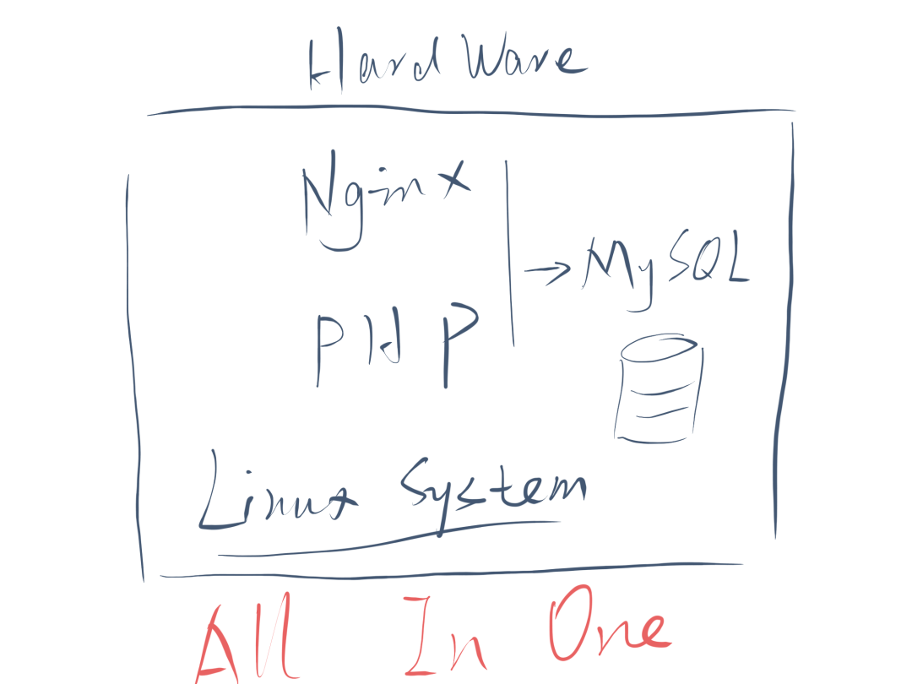
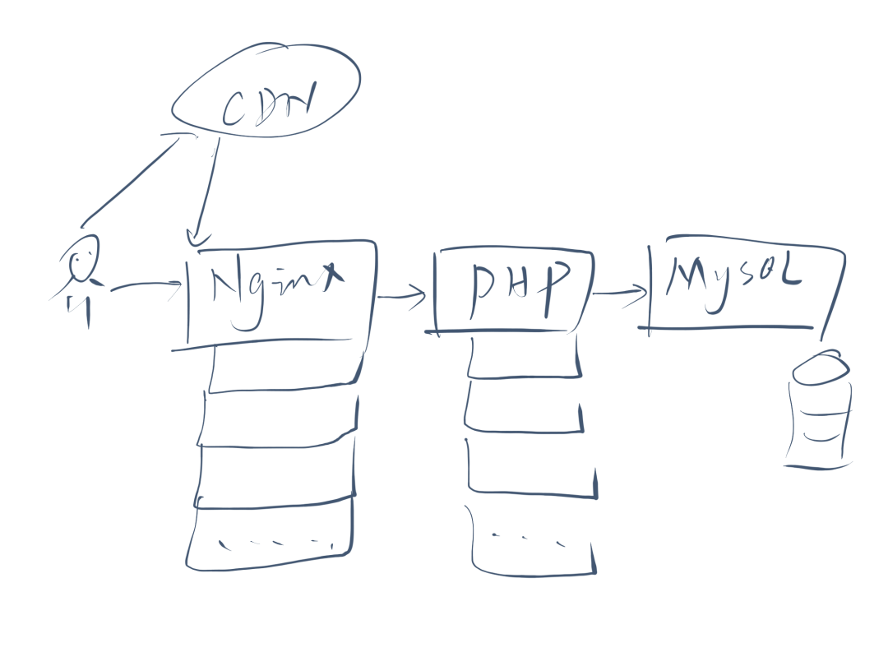
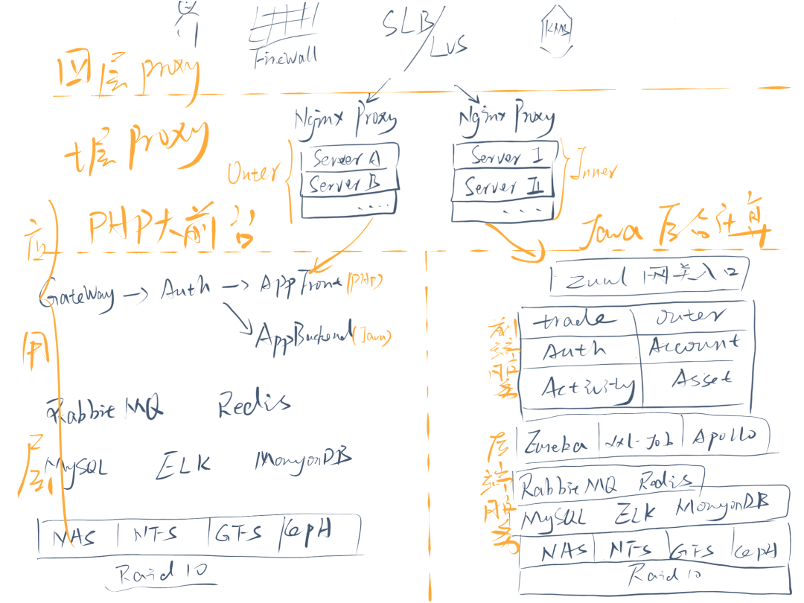

# K8S怎么就和微服务成死对头了？

- 一、互联网架构的演变过程
  - 1.1、 垂直扩展
  - 1.2、 分拆架构
  - 1.3、 横向扩展
  - 1.4、 架构优化
  - 1.5、 业务拆分
- 二、K8S要解决的问题
- 三、微服务要解决的问题
- 四、k8s和Spring冲突的功能

# **K8S怎么就和微服务成死对头了？**

> 运维就要无所不知，无所不会

大家好，我是史丹利。今天和大家聊一聊`K8S`和微服务的生存之战，或者说未来这片战场到底会不会有。

我先抛2个问题：

1. `liveness`**检测谁来做**：`spring`全家桶是微服务的标配。其中 `Eureka` 监管所有服务的生命周期。用了`k8s`后，通常会使用`svc`即可。`SVC`和 `Eureka` 谁能笑到最后。
2. **成本管理上涨: 自从微服务火了之后「其实吧，这个概念早就有了，从人类第一个登月工程开始《人月神话》就已经有的，`Linux`内核的实现思想也是微内核」。所有的高层应用，不说微服务，感觉都不是做IT的。那你遇到过**一个简单的服务拆成几十个微服务的吗**？容器化后的成本，算谁的？

好了，这么简单的问题描述，想必很多朋友压根没看懂。

没关系，文章较长，要有耐心。我一点点把问题抽出来。基础好的大佬，直接跳到最后即可。

## **一、互联网架构的演变过程**

互联网的架构发现一直在演变，一直到今天都未停止。但这不是我们本次要讨论的重点，我尽可能简单的带过，节省篇幅。

互联网行业有一个明显的特性是**爆发性成长**。在很长一段时间里，投资人对互联网行业的印象都是先有流量再谈盈利。即使是亏损状态，只要流量和模式在，也会巨额投入。像现在大家耳熟能详的携程、饿了么、小黄车、摩拜、小红书、滴滴、新蛋等等，几乎所有叫的上名字的公司，都离不开这样的模式。

这同步带来一个问题，就是如此巨大的流量+中国爆炸的人工红利+全球计算机硬件的普及，如何支撑业务正常运营成为全球互联网公司的难题。

随着互联网技术的不断成熟，互联网技术也在不断迭代成长。我们姑且认为互联网是从1990年进入中国的。到现在也有30年的时间了。互联网架构大致有如下几个阶段的演变

- 垂直扩展
- 分拆架构
- 横向扩展
- 业务拆分
- 架构优化

下面我们来逐一介绍。

### **1.1、 垂直扩展**

业务上线前，公司通常都是老板和合伙人自己出钱，穷的不行。一切都是成本和速度优先。这个阶段有没有运维都是两码事。

通常在初创阶段，所有的应用都是 `AllInOne`，即所有的服务都运行在一台[服务器](https://cloud.tencent.com/product/cvm?from=10680)上。架构也是最简单，当时最流量最轻量的 LNMP 架构。

Lamp架构

随后业务逐步有起色，流量变大。**垂直扩展是容易便捷的解决问题方式**。从4c8g 提升到  32c64g 能在一段时间内解决问题。

### **1.2、 分拆架构**

但一夫难挡万人勇，服务器的网络、性能、存储、运算能力总归会见顶。一台服务器不可能再支撑流量的时候，这时**最快捷**的办法就是分拆硬件架构。

把[数据库](https://cloud.tencent.com/solution/database?from=10680)和存储分拆出去，再把运算模块分拆出去，再把流量模块分拆出去。

初步分拆架构图

总归一个字：拆。就对了。

### **1.3、 横向扩展**

各种拆完，如果还是抗不住，说明公司规模已经不错了，离盈利不远或者已经有盈利了。这时就要考虑一些**高可用技术**，稍微有点挑战的技术了。

- `LVS`的`10w`并发起步的流量负载均衡,；
- `MySQL` 的分库分表, 主从分离，MMM 高并发架构;
- 数据的冷热分离;

较复杂的架构

这个阶段，还是纯技术的升级迭代，对抗这个阶段的压力还可行。但就实际来讲，早应该在软件架构层面做优化了，比如业务功能分拆、优化缓存策略、前后台分离

### **1.4、 架构优化**

再往下就是架构优化了，这个层面已经不仅仅是运维能力能造就的成果。需要引入外部财力、开发架构改造等资源。

- 加缓存

早期为了省钱`CDN`没买的，要搞了。`session` 不仅后台技术要做缓存，前端也要做。`CTO`甚至要亲自下手狠抓代码质量，弥补前期追进度丢质量的坑。「我们就深有体会，而且一抓就抓了3年多，最后还是走在了放弃的路上，计划全新重构。。。」

[Redis](https://cloud.tencent.com/product/crs?from=10680),RabbiqMQ等异步架构，在非及时场景，都尽可能合入。

- 分拆模块

原来随便调用，随便穿洞引用的调用关系，要全新梳理，定规范，定制度。收缩入口和出口。

按热度、流量、功能特性，做模块拆分。其实，就是打造中台的过程。只是阿里把这个口号喊的太大，把大家带偏了。有能力没能力都想搞个中台。。

- 业务分层

原来混在一起的模型做分层，代理层、缓存层、网关层、业务层、数据层、存储层

### **1.5、 业务拆分**

如果4个打法还不能支持业务，恭喜你骑在了一头独角兽身上。公司上市指日可待。

这个阶段已经不仅仅是技术层面能解决的问题了。很大可能已经进行了部门重组，业务拆分。以电商狗东为例：

原来PC端和手机端很可能是一个团队做的，现在拆分成2个部门。

原来购买、下单、秒杀、搜索、售后可能都是一个团队做的，现在要拆分成4个团队，专门的市场拉新、智能运营、大数据杀熟团队、智能搜索，下面还要再细化。

然后，把前面的步骤再来一遍就好了。

好了，终于啰嗦完了。希望说的还明白。

总结下来就是一句话：**运维要有快速平行扩展业务迅猛扩张的流量压力的能力**。

大家请先记住这句话。

## **二、K8S要解决的问题**

其实，一直在`k8s`出现之前，上面啰嗦了这么长的一段内容都是由运维完成。也俗称**运维架构能力**。但自从`k8s`出现之后，运维只要掌握了 `k8s` ，就**掌握了绝大部分的运维架构能力。**

说白了，就像 `git` 的出现一样，**技术世界再次演绎了一次，通过技术手段降维打击技术门槛的好戏。**

- 快速迁移环境的能力

原来仅仅快速迁移环境的能力，就是运维头大不能自已。测试开发环境不统一，测试环境永远不够用，跨平台部署环境难上加难。

现在只是`Dockerfile` 和`k8s yaml` 的编写能力。指数级降维打压

- 高可用架构能力

原来，运维需要掌握F5,A10 等高端硬防设备。掌握`nginx` 7层代理，`lvs`四层代理， 4种转发10种算法，面试各种被问原理。看尽面试官的装完逼回头给自己同事讲，其实刚问的那些问题我也不会。。。。

现在全然不用，因为面试官`k8s` 自己也是一知半解！吹完 `k8s` 就可以回家等通知，拿高薪了。因为`k8s` 他敢说 `yes`。

- 分布式数据存储能力

原来运维还要懂 `ceph， gfs, hdfs, swift`, 等一大坨牛逼的分布式存储，搞不搞还要被问原理。

“**问尼大爷啊，老子就是搞运维的，世界难题就是存储了，我要懂了早就去拯救世界了。混毛的运维**”，不知道有多少朋友有这样的想法。

现在全然不用，对不起，`k8s` yml 全然搞定。运维专注业务即可。

- 网关架构分层能力

`k8s`把所有的出入口收缩到 `svc` 和 `ingress`，从技术手段逼迫架构优异。再也不用，和开发乱打洞，乱路由对抗了。大家从此就是酒桌上的好朋友，不用再是工作中的死对头。

- CICD 流程建设能力

`k8s`生态提供了成熟的CICD的工具。因为使用容器镜像，所以CICD变的更加容易且规范。运维重心也将从原来的环境构建变为镜像传输和维护。

- 数据收集监控能力

`k8s`生态提供的插件，会将所有的原生数据全部收集起来，数据收集不再是难题。数据汇总和汇报，才有更大的价值。

- 权限管理能力

`k8s`收缩了服务器的登录权限，使用 conf 认证文件，即可在所有网络互通的服务器上登录，并管理`k8s`集群。生产环境更安全。

最重要的`k8s`收缩了系统管理的权限，因为所有人不需要再管理系统。只需管理`k8s`。`k8s`自己就是系统。

- 资源配额管理能力

资源配额太简单了。原来需要系统，代码各种配置。现在只需要修改容器参数。最后体现在修改 yaml 即可

- 流量管控能力

`k8s`相对云原生和serverless有一点差距。但完全不影响普通大多数公司的功能需求。非常便利。

其余的看图自己体悟。

k8sarch

------

我是可爱的分隔线。扯淡这么久，为什么感觉和题目没毛线关系。

是的，因为我不铺掂好`k8s`的作用， 他和微服务的冲突会很难讲清楚。

## **三、微服务要解决的问题**

微服务要解决哪些问题呢？扯开了讲，又是一大篇。我们只能精简了说。

如果说`k8s`拯救了运维，那微服务拯救了开发。主要是`java`开发。相对于`python`, `golang`, `php` 等个性化很强的语言，所谓的模块化开发，主要靠前期业务模块分工，每个人预估模块的工作量，领取工作项。但最后都得合在一起，**做为整体应用，统一对外提供唯一服务，最多算是半个微服务**。

`java`则比较幸福，业内当前主要流行的是 `spring cloud`全家桶。从接口规范、服务管理、健康检测、全链接监控、配置管理。提供了**一整套解决方案**，真的是爽翻天了。

摘自网图的spingcloud的架构图

但是！！！

**一整套解决方案**

这几个字是不是有点眼熟。。。

是的。老朋友都知道，我们前面已经啰嗦的不能再啰嗦了。`k8s`也提供了**一整套完整的解决方案**。

这就有点尴尬了，不巧的是，k8s的理念和springcloud的理念并不完全相同，也不是一家公司的。

我们就我们现在遇到的问题为例，给大家举例说明。

## **四、k8s和Spring冲突的功能**

这里不得不画图了，大家知道，画图特别费时间。。。

svc相对是无状态的

`Eureka`注册的`ip`地址不能是`pod`地址，大家知道的。但`svc`后面可以跟很多`pod`,所以注册到`Eureka`也是假的。。

所以 ，我说明白了吗？

这个问题要怎么解呢？

当下 `k8s` 也只是和 `Eureka` 的功能上的重叠，只是思想不一致。在 `AllIn` 容器化的大前提下， `Eureka`的方式可能会被废弃。改用 `k8s`的全套方案。

其它

- 冲突的功能还有  xxljob。`k8s` 提供了类似 `cronjob` 的定时任务功能
- `apollo` 使用 `configmap`代替
- 甚至于连 `zuul` 网关也可以去掉。主要看顶层的设计和深入度了。

好了，今天聊到这里。不管你懂了没有，史丹利已经累趴~  ^ ^