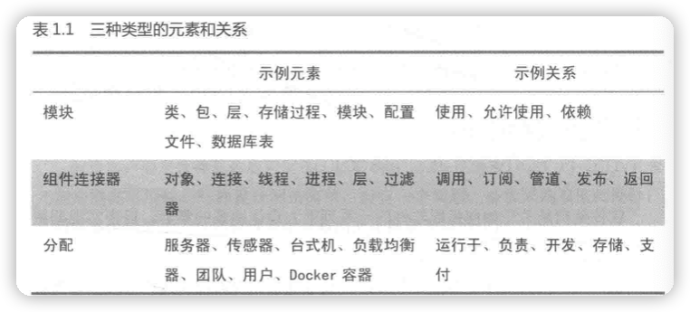

## 职业生涯

从2015年作为一个iOS软件开发工程师入行以来，工作的核心始终是围绕着“开发”这两个字进行，到目前为止，差不多七个年头了。

2022年7月，我获得了一份软件架构师的职位。这意味着我**正式**触及软件架构这个知识领域，并在真正的工作当中用软件架构的相关知识去为企业效力；同时也意味着，不出意外，在未来的几年内，工作的核心将会从“开发”转换为“架构”。

从“开发者”的角色转换为“架构师”，可能这需要一个缓慢的过程，在这个转变的过程当中，一定会遇到很多的挫折和挑战，也一定会有失败和折磨，但是经过过去这7年当中的磨练，我相信自己一定有能力出色的完成这个过程。

在整个这个过程当中，我会在个人的职业生涯学习记录当中记录一些琐碎的片段，同时也会把一些我认为比较重要的东西放在博客当中来分享。

博客之于我来说，更像是一个相册的作用，他记录了我职业生涯当中每个关键时点的快照，他的作用不在于分享内容，而在于记录职业生涯和展示自己。

很多年后，当我回顾我的整过职业生涯，我希望这是一段充满了挑战的记忆。对于很多人来说，成功并非人生常事，失败才是他们的主旋律，但是在每一次的失败当中吸取足够的教训，为下一次的成功做准备这才是一个渴望成功的人、不服输的人的最应该做的事情。曼巴永不言败。

无论是《肖申克的救赎》还是《阿甘正传》，都在告诉我们一个道理：专注、持之以恒是一个人最重要的品格。然而，罗翔老师也告诉我们：世界上最远的距离是知道与做到之间的距离。阳明先生告诉我们要知行合一，要致良知。把答案交给时间吧，所有的一切最终都会落幕。

## 成为软件架构师

### 软件架构师要做什么？

1. 从工程角度定义问题

   架构师除了关注产品的功能特性，更关注产品的**质量属性**。除了质量属性，架构师还要密切关注那些影响架构设计方向的约束和特性。

2. 分解系统，分配职责

3. 关注大局

   从全局角度考虑整体系统意味着架构师需要处理的不仅仅是技术问题。人员、过程、业务需求以及其他技术和非技术因素都将影响最后的软件系统。

4. 在质量属性之间做取舍

   放弃一些东西换取其他东西，这在软件开发中很常见。

5. 管理技术债务

   知道系统是如何分解的，关注大局，知道划分出来的各个模块协调工作，还要将业务需求与技术决策放在一起考虑，架构师才能游刃有余地管理技术债务。

6. 提升团队的架构技能

7. 。。。。。。留给未来自己的理解

### 什么是软件架构

软件架构可能没有一个明确的定义，可能是千人千面的，至少在目前看过的书籍当中，对软件架构的定义都是从不同的角度在描述软件架构这个东西，但是无论如何，他们说的都是应该对的，只是大家的侧重点不同罢了，在对软件架构有了更深入的了解之后，我想我也会给出自己对软件架构的定义。但是，在目前这个阶段，还是采用《架构师修炼之道》这本书中对于软件的定义：

> 软件架构是关于如何组织软件的一系列重大设计决策的集合，旨在实现期望的质量属性和其他软件特性。

设计得当的架构能够提升利益相关方需要的质量属性。

### 架构的基本结构

元素：软件的基本组成部分

关系：描述了元素如何协作完成任务

相同类型的元素和关系链接在一起，就形成了**结构**。软件的主体结构就是由这些元素连接在一起组成的，这个主体结构就被称为软件的架构。 

作为软件架构师要经常做的一件事情就是：**构建软件架构**，可以通过以下三种类型的元素来构建软件架构：

| 类型                                | 描述                                                         | 用来思考的系统特性 |
| ----------------------------------- | ------------------------------------------------------------ | ------------------ |
| module（模块）                      | 存在于设计阶段                                               | 可测试性、可维护性 |
| component&connector（组件、连接器） | 存在于程序的运行时                                           | 可用性、性能       |
| allocation（分配）                  | 分配结构展示了module与allocation之间，以及这些元素与现实的无力元素之间的协同与响应关系，也被称为**映射结构** |                    |

#### 质量属性

质量属性是架构师比较关心的系统的一个属性。软件系统的质量属性主要包括：

* 可伸缩性
* 可用性
* 可维护性
* 可测试性

质量属性是利益相关方判断软件系统是否好用的一切外部可见特性，与软件交互时，用户就能体验到质量属性。

### 成为团队的架构师

#### 从程序员向架构师转变

架构师的编程时间变少是正常的，但架构师不应该完全放弃编程。

为了记录和评估从程序员到架构师的转变过程，可以建一个档案，记录你在每个项目中担任的角色，简要描述系统情况以及在开发过程中学到的知识。针对每一个项目都要回到一下几个问题：

1. 利益相关方是谁，主要的业务目标是什么？
2. 项目整体解决方案是什么样的？
3. 涉及哪些技术？
4. 最大的风险是什么？你是如何克服的？
5. 如果有机会重新做一遍项目，要如何改进？

无论希望获得职位晋升还是提高专业水平，都要有耐心。获得设计复杂系统的机会也需要等上三五年。在整个职业生涯当中要时刻做好准备，把握一切设计架构的机会。

软件机构是不仅仅是团队的一个角色，更是一种思维方式。任何人一旦做出了影响软件系统结构的决定，实际上都充当了临时架构师的角色。无论你的title是什么，都应该慎重的做出决策，让架构向着健全的方向发展。

### 开发出色的软件

架构师软件成功的基础，架构可以从6个方面指引打造出色的软件：

1. 架构将大问题分解为容易处理的小问题。
2. 架构告诉大家如何协同工作。
3. 架构为讨论复杂设计提供了基本词汇。
4. 架构关注的不仅仅是业务功能，还要考虑成本、约束、进度、风险、团队的交付能力、以及最重要的质量属性。
5. 架构让你避免犯重大错误。
6. 架构让软件更灵活。