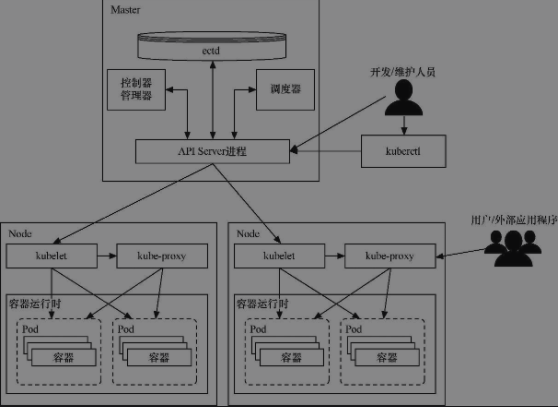
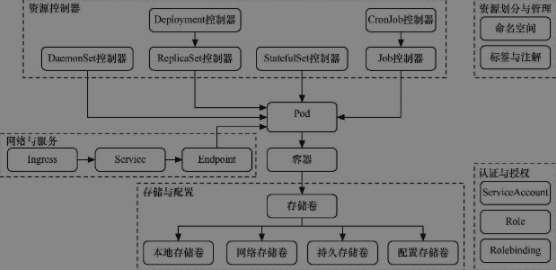

## 为了解决什么问题

### 运维的历史

传统部署纪元：**无法做资源隔离**。这导致了，如果单台物理机部署多个服务，某个服务占用资源较多，其他服务则可能无法正常提供服务；如果一台物理机部署一个服务，将会导致资源的极大浪费，导致运维的成本升高，因此没有被广泛采用。

虚拟机部署纪元：**解决了资源隔离的问题**。单台物理机上通过虚拟化技术可以虚拟出多台虚拟机，应用程序运行在虚拟机里，互相之间互不影响，解决了资源隔离的问题，资源在一定程度上得到了合理的利用，运维成本因此而降低。虚拟机这种解决方案，是一种比较重量级的解决方案，重量级的解决方案意味着效率比较低。

容器部署纪元：为了提高部署效率，容器化部署应运而生。容器化部署拥有更宽松的资源隔离解决方案，每个容器之间可以共享操作系统，因此容器被认为是轻量级的。容器拥有他自己的文件系统，共享CPU，内存，进程空间，以及其他的资源。

就应用程序的部署而言，容器化为开发人员带来了很大的灵活性。但是，应用程序越精细，它所包含的组件就越多，管理起来也就越复杂。要使容器得以有效管理，至少需要考虑以下方面：

* 组件复制
* 自动缩放
* 负载均衡
* 滚动更新
* 组件记录
* 监测和健康检查
* 服务发现
* 认证

以上，也是K8s主要解决的问题。

## 架构图

## 核心概念

1. instance

2. container

3. deployment

   A Deployment is responsible for creating and updating instances of your application.

4. pod

   * When you created a Deployment, Kubernetes created a **Pod** to host your application instance. A Pod is a group of one or more application containers (such as Docker) and includes shared storage (volumes), IP address and information about how to run them.

   * Containers should only be scheduled together in a single Pod if they are tightly coupled and need to share resources such as disk.

5. workload

6. Node

   A node is a worker machine in Kubernetes and may be a VM or physical machine, depending on the cluster. Multiple Pods can run on one Node.

   * Kubelet
   * Docker

7. service

8. control plane

9. init containers

