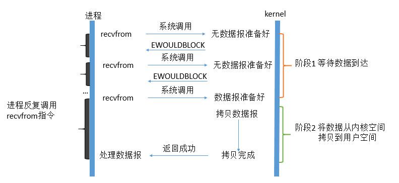

UNIX系统下IO模型一共有五种：

* 同步阻塞IO
* 同步非阻塞IO
* IO多路复用
* 信号驱动IO
* 异步IO

以下来自于：http://www.tianshouzhi.com/api/tutorials/netty/221

这篇文章是我翻阅了很多文章之后，发现的把同步非阻塞IO和IO多路复用的区别讲得最明白的一篇文章。

## 同步阻塞IO——Blocking

在linux中，默认情况下所有的socket都是blocking，一个典型的读操作流程大概是这样：

第一步通常涉及等待数据从网络中到达。当所有等待数据到达时，它被复制到内核中的某个缓冲区。

第二步就是把数据从内核缓冲区复制到应用程序缓冲区。

当用户进程调用了recvfrom这个系统调用，kernel就开始了IO的第一个阶段：**准备数据**。对于network io来说，很多时候数据在一开始还没有到达（比如，还没有收到一个完整的UDP包），这个时候kernel就要等待足够的数据到来。而在用户进程这边，整 个进程会被阻塞。当kernel一直等到数据准备好了，它就会将数据从kernel中拷贝到用户内存，然后kernel返回结果，用户进程才解除 block的状态，重新运行起来。

**所以，blocking IO的特点就是在IO执行的两个阶段都被block了。**

## 非阻塞IO

linux下，可以通过设置socket使其变为non-blocking。当对一个non-blocking socket执行读操作时，流程是这个样子：

从图中可以看出，当用户进程发出read操作时，如果kernel中的数据还没有准备好，那么它并不会block用户进程，而是立刻返回一个error。 从用户进程角度讲 ，它发起一个read操作后，并不需要等待，而是马上就得到了一个结果。用户进程判断结果是一个error时，它就知道数据还没有准备好，于是它可以再次 发送read操作。一旦kernel中的数据准备好了，并且又再次收到了用户进程的system call，那么它马上就将数据拷贝到了用户内存，然后返回。

**所以，用户进程第一个阶段不是阻塞的,需要不断的主动询问kernel数据好了没有；第二个阶段依然总是阻塞的。**

## IO多路复用

IO multiplexing这个词可能有点陌生，但是如果我说select，epoll，大概就都能明白了。有些地方也称这种IO方式为event driven IO。我们都知道，select/epoll的好处就在于**单个process就可以同时处理多个网络连接的IO**。

IO复用同非阻塞IO本质一样，不过利用了新的select系统调用，由内核来负责本来是请求进程该做的轮询操作。看似比非阻塞IO还多了一个系统调用开销，不过因为可以支持多路IO，才算提高了效率。

它的基本原理就是select /epoll这个function会不断的轮询所负责的所有socket，当某个socket有数据到达了，就通知用户进程。它的流程如图：

当用户进程调用了`select`，那么整个进程会被block，而同时，kernel会“监视”所有select负责的socket，当任何一个 socket中的数据准备好了，select就会返回。这个时候用户进程再调用read操作，将数据从kernel拷贝到用户进程。

这个图和blocking IO的图其实并没有太大的不同，事实上，还更差一些。因为这里需要使用两个system call (select 和 recvfrom)，而blocking IO只调用了一个system call (recvfrom)。但是，用select的优势在于它可以同时处理多个connection。多说一句。**所以，如果处理的连接数不是很高的话，使用 select/epoll的web server不一定比使用multi-threading + blocking IO的web server性能更好，可能延迟还更大**。

select/epoll的优势并不是对于单个连接能处理得更快，而是在于能处理更多的连接。

在IO multiplexing Model中，实际中，对于每一个socket，一般都设置成为non-blocking，但是，如上图所示，整个用户的process其实是一直被 block的。只不过process是被select这个函数block，而不是被socket IO给block。

## 信号驱动式I/O

用的很少，就不做讲解了。直接上图

## 异步IO

这类函数的工作机制是告知内核启动某个操作，并让内核在整个操作（包括将数据从内核拷贝到用户空间）完成后通知我们。如图：

用户进程发起read操作之后，立刻就可以开始去做其它的事。而另一方面，从kernel的角度，当它受到一个asynchronous read之后，首先它会立刻返回，所以不会对用户进程产生任何block。然后，kernel会等待数据准备完成，然后将数据拷贝到用户内存，当这一切都 完成之后，kernel会给用户进程发送一个signal，告诉它read操作完成了。 在这整个过程中，进程完全没有被block。

## 总结

其实前四种I/O模型都是同步I/O操作，他们的区别在于第一阶段，而他们的第二阶段是一样的：在数据从内核复制到应用缓冲区期间（用户空间），进程阻塞于recvfrom调用。 

有人可能会说，non-blocking IO并没有被block啊。这里有个非常“狡猾”的地方，定义中所指的”IO operation”是指真实的IO操作，就是例子中的recvfrom这个system call。non-blocking IO在执行recvfrom这个system call的时候，如果kernel的数据没有准备好，这时候不会block进程。但是，当kernel中数据准备好的时候，recvfrom会将数据从 kernel拷贝到用户内存中，这个时候进程是被block了，在这段时间内，进程是被block的。