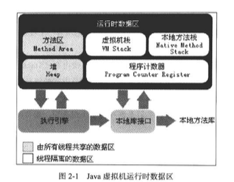
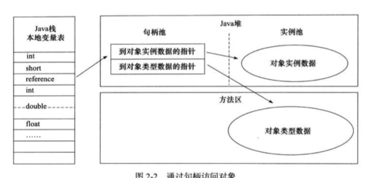

# Java内存区域

## 运行时数据区域

### 程序计数器

* 线程私有内存。
* 当前线程所执行的字节码的行号指示器

* 作用：为了保证线程切换后能够恢复到正确的位置。

* 值：
  * 如果线程正在执行一个方法，计数器记录的是正在执行的虚拟机字节码指令的地址。
  * 如果线程正在执行Native方法，计数器值为空。

### Java虚拟机栈

* 线程私有内存。

* 生命周期=线程的生命周期。

* 描述的是Java方法执行的内存模型，**方法执行的同时会创建一个栈帧**，用于存放：

  * 局部变量表
  * 操作数栈
  * 动态链接
  * 方法出口等信息。

  方法的调用直至完成，就对应着虚拟机栈的入栈和出栈操作

* 一般情况下虚拟机栈是可动态扩展，无法申请到足够的内存，抛OutOfMemoryError异常。

#### 局部变量表

* 虚拟机栈的**局部变量表**部分存放了各种可知的基本数据类型，其中64位长度的long和double类型的数据会占用2个局部变量控件，其余占一个。

* 编译期间就可确定其大小，运行期间不会改变。

#### 异常情况

* 请求的栈的深度大于虚拟机所允许的深度——**StackOverFlow**

* 虚拟机栈在动态扩容的过程中无法申请到足够的内存——**OutOfMemoryError**

### 本地方法栈

为Native方法服务，而Java虚拟机栈为Java方法服务，除此之外，没什么差别。

### Java堆

* 被所有线程所共享。

* 对大多数应用程序来说，Java堆是虚拟机所管理的内存中最大的一块。

* 创建时机：虚拟机启动时创建。

* 唯一目的：存放对象以及数组实例。（现在也没有那么绝对了）

* 分区：堆是垃圾收集器管理的主要区域。划分：

  * 按照内存回收的角度进行划分

    * 新生代
    * 老年代

    还可细分为：

    * Eden空间
    * From Survivor空间
    * To Survivor空间

  * 按照内存分配的角度进行划分：

    * 共享的堆中可能分配出多个线程私有的**分配缓冲区**

* 堆在物理上可以是不连续的内存空间，但是逻辑上必须是连续的。这样就避免了固定空间的限制，从而实现虚拟机堆内存空间的动态扩容（主流JVM都是动态可扩容的）。

* 当在堆上给实例分配内存空间没有完成的时候，并且堆也无法再扩展，就会抛出**OutOfMemoryError**异常。

### 方法区

* 被所有线程所共享。

* 用于存储已经被虚拟机加载的：
  * 类信息
  * 常量
  * 静态变量
  * 即时编译器编译后的代码等数据。
* 也叫Non-Heap

* 也叫**永久代**，垃圾收集在这个区域出现的比较少，内存回收目标主要是针对常量池的回收和对类型的卸载。JDK1.7之后开始逐步"去永久代"。
* 当方法无法满足内存分配需求时，会剖出**OutOfMemoryError**异常。

### 运行时常量池

* 是方法区的一部分。
* 既然是方法区的一部分，就会受到方法区的内存限制
* Class文件有一项信息是常量池，用于存放编译期生成的各种字面量和符号引用，这部分内容将在**类加载后进入方法区的运行时常量池中存放**。
* 动态性：运行时新产生的常量，也能够放入运行时常量池，String的intern()方法
* 当常量池无法再申请到内存是会抛出：**OutOfMemoryError**异常。

### 直接内存

* 不是虚拟机运行时数据区的一部分，也不是Java虚拟机规范中定义的内存区域。

* **NIO的直接内存与此相关**。NIO用Native函数库直接分配堆外内存，然后通过一个存储在Java堆中的**DirectByteBuffer**对象作为这块内存的引用进行操作，避免了Java堆和Native堆的来回复制数据，在某些场合能够显著提升性能。（这个具体到NIO的细节中去看吧）

* 虽然不受Java堆大小的直接控制，但是受本机总内存大小以及处理器寻址空间的限制，当超出限制时，会抛出：**OutOfMemoryError**。

## hotspot虚拟机对象探秘

### 对象创建

对象的创建过程如下：

1. 先去检查new指令的参数是否能够在常量池中定位到一个类的符号引用

2. 检查这个符号所代表的类是否已经被加载、解析和初始化过，没有的话就去加载这个类。类被加载完成后，就可以完全确定创建这个类的对象所需要的内存大小

3. 加载过程中，会为这个新生对象分配内存，分配方式取决于垃圾收集器是否带有**压缩整理**功能，若带有此功能，使用**指针碰撞**的分配方式，若不带有此功能，使用**空闲列表**方式。

4. 内存分配也存在并发问题，可采用：

   * 采用CAS配上失败重试
   * TLAB方式（在Java堆中预先为线程分配一块小内存）

   来保证内存分配操作的原子性

5. 将所有内存空间都初始化为0。

6. 对对象进行必要的信息配置，例如：

   * 这个对象是哪个类的实例
   * 如何才能找到类的元数据信息
   * 对象的哈希码
   * 对象的GC分代年龄等信息

   将这些信息保存在**对象头**中。

7. 按照程序员的意愿调用初始化方法

### 对象的内存布局

对象在内存中的存储的布局可以分为3大区域：

* 对象头

* 实例数据

* 对齐填充

#### 对象头

对象头包括两部分信息。

* 第一部分用于**存储对象自身的运行时数据**，可能是32位也可能是64位，官方称它为“Mark Word"。Mark Word被设计成一种动态的数据结构，以便在极小的空间内存储尽量多的信息。

* 另一部分是类型指针，用于指向对象的类的元数据。虚拟机通过这个指针来确定这个对象是哪个类的实例。不是所有虚拟机都这样实现的。

如果是数组对象，对象头中还有一块用于记录数组长度的数据。

#### 实例数据

对象真正存储的有效信息，即是在程序代码中定义的各种类型的字段内容。

#### 对齐填充

起到占位符的作用。因为自动内存管理系统要求对象其实地址必须是8字节的整数倍。

### 对象的访问定位

建立对象是为了使用对象，我们的Java程序需要通过栈上的reference数据来操作堆上的具体对象。由于reference类型在Java虚拟机规范中只规定了一个指向对象的引用，并没有定义这个引用应该通过何种方式去定位、访问堆中的对象的具体位置，所以对象访问方式也是取决于虚拟机实现而定的。目前主流的访问方式有

* 使用句柄
* 直接指针

这两种方式。

#### 句柄访问

Java堆中将会划分出一块内存来作为句柄池，reference中存储的就是对象的句柄地址，而句柄中包含了对象实例数据与类型数据各自的具体地址信息

#### 直接指针

那么Java堆中将会划分出一块内存来作为句柄池，reference中存储的就是对象的句柄地址，而句柄中包含了对象实例数据与类型数据各自的具体地址信息

主要虚拟机Sun HotSpot而言，它是使用第二种方式进行对象访问的，但从整个软件开发的范围来看，各种语言和框架使用句柄来访问的情况也十分常见

