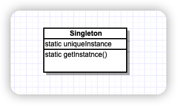

> 确保某一个类只有一个实例，并提供一个全局访问点。

## 类图




## 示例代码

**在需要的时候才创建实例**

```java
public class Singleton{
	private static Singleton uniqueInstance;
  
  private Singleton(){}
  
  public static Singleton getInstance(){
    if(uniqueInstance == null){
      uniqueInstance = new Singleton();
    }
    return uniqueInstance;
  }
}
```

以上代码在会产生并发问题，有以下三种进阶代码：

1. 采用`synchronized`关键字

```java
public class Singleton{
	private static Singleton uniqueInstance;
  
  private Singleton(){}
  
  public static synchronized Singleton getInstance(){
    if(uniqueInstance == null){
      uniqueInstance = new Singleton();
    }
    return uniqueInstance;
  }
}
```

这种方式会产生性能问题，只有第一次执行getInstance方法的时候才需要同步执行，一旦设置好uniqueInstance变量，就不再需要同步这个方法了。

如果对性能不敏感，这无所谓，否则的话采用以下方案。

2. 使用“急切”创建实例的方式，而不用延迟实例化的方法

```java
public class Singleton{
	private static Singleton uniqueInstance = new Singleton();;
  
  private Singleton(){}
  
  public static Singleton getInstance(){
    return uniqueInstance;
  }
}
```

由JVM在加载这个类的时候马上创建此唯一的单件实例。JVM保证在任何线程访问uniqueInstance静态变量之前，一定优先创建此实例。

3. 采用“双重检查锁”，在getInstance()中减少使用同步。该方式，**不适用于1.4**及更早版本的Java

```java
public class Singleton{
	private volatile static Singleton uniqueInstance;
  
  private Singleton(){}
  
  public static Singleton getInstance(){
     if(uniqueInstance == null){
       synchronized(Singleton.class){
         if(uniqueInstance == null){
         	uniqueInstance = new Singleton();
         }
       }
    }
    return uniqueInstance;
  }
}
```


## Tip

* 如果使用多个类加载器，可能导致单例失效
* 如果使用JVM1.2之前的版本，必须建立单件注册表，以免垃圾回收器将单件回收