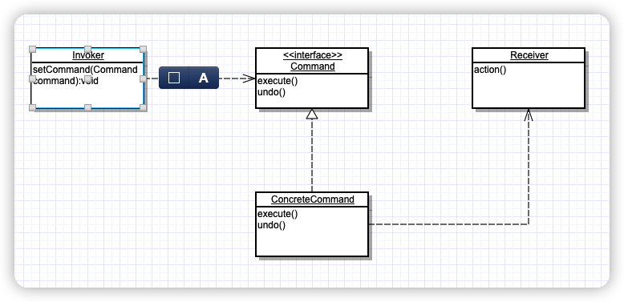

> 将“请求”封装成对象，以便使用不同的请求、队列或者日志来参数化其他对象。命令模式也支持可撤销的操作。


## 类图




## 示例代码

```java
//Command
public interface Command{
	public void execute();
	public void undo();
}

//ConcreteReceiver
public class Light{
  //action1
  public void on{
    
  }
  //action2
  public void off(){
    
  }
}

//ConcreteCommand
public class LightOnCommand implements Command{
	//Receiver
  Light light;
  
  public LightOnCommand(Light light){
    this.light = light;
  }
  
  public void execute(){
    light.on();
  }
}

//Invoker
public class SimpleRemoteControl{
  Command command;
  
  public SimpleRemoteControl(){
    
  }
  
  public void setCommand(Command command){
    this.command = command;
  }
  
  public void buttonWasPressed(){
    command.execute();
  }
}
```


## 客户端代码

```java
public class RemoteControlTest{
  public static void main(String[] args){
    //创建Invoker
    SimpleRemoteControl remoteControl = new SimpleRemoteControl();
    //创建Receiver
    Light light = new Light;
    //创建Command
    Command command = new LightOnCommand(light);
    //setCommand给Invoker
    remoteControl.setCommand(command);
    //调用
    remoteControl.buttonWasPressed();
  }
}
```

