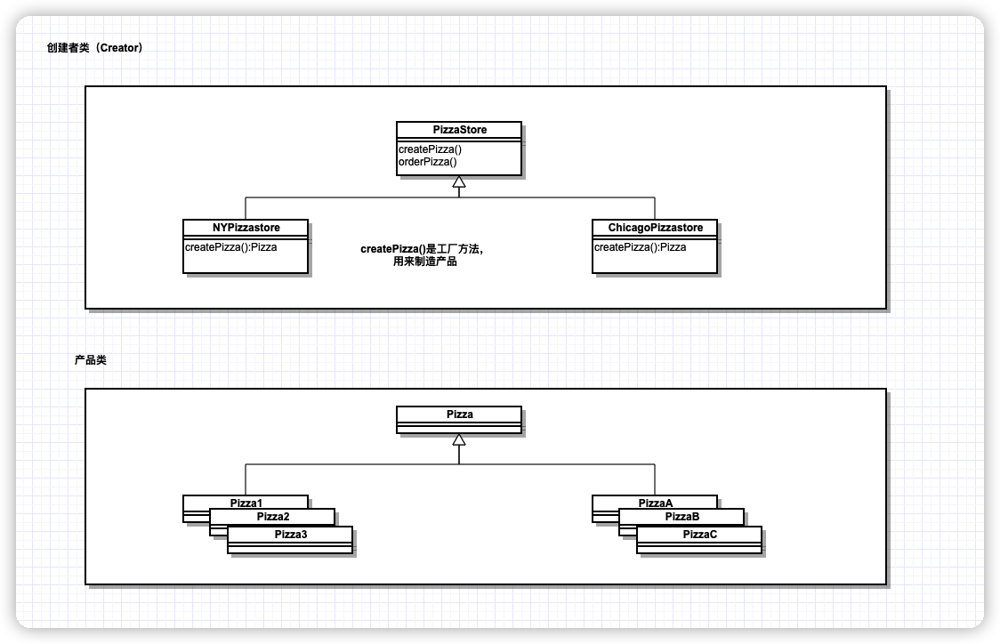
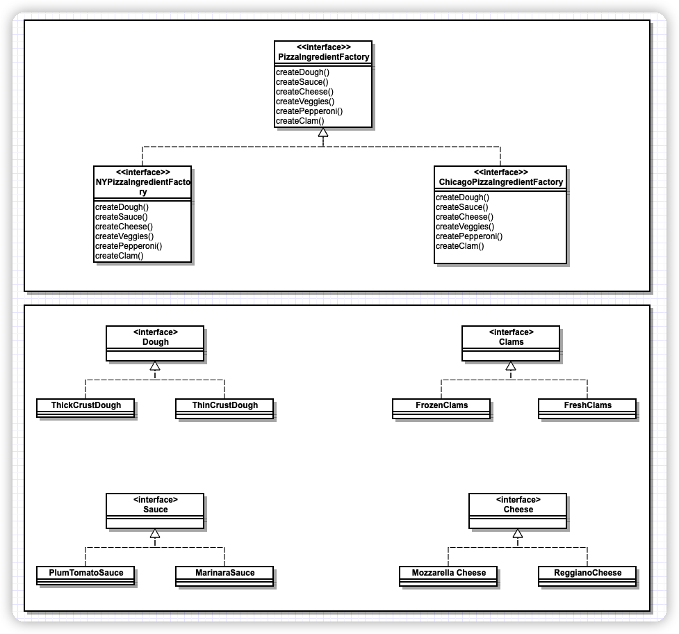

# 简单工厂模式

> 不是一个设计模式，而是一种编程习惯。

示例代码：

```java
public class SimplePizzaFactory{
	public Pizza createPizza(String type){
		Pizza pizza = null;
		if(type.equals("cheese")){
			pizza = new CheesePizza();
		}else if(type.equals("pepperoni")){
			pizza = new Pepperoni();
		}
		......
		return pizza;
	}
}
```


# 工厂方法模式

> 定义了一个创建对象的接口，但由子类决定要实例化的类是哪一个。工厂方法让类把实例化推迟到子类。

工厂方法模式通过让子类决定该创建的对象是什么，来达到将对象创建的过程封装起来的目的。

## 类图



## 客户端代码

```java
public class PizzaTestDrive{
	public static void main(String[] args){
		PizzaStore nyStore = new NYPizzaStore();
		PizzaStore chicagoStore = new ChicagoPizzaStore();
		
		Pizza pizza = nyStore.orderPizza("cheese");
		System.out.println("Ethan ordered a " + pizza.getName() + "\n");
		pizza = chicagoStore.orderPizza("cheese");
		System.out.println("Joel ordered a " + pizza.getName() + "\n");
	}
}
```


## 满足的OO原则：依赖倒置

依赖倒置原则：**要依赖抽象，不要依赖具体类**。

这个原则说明了：不能让高层组件依赖低层组件，而且，不管高层或低层组件，“两者”都应该依赖于抽象。


几个设计指导方针帮助遵循此原则：

* 变量不可以持有具体类的引用

  如果使用new，就会持有具体类的引用。可以改用工厂来避开这样的做法。

* 不要让类派生自具体类

  如果派生自具体类，就会依赖具体类。请派生自一个抽象。

* 不要覆盖基类中已经实现的方法

  如果覆盖积累已经实现的方法，那么你的基类就不是一个真正适合被继承的抽象。基类中已实现的方法，应该由所有的子类共享。

让这些方针成为在设计的时候的一些参考，而不是要完全的照搬照做。

# 抽象工厂模式

> 提供一个接口，用于创建相关或依赖对象的家族，而不需要明确指定具体类。

## 类图




## 客户端代码

```java
public class PizzaTestDrive	{
	public static void main(String[] args){
		PizzaStore nyPizzaStore = new NYPizzaStore();
		nyPizzaStore.orderPizza("cheese");
	}
}

public abstract class PizzaStore{
  public Pizza orderPizza(String type){
    Pizza pizza;
    pizza = createPizza(type);
    
    pizza.prepare();
    pizza.bake();
    pizza.cut();
    pizza.box();
    
    return pizza;
  }
  
  abstract Pizza createPizza(String type);
}

public class NYPizzaStore extends PizzaStore {

  protected Pizza createPizza(String item){
    Pizza pizza = null;
    PizzaIngredientFactory ingredientFactory = new NYPizzaIngredientFactory();
    if(item.equals("cheese")){
      pizza = new CheesePizza(ingredientFactory);
    }else if(item.equals("viggie")){
      pizza = new VeggiePizza(ingredientFactgory);
    }
    ......
    return pizza
  }
}

public interface PizzaIngredientFactory{
  public Dough createDough();
  public Sauce createSauce();
  public Cheese createCheese();
  public Clams createClam();
}

public class NYPizzaINgredientFactory implements PizzaINgredientFactory{
  public Dough createDough(){
    return new ThinCrustDough();
  }
  
  public Sauce createSauce(){
    return new MarinaraSauce();
  }
  
  public Cheese createCheese(){
    return new ReggianCheese();
  }
  
  public CLams createClam(){
    return new FreshClams();
  }
}
```

