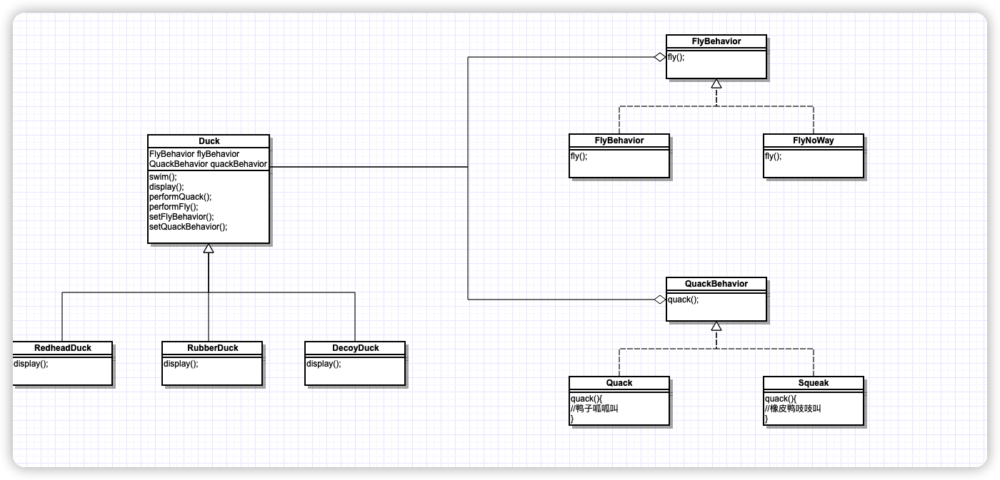

> 策略模式，定义了算法族，分别封装起来，让他们之间可以互相替换，此模式让算法的变化独立于使用算法的客户。

## 类图




## 测试类

```java
public class MiniDuckSimulator{
	public static void main(String[] args){
		Duck mallard = new MallardDuck();
		mallard.performQuack();
		mallard.performFly();
	}
}
```


## 遵循的设计原则

* 多用组合，少用继承
* 针对接口编程
* 封装变化

