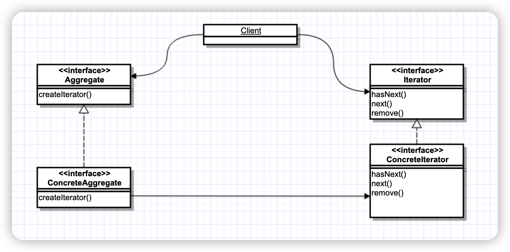

> 提供一种方法顺序访问一个聚合对象当中的各个元素，而又不暴露其内部的表示。

## 类图



## 示例代码

```java

public class MenuItem {

    private String name;
    private String description;
    private boolean vegetarian;
    private double price;

    public MenuItem(String name, String description, boolean vegetarian, double price) {
        this.name = name;
        this.description = description;
        this.vegetarian = vegetarian;
        this.price = price;
    }

    public String getName() {
        return name;
    }

    public boolean isVegetarian() {
        return vegetarian;
    }

    public String getDescription() {
        return description;
    }


    public double getPrice() {
        return price;
    }

    @Override
    public String toString() {
        return "MenuItem{" +
                "name='" + name + '\'' +
                ", description='" + description + '\'' +
                ", vegetarian=" + vegetarian +
                ", price=" + price +
                '}';
    }
}

public interface Menu {
    Iterator createIterator();
}

public class BreakfastMenu implements Menu{
    private List<MenuItem> menuItems;

    public BreakfastMenu() {
        menuItems = new ArrayList<MenuItem>();
        addItem("煎饼果子","美味的煎饼果子",false,9);
    }

    public void addItem(String name, String description, boolean vegetarian, double price) {
       menuItems.add(new MenuItem(name, description, vegetarian, price));
    }

    public List<MenuItem> getMenuItems(){
        return menuItems;
    }

    public Iterator createIterator(){
        return menuItems.iterator();
    }
}

public class DinnerMenuIterator implements Iterator {

    MenuItem[] items;
    private int position = 0;

    public DinnerMenuIterator(MenuItem[] items){
        this.items = items;
    }

    public boolean hasNext() {
        if (position >= items.length || items[position] == null){
            return false;
        }else {
            return true;
        }
    }

    public Object next() {
        MenuItem menuItem = items[position];
        position += 1;
        return menuItem;
    }

    public void remove() {
        //偷个懒
        throw new IllegalStateException("不支持删除");
    }
}
```


## 客户端代码

```java
public class Waitress {
    private Menu dinnerMenu;
    private Menu breakfastMenu;

    public Waitress(Menu dinnerMenu,Menu breakfastMenu){
        this.dinnerMenu = dinnerMenu;
        this.breakfastMenu = breakfastMenu;
    }

    public void printMenu(){
        printMenu(dinnerMenu.createIterator());
        printMenu(breakfastMenu.createIterator());
    }

    private void printMenu(Iterator iterator){
        while (iterator.hasNext()){
            MenuItem menuItem = (MenuItem)iterator.next();
            System.out.println(menuItem.toString());
        }
    }
}
```


## 满足的OO原则——单一职责原则

> 一个类应该只有一个引起变化的原因

