## 容器 VS 虚拟机

操作系统太重了


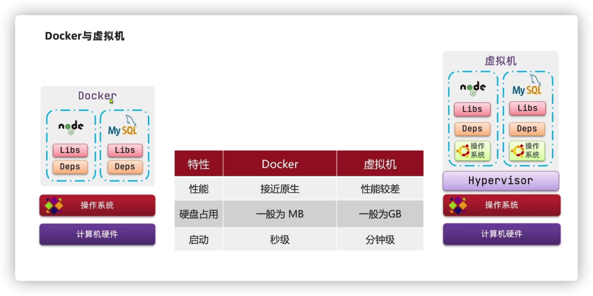


操作系统重启是非常慢的

与虚拟机通过操作系统实现隔离不同，容器技术**只隔离应用程序的运行时环境但容器之间可以共享同一个操作系统**


## 什么是Docker？

Docker是一个开源的引擎，可以轻松的为任何应用创建一个：

* 轻量级的
* 可移植的
* 自给自足的

容器。开发者在笔记本上编译测试通过的容器可以批量地在生产环境中部署，包括VMs（虚拟机）、bare metal、OpenStack 集群和其他的基础应用平台。

容器是一种通用技术，docker只是其中的一种实现。

## Docker如何解决不同系统环境的问题？

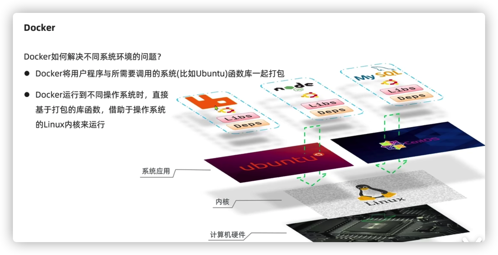

## Docker拥有哪些能力？

Docker提供了在称为容器的松散隔离环境中打包和运行应用程序的能力。这样你的程序可以在任何环境都会有一致的表现，因此docker最重要的能力就是：**可以屏蔽环境差异**。

由于Docker具有屏蔽环境的差异的能力，由此衍生出了另外一个重要的应用能力：**快速部署**。只要确保一个容器中的程序正确运行，那么你就能确信无论在生产环境部署多少都能正确运行。真正实现**“build once, run everywhere”**。


## 我能用Docker干啥？

* 快速、一致的交付你的应用程序
* 响应式发布和扩展
* 在相同的硬件上能够运行更多的工作负载

​	

## Docker引擎介绍

docker客户端

* SERVER（docker daemon）
* REST API
* CLI


> docker客户端和服务端一般运行在同一台机器上


## Docker架构

### 镜像和容器

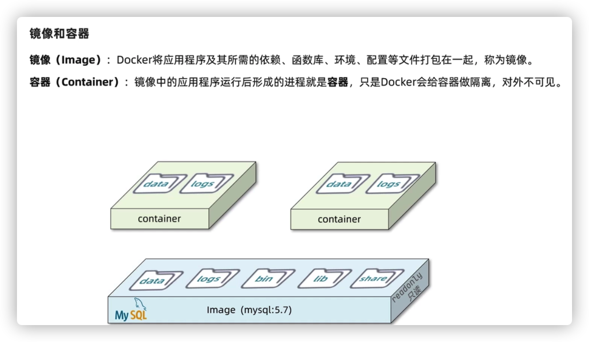

### DockerHub

官网：https://registry.hub.docker.com/

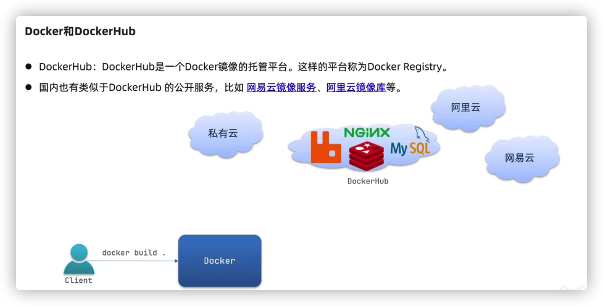

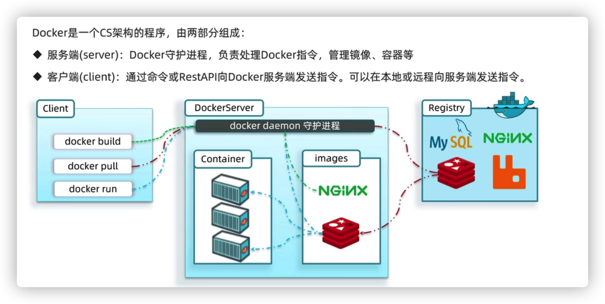

官网架构图如下：


* The **Docker daemon (**`dockerd`) listens for Docker API requests and manages Docker objects such as images, containers, networks, and volumes. A daemon can also communicate with other daemons to manage Docker services.

* The **Docker client** (`docker`) is the primary way that many Docker users interact with Docker. When you use commands such as `docker run`, the client sends these commands to `dockerd`, which carries them out. The `docker` command uses the Docker API. The Docker client can communicate with more than one daemon.

* A **Docker *registry*** stores Docker images. Docker Hub is a public registry that anyone can use, and Docker is configured to look for images on Docker Hub by default. You can even run your own private registry.

  When you use the `docker pull` or `docker run` commands, the required images are pulled from your configured registry. When you use the `docker push` command, your image is pushed to your configured registry.


## Docker核心概念

docker中有这样几个概念：

- dockerfile：源程序
- image：可执行程序
- container：进程

实际上你可以简单的把image理解为可执行程序，container就是运行起来的进程。

那么写程序需要源代码，那么“写”image就需要dockerfile，dockerfile就是image的源代码，docker就是"编译器"。

因此我们只需要在dockerfile中指定需要哪些程序、依赖什么样的配置，之后把dockerfile交给“编译器”docker进行“编译”，也就是docker build命令，生成的可执行程序就是image，之后就可以运行这个image了，这就是docker run命令，image运行起来后就是docker container。


## Docker使用

### 安装Docker

CentOS7

```shell
yum install -y docker	
systemctl start docker
```


### 镜像加速

```shell
#CentOS7
#/etc/docker/daemon.json
{"registry-mirrors":["https://reg-mirror.qiniu.com/"]}
```


### 镜像使用

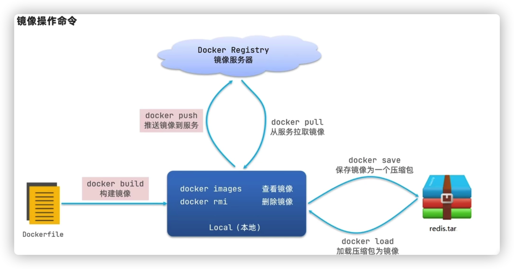

#### 列出所有镜像

```shell
docker images
```

- **REPOSITORY：**表示镜像的仓库源
- **TAG：**镜像的标签
- **IMAGE ID：**镜像ID
- **CREATED：**镜像创建时间
- **SIZE：**镜像大小


#### 运行某个镜像

```shell
#运行某个镜像
#-t: 在新容器内指定一个伪终端或终端。
#-i: 允许你对容器内的标准输入 (STDIN) 进行交互。
docker run -i -t ubuntu:15.10 /bin/bash

#-d 在后台运行
#-P 与主机的高端口绑定
#--name 指定容器名称
docker run -d -P --name runoob training/webapp python app.py
```

- **REPOSITORY：**表示镜像的仓库源
- **TAG：**镜像的标签
- **IMAGE ID：**镜像ID
- **CREATED：**镜像创建时间
- **SIZE：**镜像大小


#### 获取一个镜像

```shell
docker pull ubuntu:13.10
```


#### 查找镜像

```shell
docker search <镜像名称>
```


#### 拖取镜像

```shell
docker pull <镜像名称>
```


#### 删除镜像

```shell
docker rmi hello-world
```


#### 自定义镜像

##### 镜像的结构

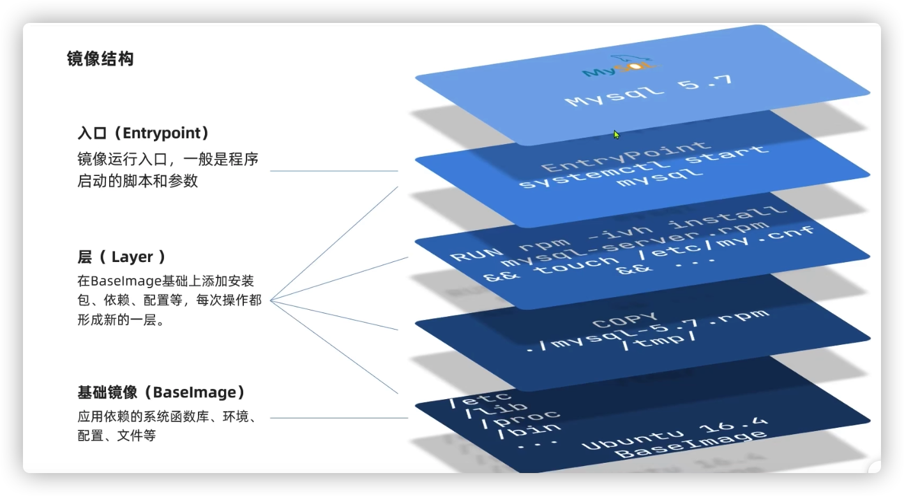

##### 使用DockerFile构建镜像

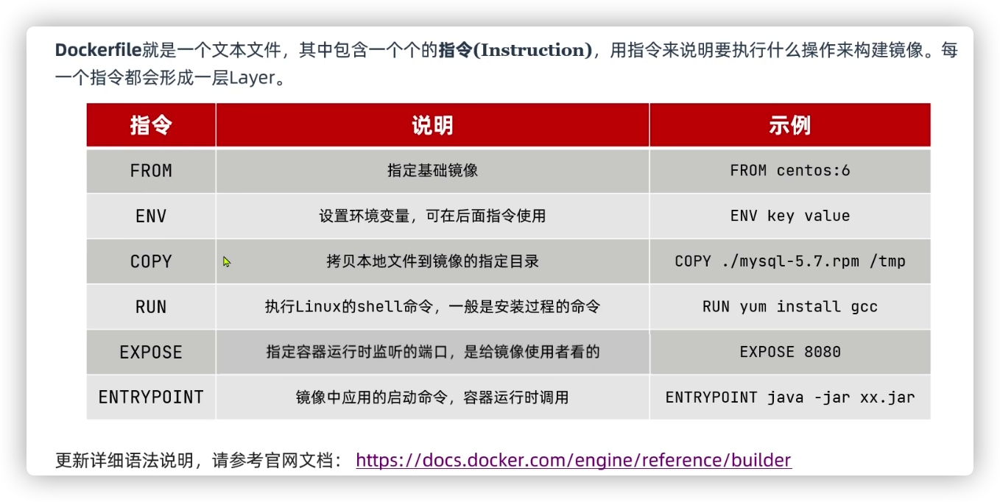

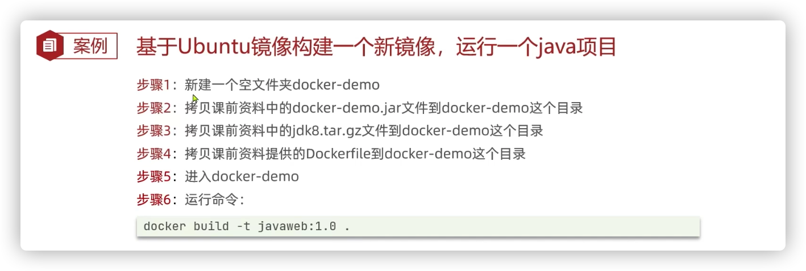

**Dockerfile** 是一个用来构建镜像的文本文件，文本内容包含了一条条构建镜像所需的指令和说明。下边是一个Dockerfile的示例：

```dockerfile
FROM    centos:6.7
MAINTAINER      Fisher "fisher@sudops.com"

RUN     /bin/echo 'root:123456' | chpasswd
RUN     useradd runoob
RUN     /bin/echo 'runoob:123456' |chpasswd
RUN     /bin/echo -e "LANG=\"en_US.UTF-8\"" >/etc/default/local
EXPOSE  22
EXPOSE  80
CMD     /usr/sbin/sshd -D
```

每一个指令都会在镜像上创建一个新的层，每一个指令的前缀都必须是大写的。

第一条FROM，指定使用哪个镜像源

RUN 指令告诉docker 在镜像内执行命令，安装了什么。

使用 Dockerfile 文件，通过 docker build 命令来构建一个镜像。

```
docker build -t runoob/centos:6.7 .
```

参数说明：

- **-t** ：指定要创建的目标镜像名
- **.** ：Dockerfile 文件所在目录，可以指定Dockerfile 的绝对路径


##### 更新镜像

```shell
#启动一个镜像，比如Ubuntu
docker run -t -i ubuntu:15.10 /bin/bash
#做一些更新操作
apt-get update 
#然后提交更新
docker commit -m="has update" -a="runoob" e218edb10161 runoob/ubuntu:v2
```

各个参数说明：

- **-m:** 提交的描述信息
- **-a:** 指定镜像作者
- **e218edb10161：**容器 ID
- **runoob/ubuntu:v2:** 指定要创建的目标镜像名


#### 给镜像添加标签

```docker
docker tag 860c279d2fec runoob/centos:dev
```


### 容器使用

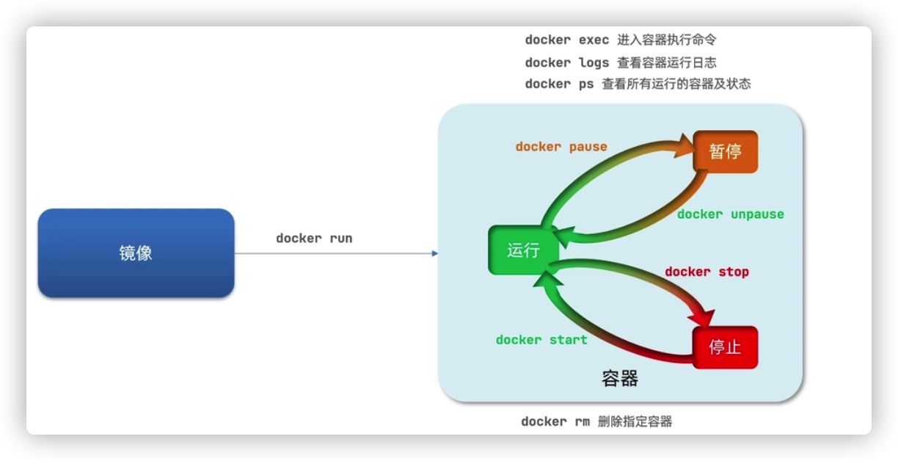

#### 查看容器

```shell
#查看所有运行中的容器
docker ps

#查看所有容器，包括所有状态
docker ps -a

#查看最后一次创建的容器
docker ps -l
```

容器状态有7种：

- created（已创建）
- restarting（重启中）
- running 或 Up（运行中）
- removing（迁移中）
- paused（暂停）
- exited（停止）
- dead（死亡）


#### 启停容器

```shell
#Docker 以 ubuntu15.10 镜像创建一个新容器，然后在容器里执行 bin/echo "Hello world"，然后输出结果。
docker run ubuntu:15.10 /bin/echo "Hello world"

#-t: 在新容器内指定一个伪终端或终端。
#-i: 允许你对容器内的标准输入 (STDIN) 进行交互。
docker run -i -t ubuntu:15.10 /bin/bash

#-d：后台启动
docker run -d ubuntu:15.10 /bin/sh -c "while true; do echo hello world; sleep 1; done"

#启动已经停止的容器
docker start <容器Id>
docker restart <容器Id>

#停止容器
docker stop <容器Id>
```

**为什么Docker刚运行完run命令就停止了？**

> Docker 容器启动后，默认会把容器内部第一个进程，也就是pid=1的程序作为docker容器是否正在运行的依据。
> 如果docker 容器pid=1进程挂了，那么docker容器便会直接退出。这样的话，如果我们在前台维持一个运行的进程，docker 容器就会一直处于运行的状态中。


#### 监控容器

##### 查看容器日志

```shell
#查看日志
#1 查看标准输出
docker logs {容器ID或者容器名称}
#2 让docker logs 像使用 tail -f 一样来输出容器内部的标准输出。
docker logs -f {容器ID或者容器名称}  
```


##### 查看容器进程

```shell
docker top <容器Id>
```


##### 检查Docker

```shell
docker inspect <容器Id>
```


#### 进入容器

```shell
#这种方式进入容器，exit的时候，会将容器停止，不推荐使用
docker attach <容器Id> 

#如果从这个容器退出，容器不会停止，这就是为什么推荐使用 docker exec 的原因
docker exec -it <容器Id> /bin/bash
```


#### 导入和导出容器

```shell
#导出容器
docker export <容器Id> > ubuntu.tar

#导入容器1
cat docker/ubuntu.tar | docker import - test/ubuntu:v1
#导入容器2
docker import http://example.com/exampleimage.tgz example/imagerepo
```


#### 删除容器

```shell
#删除某个容器
docker rm -f <容器Id>

#删除所有处于终止状态的容器
docker container prune
```


### Docker容器连接

#### 网络端口映射

```shell
docker run -d -P training/webapp python app.py
docker run -d -p training/webapp python app.py
```

- **-P :**是容器内部端口**随机**映射到主机的高端口。
- **-p :** 是容器内部端口绑定到**指定**的主机端口。

也可以绑定主机的Ip地址：

```shell
docker run -d -p 127.0.0.1:5001:5000 training/webapp python app.py
```


##### 绑定UDP端口

端口后面加上 **/udp**

```shell
docker run -d -p 127.0.0.1:5000:5000/udp training/webapp python app.py
```


##### 查看端口绑定情况

**docker port** 命令可以让我们快捷地查看容器的端口的绑定情况

```shell
#查看容器的5000端口是如主机的哪个端口相绑定
docker port <容器Id> 5000
```


#### Docker容器互联

Docker 有一个连接系统允许将多个容器连接在一起，共享连接信息。

Docker 连接会创建一个**父子关系**，其中父容器可以看到子容器的信息。

##### **操作**

1. 先创建一个新的 Docker 网络

```shell
# -d：参数指定 Docker 网络类型，有 bridge、overlay。
docker network create -d bridge test-net
```

2. 运行一个容器并连接到新建的 test-net 网络，指定容器名称为test1

```shell
docker run -itd --name test1 --network test-net ubuntu /bin/bash
```

3. 再运行一个容器并加入到 test-net 网络，指定容器名称为test2

```
docker run -itd --name test2 --network test-net ubuntu /bin/bash
```

4. 验证

```shell
#进入容器test1去ping test2
docker exec -it test1 /bin/bash
#没有ping命令则需要执行:
# apt-get update
# apt install iputils-ping
ping test2

#test2 ping test1
#操作同上
```


#### 配置DNS

##### 全局配置

CentOS上，Docker的配置文件在：/etc/docker/daemon.json这个位置。

```shell
{
  "dns" : [
    "114.114.114.114",
    "8.8.8.8"
  ]
}
```

配置完后，重启Docker。

查看是否生效

```shell
docker run -it --rm  ubuntu  cat etc/resolv.conf
```


##### 指定容器配置

```shell
docker run -it --rm -h host_ubuntu  --dns=114.114.114.114 --dns-search=test.com ubuntu
```

**--rm**：容器退出时自动清理容器内部的文件系统。

**-h HOSTNAME 或者 --hostname=HOSTNAME**： 设定容器的主机名，它会被写到容器内的 /etc/hostname 和 /etc/hosts。

**--dns=IP_ADDRESS**： 添加 DNS 服务器到容器的 /etc/resolv.conf 中，让容器用这个服务器来解析所有不在 /etc/hosts 中的主机名。

**--dns-search=DOMAIN**： 设定容器的搜索域，当设定搜索域为 .example.com 时，在搜索一个名为 host 的主机时，DNS 不仅搜索 host，还会搜索 host.example.com。


> 如果在容器启动时没有指定 **--dns** 和 **--dns-search**，Docker 会默认用宿主主机上的 /etc/resolv.conf 来配置容器的 DNS。


### 仓库管理

仓库（Repository）是集中存放镜像的地方。

```shell
docker login
docker search ubuntu
docker pull ubuntu 
docker tag ubuntu:18.04 <username>/ubuntu:18.04
docker push <username>/ubuntu:18.04
docker search <username>/ubuntu
docker logout
```

### 数据卷

#### 耦合问题


#### Container->Volumes->宿主机文件系统

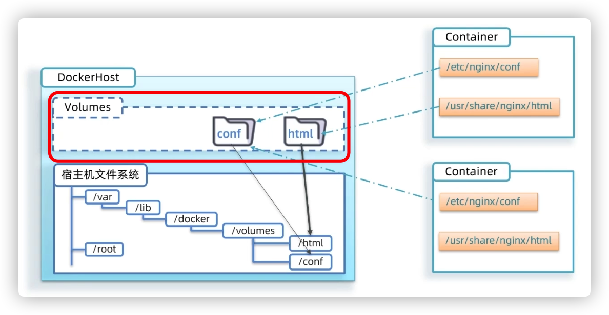

#### 数据卷基本语法

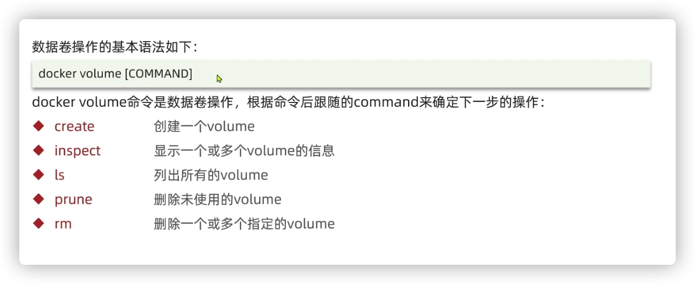


#### 挂载数据卷

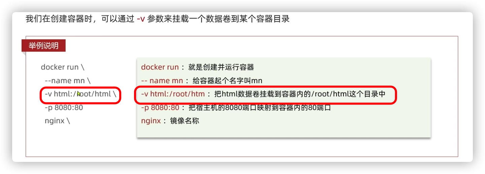

除了挂载数据卷，也可以直接挂载一个宿主机目录，案例如下：

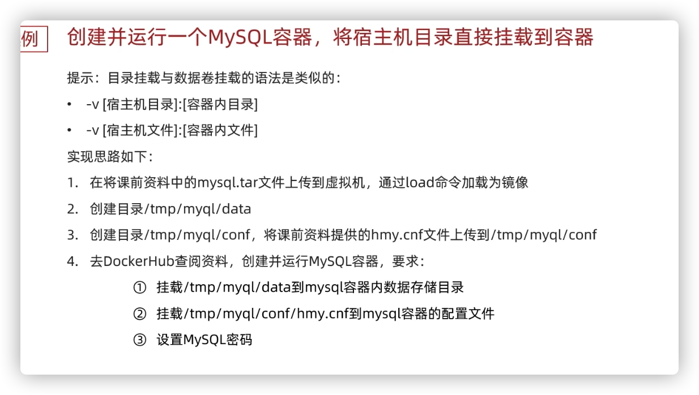


## Docker工具

### Docker Compose

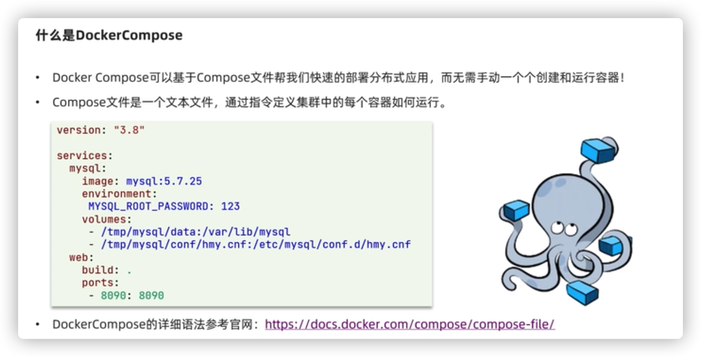

Compose 是用于定义和运行多容器 Docker 应用程序的工具。通过 Compose，您可以使用 YML 文件来配置应用程序需要的所有服务。然后，使用一个命令，就可以从 YML 文件配置中创建并启动所有服务。

#### Compose 三部曲

- 使用 Dockerfile 定义应用程序的环境。
- 使用 docker-compose.yml 定义构成应用程序的服务，这样它们可以在隔离环境中一起运行。
- 最后，执行 docker-compose up 命令来启动并运行整个应用程序。


为什么docker内使用127.0.0.1不好用呢？
