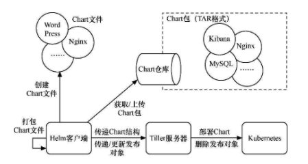

## Helm是什么

Helm是Kubernetes的一个子项目，是一种Kubernetes包管理平台。Helm能有效管理Kubernetes应用集合。使用Helm，可以轻松定义、部署、升级非常复杂的Kubernetes应用集合，并进行版本管理。Helm具有对Kubernetes资源进行统一部署、删除、升级、回滚等强大功能。


## 解决的问题

1. 将分散而互相关联的应用模板文件作为一个整体统一管理
2. 同时发布和重用应用模板文件
3. 进行版本控制
4. 统一维护模板文件产生的各种资源


## 整体架构



* Helm客户端

  主要用于Chart文件的创建、打包和发布部署，以及本地和远程Chart仓库的管理

* Tiller服务器

  * 以Deployment控制器形式部署
  * 接收Helm客户端发出的Chart结构
  * 根据Chart结构生成发布（release）对象
  * 将Chart解析成各个K8s的部署文件，供K8s创建相应的资源
  * 提供发布对象的更新、回滚、统一删除等功能

* Chart

  * 是应用程序的部署定义
  * 包含一组与K8s资源相关的yaml模板文件
  * 通过一定的结构组织yaml模板文件——Chart文件

* Chart仓库

  * 存放Chart包

* 发布对象

  * 在K8s中部署的Chart称为发布对象


## 基本操作

```shell
# 创建chart
helm create examplechart
# 验证：检查Chart文件的依赖项和模板配置是否正确
helm lint examplechart
# 验证：输出的内容为最终Kubernetes各模板与参数值合成在一起的yaml模板文件
helm install --dry-run --debug examplechart --name examplerelease
# 将Chart发布到K8s集群中
helm install exmplechart
# 列出所有已发布的Chart
helm list
# 查看某个Chart的状态
helm status examplerelease
# Helm的仓库列表，通常会列出本地仓库和远程仓库
helm repo list
# 查看仓库中的所有Chart
helm search
# 给Chart打包并存放到本地仓库
helm package examplechart
# 查找某个Chart（只会列出最新版本）
helm search examplechart
# 查找某个Chart的所有版本
helm search examplechart --versions
# 启动本地仓库服务
helm serve
# 升级某个集群中的已发布对象（examplerelease）
helm upgrade examplerelease local/examplechart
# 查看某个已发布对象的发布过的历史
helm history examplerelease
# 将某个Chart回滚到某个版本
helm rollback examplerelease 1
# 删除某个已发布的对象（历史版本信息不会被删除）
helm delete examplerelease
# 删除某个已发布的对象（历史版本信息也会被删除）
helm delete examplerelease --purge
```


helm init --upgrade -i registry.cn-hangzhou.aliyuncs.com/google_containers/tiller:v2.17.0 --service-account=tiller --stable-repo-url https://kubernetes.oss-cn-hangzhou.aliyuncs.com/charts