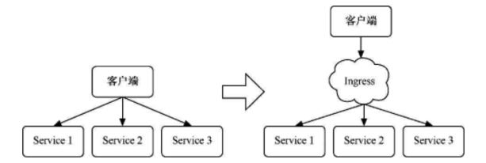
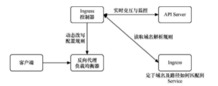
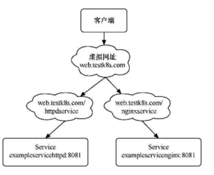
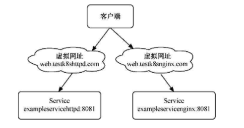

## Service

### 分类

| 类别                     | 向内发布 | 向外发布 |
| ------------------------ | -------- | -------- |
| 普通Service（ClusterIP） |          | ✔️        |
| 无头Service（ClusterIP） | ✔️        |          |
| NodePort                 |          | ✔️        |
| LoadBalancer             |          | ✔️        |
| ExternalName             | ✔️        |          |


### 特性

#### 普通Service

* 不指定默认为此类型
* k8s会给此Service自动分配一个固定的虚拟IP地址
* 谁能够访问这个Service后端Pod
  * Master、Node
  * Pod（ping不同，但是可以访问服务）
* 提供负载均衡能力


**示例**

```yaml
kind: Service
apiVersion: v1
metadata:
  name: exampleclusteripservice
spec:
  selector:
    example: exampleforservice
  ports:
    - protocol: TCP
      port: 8080
      targetPort: 80
  type: ClusterIP
```


#### NodePort

* 基于ClusterIP
* 将K8s自动分配的ClusterIp和端口号，映射到Master和Node的IP和端口号，因此访问任意一台集群中中的机器，都能够访问到后端Pod


**示例**

```yaml
kind: Service
apiVersion: v1
metadata:
  name: examplenodeportservice
spec:
	nodePort: 30001 #取值范围为30000～32767
	type: NodePort
  selector:
    example: exampleforservice
  ports:
    - protocol: TCP
      port: 8080
      targetPort: 80
```


#### LoadBalancer

* 基于ClusterIP和NodePort


#### 无头Service

* 不会分配任何CluseterIP地址
* 不通过kube-proxy进行反向代理和负载均衡
* Service的后端直接解析为Pod的IP地址列表
* 只能在集群内的Pod中访问
* 集群内的机器（即Master和Node）无法直接访问
* 集群外的机器也无法访问
* 主要供StatefulSet使用


**示例**

```yaml
kind: Service
apiVersion: v1
metadata:
  name: exampleheadlessservice
spec:
  selector:
    example: exampleforservice
clusterIP:  None
  ports:
    - protocol: TCP
      port: 8080
      targetPort: 80
  type: ClusterIP
```


#### ExternalName

* 将定义在集群外部的服务引入到集群内部


**示例**

```yaml
apiVersion: v1
kind: Service
metadata:
  name: exampleexternalnameservice
spec:
  type: ExternalName
  externalName: www.baidu.com
```


## Ingress

解决的问题：**Service一旦变多，每个节点上开启的端口也会变多。这样不仅维护起来相当复杂，安全性还会大大降低**。

使用Service与Ingress的区别，如图：



Ingress设计到的3个组件：



* 反向代理负载均衡器：类似于Nginx
* Ingress控制器：监控作用
* Ingress：定义访问规则

Ingress控制器的种类很多，需要自定义安装，K8s默认没有安装Ingress控制器。

使用Ingress的步骤：

1. 安装Ingress控制器，如：Traefik
2. 创建两个用于测试使用的服务，如：httpd和nginx
3. 进行Ingress的各类基本操作
   1. 不使用虚拟主机名称的单个Service
   2. 基于虚拟主机名称划分多个子路径
   3. 基于多个虚拟主机名称


### Ingress的基本操作

假设：

k8s集群中有三台机器：192.168.56.101、192.168.56.102、192.168.56.103。

K8s集群中有两个Deployment：examplehttpd、examplenginx

K8s集群中有两个Service：exampleservicehttpd、exampleservicenginx


#### 不使用虚拟主机名称的单个Service

这种方式没啥用，知道有这种方式就行。

```yaml
apiVersion: extensions/v1beta1
kind: Ingress
metadata:
  name: examplesingleingress
  annotations:
    Kubernetes.io/ingress.class: traefik #指定使用哪个IngressController
spec:
  backend:
    serviceName: exampleservicehttpd #对应一个ClusterIP类型的Service
    servicePort: 8081 #Service暴露的端口是8081
```

访问方式：`http://{集群中任意主机的IP地址}`


#### 基于虚拟主机名称划分多个子路径

在同一个域名下配置两个子路径，其中一个子路径访问httpd的Service，另一个子路径访问Nginx的Service。



```yaml
apiVersion: extensions/v1beta1
kind: Ingress
metadata:
  name: examplefanoutingress
  annotations:
    Kubernetes.io/ingress.class: traefik
traefik.frontend.rule.type:  PathPrefixStrip #如果支持在一个域名下划分子路径，这里必须填写PathPrefixStrip
spec:
  rules:
- host: web.testk8s.com
    http:
      paths:
			- path:  /httpdservice #访问httpd的子路径
        backend:
          serviceName: exampleservicehttpd #后端Service名称
          servicePort: 8081
			- path:  /nginxservice #访问nginx的子路径
        backend:
          serviceName: exampleservicenginx #后端Service名称
          servicePort: 8081
```


#### 基于多个虚拟主机名称



```yaml
apiVersion: extensions/v1beta1
kind: Ingress
metadata:
  name: examplehostingingress
  annotations:
    Kubernetes.io/ingress.class: traefik
spec:
  rules:
- host:  web.testk8shttpd.com
    http:
      paths:
      - backend:
          serviceName: exampleservicehttpd
          servicePort: 8081
- host:  web.testk8snginx.com
    http:
      paths:
      - backend:
          serviceName: exampleservicenginx
          servicePort: 8081
```


